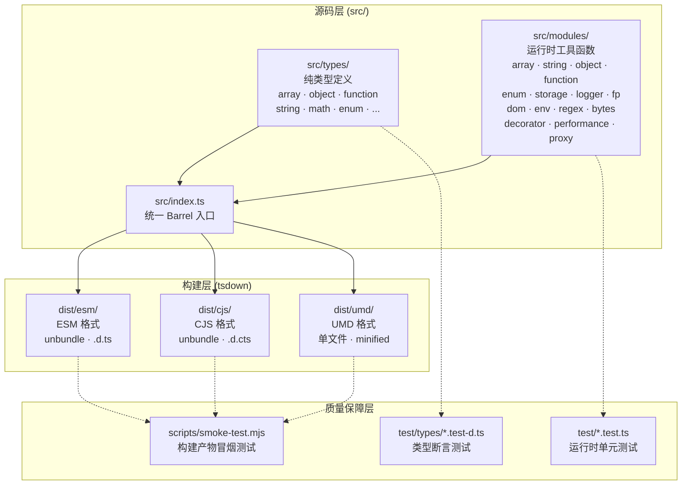
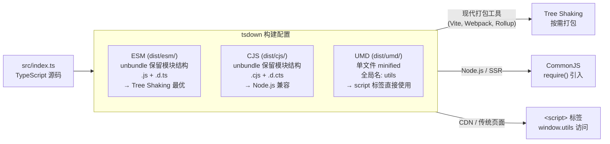
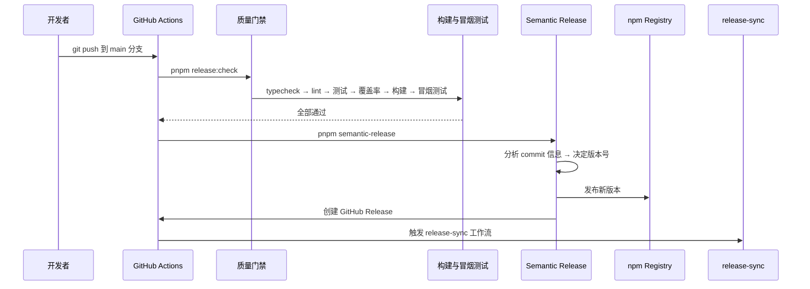

`@mudssky/jsutils` 是一个以 **TypeScript 优先、零运行时依赖（仅两个样式库）** 为核心理念的通用工具函数库。它将日常前端开发中反复出现的数组操作、字符串处理、对象变换、函数增强、类型守卫等需求，凝练为 20+ 个按领域划分的独立模块，并通过 tsdown 构建为 **ESM / CJS / UMD 三种格式**，兼顾现代打包工具的 Tree Shaking 需求与传统 `<script>` 标签引入的兼容性。当前版本为 `1.34.1`，已在 npm 公开发布，由 Semantic Release 驱动自动化版本管理。

Sources: [package.json](package.json#L1-L131), [README.md](README.md#L1-L38), [src/index.ts](src/index.ts#L1-L23)

---

## 为什么需要这个库：解决的核心问题

在日常前端项目中，开发者经常需要处理一类"不属于任何业务逻辑，但几乎每个项目都会用到"的通用操作：生成一组连续数字、将数组按固定大小分块、对对象进行 pick/omit、实现防抖与节流、判断变量的运行时类型……这些操作本身并不复杂，但每个项目都从零编写既浪费时间，又容易引入边界条件的 bug。

`@mudssky/jsutils` 的存在意义正是在于：**将这些"碎片的、跨项目可复用的"工具函数集中到一个经过严格类型检查和单元测试验证的库中**。它与 lodash 等经典工具库的定位类似，但在以下方面有明确的差异化设计：

| 维度         | `@mudssky/jsutils`                                                               | 传统工具库（如 lodash）                                  |
| ------------ | -------------------------------------------------------------------------------- | -------------------------------------------------------- |
| **类型系统** | 原生 TypeScript 编写，`strict: true`，类型与运行时代码同步演进                   | 通过 `@types/lodash` 补充类型，类型定义可能滞后于实现    |
| **输出格式** | ESM（unbundle 保留模块结构）、CJS、UMD 三格式并行，明确标记 `sideEffects: false` | 主要输出 CJS，ESM 版本（lodash-es）为独立包              |
| **模块粒度** | 按领域细分为 20+ 独立模块，每个模块聚焦单一职责                                  | 按功能组织，但单个模块（如 `lodash/object`）包含大量函数 |
| **依赖数量** | 仅 2 个运行时依赖（`clsx` + `tailwind-merge`）                                   | 零运行时依赖，但包体积极大                               |
| **特有领域** | 增强枚举系统（O(1) 查找 + 链式匹配）、DOM 操作辅助、CSS 类名合并、性能监控装饰器 | 侧重通用数据操作，缺少前端领域特定工具                   |

Sources: [tsconfig.json](tsconfig.json#L97-L98), [package.json](package.json#L29-L40), [tsdown.config.ts](tsdown.config.ts#L1-L55)

---

## 架构设计：三层分离的模块体系

`@mudssky/jsutils` 的内部架构遵循一个清晰的**三层分离原则**：类型层（`src/types/`）、运行时层（`src/modules/`）与公开入口层（`src/index.ts`）。这种分层确保了类型定义可以被独立引用，同时运行时代码保持按需加载的能力。

下面的 Mermaid 图展示了从源码到最终产物的完整数据流：



**入口文件** `src/index.ts` 使用 `export *` 聚合所有模块，并通过 `export type *` 将类型定义以纯类型方式导出。这种设计意味着用户在使用时可以完全通过 ESM 的按需引入来触发 Tree Shaking，未被使用的模块不会进入最终打包产物。

Sources: [src/index.ts](src/index.ts#L1-L23), [src/types/index.ts](src/types/index.ts#L1-L12), [tsdown.config.ts](tsdown.config.ts#L1-L55)

---

## 模块地图：20+ 领域的完整覆盖

下表按功能领域对全部模块进行分类，帮助你快速定位所需工具。每行标注了对应的源文件路径和所属文档页面。

| 功能领域       | 模块路径                       | 核心导出                                                                                          | 详细文档                                                                                                                                                       |
| -------------- | ------------------------------ | ------------------------------------------------------------------------------------------------- | -------------------------------------------------------------------------------------------------------------------------------------------------------------- |
| **数组操作**   | `src/modules/array.ts`         | `range`, `chunk`, `createQuery`, `getSortDirection`, `countBy`, `includeIf`                       | [数组操作：range、chunk、排序、聚合与集合运算](4-shu-zu-cao-zuo-range-chunk-pai-xu-ju-he-yu-ji-he-yun-suan)                                                    |
| **字符串处理** | `src/modules/string.ts`        | `genAllCasesCombination`, `generateUUID`, `generateBase62Code`, `numberToChinese`                 | [字符串处理：大小写转换、模板解析、UUID 生成与数字转文字](5-zi-fu-chuan-chu-li-da-xiao-xie-zhuan-huan-mo-ban-jie-xi-uuid-sheng-cheng-yu-shu-zi-zhuan-wen-zi)   |
| **对象操作**   | `src/modules/object.ts`        | `pick`, `omit`, `pickBy`, `omitBy`, `mapKeys`, `mapValues`, `merge`, `removeNonSerializableProps` | [对象操作：pick/omit、mapKeys/mapValues、深度合并与序列化清理](6-dui-xiang-cao-zuo-pick-omit-mapkeys-mapvalues-shen-du-he-bing-yu-xu-lie-hua-qing-li)          |
| **函数增强**   | `src/modules/function.ts`      | `debounce`, `throttle`, `sleepAsync`                                                              | [函数增强：防抖（debounce）与节流（throttle）的完整实现](7-han-shu-zeng-qiang-fang-dou-debounce-yu-jie-liu-throttle-de-wan-zheng-shi-xian)                     |
| **类型守卫**   | `src/modules/typed.ts`         | `isString`, `isNumber`, `isArray`, `isObject`, `isFunction`, `isPromise`, `isEmpty`, `isEqual`    | [类型守卫体系：isString、isEqual、isEmpty 等运行时类型判断](8-lei-xing-shou-wei-ti-xi-isstring-isequal-isempty-deng-yun-xing-shi-lei-xing-pan-duan)            |
| **函数式编程** | `src/modules/fp.ts`            | `pipe`, `compose`, `curry`, `identity`, `Monad`                                                   | [函数式编程工具：pipe、compose、curry 与 Monad 函子](9-han-shu-shi-bian-cheng-gong-ju-pipe-compose-curry-yu-monad-han-zi)                                      |
| **增强枚举**   | `src/modules/enum.ts`          | `createEnum`, `EnumArray` (O(1) 查找, 链式匹配)                                                   | [增强枚举系统：createEnum、O(1) 查找与链式匹配](10-zeng-qiang-mei-ju-xi-tong-createenum-o-1-cha-zhao-yu-lian-shi-pi-pei)                                       |
| **存储抽象**   | `src/modules/storage.ts`       | `WebLocalStorage`, `WebSessionStorage`, `AbstractStorage` (前缀命名空间)                          | [存储抽象层：WebLocalStorage/WebSessionStorage 与前缀命名空间](11-cun-chu-chou-xiang-ceng-weblocalstorage-websessionstorage-yu-qian-zhui-ming-ming-kong-jian)  |
| **日志系统**   | `src/modules/logger.ts`        | `ConsoleLogger` (分级过滤, 格式化输出, 上下文注入)                                                | [日志系统：分级过滤、格式化输出与上下文注入](12-ri-zhi-xi-tong-fen-ji-guo-lu-ge-shi-hua-shu-chu-yu-shang-xia-wen-zhu-ru)                                       |
| **正则工具**   | `src/modules/regex/`           | 常用模式校验, 密码强度分析, 字符转义                                                              | [正则表达式工具：常用模式校验、密码强度分析与字符转义](13-zheng-ze-biao-da-shi-gong-ju-chang-yong-mo-shi-xiao-yan-mi-ma-qiang-du-fen-xi-yu-zi-fu-zhuan-yi)     |
| **字节转换**   | `src/modules/bytes.ts`         | `Bytes` 类 (双向格式化与解析)                                                                     | [字节单位转换：Bytes 类的双向格式化与解析](14-zi-jie-dan-wei-zhuan-huan-bytes-lei-de-shuang-xiang-ge-shi-hua-yu-jie-xi)                                        |
| **环境检测**   | `src/modules/env.ts`           | `isBrowser`, `isNode`, `isWebWorker`, `runInBrowser`, `runWithDocument`                           | [环境检测：浏览器/Node.js/Web Worker 判断与安全执行包装](15-huan-jing-jian-ce-liu-lan-qi-node-js-web-worker-pan-duan-yu-an-quan-zhi-xing-bao-zhuang)           |
| **DOM 操作**   | `src/modules/dom/domHelper.ts` | `DOMHelper` (链式 API, 事件管理)                                                                  | [DOM 操作辅助：DOMHelper 链式 API 与事件管理](16-dom-cao-zuo-fu-zhu-domhelper-lian-shi-api-yu-shi-jian-guan-li)                                                |
| **文本高亮**   | `src/modules/dom/highlighter/` | `Highlighter` (多关键词匹配, 导航, 滚动定位)                                                      | [文本高亮器：Highlighter 多关键词匹配、导航与滚动定位](17-wen-ben-gao-liang-qi-highlighter-duo-guan-jian-ci-pi-pei-dao-hang-yu-gun-dong-ding-wei)              |
| **CSS 类名**   | `src/modules/style.ts`         | `cn()` (clsx + tailwind-merge 封装)                                                               | [CSS 类名合并：cn() 函数与 Tailwind CSS 集成](18-css-lei-ming-he-bing-cn-han-shu-yu-tailwind-css-ji-cheng)                                                     |
| **装饰器**     | `src/modules/decorator.ts`     | `debounceMethod`, `performanceMonitor`                                                            | [TypeScript 装饰器：debounceMethod 与 performanceMonitor](19-typescript-zhuang-shi-qi-debouncemethod-yu-performancemonitor)                                    |
| **性能监控**   | `src/modules/performance.ts`   | `PerformanceMonitor` (迭代测试, 内存追踪, 对比基准)                                               | [性能监控器：PerformanceMonitor 迭代测试、内存追踪与对比基准](20-xing-neng-jian-kong-qi-performancemonitor-die-dai-ce-shi-nei-cun-zhui-zong-yu-dui-bi-ji-zhun) |
| **Proxy 工具** | `src/modules/proxy.ts`         | `singletonProxy` (单例构造器包装)                                                                 | [Proxy 工具：singletonProxy 单例构造器包装](21-proxy-gong-ju-singletonproxy-dan-li-gou-zao-qi-bao-zhuang)                                                      |

Sources: [src/index.ts](src/index.ts#L1-L23), [src/modules/typed.ts](src/modules/typed.ts#L1-L145), [src/modules/env.ts](src/modules/env.ts#L1-L153), [src/modules/fp.ts](src/modules/fp.ts#L1-L149), [src/modules/style.ts](src/modules/style.ts#L1-L10)

---

## 设计哲学的五个核心原则

### 原则一：TypeScript 原生，类型即文档

整个项目以 TypeScript 编写，启用了 `strict: true` 全严格模式。类型不仅是编译期的安全保障，更是运行时 API 的"活文档"。例如，`typed.ts` 中的每个类型守卫函数都使用了 TypeScript 的 **类型谓词（Type Predicate）** 语法（`value is string`、`value is number`），这意味着调用 `isString(value)` 后，TypeScript 编译器能自动收窄变量类型：

```ts
// 调用前：value 的类型是 any
// 调用后：TypeScript 自动收窄为 string
if (isString(value)) {
  console.log(value.toUpperCase()) // 安全，无需类型断言
}
```

Sources: [tsconfig.json](tsconfig.json#L97-L98), [src/modules/typed.ts](src/modules/typed.ts#L50-L52)

### 原则二：零耦合模块化，按需加载

每个模块（如 `array.ts`、`object.ts`、`fp.ts`）都是独立的文件，模块间的依赖关系被刻意控制在最小范围内。例如，`array.ts` 仅依赖同层的 `error.ts`（提供 `ArgumentError`）和 `typed.ts`（提供 `isArray`、`isFunction`），而不会反向依赖更高层的业务模块。`package.json` 中显式声明了 `"sideEffects": false`，配合 ESM 输出的 unbundle 模式，确保了打包工具可以精确地 Tree Shake 掉未使用的函数。

Sources: [package.json](package.json#L29), [tsdown.config.ts](tsdown.config.ts#L4-L21), [src/modules/array.ts](src/modules/array.ts#L1-L5)

### 原则三：运行时与类型定义的物理分离

项目将**运行时工具函数**放在 `src/modules/*`，将**纯类型定义**放在 `src/types/*`。入口文件通过 `export *` 导出运行时代码，通过 `export type *` 导出类型定义。这种分离使得类型消费者（如仅需要类型提示的 IDE 插件）可以在不引入任何运行时开销的情况下获取完整的类型信息。

Sources: [src/index.ts](src/index.ts#L22), [src/types/index.ts](src/types/index.ts#L1-L12)

### 原则四：防御性编程，优雅的错误处理

库中的工具函数普遍采用了**防御性编程**策略。例如，`object.ts` 中的 `pick`、`omit` 等函数在接收到 `null` 或 `undefined` 时不会抛出异常，而是返回空对象；`array.ts` 中的 `range` 函数在 `step` 为 0 或传入小数时会抛出自定义的 `ArgumentError`，而非让底层引擎抛出难以理解的错误信息。这种设计哲学确保了库函数在边界条件下的行为是**可预测的**。

Sources: [src/modules/error.ts](src/modules/error.ts#L1-L19), [src/modules/object.ts](src/modules/object.ts#L12-L26), [src/modules/array.ts](src/modules/array.ts#L46-L60)

### 原则五：工程化驱动质量

项目建立了三层质量门禁体系，每一层在前一层基础上叠加更严格的检查：

| 门禁级别         | 命令                 | 检查内容                                             | 适用场景          |
| ---------------- | -------------------- | ---------------------------------------------------- | ----------------- |
| **本地快速校验** | `pnpm qa`            | typecheck + lint + 运行时测试 + 类型测试（并行执行） | 每次提交前        |
| **PR 严格门禁**  | `pnpm ci:strict`     | `qa` + 覆盖率检查 + 构建 + 冒烟测试                  | Pull Request 合并 |
| **发布前校验**   | `pnpm release:check` | `ci:strict` + Typedoc 文档生成                       | 版本发布          |

测试覆盖率阈值设定在较高水平：语句覆盖率 ≥ 90%、行覆盖率 ≥ 90%、函数覆盖率 ≥ 88%、分支覆盖率 ≥ 83%。这意味着库中绝大多数代码路径都经过了实际测试验证。

Sources: [package.json](package.json#L73-L74), [vitest.config.ts](vitest.config.ts#L20-L41), [AGENTS.md](AGENTS.md#L22-L43)

---

## 构建输出：三种格式，三种场景

`@mudssky/jsutils` 通过 [tsdown](https://github.com/nicepkg/tsdown)（基于 esbuild 的打包工具）生成三种输出格式，每种格式针对不同的使用场景做了专门优化：



**关键设计决策**：ESM 和 CJS 输出使用 `unbundle: true` 模式，这意味着每个源文件被单独编译而非合并为一个大文件，保留了模块边界，使打包工具能精确地进行 Tree Shaking。而 UMD 输出则采用单文件打包模式（`minify: true`），内联所有依赖（包括 `clsx` 和 `tailwind-merge`），方便在无构建工具的环境中直接使用。TypeScript 编译目标统一设为 `ES2017`，因为现代用户项目通常有自己的打包工具来处理更底层的语法转译。

Sources: [tsdown.config.ts](tsdown.config.ts#L1-L55), [package.json](package.json#L31-L44), [README.md](README.md#L7-L8)

---

## 自动化发布流水线

项目采用 **Semantic Release** 驱动的全自动化版本发布流程，遵循 Conventional Commits 规范。整个流程无需手动干预：



开发者只需按照 Conventional Commits 规范编写提交信息（如 `feat:`, `fix:`, `chore:`），Semantic Release 会自动分析提交历史、计算版本号、生成 CHANGELOG、发布到 npm，并创建 GitHub Release。`commitlint` + `husky` 的组合确保了提交信息格式在本地即被校验，避免不规范信息进入主分支。

Sources: [.releaserc.cjs](.releaserc.cjs#L1-L9), [.github/workflows/release.yml](.github/workflows/release.yml#L1-L78), [package.json](package.json#L67-L69)

---

## 推荐阅读路线

根据你的实际需求，我们推荐以下几条学习路线：

**🚀 快速上手路线**（10 分钟）：

1. [快速开始：安装、引入与按需使用](2-kuai-su-kai-shi-an-zhuang-yin-ru-yu-an-xu-shi-yong) — 了解如何安装和引入
2. [项目结构与模块地图](3-xiang-mu-jie-gou-yu-mo-kuai-di-tu) — 熟悉目录布局与模块组织

**🔧 日常开发路线**（按需查阅）：

1. [数组操作：range、chunk、排序、聚合与集合运算](4-shu-zu-cao-zuo-range-chunk-pai-xu-ju-he-yu-ji-he-yun-suan) — 数组相关的所有工具
2. [字符串处理：大小写转换、模板解析、UUID 生成与数字转文字](5-zi-fu-chuan-chu-li-da-xiao-xie-zhuan-huan-mo-ban-jie-xi-uuid-sheng-cheng-yu-shu-zi-zhuan-wen-zi) — 字符串操作全集
3. [对象操作：pick/omit、mapKeys/mapValues、深度合并与序列化清理](6-dui-xiang-cao-zuo-pick-omit-mapkeys-mapvalues-shen-du-he-bing-yu-xu-lie-hua-qing-li) — 对象变换工具
4. [类型守卫体系：isString、isEqual、isEmpty 等运行时类型判断](8-lei-xing-shou-wei-ti-xi-isstring-isequal-isempty-deng-yun-xing-shi-lei-xing-pan-duan) — 运行时类型检查

**🏗️ 深度学习路线**（理解设计思想）：

1. [增强枚举系统：createEnum、O(1) 查找与链式匹配](10-zeng-qiang-mei-ju-xi-tong-createenum-o-1-cha-zhao-yu-lian-shi-pi-pei) — 体验 O(1) 枚举查找的精巧设计
2. [函数式编程工具：pipe、compose、curry 与 Monad 函子](9-han-shu-shi-bian-cheng-gong-ju-pipe-compose-curry-yu-monad-han-zi) — 函数式编程范式实践
3. [构建与打包：tsdown 多格式输出（ESM / CJS / UMD）配置详解](22-gou-jian-yu-da-bao-tsdown-duo-ge-shi-shu-chu-esm-cjs-umd-pei-zhi-xiang-jie) — 理解构建流水线
4. [代码质量与 CI/CD：ESLint + Biome + Husky + Semantic Release 流水线](24-dai-ma-zhi-liang-yu-ci-cd-eslint-biome-husky-semantic-release-liu-shui-xian) — 工程化体系全景
