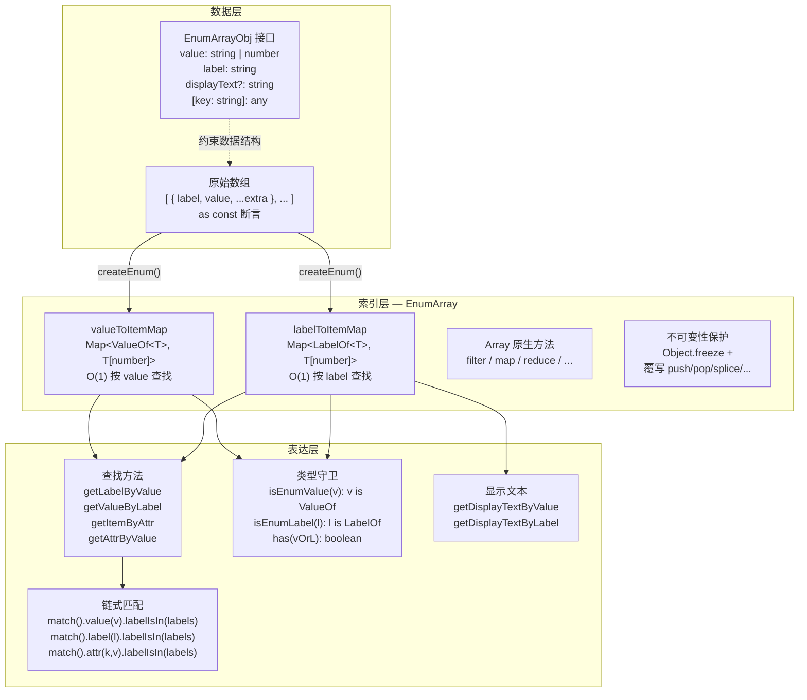
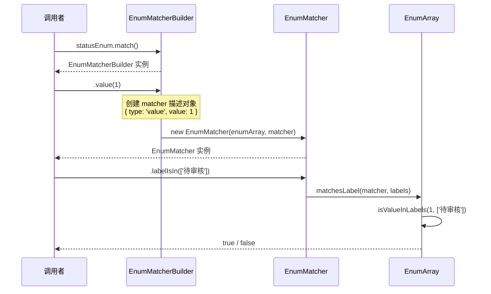

在日常前端开发中，枚举数据（如状态码、用户角色、审批流程节点）几乎无处不在。JavaScript 原生的 `enum` 仅支持简单的键值映射，而真实业务场景往往需要"通过 value 查 label"、"通过任意属性筛选"、"判断 API 返回值是否属于某类状态"等复合操作。`@mudssky/jsutils` 的增强枚举系统正是为此而设计——它以 `createEnum` 工厂函数为入口，返回一个继承自 `Array` 的 `EnumArray` 实例，在保留所有原生数组方法的同时，通过内部 Map 索引实现 **O(1) 查找**，并以 **链式匹配 API** 提供声明式的条件判断能力。本文将从架构设计、核心 API、类型系统到不可变性保证，对该模块进行系统性的解析。

Sources: [enum.ts](src/modules/enum.ts#L1-L1133)

## 架构总览：三层抽象

在深入 API 细节之前，先从整体上理解枚举系统的三层架构：**数据层**（`EnumArrayObj` 接口约束原始数据结构）、**索引层**（双 Map 提供 O(1) 查找）、**表达层**（链式匹配器与类型守卫封装业务逻辑）。三者的关系如下：



`createEnum` 是唯一的公开工厂函数。它在构造阶段完成两件事：将原始数据逐一填入数组索引槽位，同时构建 `valueToItemMap` 和 `labelToItemMap` 两个 `Map` 实例。此后的所有基于 value 或 label 的查找操作均通过 `Map.get()` 完成，时间复杂度为 **O(1)**，而非常见的 `Array.find()` 的 O(n)。最终返回值经过 `Object.freeze` 处理，确保枚举实例一旦创建就不可变。

Sources: [enum.ts](src/modules/enum.ts#L1017-L1122), [enum.ts](src/modules/enum.ts#L204-L304)

## 快速开始：定义与使用

### 定义枚举数据

使用 `createEnum` 的第一步是准备一个符合 `EnumArrayObj` 接口的数组，并使用 `as const` 断言保留字面量类型信息：

```typescript
import { createEnum } from '@mudssky/jsutils'

const statusList = [
  { label: '待审核', value: 1, color: '#faad14', priority: 'low' },
  { label: '已通过', value: 2, color: '#52c41a', priority: 'high' },
  { label: '已拒绝', value: 3, color: '#f5222d', priority: 'medium' },
] as const

const statusEnum = createEnum(statusList)
```

`as const` 的作用至关重要：它让 TypeScript 将数组推断为只读元组类型（`readonly [{ label: '待审核', value: 1, color: '#faad14', priority: 'low' }, ...]`），从而在后续所有查找方法中获得精确的字面量类型提示（例如 `getLabelByValue(1)` 的返回值类型为 `'待审核' | '已通过' | '已拒绝' | undefined`），而非宽泛的 `string | undefined`。

Sources: [enum.ts](src/modules/enum.ts#L1025-L1054)

### 枚举项数据结构

每个枚举项必须满足 `EnumArrayObj` 接口，该接口的完整定义如下：

| 属性            | 类型               | 必填 | 说明                                  |
| --------------- | ------------------ | ---- | ------------------------------------- |
| `value`         | `string \| number` | ✅   | 枚举的业务标识，如状态码、角色 ID     |
| `label`         | `string`           | ✅   | 枚举的显示名称，用于 UI 渲染          |
| `displayText`   | `string`           | ❌   | 覆盖 label 的自定义显示文本           |
| `[key: string]` | `any`              | ❌   | 任意扩展属性（color、permissions 等） |

这种"必填 + 可选 + 开放"的三层属性设计，使得枚举项既可以承载简单的状态映射，也能容纳复杂的业务元数据（如权限列表、优先级、分类标签等）。

Sources: [enum.ts](src/modules/enum.ts#L7-L17)

## 核心 API 详解

### O(1) 查找方法

以下四个方法是枚举系统最基础、使用频率最高的操作，它们全部通过内部 Map 实现 O(1) 查找：

| 方法                     | 输入         | 输出                      | 复杂度 | 说明                    |
| ------------------------ | ------------ | ------------------------- | ------ | ----------------------- |
| `getLabelByValue(value)` | `ValueOf<T>` | `LabelOf<T> \| undefined` | O(1)   | 通过 value 反查 label   |
| `getValueByLabel(label)` | `LabelOf<T>` | `ValueOf<T> \| undefined` | O(1)   | 通过 label 反查 value   |
| `getItemByValue(value)`  | `ValueOf<T>` | `T[number] \| undefined`  | O(1)   | 通过 value 获取完整对象 |
| `getItemByLabel(label)`  | `LabelOf<T>` | `T[number] \| undefined`  | O(1)   | 通过 label 获取完整对象 |

```typescript
// 基础双向查找
statusEnum.getLabelByValue(1) // '待审核'
statusEnum.getValueByLabel('已通过') // 2

// 获取完整对象（包含所有自定义属性）
const item = statusEnum.getItemByValue(1)
// { label: '待审核', value: 1, color: '#faad14', priority: 'low' }
item?.color // '#faad14'
item?.priority // 'low'
```

这些方法的实现非常简洁，以 `getItemByValue` 为例，核心仅一行 `Map.get()` 调用。`getLabelByValue` 和 `getValueByLabel` 实际上是先调用对应的 `getItemBy*` 方法，再从结果中提取 `label` 或 `value` 属性。

Sources: [enum.ts](src/modules/enum.ts#L306-L373)

### 按任意属性查找

当需要通过非 `value`/`label` 的自定义属性查找时，`getItemByAttr` 提供了通用能力：

```typescript
const item = statusEnum.getItemByAttr('color', '#faad14')
// { label: '待审核', value: 1, color: '#faad14', priority: 'low' }
```

值得注意的是，该方法对 `label` 和 `value` 两个高频键做了**快速路径优化**——当 `key === 'label'` 或 `key === 'value'` 时，内部会直接委托给 `getItemByLabel` / `getItemByValue` 的 O(1) 实现，而非遍历数组。只有对于其他自定义属性（如 `color`、`priority`），才回退到 O(n) 的线性扫描。

Sources: [enum.ts](src/modules/enum.ts#L375-L417)

### 类型安全的属性访问

`getAttrByValue` 和 `getAttrByLabel` 是对 `getItemByValue`/`getItemByLabel` 的二次封装，允许直接获取目标对象的某个属性值：

```typescript
const color = statusEnum.getAttrByValue(1, 'color') // '#faad14'
const level = statusEnum.getAttrByLabel('编辑者', 'level') // 2

// 类型推断：key 参数会获得自动补全提示（label / value / color / priority）
// 返回值类型会根据 key 自动推断
```

这种设计避免了"先取对象再取属性"的两步操作，同时通过泛型约束确保 `key` 参数只能是枚举项实际拥有的属性名。

Sources: [enum.ts](src/modules/enum.ts#L719-L761)

### 显示文本处理

UI 层经常需要区分"枚举的内部 label"和"面向用户的展示文本"。`getDisplayTextByValue` 和 `getDisplayTextByLabel` 封装了这一逻辑：优先返回 `displayText`（如果存在），否则回退到 `label`。

```typescript
const sexList = [
  { label: '男', value: 1, displayText: '性别男' },
  { label: '女', value: 2 },
] as const
const sexEnum = createEnum(sexList)

sexEnum.getDisplayTextByValue(1) // '性别男'（有 displayText，返回 displayText）
sexEnum.getDisplayTextByValue(2) // '女'（无 displayText，回退到 label）
```

Sources: [enum.ts](src/modules/enum.ts#L419-L453)

### 批量提取

当需要将枚举数据传递给下拉框组件或用于校验时，以下方法提供了便捷的批量提取能力：

| 方法                             | 返回值                      | 说明               |
| -------------------------------- | --------------------------- | ------------------ |
| `getLabelList()` / `getLabels()` | `ReadonlyArray<LabelOf<T>>` | 所有 label 的数组  |
| `getValues()`                    | `ValueOf<T>[]`              | 所有 value 的数组  |
| `getKeyMappedList(dict)`         | `Record<string, unknown>[]` | 按映射字典重命名键 |

```typescript
statusEnum.getLabels() // ['待审核', '已通过', '已拒绝']
statusEnum.getValues() // [1, 2, 3]

// 键映射：将 { label, value } 转为 { name, id }
statusEnum.getKeyMappedList({ label: 'name', value: 'id' })
// [{ name: '待审核', id: 1 }, { name: '已通过', id: 2 }, { name: '已拒绝', id: 3 }]
```

Sources: [enum.ts](src/modules/enum.ts#L455-L512)

## 条件判断体系

枚举系统提供了三种层级的条件判断 API，从简单到复杂逐步递进：

### 直接判断方法

`isValueInLabels`、`isLabelIn`、`isAttrInLabels` 是三个独立的判断方法，直接返回 `boolean`：

```typescript
// 判断 API 返回的 status 是否属于"待审核"或"已通过"
const isValid = statusEnum.isValueInLabels(apiData.status, ['待审核', '已通过'])

// 判断用户输入是否属于合法 label 集合
const isAllowed = statusEnum.isLabelIn(userInput, ['待审核', '已通过'])

// 判断 color 为 '#faad14' 的项，其 label 是否在允许列表中
const isWarning = statusEnum.isAttrInLabels('color', '#faad14', ['待审核'])
```

其中 `isValueInLabels` 和 `isLabelIn` 对 `null`、`undefined` 等外部数据做了安全处理，直接返回 `false`，非常适合处理来自 API 的不确定数据。`isAttrInLabels` 同样对 `label` 和 `value` 键做了 O(1) 快速路径优化。

Sources: [enum.ts](src/modules/enum.ts#L514-L617)

### 链式匹配 API

`match()` 方法开启一个链式调用，将"匹配维度"和"判断目标"分离为两个链式步骤，语义更加清晰：

```typescript
// 语法模式：match().<维度>(<值>).labelIsIn(<允许的标签列表>)

// 按 value 匹配
statusEnum.match().value(1).labelIsIn(['待审核']) // true
statusEnum.match().value(999).labelIsIn(['待审核']) // false（不存在的值）

// 按 label 匹配
statusEnum.match().label('待审核').labelIsIn(['待审核']) // true
statusEnum.match().label('未知').labelIsIn(['待审核']) // false

// 按任意属性匹配
statusEnum.match().attr('color', '#faad14').labelIsIn(['待审核']) // true
statusEnum.match().attr('color', '#faad14').labelIsIn(['已通过']) // false
```

链式调用的内部实现采用了**构建者模式**（Builder Pattern）：`match()` 返回 `EnumMatcherBuilder`，它的 `.value()` / `.label()` / `.attr()` 方法返回 `EnumMatcher`（即 `EnumMatchResult`），最终调用 `.labelIsIn()` 完成断言。这种设计将"选择匹配维度"和"执行判断逻辑"解耦，同时保证了类型安全——每个步骤的参数类型都由泛型精确推断。



Sources: [enum.ts](src/modules/enum.ts#L663-L676), [enum.ts](src/modules/enum.ts#L113-L180)

### 属性匹配器：getAttrMatcher

当需要对**同一个属性键**进行多次匹配时，`getAttrMatcher` 可以避免重复传入键名：

```typescript
const colorMatcher = statusEnum.getAttrMatcher('color')

// 复用同一个 matcher，仅切换 value 参数
const isWarning = colorMatcher.value('orange').labelIsIn(['待处理']) // true
const isSuccess = colorMatcher.value('green').labelIsIn(['已完成']) // true
const isInvalid = colorMatcher.value('purple').labelIsIn(['待处理']) // false

const priorityMatcher = statusEnum.getAttrMatcher('priority')
priorityMatcher.value('high').labelIsIn(['待审核']) // true
priorityMatcher.value('medium').labelIsIn(['已拒绝']) // true
```

`getAttrMatcher` 返回的对象只暴露一个 `value` 方法，该方法接受属性值并返回 `EnumMatchResult`。这种设计在处理"同一维度多值校验"的场景中（如遍历一组颜色值逐一判断其归属状态）尤为便捷。

Sources: [enum.ts](src/modules/enum.ts#L678-L717)

### 三种条件判断方式的对比

| 特性       | 直接方法（如 `isValueInLabels`） | 链式匹配 `match()`     | 属性匹配器 `getAttrMatcher` |
| ---------- | -------------------------------- | ---------------------- | --------------------------- |
| 语义清晰度 | ★★★ 参数直白                     | ★★★★★ 读起来像自然语言 | ★★★★ 适合批量操作           |
| 调用简洁度 | ★★★★★ 一步到位                   | ★★★ 三步链式           | ★★★ 前置一步 + 两步链式     |
| 适用场景   | 单次简单判断                     | 复杂业务条件判断       | 同一属性多次匹配            |
| 类型安全   | 参数类型精确推断                 | 参数类型精确推断       | 属性键/值类型精确推断       |

Sources: [enum.ts](src/modules/enum.ts#L514-L717)

## 类型守卫

在处理 `unknown` 类型数据（如 API 响应、用户输入）时，TypeScript 的类型缩窄（Type Narrowing）是保障运行时安全的关键。枚举系统提供了三个类型守卫方法：

### isEnumValue

`isEnumValue(value: unknown): value is ValueOf<T>` 检查给定值是否为枚举中定义的有效 value，并在类型守卫通过后将参数类型缩窄为 `ValueOf<T>`：

```typescript
const unknownValue: unknown = apiResponse.status

if (statusEnum.isEnumValue(unknownValue)) {
  // 此时 unknownValue 类型被缩窄为 1 | 2 | 3
  // 可以安全地调用查找方法
  const label = statusEnum.getLabelByValue(unknownValue) // 类型安全
  const item = statusEnum.getItemByValue(unknownValue) // 类型安全
}
```

### isEnumLabel

`isEnumLabel(label: unknown): label is LabelOf<T>` 检查给定标签是否为枚举中定义的有效 label，同样提供类型缩窄能力：

```typescript
const unknownLabel: unknown = userInput

if (statusEnum.isEnumLabel(unknownLabel)) {
  // 此时 unknownLabel 类型被缩窄为 '待审核' | '已通过' | '已拒绝'
  const value = statusEnum.getValueByLabel(unknownLabel) // 类型安全
}
```

### has

`has(valueOrLabel: unknown): boolean` 是一个便捷方法，同时检查 value 和 label 的存在性，但不提供类型缩窄（因为无法确定匹配到的到底是 value 还是 label）：

```typescript
statusEnum.has(1) // true（匹配 value）
statusEnum.has('待审核') // true（匹配 label）
statusEnum.has(999) // false
statusEnum.has('不存在') // false
```

三者均基于内部 Map 的 `has()` 方法实现，时间复杂度 O(1)。测试数据表明，对于 1000 条枚举项执行 100 次连续查找操作，总耗时在 100ms 以内。

Sources: [enum.ts](src/modules/enum.ts#L775-L821), [enum.test.ts](test/enum.test.ts#L436-L560), [enum.test.ts](test/enum.test.ts#L667-L698)

## 类型系统设计

枚举模块导出了一套精心设计的工具类型，它们共同支撑了整个系统的类型安全性：

| 类型               | 定义                                    | 用途                                                         |
| ------------------ | --------------------------------------- | ------------------------------------------------------------ |
| `ValueOf<T>`       | `T[number]['value']`                    | 从枚举数组提取 value 的联合类型（如 `1 \| 2 \| 3`）          |
| `LabelOf<T>`       | `T[number]['label']`                    | 从枚举数组提取 label 的联合类型（如 `'待审核' \| '已通过'`） |
| `AttributeOf<T>`   | `Extract<keyof T[number], string>`      | 提取枚举项的所有字符串属性名                                 |
| `ExternalValue`    | `string \| number \| null \| undefined` | 描述来自 API 等外部源的不确定数据类型                        |
| `EnhancedLabel<T>` | `T \| (string & {})`                    | 既提供 IDE 自动补全，又兼容任意外部字符串                    |

其中 `EnhancedLabel` 是一个巧妙的类型技巧：`T | (string & {})` 中的 `string & {}` 等价于 `string`，但 TypeScript 在交叉类型时不会将 `T` 中的字面量类型分发（distribute）到 `string` 中，因此 IDE 仍然会提示 `T` 中的具体字面量值，同时运行时可以接受任意普通字符串。这让 `isLabelIn` 等方法既能享受类型提示的便利，又能安全处理来自外部的未知字符串。

Sources: [enum.ts](src/modules/enum.ts#L36-L64), [types/enum.ts](src/types/enum.ts#L1-L32)

## 不可变性与安全性

枚举数据本质上是常量定义，不应在运行时被修改。枚举系统从两个层面保证不可变性：

### Object.freeze 外层冻结

`createEnum` 返回的对象经过 `Object.freeze` 处理，阻止对属性的直接赋值和删除：

```typescript
const statusEnum = createEnum(statusList)
// statusEnum[0] = newItem  // TypeError: Cannot assign to read only property
// delete statusEnum[0]     // TypeError: Cannot delete property
```

### 变更方法内部覆写

`EnumArray` 继承自 `Array`，理论上可以调用 `push`、`pop`、`splice`、`sort`、`reverse`、`fill`、`copyWithin`、`shift`、`unshift` 等变更方法。为了防止误用，这些方法全部被覆写，调用时会抛出带有明确提示的错误信息：

```typescript
statusEnum.push({ label: '新增', value: 4 })
// Error: EnumArray Error: Cannot call '.push()' on an immutable EnumArray instance.
// EnumArray is designed to be a read-only constant.
// If you need a new enum with modified data, please create a new instance with createEnum().
```

而 `filter`、`map`、`reduce`、`slice`、`concat`、`find` 等只读方法则正常工作，返回值可能是普通 `Array`（如 `slice`）或保持 `EnumArray` 类型（如 `filter`）。测试表明，`EnumArray` 实例同时满足 `Array.isArray()`、`instanceof Array` 和 `instanceof EnumArray` 三个判断。

Sources: [enum.ts](src/modules/enum.ts#L950-L1012), [enum.ts](src/modules/enum.ts#L1117-L1122), [enum.test.ts](test/enum.test.ts#L718-L813)

## 重复检查配置

当枚举数据中存在重复的 `value` 或 `label` 时，Map 构建过程遵循"后覆盖前"的语义——即后续的同键项会覆盖先前的映射。为了帮助开发者在早期发现此类问题，`createEnum` 支持通过 `EnumCreationOptions.checkDuplicates` 配置重复检查行为：

| 配置值                  | 行为                                                 |
| ----------------------- | ---------------------------------------------------- |
| `'development'`（默认） | 仅在 `process.env.NODE_ENV === 'development'` 时检查 |
| `'always'` 或 `true`    | 始终检查                                             |
| `'never'` 或 `false`    | 从不检查                                             |

检查发现重复时，会通过 `console.warn` 输出警告（而非抛出异常），消息中包含重复的 value/label 值以及当前配置级别，便于定位问题。

```typescript
// 生产环境也强制检查（适用于启动脚本）
const enum1 = createEnum(list, { checkDuplicates: 'always' })

// 测试环境跳过检查（适用于特殊测试场景）
const enum2 = createEnum(list, { checkDuplicates: false })

// 不传配置，默认行为等同于 'development'
const enum3 = createEnum(list)
```

Sources: [enum.ts](src/modules/enum.ts#L19-L33), [enum.ts](src/modules/enum.ts#L210-L261), [enum.test.ts](test/enum.test.ts#L816-L1029)

## 完整 API 速查表

以下是 `EnumArray` 类的全部公开方法，按功能分类整理：

**O(1) 查找方法**

| 方法              | 签名                         | 返回类型                  |
| ----------------- | ---------------------------- | ------------------------- |
| `getLabelByValue` | `(value: ValueOf<T>) => ...` | `LabelOf<T> \| undefined` |
| `getValueByLabel` | `(label: LabelOf<T>) => ...` | `ValueOf<T> \| undefined` |
| `getItemByValue`  | `(value: ValueOf<T>) => ...` | `T[number] \| undefined`  |
| `getItemByLabel`  | `(label: LabelOf<T>) => ...` | `T[number] \| undefined`  |

**通用查找**

| 方法             | 签名                                 | 复杂度                         |
| ---------------- | ------------------------------------ | ------------------------------ |
| `getItemByAttr`  | `(key: K, value: V) => ...`          | label/value 键 O(1)，其他 O(n) |
| `getAttrByValue` | `(value: ValueOf<T>, key: K) => ...` | O(1)                           |
| `getAttrByLabel` | `(label: LabelOf<T>, key: K) => ...` | O(1)                           |

**显示文本**

| 方法                    | 签名                                         | 说明                         |
| ----------------------- | -------------------------------------------- | ---------------------------- |
| `getDisplayTextByValue` | `(value: ValueOf<T>) => string \| undefined` | 优先 displayText，回退 label |
| `getDisplayTextByLabel` | `(label: LabelOf<T>) => string`              | 优先 displayText，回退 label |

**条件判断**

| 方法              | 签名                                        | 说明                                |
| ----------------- | ------------------------------------------- | ----------------------------------- |
| `isValueInLabels` | `(value: ExternalValue, labels) => boolean` | value 对应的 label 是否在允许列表中 |
| `isLabelIn`       | `(label: EnhancedLabel, labels) => boolean` | label 是否直接在允许列表中          |
| `isAttrInLabels`  | `(key, attrValue, labels) => boolean`       | 属性匹配项的 label 是否在允许列表中 |

**链式匹配**

| 方法                  | 返回类型                             | 说明               |
| --------------------- | ------------------------------------ | ------------------ |
| `match()`             | `EnumMatchBuilder<T>`                | 开启链式匹配       |
| `match().value(v)`    | `EnumMatchResult<T>`                 | 按 value 维度匹配  |
| `match().label(l)`    | `EnumMatchResult<T>`                 | 按 label 维度匹配  |
| `match().attr(k,v)`   | `EnumMatchResult<T>`                 | 按任意属性维度匹配 |
| `.labelIsIn(labels)`  | `boolean`                            | 最终断言           |
| `getAttrMatcher(key)` | `{ value(v) => EnumMatchResult<T> }` | 属性匹配器         |

**类型守卫**

| 方法          | 签名                                      | 说明                            |
| ------------- | ----------------------------------------- | ------------------------------- |
| `isEnumValue` | `(value: unknown) => value is ValueOf<T>` | 检查是否为有效 value + 类型缩窄 |
| `isEnumLabel` | `(label: unknown) => label is LabelOf<T>` | 检查是否为有效 label + 类型缩窄 |
| `has`         | `(valueOrLabel: unknown) => boolean`      | 检查 value 或 label 是否存在    |

**批量提取**

| 方法                             | 返回类型                    |
| -------------------------------- | --------------------------- |
| `getLabelList()` / `getLabels()` | `ReadonlyArray<LabelOf<T>>` |
| `getValues()`                    | `ValueOf<T>[]`              |
| `getKeyMappedList(dict)`         | `Record<string, unknown>[]` |

Sources: [enum.ts](src/modules/enum.ts#L1-L1133)

## 扩展与继承

`EnumArray` 被设计为可继承的类——构造函数是公开的，开发者可以创建子类添加领域特定的方法：

```typescript
import { EnumArray, EnumArrayObj, createEnum } from '@mudssky/jsutils'

class I18nEnumArray<T extends readonly EnumArrayObj[]> extends EnumArray<T> {
  getLabelByLocale(value: number, locale: string): string {
    const item = this.getItemByValue(value as any)
    return item?.[`label_${locale}`] ?? item?.label ?? ''
  }
}

// 通过 new 直接创建子类实例
const i18nEnum = new I18nEnumArray([
  { label: 'Active', label_zh: '启用', value: 1 },
  { label: 'Inactive', label_zh: '禁用', value: 0 },
] as const)

i18nEnum.getLabelByLocale(1, 'zh') // '启用'
```

需要注意的是，使用 `new EnumArray(...)` 创建的实例不经过 `Object.freeze` 处理（仅 `createEnum` 返回值被冻结），子类实例需要自行处理不可变性。

Sources: [enum.ts](src/modules/enum.ts#L1117-L1122), [enum.test.ts](test/enum.test.ts#L39-L46)

## 延伸阅读

- [对象操作：pick/omit、mapKeys/mapValues、深度合并与序列化清理](6-dui-xiang-cao-zuo-pick-omit-mapkeys-mapvalues-shen-du-he-bing-yu-xu-lie-hua-qing-li) — 枚举的 `getKeyMappedList` 内部使用了 `mapKeys` 工具函数
- [类型守卫体系：isString、isEqual、isEmpty 等运行时类型判断](8-lei-xing-shou-wei-ti-xi-isstring-isequal-isempty-deng-yun-xing-shi-lei-xing-pan-duan) — 与枚举的 `isEnumValue`/`isEnumLabel` 类型守卫设计理念一脉相承
- [类型系统设计：工具类型定义与 TypeScript 类型测试最佳实践](25-lei-xing-xi-tong-she-ji-gong-ju-lei-xing-ding-yi-yu-typescript-lei-xing-ce-shi-zui-jia-shi-jian) — 深入了解 `ValueOf`、`LabelOf` 等工具类型的设计模式
