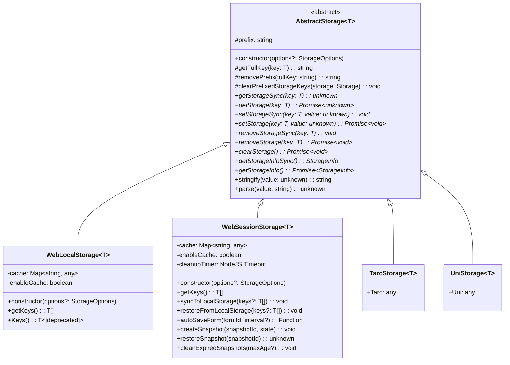
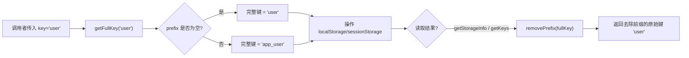
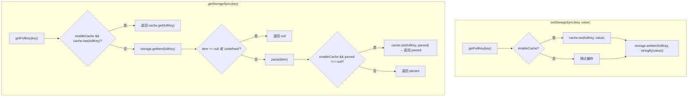

浏览器的 `localStorage` 与 `sessionStorage` 是 Web 开发中最常用的客户端持久化手段，但原生 API 存在几个长期痛点：只能存储字符串，需要手动 `JSON.parse/JSON.stringify`；不同模块在同源下共享键空间，极易产生冲突；缺乏内存缓存机制，高频读取时产生不必要的序列化开销。`@mudssky/jsutils` 的存储抽象层通过 **抽象基类 + 前缀命名空间 + 可选内存缓存** 三层架构统一解决了这些问题。它同时为 Web、Taro 小程序、uni-app 三端提供了一致的接口契约，让开发者可以用同一套 API 思维在不同平台间迁移。本文将聚焦于 `WebLocalStorage` 和 `WebSessionStorage` 两个核心实现，深入解析其类型系统、缓存策略、命名空间隔离机制，以及 `WebSessionStorage` 独有的快照、表单自动保存与跨存储同步能力。

Sources: [storage.ts](src/modules/storage.ts#L1-L637), [index.ts](src/index.ts#L17-L17)

## 类继承架构与统一接口契约

整个存储模块建立在 **模板方法模式（Template Method Pattern）** 之上。`AbstractStorage` 是泛型抽象基类，定义了所有平台共享的前缀管理与序列化逻辑；`WebLocalStorage`、`WebSessionStorage`、`TaroStorage`、`UniStorage` 四个子类分别对接不同运行时的底层 Storage 实现。



上图中，`AbstractStorage` 的抽象方法（标记 `*`）构成所有子类必须实现的统一接口。无论底层使用浏览器 `localStorage`、`sessionStorage`，还是小程序平台的同步 API，上层调用者都可以用 `getStorageSync(key)` / `setStorageSync(key, value)` 这一套完全相同的方法签名完成操作，实现了真正的平台无关。

`AbstractStorage` 还提供了 `stringify` 和 `parse` 两个工具方法，分别封装 `JSON.stringify` 和带异常捕获的 `JSON.parse`——当原始数据损坏或格式异常时，`parse` 会安全返回 `null` 而非抛出异常，避免整个应用因单条脏数据而崩溃。

Sources: [storage.ts](src/modules/storage.ts#L25-L100)

## 配置选项与类型参数

所有存储实例通过 `StorageOptions` 接口进行配置，支持两个可选参数：

| 参数          | 类型      | 默认值                                                      | 说明                       |
| ------------- | --------- | ----------------------------------------------------------- | -------------------------- |
| `prefix`      | `string`  | `''`（空前缀）                                              | 键名前缀，用于命名空间隔离 |
| `enableCache` | `boolean` | `WebLocalStorage` 为 `false`；`WebSessionStorage` 为 `true` | 是否启用内存缓存层         |

泛型参数 `<T extends string = string>` 约束了键的类型。当 `T` 使用字符串字面量联合类型（如 `'user' \| 'token' \| 'settings'`）时，TypeScript 会为 `getStorageSync`、`setStorageSync` 等方法的 `key` 参数提供精确的自动补全与类型检查，有效防止拼写错误：

```typescript
type AppKey = 'user' | 'token' | 'settings'
const storage = new WebLocalStorage<AppKey>()

storage.setStorageSync('user', { name: 'Alice' }) // ✅ 合法
storage.setStorageSync('uset', { name: 'Alice' }) // ❌ 编译错误：'uset' 不在 AppKey 中
```

Sources: [storage.ts](src/modules/storage.ts#L3-L20), [storage.ts](src/modules/storage.ts#L105-L114), [storage.ts](src/modules/storage.ts#L337-L348)

## 前缀命名空间：键隔离机制详解

**前缀命名空间** 是本模块最核心的设计。当创建实例时传入 `prefix: 'app_'`，所有键操作都会自动在底层键名前追加 `app_`，而对调用者完全透明。

### 键名转换流程



`getFullKey` 在每次 `set`、`get`、`remove` 操作时自动拼接前缀；`removePrefix` 则在 `getKeys`、`getStorageInfoSync` 等返回键名列表时反向剥离前缀，确保调用者始终操作的是**不带前缀的短键名**。

### 命名空间隔离的 clear 行为

这是前缀机制最关键的行为差异：

| 场景   | `prefix` 状态 | `clearStorageSync()` / `clearStorage()` 行为                            |
| ------ | ------------- | ----------------------------------------------------------------------- |
| 有前缀 | `'app_'`      | 仅遍历 Storage 中以 `app_` 开头的键并删除，**不影响其他命名空间的数据** |
| 无前缀 | `''` 或未设置 | 调用原生 `storage.clear()`，**清空整个存储区**                          |

内部通过 `clearPrefixedStorageKeys` 方法实现：当 `prefix` 为空时直接调用 `storage.clear()`；否则先收集所有匹配前缀的键名到临时数组，再逐一 `removeItem`。这种"先收集后删除"的策略避免了遍历过程中修改集合导致的索引错乱。

Sources: [storage.ts](src/modules/storage.ts#L35-L71), [storage.ts](src/modules/storage.ts#L54-L71), [storage.ts](src/modules/storage.ts#L172-L177), [storage.ts](src/modules/storage.ts#L432-L437)

## 内存缓存层

`WebLocalStorage` 和 `WebSessionStorage` 都支持通过 `enableCache: true` 启用内存缓存。缓存基于 `Map<string, any>` 实现，以完整键名（含前缀）为键，以原始 JavaScript 值为值。

### 读写路径



**写入路径**（`setStorageSync`）中，原始值同时写入缓存和底层 Storage。缓存存储的是未经序列化的 JavaScript 对象引用，后续读取时跳过 `JSON.parse` 反序列化过程。

**读取路径**（`getStorageSync`）中，优先检查缓存命中；缓存未命中时才访问底层 Storage 并执行 `JSON.parse`。值得注意的是，`WebSessionStorage` 在缓存未命中时还会执行**缓存回填**（cache-aside 模式），将解析后的结果写回缓存以加速后续访问。

### 缓存一致性保障

当启用缓存后，`removeStorageSync` 和 `clearStorageSync` 会同步清理缓存中对应的数据，确保后续读取不会返回已删除的脏数据。`WebSessionStorage` 还额外监听了 `storage` 事件，当同源其他标签页修改了 sessionStorage 时，自动同步更新本地缓存。

Sources: [storage.ts](src/modules/storage.ts#L195-L211), [storage.ts](src/modules/storage.ts#L459-L488), [storage.ts](src/modules/storage.ts#L350-L378)

## 两大实现对比：WebLocalStorage vs WebSessionStorage

虽然两者共享同一抽象基类，但在默认行为和扩展能力上存在显著差异：

| 特性                 | WebLocalStorage          | WebSessionStorage                                              |
| -------------------- | ------------------------ | -------------------------------------------------------------- |
| 底层存储             | `localStorage`           | `sessionStorage`                                               |
| 数据生命周期         | 持久化，除非主动清除     | 标签页/窗口关闭即清除                                          |
| 作用域               | 同源所有标签页共享       | 仅限当前标签页                                                 |
| `enableCache` 默认值 | `false`                  | `true`                                                         |
| 空间不足处理         | 无特殊处理，直接抛出异常 | 自动清缓存重试一次（`handleQuotaExceeded`）                    |
| 页面卸载监听         | 无                       | `beforeunload` 清理缓存和定时器                                |
| 跨存储同步           | 无                       | `syncToLocalStorage` / `restoreFromLocalStorage`               |
| 表单自动保存         | 无                       | `autoSaveForm`                                                 |
| 状态快照             | 无                       | `createSnapshot` / `restoreSnapshot` / `cleanExpiredSnapshots` |

`WebSessionStorage` 默认启用缓存是因为 sessionStorage 的数据生命周期短、读取频率高（如页面状态暂存），缓存带来的性能收益更明显。而 localStorage 数据持久存在，缓存可能导致与其他标签页的写入产生不一致，因此默认关闭。

Sources: [storage.ts](src/modules/storage.ts#L105-L212), [storage.ts](src/modules/storage.ts#L337-L626)

## WebSessionStorage 独有高级功能

### 空间不足自动重试

`WebSessionStorage.setStorageSync` 捕获底层 `sessionStorage.setItem` 抛出的 `QuotaExceededError`，自动执行 `handleQuotaExceeded`：先清空缓存释放内存引用，然后重新尝试写入；若重试仍失败，则向上抛出原始异常。这种"清理-重试"策略能在存储空间临界时提供一次挽救机会。

Sources: [storage.ts](src/modules/storage.ts#L493-L514)

### 跨存储同步：syncToLocalStorage / restoreFromLocalStorage

`syncToLocalStorage` 将 sessionStorage 中的指定键值同步写入 localStorage（持久化），`restoreFromLocalStorage` 则反向将 localStorage 中的数据恢复到 sessionStorage。当不传入具体键名时，两者都会自动遍历匹配当前前缀的所有键。典型使用场景是**表单向导**：用户在多步骤表单中填写的数据暂存于 sessionStorage，在关键节点通过 `syncToLocalStorage` 持久化到 localStorage，防止意外关闭标签页导致数据丢失。

Sources: [storage.ts](src/modules/storage.ts#L519-L551)

### 表单自动保存：autoSaveForm

`autoSaveForm(formId, interval)` 方法接受一个 HTML `<form>` 元素的 `id` 和可选的保存间隔（默认 5000 毫秒），通过 `FormData` API 自动采集所有表单字段并以 `form_${formId}` 为键存入 sessionStorage。该方法还注册了 `beforeunload` 监听器确保页面关闭前执行最后一次保存，返回一个 `dispose` 函数供调用者取消自动保存和事件监听。

非浏览器环境或表单不存在时，方法会通过 `console.warn` 输出警告并返回空操作函数，不会抛出异常，保证 SSR/SSG 场景的安全性。

Sources: [storage.ts](src/modules/storage.ts#L556-L588), [storage.test.ts](test/dom/storage.test.ts#L66-L97)

### 状态快照：createSnapshot / restoreSnapshot / cleanExpiredSnapshots

`createSnapshot(snapshotId, state)` 将页面状态连同当前时间戳 `Date.now()` 一起序列化存储，键名为 `snapshot_${snapshotId}`。`restoreSnapshot` 按相同规则读取并返回原始状态对象。`cleanExpiredSnapshots(maxAge)` 遍历所有以 `snapshot_` 开头的键，删除时间戳超过 `maxAge`（默认 24 小时）的过期快照。这三个方法共同构成了一个轻量级的**页面状态时间胶囊**，适用于 SPA 路由切换时保存滚动位置、Tab 选中状态、折叠面板展开状态等瞬时 UI 数据。

Sources: [storage.ts](src/modules/storage.ts#L593-L625)

## 序列化与反序列化的边界行为

`AbstractStorage.stringify` 直接调用 `JSON.stringify`，因此 `undefined`、函数、`Symbol` 等 JSON 不支持的值会被序列化为 `null` 或被忽略。`AbstractStorage.parse` 使用 `try-catch` 包裹 `JSON.parse`，任何格式非法的字符串都会安全返回 `null`。

此外，`getStorageSync` 中还额外处理了一个边界情况：当 `localStorage/sessionStorage` 中直接存储了字符串 `"undefined"`（可能由某些第三方库或手动操作写入）时，方法会返回 `null` 而非字符串 `"undefined"`，避免下游代码产生类型混淆。

Sources: [storage.ts](src/modules/storage.ts#L90-L99), [storage.ts](src/modules/storage.ts#L202-L211), [storage.ts](src/modules/storage.ts#L474-L488)

## 存储信息查询：getStorageInfoSync / getStorageInfo

`getStorageInfoSync` 返回一个 `StorageInfo` 对象，包含当前命名空间下的所有键名列表、已用空间（字节）和空间上限。其中：

- **`keys`**：已去除前缀的短键名数组，仅包含匹配当前 `prefix` 的条目
- **`currentSize`**：基于 UTF-16 编码计算，每个字符占 2 字节，`(key.length + value.length) * 2`
- **`limitSize`**：硬编码为 `5 << 20`（5 MB），对应主流浏览器的 localStorage/sessionStorage 默认配额
- **`cacheInfo`**：内部 `Map.entries()` 迭代器，可用于调试缓存状态

`getStorageInfo` 是其异步包装，直接返回 `getStorageInfoSync()` 的结果。

Sources: [storage.ts](src/modules/storage.ts#L116-L139), [storage.ts](src/modules/storage.ts#L381-L403)

## 实战用法速查

### 创建实例

```typescript
import { WebLocalStorage, WebSessionStorage } from '@mudssky/jsutils'

// 无前缀、无缓存 —— 最简形态
const plainStorage = new WebLocalStorage()

// 带前缀、带缓存 —— 生产推荐
const userStorage = new WebLocalStorage({ prefix: 'user_', enableCache: true })

// 类型安全的 sessionStorage（默认启用缓存）
type SessionKey = 'formData' | 'currentPage' | 'scrollPos'
const sessionStore = new WebSessionStorage<SessionKey>({ prefix: 'app_' })
```

### 基本读写与删除

```typescript
// 写入（自动 JSON 序列化）
userStorage.setStorageSync('profile', { name: 'Alice', role: 'admin' })

// 读取（自动 JSON 反序列化）
const profile = userStorage.getStorageSync('profile') // { name: 'Alice', role: 'admin' }

// 删除
userStorage.removeStorageSync('profile')

// 异步变体（方法名不含 Sync 后缀）
await userStorage.setStorage('token', 'abc123')
const token = await userStorage.getStorage('token')
await userStorage.removeStorage('token')
```

### 命名空间隔离与模块级清除

```typescript
const moduleA = new WebLocalStorage({ prefix: 'moduleA_' })
const moduleB = new WebLocalStorage({ prefix: 'moduleB_' })

moduleA.setStorageSync('data', 'A 的数据')
moduleB.setStorageSync('data', 'B 的数据')

moduleA.getStorageSync('data') // 'A 的数据'
moduleB.getStorageSync('data') // 'B 的数据'

// 仅清除 moduleA 命名空间，moduleB 不受影响
moduleA.clearStorageSync()
moduleB.getStorageSync('data') // 仍然是 'B 的数据'
```

### WebSessionStorage 快照与跨存储同步

```typescript
const session = new WebSessionStorage({ prefix: 'wizard_' })

// 创建快照
session.createSnapshot('step2', {
  scrollPosition: 450,
  activeTab: 'address',
  formData: { city: 'Shanghai', zip: '200000' },
})

// 恢复快照
const restored = session.restoreSnapshot('step2')
// → { scrollPosition: 450, activeTab: 'address', formData: {...}, timestamp: 1710000000000 }

// 持久化到 localStorage
session.syncToLocalStorage(['form_progress'])

// 应用启动时恢复
session.restoreFromLocalStorage()

// 清理超过 12 小时的过期快照
session.cleanExpiredSnapshots(12 * 60 * 60 * 1000)
```

Sources: [storage-prefix-example.md](examples/storage-prefix-example.md#L1-L111), [session-storage-example.md](examples/session-storage-example.md#L1-L233), [storage.ts](src/modules/storage.ts#L628-L637)

## 设计决策与最佳实践

**何时使用缓存？** 如果存储数据会被当前标签页高频读取（如主题配置、用户信息），启用 `enableCache: true` 可以避免重复的 `JSON.parse` 开销。但要注意，启用缓存后直接操作底层 `localStorage/sessionStorage`（绕过封装类）会导致缓存与底层不一致。团队规范应约定所有存储操作统一通过封装实例进行。

**前缀命名规范。** 推荐使用 `{项目名}_{模块名}_` 的格式，如 `myapp_user_`、`myapp_cart_`。在多团队协作或微前端架构中，这种分层前缀能有效避免不同子系统之间的键名冲突。版本化前缀（如 `v2_`）则可用于数据迁移——新版本使用新前缀，旧版本数据自然被忽略。

**sessionStorage vs localStorage 的选择原则。** 敏感性数据（如临时令牌、未提交的表单）优先使用 `WebSessionStorage`，标签页关闭即清除；需要跨标签页共享的持久设置（如语言偏好、主题）使用 `WebLocalStorage`。两者共享相同的前缀机制和缓存策略，切换成本极低。

Sources: [storage-prefix-example.md](examples/storage-prefix-example.md#L97-L110)

## 延伸阅读

- 想了解存储可用性的环境检测机制？参见 [环境检测：浏览器/Node.js/Web Worker 判断与安全执行包装](15-huan-jing-jian-ce-liu-lan-qi-node-js-web-worker-pan-duan-yu-an-quan-zhi-xing-bao-zhuang)，其中 `isBrowser()` 和 `isDocumentAvailable()` 正是 `WebSessionStorage` 在构造时用于判断是否注册浏览器事件监听的基础。
- 想了解完整的工具函数体系？参见 [项目结构与模块地图](3-xiang-mu-jie-gou-yu-mo-kuai-di-tu)。
- 想了解如何验证存储模块的正确性？参见 [测试体系：Vitest 单元测试、类型测试与构建产物冒烟测试](23-ce-shi-ti-xi-vitest-dan-yuan-ce-shi-lei-xing-ce-shi-yu-gou-jian-chan-wu-mou-yan-ce-shi)。
