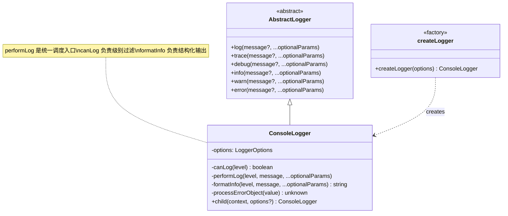
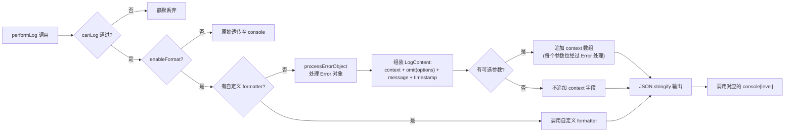
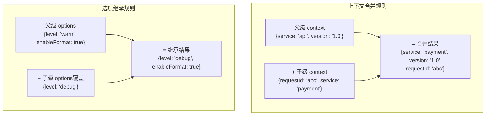

jsutils 的日志模块提供了一个结构化的、可配置的日志系统，围绕 **分级过滤**、**JSON 格式化输出**、**自定义格式化器** 和 **层级式上下文注入** 四个核心能力构建。其设计目标是让前端与 Node.js 环境中的日志输出既便于开发者实时调试，又便于日志采集系统进行结构化解析。整个模块由一个抽象基类 `AbstractLogger`、一个具体实现 `ConsoleLogger`、以及一个工厂函数 `createLogger` 组成，体量精简但扩展点明确。

Sources: [logger.ts](src/modules/logger.ts#L1-L235)

## 架构总览

日志系统的类层次遵循 **模板方法 + 策略注入** 的设计范式：`AbstractLogger` 声明六个日志级别的统一接口，`ConsoleLogger` 实现全部细节——包括级别过滤、格式化、Error 序列化和子日志器创建。`createLogger` 工厂函数则是对构造器的薄封装，提供更语义化的调用入口。



Sources: [logger.ts](src/modules/logger.ts#L8-L15) [logger.ts](src/modules/logger.ts#L59-L225) [logger.ts](src/modules/logger.ts#L232-L234)

## 日志级别体系

日志模块定义了六个级别，每个级别对应一个数值权重。当调用某个级别的日志方法时，系统会比较 **当前调用的级别权重** 与 **配置的目标级别权重**——只有前者 **大于等于** 后者时，日志才会实际输出到控制台。

| 级别    | 数值权重 | 对应 Console API | 典型用途         |
| ------- | -------- | ---------------- | ---------------- |
| `trace` | 0        | `console.trace`  | 细粒度执行流追踪 |
| `log`   | 0        | `console.log`    | 通用调试输出     |
| `debug` | 1        | `console.debug`  | 开发期调试信息   |
| `info`  | 2        | `console.info`   | 常规运行信息     |
| `warn`  | 3        | `console.warn`   | 非致命性警告     |
| `error` | 4        | `console.error`  | 错误与异常信息   |

值得注意的设计细节：`trace` 和 `log` 共享权重 0，这意味着无论配置为 `trace` 还是 `log`，这两个级别都会同时通过过滤——它们被视为"最低级别"的两种等价表达。

过滤逻辑位于 `canLog` 方法中，核心判断仅为一行数值比较：`currentLevelValue >= optionLevelValue`。这种设计使得在开发环境配置 `trace` 或 `debug` 级别查看全量日志，而在生产环境切换至 `warn` 或 `error` 级别只保留关键信息，实现一行配置的零成本切换。

Sources: [logger.ts](src/modules/logger.ts#L17-L29) [logger.ts](src/modules/logger.ts#L114-L118)

## 配置选项详解

`ConsoleLogger` 的全部行为由 `LoggerOptions` 接口驱动。以下是每个配置项的语义与默认值：

| 配置项         | 类型                                    | 必填 | 默认值           | 说明                                     |
| -------------- | --------------------------------------- | ---- | ---------------- | ---------------------------------------- |
| `level`        | `LogLevel`                              | ✅   | —                | 最低输出级别，决定哪些日志被过滤         |
| `name`         | `string`                                | ❌   | `undefined`      | 日志器名称，会注入到格式化输出中         |
| `enableFormat` | `boolean`                               | ❌   | `true`           | 是否启用结构化格式化输出                 |
| `formatter`    | `(level, message, ...params) => string` | ❌   | 内置 JSON 格式化 | 自定义格式化函数，完全替换内置格式化逻辑 |
| `context`      | `Record<string, unknown>`               | ❌   | `undefined`      | 静态上下文数据，每条日志输出时都会携带   |

其中 `enableFormat` 的默认值处理值得特别关注：构造器中通过 `this.options.enableFormat = this.options.enableFormat !== false` 实现——即只有显式传入 `false` 时才关闭格式化，未传或传入 `true` 均为开启状态。这种 **否定式默认** 的写法确保了格式化是开箱即用的默认行为。

Sources: [logger.ts](src/modules/logger.ts#L33-L43) [logger.ts](src/modules/logger.ts#L60-L64)

## 格式化输出机制

当 `enableFormat` 为 `true`（默认）且未提供自定义 `formatter` 时，`ConsoleLogger` 会通过 `formatInfo` 方法将日志组装为 **结构化 JSON 字符串**。输出的 `LogContent` 结构如下：

```typescript
interface LogContent {
  // 来自 LoggerOptions 的静态字段（排除 formatter、enableFormat、context）
  name?: string
  level: LogLevel
  message: unknown // 经过 Error 序列化处理的主消息
  timestamp: string // ISO 8601 格式时间戳
  [key: string]: unknown // 来自 context 的任意键值
  context?: unknown[] // 可选参数数组（仅在有可选参数时出现）
}
```

格式化的处理流程分为以下步骤：



格式化输出的一个关键特性是 **内部字段的自动清洗**：通过 `omit(this.options, ['formatter', 'enableFormat', 'context'])` 将配置对象中与输出无关的 `formatter`、`enableFormat`、`context` 三个字段剔除，只保留 `name` 和 `level` 注入到输出结构中。而 `context` 的内容则通过展开运算符 `...this.options.context` 平铺到顶层，使得上下文字段与 `name`、`level` 等元数据处于同一层级，方便日志检索系统直接按字段过滤。

Sources: [logger.ts](src/modules/logger.ts#L87-L112) [logger.ts](src/modules/logger.ts#L126-L149) [logger.ts](src/modules/logger.ts#L47-L55) [object.ts](src/modules/object.ts#L65-L85)

## Error 对象序列化

`processErrorObject` 是日志模块中一个容易被忽视但极为实用的私有方法。在 JavaScript 中，`Error` 对象的 `message`、`stack`、`name` 属性虽然是可枚举的，但直接 `JSON.stringify(new Error(...))` 的结果是一个空对象 `{}`——因为 `Error` 的自有属性大多不可被标准序列化捕获。`ConsoleLogger` 的做法是 **手动提取** 这三个关键字段：

```typescript
// 序列化后的 Error 结构
{
  message: "数据库连接失败",
  stack: "Error: 数据库连接失败\n    at connectDB (app.ts:42:11)",
  name: "Error"
}
```

更值得注意的是对 **嵌套 cause 链** 的递归处理。当一个 `Error` 的 `cause` 属性指向另一个 `Error` 时（这是 ES2022 引入的 Error Cause 规范），`processErrorObject` 会递归地将其序列化为嵌套结构。例如一个三层嵌套的错误链 `MainError → MiddleError → DeepError`，序列化后会产生 `message.cause.cause` 的三层对象，确保异常因果链在日志中完整保留。

Sources: [logger.ts](src/modules/logger.ts#L70-L85)

## 上下文注入与子日志器

`child` 方法是日志系统实现 **层级式上下文管理** 的核心机制。它的工作原理是创建一个全新的 `ConsoleLogger` 实例，将父级的 `options` 作为基础，用传入的 `context` 进行浅合并（子级字段覆盖父级同名字段），同时允许通过第二个参数 `options` 部分覆盖父级的配置（如 `level`、`formatter`）。



这种设计带来几个重要的工程特性：

**独立性** — 每次 `child()` 调用都会创建一个新的 `ConsoleLogger` 实例，子级对配置或上下文的修改不会反向影响父级。这意味着在同一个请求处理链中，可以为不同的处理阶段创建独立的子日志器，各自携带当前阶段的上下文信息，而不会互相污染。

**可覆盖性** — 子级可以覆盖父级的任何上下文字段。这在微服务架构中尤其有用：父级日志器携带 `service: 'api-gateway'`，而某个子模块的子日志器可以覆盖为 `service: 'payment'`，同时继承父级的 `env`、`version` 等公共字段。

**配置继承** — `child` 的第二个参数是 `Partial<Omit<LoggerOptions, 'context'>>`，允许子级在不修改上下文的前提下调整 `level`、`formatter` 等配置项。未指定的配置项自动继承父级，实现"默认继承 + 按需覆盖"的灵活模式。

Sources: [logger.ts](src/modules/logger.ts#L211-L224)

## 自定义格式化器

当内置的 JSON 结构化输出不满足需求时，可以通过 `formatter` 选项注入完全自定义的格式化逻辑。自定义格式化器接收三个参数（`level`、`message`、`...optionalParams`），返回一个字符串，该字符串将直接作为日志输出内容。

```typescript
import { createLogger } from '@mudssky/jsutils'

const customLogger = createLogger({
  name: 'CustomApp',
  level: 'debug',
  formatter: (level, message, ...params) => {
    const timestamp = new Date().toISOString()
    return `[${timestamp}] ${level.toUpperCase()}: ${message} ${
      params.length > 0 ? JSON.stringify(params) : ''
    }`
  },
})

customLogger.info('自定义格式的日志', { extra: 'data' })
// 输出: [2024-01-01T00:00:00.000Z] INFO: 自定义格式的日志 [{"extra":"data"}]
```

需要注意的是，当提供了 `formatter` 时，内置的 `processErrorObject`（Error 序列化）和 `LogContent` 组装逻辑 **完全被绕过**——格式化的全部控制权交给自定义函数。如果需要在自定义格式化器中保留 Error 序列化能力，需要自行处理。

自定义格式化器同样可以通过 `child` 方法在子级日志器中覆盖，实现父子级使用不同输出格式的场景。

Sources: [logger.ts](src/modules/logger.ts#L37-L41) [logger.ts](src/modules/logger.ts#L92-L94) [logger-example.md](examples/logger/logger-example.md#L82-L95)

## 快速上手

### 基础创建与使用

```typescript
import { createLogger } from '@mudssky/jsutils'

// 创建日志器——level 是唯一必填项
const logger = createLogger({
  name: 'MyApp',
  level: 'info',
  enableFormat: true, // 默认即为 true，可省略
})

logger.info('应用启动成功')
// 输出: {"name":"MyApp","level":"info","message":"应用启动成功","timestamp":"2024-01-01T00:00:00.000Z"}

logger.warn('这是一个警告消息')
logger.error('发生了错误')
```

### 环境感知的级别配置

```typescript
// 开发环境输出全量日志，生产环境只保留警告和错误
const logger = createLogger({
  name: 'WebApp',
  level: process.env.NODE_ENV === 'production' ? 'warn' : 'debug',
  context: {
    env: process.env.NODE_ENV,
    version: process.env.APP_VERSION,
  },
})
```

### 模块化子日志器

```typescript
// 应用主日志器
const appLogger = createLogger({
  name: 'WebApp',
  level: 'info',
  context: { service: 'web-server', version: '1.0.0' },
})

// 为不同模块创建携带独立上下文的子日志器
const authLogger = appLogger.child({ module: 'auth' })
const apiLogger = appLogger.child({ module: 'api' })

// 为特定请求创建更深层级的日志器
const requestLogger = apiLogger.child({
  requestId: 'req-abc123',
  method: 'POST',
  path: '/api/users',
})

requestLogger.info('开始处理请求')
// 输出包含: service, version, module, requestId, method, path, name, level, message, timestamp
```

### Error 对象处理

```typescript
try {
  const cause = new Error('网络超时')
  throw new Error('请求失败', { cause })
} catch (error) {
  // Error 对象（包括嵌套 cause 链）会被自动序列化
  logger.error('处理请求时出错', error, { userId: 123 })
  // 输出的 message 字段会包含嵌套的 cause 结构
}
```

Sources: [logger.ts](src/modules/logger.ts#L232-L234) [logger-example.md](examples/logger/logger-example.md#L7-L21) [logger-example.md](examples/logger/logger-example.md#L49-L78) [logger-example.md](examples/logger/logger-example.md#L26-L45)

## API 参考

### `createLogger(options)`

工厂函数，创建并返回一个 `ConsoleLogger` 实例。

**参数：** `options: LoggerOptions`（详见配置选项详解章节）

**返回值：** `ConsoleLogger`

### `ConsoleLogger` 实例方法

| 方法                                 | 说明                     |
| ------------------------------------ | ------------------------ |
| `log(message?, ...optionalParams)`   | 输出通用日志（级别 0）   |
| `trace(message?, ...optionalParams)` | 输出追踪日志（级别 0）   |
| `debug(message?, ...optionalParams)` | 输出调试日志（级别 1）   |
| `info(message?, ...optionalParams)`  | 输出信息日志（级别 2）   |
| `warn(message?, ...optionalParams)`  | 输出警告日志（级别 3）   |
| `error(message?, ...optionalParams)` | 输出错误日志（级别 4）   |
| `child(context, options?)`           | 创建子日志器，合并上下文 |

### 导出的类型

| 类型            | 说明                                                                           |
| --------------- | ------------------------------------------------------------------------------ |
| `LogLevel`      | 日志级别联合类型：`'trace' \| 'log' \| 'debug' \| 'info' \| 'warn' \| 'error'` |
| `LoggerOptions` | 日志器配置选项接口                                                             |
| `LogContent`    | 格式化后的日志输出结构接口                                                     |

Sources: [logger.ts](src/modules/logger.ts#L29) [logger.ts](src/modules/logger.ts#L33-L43) [logger.ts](src/modules/logger.ts#L47-L55) [logger.ts](src/modules/logger.ts#L156-L224)

## 设计决策与注意事项

**上下文合并是浅合并** — `child()` 方法使用对象展开运算符 `{...parent, ...child}` 进行合并，这意味着嵌套对象不会进行深度合并，而是整体替换。在实际使用中，建议将上下文字段设计为扁平的键值结构，避免嵌套对象带来的覆盖语义歧义。

**格式化关闭时的性能优势** — 当 `enableFormat` 设为 `false` 时，日志消息和可选参数会原样透传给对应的 `console` 方法，完全跳过 Error 序列化、对象组装和 `JSON.stringify` 的开销。在高频调用的热路径中，这个开关可以带来可观的性能提升。

**日志级别作为最低门槛** — `level` 配置项的含义是"允许输出的最低级别"，而非"只输出该级别"。例如配置为 `warn` 时，`warn` 和 `error` 级别的日志都会输出，而非仅输出 `warn`。

**console 方法的精确映射** — 每个日志级别会调用对应名称的 `console` 原生方法（`console.info`、`console.warn` 等），而非统一使用 `console.log`。这使得浏览器开发者工具中的日志过滤功能和颜色标记得以完整保留。当级别名称无法在 `console` 对象上找到对应方法时，会回退到 `console.log`。

Sources: [logger.ts](src/modules/logger.ts#L133-L137) [logger.ts](src/modules/logger.ts#L114-L118) [logger.ts](src/modules/logger.ts#L139-L148)

## 延伸阅读

- 如果你需要在方法级别自动添加防抖或性能监控能力，可以结合 [TypeScript 装饰器：debounceMethod 与 performanceMonitor](19-typescript-zhuang-shi-qi-debouncemethod-yu-performancemonitor) 使用。
- 对于需要持久化存储的运行时数据，日志系统可以与 [存储抽象层：WebLocalStorage/WebSessionStorage 与前缀命名空间](11-cun-chu-chou-xiang-ceng-weblocalstorage-websessionstorage-yu-qian-zhui-ming-ming-kong-jian) 配合，实现日志的本地缓存与回放。
- 了解日志模块在整个项目中的定位，请参考 [项目结构与模块地图](3-xiang-mu-jie-gou-yu-mo-kuai-di-tu)。
