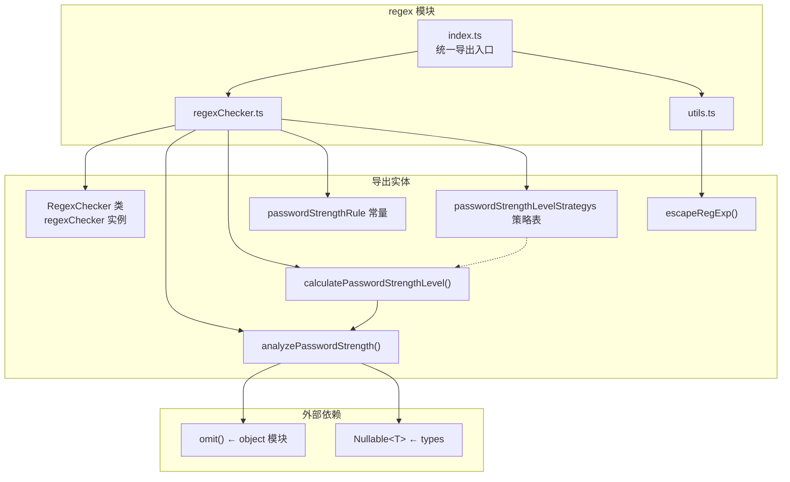
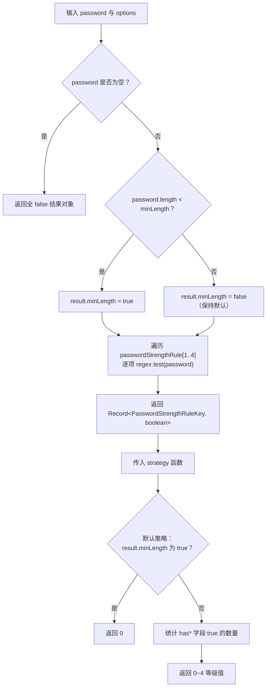

jsutils 的正则表达式模块提供了三大能力：**常用格式校验**（邮箱、用户名、手机号、正负数）、**密码强度分析**（多维度规则检测 + 可扩展的策略计算）以及 **正则特殊字符转义**（安全的动态正则构建）。这三个子模块覆盖了前端开发中绝大多数正则使用场景——从一行代码的格式校验到可定制的密码安全评级系统，都无需再手写重复的模式和逻辑。

Sources: [index.ts](src/modules/regex/index.ts#L1-L2), [regexChecker.ts](src/modules/regex/regexChecker.ts#L1-L196), [utils.ts](src/modules/regex/utils.ts#L1-L42)

## 模块架构总览

模块由两个文件组成，通过 barrel `index.ts` 统一导出。`regexChecker.ts` 是核心实现文件，承载了 `RegexChecker` 校验类和密码强度分析的全部函数；`utils.ts` 提供独立的正则转义工具函数。下面的关系图展示了各导出实体及其依赖：



**依赖关系说明**：`calculatePasswordStrengthLevel` 内部调用 `analyzePasswordStrength` 获取逐项检测结果，然后交由策略函数计算最终等级。`omit` 函数用于在默认策略中排除 `minLength` 字段，只统计字符组成维度的通过数。

Sources: [index.ts](src/modules/regex/index.ts#L1-L2), [regexChecker.ts](src/modules/regex/regexChecker.ts#L1-L2)

## RegexChecker：常用格式校验

`RegexChecker` 是一个封装了常用正则模式的工具类，所有模式以 `readonly` 属性暴露为 `RegExp` 实例，可直接调用 `.test()` 方法进行校验。库同时导出一个单例 `regexChecker`，可以直接使用而无需手动实例化。

### 内置校验模式一览

| 属性名            | 正则表达式                          | 校验规则                                    | 典型用途       |
| ----------------- | ----------------------------------- | ------------------------------------------- | -------------- |
| `usernamePattern` | `/^[a-zA-Z0-9_-]{4,16}$/`           | 仅允许字母、数字、连字符、下划线，长度 4–16 | 用户注册校验   |
| `positivePattern` | `/^\d*\.?\d+$/`                     | 正数（整数或小数，如 `3.14`、`100`）        | 数值输入校验   |
| `negativePattern` | `/^-\d*\.?\d+$/`                    | 负数（如 `-3.14`、`-100`）                  | 数值输入校验   |
| `emailPatternCN`  | `/^[A-Za-z0-9\u4e00-\u9fa5]+@...$/` | 允许中文的邮箱格式                          | 国内业务场景   |
| `emailPattern`    | RFC 5322 近似模式                   | 标准英文邮箱格式（含 IP 地址域）            | 国际化场景     |
| `mobilePattern`   | `/^1[34578]\d{9}$/`                 | 以 1 开头，第二位为 3/4/5/7/8 的 11 位号码  | 中国大陆手机号 |

**使用示例**：

```typescript
import { regexChecker } from '@mudssky/jsutils'

// 邮箱校验
regexChecker.emailPattern.test('test001@163.com') // true
regexChecker.emailPattern.test('test..2002@gmail.com') // false（连续点号不合法）
regexChecker.emailPattern.test('test.@gmail.com') // false（本地部分不能以点号结尾）

// 正负数校验
regexChecker.positivePattern.test('3.14') // true
regexChecker.negativePattern.test('-100') // true

// 手机号校验
regexChecker.mobilePattern.test('13812345678') // true
regexChecker.mobilePattern.test('19912345678') // false（第二位 9 不在 [34578] 范围）
```

关于 `emailPattern` 的校验精度：它遵循 RFC 5322 的常见近似实现，能正确拒绝 `test..2002@gmail.com`（连续点号）、`test.@gmail.com`（末尾点号）、`test@gmail.`（不完整域名）等非法格式，但允许 `12345@gmail.com.cn` 这样的多级域名。需要支持中文邮箱的场景应使用 `emailPatternCN`。

Sources: [regexChecker.ts](src/modules/regex/regexChecker.ts#L7-L41)

## 密码强度分析体系

密码强度分析是本模块最核心的能力，由三层结构组成：**规则定义层** → **逐项检测层** → **等级计算层**。这种分层设计允许你在每一层进行自定义扩展。

### 第一层：规则定义 `passwordStrengthRule`

规则定义是一个 `readonly` 常量数组，每项包含 `key`（结果对象的字段名）、`regex`（正则表达式）和 `desp`（中文描述）。五个规则维度的定义如下：

| 索引 | key              | 正则                                          | 描述             | 语义含义（结果为 `true` 时）             |
| ---- | ---------------- | --------------------------------------------- | ---------------- | ---------------------------------------- |
| 0    | `minLength`      | `/(?=.{8,}).*/`                               | 最少 8 个字符    | 密码长度 **不足** 最小要求（语义反转⚠️） |
| 1    | `hasLowercase`   | `/^(?=.*[a-z]).*$/`                           | 必须包含小写字母 | 密码 **包含** 小写字母                   |
| 2    | `hasUppercase`   | `/^(?=.*[A-Z]).*$/`                           | 必须包含大写字母 | 密码 **包含** 大写字母                   |
| 3    | `hasDigit`       | `/^(?=.*\d).*$/`                              | 必须包含数字     | 密码 **包含** 数字                       |
| 4    | `hasSpecialChar` | `/^(?=.*[`~!@#$%^&*()_+<>?:"{},./;'[\]]).*$/` | 必须包含特殊字符 | 密码 **包含** 特殊字符                   |

> ⚠️ **语义注意**：`minLength` 字段在结果对象中的语义是 **反转的**——`true` 表示密码 **不满足** 最小长度要求（即密码太短），`false` 表示满足。而其他四个 `has*` 字段的 `true` 都表示 **满足** 了对应要求。默认策略 `default` 正是依赖这个语义：`if (res.minLength) return 0`——一旦密码过短，直接返回最低强度 0。

规则定义数组使用了 TypeScript 的 `as const satisfies PasswordStrengthRule[]` 断言，确保每个元素的类型在编译时被精确收窄，同时满足 `PasswordStrengthRule` 接口约束。

Sources: [regexChecker.ts](src/modules/regex/regexChecker.ts#L45-L84)

### 第二层：逐项检测 `analyzePasswordStrength`

`analyzePasswordStrength` 函数对密码进行逐维度检测，返回一个布尔结果对象：

```typescript
function analyzePasswordStrength(
  password: Nullable<string>,
  options?: AnalyzePasswordStrenthOptions,
): Record<PasswordStrengthRuleKey, boolean>
```

**参数说明**：

| 参数                | 类型               | 说明                                            |
| ------------------- | ------------------ | ----------------------------------------------- |
| `password`          | `Nullable<string>` | 待检测密码，`null`/`undefined` 时返回全 `false` |
| `options.minLength` | `number`           | 最小长度阈值，默认 `8`                          |

**返回值结构**：

```typescript
{
  minLength: boolean // true = 密码太短（不满足最小长度）
  hasLowercase: boolean // true = 包含小写字母
  hasUppercase: boolean // true = 包含大写字母
  hasDigit: boolean // true = 包含数字
  hasSpecialChar: boolean // true = 包含特殊字符
}
```

**实现要点**：函数遍历 `passwordStrengthRule` 数组，但循环从索引 1 开始（跳过 `minLength` 的正则规则），因为最小长度通过 `password.length < minLength` 直接比较而非正则匹配。这意味着 `passwordStrengthRule[0].regex` 仅作为文档参考，实际检测由参数驱动。

```typescript
import { analyzePasswordStrength } from '@mudssky/jsutils'

// 完整强密码（8 字符，默认 minLength）
analyzePasswordStrength('A1b@cdef')
// → { minLength: false, hasLowercase: true, hasUppercase: true, hasDigit: true, hasSpecialChar: true }

// 自定义最小长度
analyzePasswordStrength('Ab1!', { minLength: 5 })
// → { minLength: true, hasLowercase: true, hasUppercase: true, hasDigit: true, hasSpecialChar: true }
//    ↑ 密码仅 4 字符，不满足 minLength=5

// 空值安全
analyzePasswordStrength(null)
// → { minLength: false, hasLowercase: false, hasUppercase: false, hasDigit: false, hasSpecialChar: false }
```

Sources: [regexChecker.ts](src/modules/regex/regexChecker.ts#L86-L124)

### 第三层：等级计算 `calculatePasswordStrengthLevel`

在获取逐项检测结果的基础上，`calculatePasswordStrengthLevel` 通过策略模式将多维布尔结果映射为一个数值等级：

```typescript
function calculatePasswordStrengthLevel(
  password: string,
  options?: CalculatePasswordStrengthLevelOptions,
): number
```

**参数说明**：

| 参数                | 类型                            | 说明                                           |
| ------------------- | ------------------------------- | ---------------------------------------------- |
| `password`          | `string`                        | 待评估密码                                     |
| `options.minLength` | `number`                        | 最小长度阈值，透传至 `analyzePasswordStrength` |
| `options.strategy`  | `PasswordStrengthLevelStrategy` | 等级计算策略，默认使用 `'default'`             |

#### 默认策略 `default`

```typescript
;(res) => {
  if (res.minLength) return 0 // 密码过短 → 直接返回 0
  const entries = Object.entries(omit(res, ['minLength']))
  let strengthLevel = 0
  for (const [, value] of entries) {
    if (value) strengthLevel++ // 每满足一项 has* 规则 +1
  }
  return strengthLevel // 最终范围：0 ~ 4
}
```

默认策略的核心逻辑：先用 `omit(res, ['minLength'])` 排除 `minLength` 字段，然后统计剩余四个 `has*` 字段中有多少为 `true`。这意味着等级范围是 0–4，对应满足的字符多样性维度数。

**等级含义对照表**：

| 等级 | 含义   | 满足条件                                               |
| ---- | ------ | ------------------------------------------------------ |
| 0    | 不合格 | 密码过短或不含任何字符类型                             |
| 1    | 弱     | 仅满足 1 种字符类型（如只有小写）                      |
| 2    | 一般   | 满足 2 种字符类型                                      |
| 3    | 良好   | 满足 3 种字符类型                                      |
| 4    | 强     | 满足全部 4 种字符类型（小写 + 大写 + 数字 + 特殊字符） |

```typescript
import { calculatePasswordStrengthLevel } from '@mudssky/jsutils'

calculatePasswordStrengthLevel('Abcde1@!') // → 4（四项全满足）
calculatePasswordStrengthLevel('Abcde1234') // → 3（缺少特殊字符）
calculatePasswordStrengthLevel('abcdefgh') // → 1（仅有小写字母）
calculatePasswordStrengthLevel('abc', { minLength: 8 }) // → 0（密码过短）
```

Sources: [regexChecker.ts](src/modules/regex/regexChecker.ts#L126-L180)

#### 自定义策略

`PasswordStrengthLevelStrategy` 是一个泛型函数类型，接收 `analyzePasswordStrength` 的返回值，输出任意类型的等级表示。你可以注册自定义策略到 `passwordStrengthLevelStrategys` 对象中，或直接通过 `options.strategy` 传入：

```typescript
import {
  calculatePasswordStrengthLevel,
  PasswordStrengthLevelStrategy,
} from '@mudssky/jsutils'

// 示例：倍率策略（满足的规则数 × 2）
const doubleStrategy: PasswordStrengthLevelStrategy = (res) => {
  return Object.values(res).filter(Boolean).length * 2
}

calculatePasswordStrengthLevel('Abcdefg1@!', {
  strategy: doubleStrategy,
  minLength: 8,
})
// → 8（4 项 has* 规则满足，但 minLength 为 false 即长度足够，注意语义反转）
// 实际上 Object.values(res) 会包含 minLength: false，filter(Boolean) 排除了它
// 所以结果是 4 个 true × 2 = 8
```

> **策略设计建议**：编写自定义策略时务必注意 `minLength` 字段的语义反转。如果直接使用 `Object.values(res).filter(Boolean).length` 来统计，`minLength: true`（密码过短）会被计入总数，导致逻辑错误。推荐参照默认策略，先用 `omit(res, ['minLength'])` 排除该字段。

Sources: [regexChecker.ts](src/modules/regex/regexChecker.ts#L128-L153), [regexChecker.ts](src/modules/regex/regexChecker.ts#L170-L180)

### 密码强度分析流程

下面的流程图展示了从密码输入到最终等级输出的完整处理链路：



Sources: [regexChecker.ts](src/modules/regex/regexChecker.ts#L99-L180)

## escapeRegExp：正则特殊字符转义

`escapeRegExp` 是一个独立的纯函数，用于将字符串中的正则表达式元字符转义为字面量形式。它的核心应用场景是**动态构建正则表达式时处理用户输入**——未经转义的用户输入中如果包含 `.*+?^${}()|[]\` 等字符，会被正则引擎解释为控制语法而非字面匹配。

### 转义字符清单

| 特殊字符 | 正则含义     | 转义后    |
| -------- | ------------ | --------- | --- | --- |
| `.`      | 匹配任意字符 | `\.`      |
| `*`      | 零次或多次   | `\*`      |
| `+`      | 一次或多次   | `\+`      |
| `?`      | 零次或一次   | `\?`      |
| `^`      | 字符串开始   | `\^`      |
| `$`      | 字符串结束   | `\$`      |
| `{}`     | 量词         | `\{` `\}` |
| `()`     | 分组         | `\(` `\)` |
| `[]`     | 字符类       | `\[` `\]` |
| `\\      | `            | 或操作    | `\\ | `   |
| `\\`     | 转义前缀     | `\\\\`    |

### 使用示例

```typescript
import { escapeRegExp } from '@mudssky/jsutils'

// 基本转义
escapeRegExp('Hello (world)') // → 'Hello \\(world\\)'
escapeRegExp('$100.50') // → '\\$100\\.50'
escapeRegExp('[a-z]+') // → '\\[a-z\\]\\+'

// 动态构建安全正则
const userInput = 'Hello (world)'
const regex = new RegExp(escapeRegExp(userInput), 'g')
const text = 'Say Hello (world) to everyone'
text.match(regex) // → ['Hello (world)']

// 未转义的陷阱（对比）
const unsafeRegex = new RegExp('Hello (world)', 'g')
text.match(unsafeRegex) // → ['Hello world']（括号被解释为分组语法）
```

### 实现原理

函数使用一条精简的正则替换完成全部转义工作：

```typescript
function escapeRegExp(string: string): string {
  return string.replace(/[.*+?^${}()|[\]\\]/g, '\\$&')
}
```

`\\$&` 是正则替换的特殊语法，表示"匹配到的整个子串"。因此对每个匹配到的特殊字符，在其前面插入一个反斜杠。字符类 `[.*+?^${}()|[\]\\]` 覆盖了 JavaScript 正则表达式的全部 14 个元字符（注意 `]` 和 `\` 在字符类内部需要转义）。

Sources: [utils.ts](src/modules/regex/utils.ts#L1-L42)

## API 速查表

| 导出项                                  | 类型                                            | 用途                                              |
| --------------------------------------- | ----------------------------------------------- | ------------------------------------------------- |
| `RegexChecker`                          | 类                                              | 常用格式校验（用户名、邮箱、手机号、正负数）      |
| `regexChecker`                          | `RegexChecker` 实例                             | 即开即用的单例，无需实例化                        |
| `passwordStrengthRule`                  | `readonly PasswordStrengthRule[]`               | 五维密码规则的声明式定义                          |
| `analyzePasswordStrength()`             | 函数                                            | 返回逐项布尔检测结果                              |
| `calculatePasswordStrengthLevel()`      | 函数                                            | 基于策略的数值等级计算（0–4）                     |
| `passwordStrengthLevelStrategys`        | `Record<string, PasswordStrengthLevelStrategy>` | 策略注册表（含 `default`）                        |
| `PasswordStrengthRule`                  | 接口                                            | 规则定义的类型约束                                |
| `PasswordStrengthRuleKey`               | 类型                                            | `'minLength' \| 'hasLowercase' \| ...`            |
| `PasswordStrengthLevelStrategy`         | 类型                                            | 策略函数签名 `<OUT>(result) => OUT`               |
| `AnalyzePasswordStrenthOptions`         | 类型                                            | `{ minLength?: number }`                          |
| `CalculatePasswordStrengthLevelOptions` | 类型                                            | `{ strategy?, ...AnalyzePasswordStrenthOptions }` |
| `escapeRegExp()`                        | 函数                                            | 转义正则元字符，用于安全动态构建                  |

Sources: [regexChecker.ts](src/modules/regex/regexChecker.ts#L182-L196), [utils.ts](src/modules/regex/utils.ts#L40-L42)

## 延伸阅读

- 如需在字符串处理中配合使用正则工具，参阅 [字符串处理：大小写转换、模板解析、UUID 生成与数字转文字](5-zi-fu-chuan-chu-li-da-xiao-xie-zhuan-huan-mo-ban-jie-xi-uuid-sheng-cheng-yu-shu-zi-zhuan-wen-zi)
- 如需了解 `omit` 等对象工具在密码策略中的应用原理，参阅 [对象操作：pick/omit、mapKeys/mapValues、深度合并与序列化清理](6-dui-xiang-cao-zuo-pick-omit-mapkeys-mapvalues-shen-du-he-bing-yu-xu-lie-hua-qing-li)
- 如需结合 DOM 实现密码强度实时提示等交互功能，参阅 [DOM 操作辅助：DOMHelper 链式 API 与事件管理](16-dom-cao-zuo-fu-zhu-domhelper-lian-shi-api-yu-shi-jian-guan-li)
