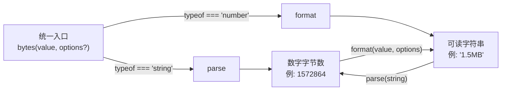

在前端开发中，文件大小显示、上传进度提示、存储配额计算等场景都离不开"字节"与人类可读单位之间的相互转换。`@mudssky/jsutils` 提供了 **Bytes 类**——一个同时支持 **格式化（数字 → 字符串）** 和 **解析（字符串 → 数字）** 的双向转换工具，覆盖从 B 到 PB 共 6 个量级，并内置千分位分隔、自定义小数位数、单位间强制转换等实用配置项。本文将带你从设计思路到实际用法，全面掌握这个模块。

Sources: [bytes.ts](src/modules/bytes.ts#L1-L182)

## 架构总览：双向转换的数据流

Bytes 模块的核心设计可以用一个简洁的双向数据流来表达：左侧是原始字节数（`number`），右侧是人类可读字符串（如 `"1.5 MB"`），中间通过 `format` 和 `parse` 两个方法完成互转，而 `convert` 方法作为统一入口根据入参类型自动分发。



模块导出了四种形态的 API 供不同场景使用：

| 导出名称        | 类型     | 说明                                                        |
| --------------- | -------- | ----------------------------------------------------------- |
| `Bytes`         | 类       | 可实例化的完整类，包含 `format`、`parse`、`convert` 方法    |
| `bytesInstance` | 实例     | 预创建的 `Bytes` 单例，直接使用无需手动 `new`               |
| `bytes()`       | 函数     | 对 `bytesInstance.convert` 的函数式封装，最常用的调用方式   |
| `bytesUnitMap`  | 常量对象 | 单位到数值的映射字典 `{ b: 1, kb: 1024, mb: 1048576, ... }` |

同时导出两个类型供 TypeScript 用户使用：`BytesUnitType`（单位字面量联合类型）和 `BytesOption`（格式化配置接口）。

Sources: [bytes.ts](src/modules/bytes.ts#L38-L182), [index.ts](src/index.ts#L2)

## 单位映射表：二进制前缀体系

Bytes 模块采用 **二进制前缀**（1024 进制），而非 SI 十进制前缀（1000 进制）。这是文件系统和存储领域的通用惯例：`1 KB = 1024 B`。

| 单位   | 值（字节）            | 计算方式  | 适用场景             |
| ------ | --------------------- | --------- | -------------------- |
| **B**  | 1                     | 基准单位  | 小文件、文本内容     |
| **KB** | 1,024                 | `1 << 10` | 文档、图片缩略图     |
| **MB** | 1,048,576             | `1 << 20` | 照片、短视频、安装包 |
| **GB** | 1,073,741,824         | `1 << 30` | 大文件、磁盘分区     |
| **TB** | 1,099,511,627,776     | `1024⁴`   | 大容量存储           |
| **PB** | 1,125,899,906,842,624 | `1024⁵`   | 数据中心级别         |

源码中使用位运算 (`1 << 10`, `1 << 20`, `1 << 30`) 来计算 KB、MB、GB 的值，这在 JavaScript 中是一种高效的常数表达方式。TB 和 PB 因超出 32 位安全范围，改用 `Math.pow(1024, n)` 计算。

Sources: [bytes.ts](src/modules/bytes.ts#L7-L14)

## 快速上手：三行代码搞定转换

### 安装与引入

```typescript
// 按需引入 bytes 函数（最简方式）
import { bytes } from '@mudssky/jsutils'

// 或引入类实例，获取完整的面向对象 API
import { bytesInstance } from '@mudssky/jsutils'

// 或引入 Bytes 类，自行创建实例
import { Bytes } from '@mudssky/jsutils'
const myBytes = new Bytes()
```

Sources: [bytes.ts](src/modules/bytes.ts#L159-L181), [index.ts](src/index.ts#L2)

### 最基本的用法

```typescript
import { bytes } from '@mudssky/jsutils'

// ========== 数字 → 字符串（格式化）==========
bytes(0) // '0B'
bytes(500) // '500B'
bytes(1024) // '1KB'
bytes(1048576) // '1MB'
bytes(1073741824) // '1GB'

// ========== 字符串 → 数字（解析）==========
bytes('1KB') // 1024
bytes('1.5MB') // 1572864
bytes('2GB') // 2147483648

// ========== 无效输入 ==========
bytes(NaN) // null
bytes('foobar') // null
bytes(Infinity) // null
```

`bytes()` 函数是模块的**统一入口**：传入 `number` 自动调用格式化，传入 `string` 自动调用解析，传入无效值返回 `null`。这种"重载式"设计让你不需要关心当前应该调哪个方法。

Sources: [bytes.ts](src/modules/bytes.ts#L172-L178)

## 深入 format：数字格式化的全配置详解

`format` 方法将一个字节数值转换为人类可读的字符串。它接受一个必选的数值参数和一个可选的配置对象。

### 配置项一览

```typescript
interface BytesOption {
  unit?: BytesUnitType // 强制指定输出单位，如 'kb'、'mb'
  decimalPlaces?: number // 小数位数，默认 2
  fixedDecimals?: boolean // 是否固定小数位（保留尾零），默认 false
  thousandsSeparator?: string // 千分位分隔符，如 ','、'.'、' '
  unitSeparator?: string // 数值与单位之间的分隔符，如 ' '
}
```

| 参数                 | 类型                                | 默认值           | 说明                                         |
| -------------------- | ----------------------------------- | ---------------- | -------------------------------------------- |
| `unit`               | `'b'\|'kb'\|'mb'\|'gb'\|'tb'\|'pb'` | `''`（自动选择） | 强制使用指定单位；传入无效值时回退为自动选择 |
| `decimalPlaces`      | `number`                            | `2`              | 控制 `toFixed` 的小数位数                    |
| `fixedDecimals`      | `boolean`                           | `false`          | 为 `true` 时保留尾部零（如 `1.000KB`）       |
| `thousandsSeparator` | `string`                            | `''`（无分隔）   | 整数部分的千分位分隔符                       |
| `unitSeparator`      | `string`                            | `''`（无空格）   | 数值与单位之间的连接字符                     |

Sources: [bytes.ts](src/modules/bytes.ts#L26-L32)

### 自动单位选择机制

当不指定 `unit`（或传入无效单位）时，`format` 会根据数值的绝对值自动选择最合适的单位。选择逻辑从大到小依次比较：

```typescript
// 自动选择流程（伪代码）
if (num >= 1024⁵)      → 'PB'
else if (num >= 1024⁴) → 'TB'
else if (num >= 1024³) → 'GB'
else if (num >= 1024²) → 'MB'
else if (num >= 1024¹) → 'KB'
else                    → 'B'
```

这意味着 `bytes(1500)` 返回 `'1.46KB'`（而非 `'1500B'`），因为 1500 已经超过了 1024 的 KB 阈值。自动选择的核心思想是：**始终选择能让数值落在 [1, 1024) 区间内的最大单位**，让人类一眼就能感知大小。

Sources: [bytes.ts](src/modules/bytes.ts#L106-L134)

### 小数位控制

```typescript
import { bytesInstance } from '@mudssky/jsutils'

// 默认 2 位小数，自动去除尾零
bytesInstance.format(1536) // '1.5KB'

// 自定义小数位数
bytesInstance.format(1075, { decimalPlaces: 0 }) // '1KB'（四舍五入）
bytesInstance.format(1075, { decimalPlaces: 1 }) // '1.1KB'
bytesInstance.format(1126, { decimalPlaces: 4 }) // '1.1006KB'

// 固定小数位（保留尾零）
bytesInstance.format(1024, { decimalPlaces: 3, fixedDecimals: true })
// '1.000KB'
```

`fixedDecimals` 默认为 `false`，这意味着 `1.50KB` 会自动简化为 `1.5KB`。当你需要表格列对齐等场景时，可以设置为 `true` 来保留统一的小数位宽度。

Sources: [bytes.ts](src/modules/bytes.ts#L137-L141), [bytes.test.ts](test/bytes.test.ts#L204-L250)

### 千分位分隔符

```typescript
bytesInstance.format(1000, { thousandsSeparator: ',' }) // '1,000B'
bytesInstance.format(1000, { thousandsSeparator: '.' }) // '1.000B'
bytesInstance.format(1000, { thousandsSeparator: ' ' }) // '1 000B'
bytesInstance.format(1005.1005 * 1024, {
  decimalPlaces: 4,
  thousandsSeparator: '_',
}) // '1_005.1005KB'
```

千分位分隔符**只作用于整数部分**，不影响小数部分。内部实现通过 `/\B(?=(\d{3})+(?!\d))/g` 正则表达式，在连续数字中每隔三位插入分隔符——这是一个经典的千分位格式化正则模式。

Sources: [bytes.ts](src/modules/bytes.ts#L143-L153), [bytes.test.ts](test/bytes.test.ts#L170-L194)

### 单位与数值之间的分隔符

```typescript
bytesInstance.format(1024) // '1KB'（无空格）
bytesInstance.format(1024, { unitSeparator: ' ' }) // '1 KB'（空格）
bytesInstance.format(1024, { unitSeparator: '\t' }) // '1\tKB'（制表符）
```

`unitSeparator` 控制数值字符串和单位之间的连接字符，默认为空字符串（紧凑格式）。在 UI 展示中，传入 `' '` 可以生成 `1 KB` 这种带空格的标准格式。

Sources: [bytes.ts](src/modules/bytes.ts#L115-L155), [bytes.test.ts](test/bytes.test.ts#L196-L202)

### 强制指定单位

```typescript
import { bytesInstance } from '@mudssky/jsutils'

// 12MB 以不同单位显示
bytesInstance.format(12 * 1024 * 1024, { unit: 'b' }) // '12582912B'
bytesInstance.format(12 * 1024 * 1024, { unit: 'kb' }) // '12288KB'
bytesInstance.format(12 * 1024 * 1024, { unit: 'mb' }) // '12MB'

// 传入无效单位时自动回退
bytesInstance.format(12 * 1024 * 1024, { unit: '' }) // '12MB'（回退为自动选择）
bytesInstance.format(12 * 1024 * 1024, { unit: 'bb' }) // '12MB'（同上）
```

当你需要在不同行之间保持单位一致（例如文件列表统一显示为 KB），`unit` 参数就非常有用。如果传入的 `unit` 不在 `bytesUnitMap` 中（包括空字符串或拼写错误），方法会静默回退为自动选择。

Sources: [bytes.ts](src/modules/bytes.ts#L118-L134), [bytes.test.ts](test/bytes.test.ts#L258-L285)

## 深入 parse：字符串解析的细节

`parse` 方法将人类可读的字节字符串还原为数值。它的设计哲学是**宽容输入、精确输出**。

### 解析规则详解

```typescript
import { bytesInstance } from '@mudssky/jsutils'

// 标准格式：数字 + 单位（大小写不敏感）
bytesInstance.parse('1KB') // 1024
bytesInstance.parse('1kb') // 1024
bytesInstance.parse('1Kb') // 1024
bytesInstance.parse('1kB') // 1024

// 支持小数
bytesInstance.parse('0.5KB') // 512
bytesInstance.parse('1.5MB') // 1572864

// 支持负数
bytesInstance.parse('-1') // -1
bytesInstance.parse('-1.5TB') // -1649267441664

// 数字与单位之间允许空格
bytesInstance.parse('1 TB') // 1099511627776

// 无单位时默认为字节（B）
bytesInstance.parse('0') // 0
bytesInstance.parse('1024') // 1024

// 无效输入返回 null
bytesInstance.parse('foobar') // null
```

Sources: [bytes.ts](src/modules/bytes.ts#L79-L105), [bytes.test.ts](test/bytes.test.ts#L21-L111)

### 精度特性：向下取整到整数

`parse` 的输出始终通过 `Math.floor` 向下取整，**精度只到 1 字节**，小数部分会被丢弃：

```typescript
bytesInstance.parse('1.1b') // 1（而非 1.1）
bytesInstance.parse('1.0001kb') // 1024（0.0001 × 1024 ≈ 0.1，被 floor 掉）
```

这个设计决策符合实际需求：字节是数字信息的最小寻址单位，不存在"0.1 个字节"的概念。如果你需要更精确的中间计算，请直接使用字节数值进行运算，仅在最终展示时调用 `format`。

Sources: [bytes.ts](src/modules/bytes.ts#L100-L104), [bytes.test.ts](test/bytes.test.ts#L102-L106)

### 内部正则解析器

`parse` 方法内部使用正则表达式 `/^((-|\+)?(\d+(?:\.\d+)?)) *(kb|mb|gb|tb|pb)$/i` 来提取输入中的数值和单位。这个正则的含义是：

- `^` 从字符串开头匹配
- `(-|\+)?` 可选的正负号
- `(\d+(?:\.\d+)?)` 数字部分（支持小数）
- ` *` 数值与单位之间允许任意空格
- `(kb|mb|gb|tb|pb)` 单位部分
- `$` 字符串结尾
- `/i` 大小写不敏感

当正则匹配失败时（即输入不含已知单位），`parse` 会回退为 `parseInt` 解析并将单位默认为 `b`（字节）。如果 `parseInt` 也失败（如输入 `"foobar"`），最终返回 `null`。

Sources: [bytes.ts](src/modules/bytes.ts#L55-L104)

## 实战场景：典型用法示例

### 场景一：文件上传进度显示

```typescript
import { bytes } from '@mudssky/jsutils'

function formatProgress(loaded: number, total: number) {
  const loadedStr = bytes(loaded, { unitSeparator: ' ' })
  const totalStr = bytes(total, { unitSeparator: ' ' })
  return `${loadedStr} / ${totalStr}`
}

formatProgress(524288, 10485760)
// '512 KB / 10 MB'
```

### 场景二：文件大小列统一单位

```typescript
import { bytes } from '@mudssky/jsutils'

const files = [
  { name: 'readme.md', size: 2048 },
  { name: 'photo.jpg', size: 3145728 },
  { name: 'video.mp4', size: 536870912 },
]

// 统一以 MB 显示，保留 2 位小数
const table = files.map((f) => ({
  name: f.name,
  size: bytes(f.size, { unit: 'mb', unitSeparator: ' ' }),
}))
// [
//   { name: 'readme.md', size: '0 MB' },
//   { name: 'photo.jpg', size: '3 MB' },
//   { name: 'video.mp4', size: '512 MB' },
// ]
```

### 场景三：用户输入解析

```typescript
import { bytes } from '@mudssky/jsutils'

// 用户在表单中输入 "100MB"，你需要知道它等于多少字节
const userInput = '100MB'
const byteCount = bytes(userInput) // 104857600

if (byteCount !== null && byteCount > MAX_UPLOAD_SIZE) {
  alert('文件大小超出限制！')
}
```

### 场景四：大数据量的千分位展示

```typescript
import { bytesInstance } from '@mudssky/jsutils'

// 用千分位逗号 + 空格分隔，展示超大文件
bytesInstance.format(2 * Math.pow(1024, 4), {
  thousandsSeparator: ',',
  unitSeparator: ' ',
})
// '2 TB'

bytesInstance.format(1234567890, {
  thousandsSeparator: ',',
  unitSeparator: ' ',
})
// '1,234,567,890B' — 注意：小于 1KB 时以 B 为单位，千分位照样生效
```

Sources: [bytes.ts](src/modules/bytes.ts#L67-L78), [bytes.test.ts](test/bytes.test.ts#L288-L313)

## 导出 API 速查表

以下是模块全部导出的快速参考：

| 导出                     | 签名                                                                | 说明                                |
| ------------------------ | ------------------------------------------------------------------- | ----------------------------------- |
| `Bytes`                  | `class`                                                             | 可实例化的字节转换类                |
| `bytesInstance`          | `Bytes`                                                             | 预创建的类实例                      |
| `bytes(value, options?)` | `(number\|string, BytesOption?) => string\|number\|null\|undefined` | 统一转换入口函数                    |
| `bytesUnitMap`           | `Record<string, number>`                                            | 单位→数值映射字典                   |
| `BytesUnitType`          | `type`                                                              | `'b'\|'kb'\|'mb'\|'gb'\|'tb'\|'pb'` |
| `BytesOption`            | `interface`                                                         | 格式化配置接口                      |

Sources: [bytes.ts](src/modules/bytes.ts#L159-L182)

## 延伸阅读

- 如果你对文件上传后的存储管理感兴趣，可以继续阅读 [存储抽象层：WebLocalStorage/WebSessionStorage 与前缀命名空间](11-cun-chu-chou-xiang-ceng-weblocalstorage-websessionstorage-yu-qian-zhui-ming-ming-kong-jian)，了解如何用命名空间隔离不同业务的数据。
- 想了解正则表达式在工具函数中的更多应用，参见 [正则表达式工具：常用模式校验、密码强度分析与字符转义](13-zheng-ze-biao-da-shi-gong-ju-chang-yong-mo-shi-xiao-yan-mi-ma-qiang-du-fen-xi-yu-zi-fu-zhuan-yi)。
- 如果需要将字节转换与日志输出结合，参见 [日志系统：分级过滤、格式化输出与上下文注入](12-ri-zhi-xi-tong-fen-ji-guo-lu-ge-shi-hua-shu-chu-yu-shang-xia-wen-zhu-ru)。
