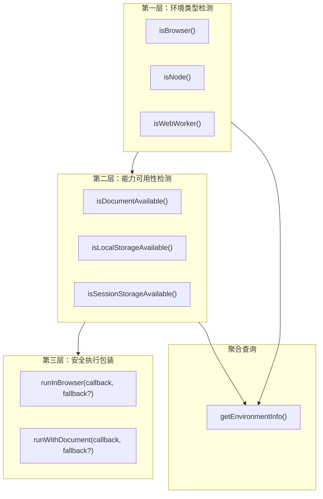
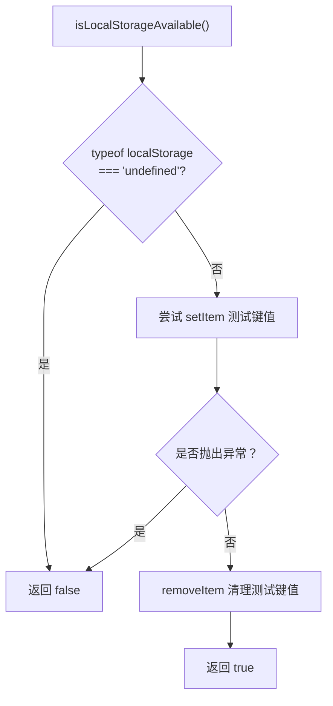
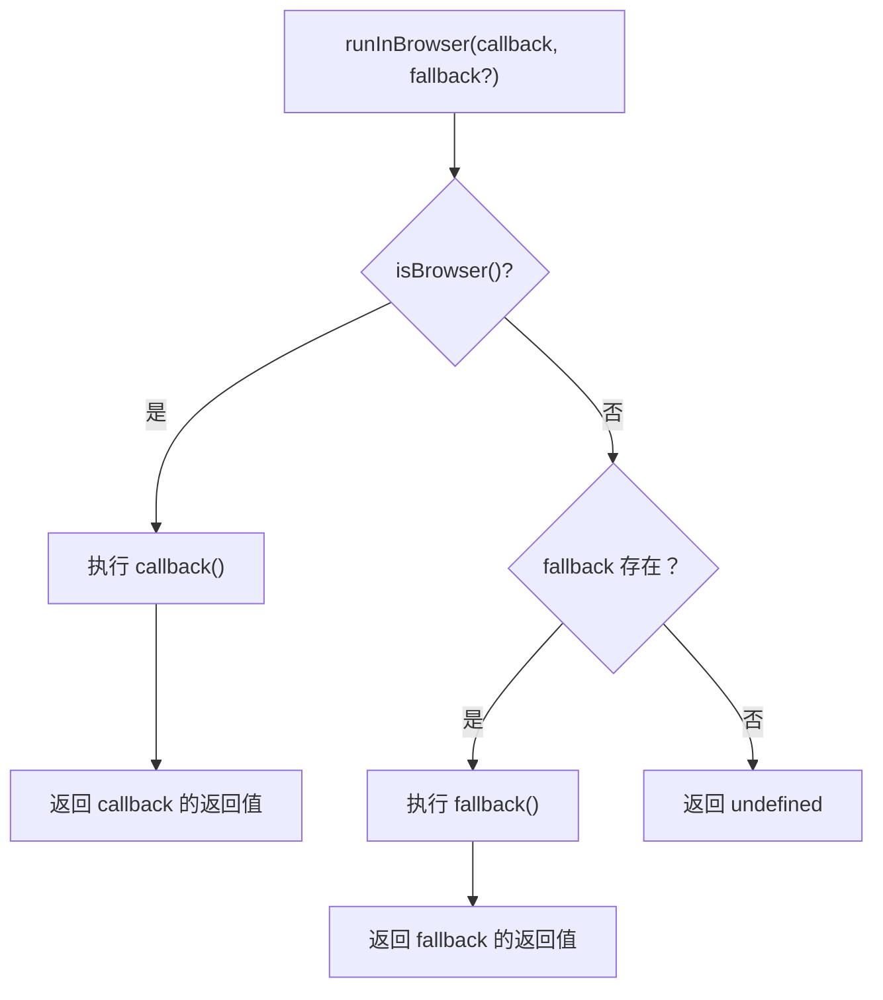

JavaScript 的「一次编写，到处运行」听起来很美好，但现实是——浏览器有 `window` 和 `document`，Node.js 有 `process` 和 `require`，Web Worker 有 `importScripts` 和 `postMessage`。当代码需要同时在这几种环境中运行时，**环境检测**就是第一道防线。`jsutils` 的 `env` 模块提供了一组精确的运行时环境探测函数和安全执行包装器，让你无需手动编写 `typeof window !== 'undefined'` 这类容易出错的样板代码。

Sources: [env.ts](src/modules/env.ts#L1-L4)

## 模块全景：三层能力架构

该模块的设计可以划分为三个递进的能力层——**环境类型检测**、**能力可用性检测**、**安全执行包装**。每一层都建立在前一层的基础上，形成从「我在哪」到「我能用什么」再到「我该怎么安全地用」的完整链路。



这个分层架构的关键设计决策在于：**不依赖 User-Agent 字符串解析**，而是通过检测全局对象的 `typeof` 来判断环境类型。这种方式比解析 `navigator.userAgent` 更可靠，因为 User-Agent 字符串可以被修改，甚至在新版浏览器中会被冻结（Chrome 已计划减少 User-Agent 信息）。

Sources: [env.ts](src/modules/env.ts#L1-L153)

## 环境类型检测：我在哪里运行？

### isBrowser() —— 浏览器环境判断

```typescript
import { isBrowser } from 'jsutils'

if (isBrowser()) {
  console.log('当前运行在浏览器中，可以安全访问 DOM')
}
```

该函数通过检查 `typeof window !== 'undefined'` 来判断是否处于浏览器环境。`typeof` 操作符的安全之处在于：即使 `window` 未定义，`typeof window` 也只会返回字符串 `"undefined"` 而不会抛出 `ReferenceError`。

Sources: [env.ts](src/modules/env.ts#L14-L16)

### isNode() —— Node.js 环境判断

```typescript
import { isNode } from 'jsutils'

if (isNode()) {
  console.log('当前运行在 Node.js 中，可以使用 fs、path 等模块')
}
```

Node.js 检测采用了**三重验证**策略：`typeof process !== 'undefined'` 确认 `process` 全局对象存在，`process.versions` 确认版本信息对象存在，`!!process.versions.node` 确认这确实是 Node.js 而非其他使用 `process` 的运行时（如 Deno 早期版本）。这种多层检测避免了误判。

Sources: [env.ts](src/modules/env.ts#L23-L29)

### isWebWorker() —— Web Worker 环境判断

```typescript
import { isWebWorker } from 'jsutils'

if (isWebWorker()) {
  console.log('当前运行在 Web Worker 中')
}
```

Web Worker 的检测组合了两个条件：`typeof importScripts === 'function'` 是 Web Worker（及 Service Worker）独有的全局函数，而 `typeof navigator !== 'undefined'` 排除了 Node.js 环境（因为 `importScripts` 在某些 Node.js polyfill 中也可能存在）。这种**交叉验证**模式比单条件检测更健壮。注意模块顶部通过 `declare const importScripts` 声明了该全局变量的类型，使 TypeScript 编译器不会报错。

Sources: [env.ts](src/modules/env.ts#L7), [env.ts](src/modules/env.ts#L36-L38)

### 三种环境检测的判定依据对比

| 函数            | 检测机制              | 检测的全局对象                                           | 特殊处理                 |
| --------------- | --------------------- | -------------------------------------------------------- | ------------------------ |
| `isBrowser()`   | `typeof` 单条件       | `window`                                                 | 无                       |
| `isNode()`      | `typeof` + 属性链验证 | `process` → `process.versions` → `process.versions.node` | 三重验证链               |
| `isWebWorker()` | `typeof` 双条件交叉   | `importScripts` + `navigator`                            | `importScripts` 类型声明 |

**重要提示**：这三种环境**并不互斥**。例如，在 SSR（服务端渲染）场景中，代码可能在 Node.js 中运行但通过 jsdom 模拟了浏览器环境，此时 `isBrowser()` 和 `isNode()` 可能同时返回 `true`。因此，在做环境判断时，应该根据你的具体需求选择最合适的检测函数。

Sources: [env.ts](src/modules/env.ts#L14-L38)

## 能力可用性检测：我能用什么？

仅仅知道「我在浏览器里」是不够的。浏览器可能处于隐私模式导致 Storage 不可用，或者在 SSR hydration 阶段 `document` 尚未就绪。能力可用性检测解决的是更细粒度的问题。

### isDocumentAvailable() —— document 对象可用性

```typescript
import { isDocumentAvailable } from 'jsutils'

if (isDocumentAvailable()) {
  const el = document.createElement('div')
  // 安全地进行 DOM 操作
}
```

该函数检查 `typeof document !== 'undefined'`。它和 `isBrowser()` 的区别在于：`isBrowser()` 检测 `window`（浏览器顶层对象），而 `isDocumentAvailable()` 检测 `document`（DOM 树入口）。在 Web Worker 环境中，虽然处于浏览器内，但没有 `document` 对象。

Sources: [env.ts](src/modules/env.ts#L44-L47)

### isLocalStorageAvailable() / isSessionStorageAvailable() —— 存储可用性检测

```typescript
import { isLocalStorageAvailable, isSessionStorageAvailable } from 'jsutils'

if (isLocalStorageAvailable()) {
  localStorage.setItem('token', 'abc123')
}
```

Storage 检测采用了**实际 I/O 验证**而非简单的 `typeof` 检查。这是因为即使 `localStorage` 对象存在，以下情况仍可能导致操作失败：

- **隐私/无痕模式**：Safari 隐私模式下 `localStorage` 对象存在但写入会抛异常
- **存储配额耗尽**：磁盘空间不足时 `setItem` 会抛 `QuotaExceededError`
- **安全策略限制**：某些 CSP（内容安全策略）配置可能阻止 Storage 使用

检测流程是：先用 `typeof` 快速排除对象不存在的情况，然后执行一次真实的 `setItem` → `removeItem` 操作来验证完整可用性，整个过程包裹在 `try...catch` 中确保任何异常都返回 `false`。

Sources: [env.ts](src/modules/env.ts#L54-L85)

### 存储检测的防御性流程



Sources: [env.ts](src/modules/env.ts#L54-L66)

## getEnvironmentInfo() —— 一次性获取全部环境信息

当你需要做全面的环境判断时，单独调用多个函数显得冗余。`getEnvironmentInfo()` 将所有检测结果聚合为一个对象返回：

```typescript
import { getEnvironmentInfo } from 'jsutils'

const env = getEnvironmentInfo()
console.log(env)
```

在 Node.js 环境中输出类似：

```typescript
{
  isBrowser: false,
  isNode: true,
  isWebWorker: false,
  isDocumentAvailable: false,
  isLocalStorageAvailable: false,
  isSessionStorageAvailable: false,
  userAgent: undefined,
  platform: 'win32'  // 或 'darwin'、'linux' 等
}
```

在浏览器环境中输出类似：

```typescript
{
  isBrowser: true,
  isNode: false,
  isWebWorker: false,
  isDocumentAvailable: true,
  isLocalStorageAvailable: true,
  isSessionStorageAvailable: true,
  userAgent: 'Mozilla/5.0 (Windows NT 10.0; Win64; x64) ...',
  platform: 'Win32'
}
```

返回的 `EnvironmentInfo` 对象包含以下字段：

| 字段                        | 类型                  | 说明                                                                     |
| --------------------------- | --------------------- | ------------------------------------------------------------------------ |
| `isBrowser`                 | `boolean`             | 是否在浏览器环境                                                         |
| `isNode`                    | `boolean`             | 是否在 Node.js 环境                                                      |
| `isWebWorker`               | `boolean`             | 是否在 Web Worker 环境                                                   |
| `isDocumentAvailable`       | `boolean`             | document 对象是否可用                                                    |
| `isLocalStorageAvailable`   | `boolean`             | localStorage 是否可用                                                    |
| `isSessionStorageAvailable` | `boolean`             | sessionStorage 是否可用                                                  |
| `userAgent`                 | `string \| undefined` | 浏览器 User-Agent 字符串（仅浏览器环境）                                 |
| `platform`                  | `string \| undefined` | 平台标识（浏览器取 `navigator.platform`，Node.js 取 `process.platform`） |

`platform` 字段的解析逻辑体现了模块的**环境自适应设计**：浏览器环境优先取 `navigator.platform`，Node.js 环境取 `process.platform`，两者都不存在时返回 `undefined`。这种安全访问链避免了任何环境下的运行时错误。

Sources: [env.ts](src/modules/env.ts#L91-L118)

## 安全执行包装：优雅地处理环境差异

安全执行包装是本模块最实用的能力层。它将「检测环境 → 条件分支执行」这个常见模式封装成了泛型函数，消除了重复的 `if` 判断代码。

### runInBrowser() —— 浏览器安全执行

```typescript
import { runInBrowser } from 'jsutils'

// 基本用法：仅在浏览器中执行，其他环境返回 undefined
const viewport = runInBrowser(() => ({
  width: window.innerWidth,
  height: window.innerHeight,
}))
// Node.js 中 viewport 为 undefined，浏览器中为实际尺寸对象

// 带 fallback：在非浏览器环境中使用替代方案
const width = runInBrowser(
  () => window.innerWidth,
  () => 1024, // Node.js 环境下的默认宽度
)
```

Sources: [env.ts](src/modules/env.ts#L127-L135)

### runWithDocument() —— document 安全执行

```typescript
import { runWithDocument } from 'jsutils'

// 在 SSR 场景中安全创建 DOM 元素
const container = runWithDocument(
  () => document.getElementById('app'),
  () => null, // SSR 阶段返回 null
)

// 在可能有/没有 document 的环境中安全操作
const title = runWithDocument(
  () => document.title,
  () => 'Default Title',
)
```

Sources: [env.ts](src/modules/env.ts#L143-L152)

### 安全执行包装的执行流程



两个包装函数的签名完全一致，唯一区别是内部的环境判断条件：

```typescript
// 函数签名对比
function runInBrowser<T>(callback: () => T, fallback?: () => T): T | undefined
function runWithDocument<T>(
  callback: () => T,
  fallback?: () => T,
): T | undefined
```

泛型参数 `<T>` 使返回值类型能够被 TypeScript 正确推断。需要注意返回类型是 `T | undefined`——当环境不满足且未提供 `fallback` 时，返回值为 `undefined`。在使用返回值时应做好类型窄化处理。

Sources: [env.ts](src/modules/env.ts#L127-L152)

## 实战场景：典型用法一览

### 场景一：SSR/SSG 安全渲染

在 Next.js、Nuxt 等 SSR 框架中，代码会在服务端（Node.js）和客户端（浏览器）各执行一次。使用 `runInBrowser` 可以安全地将浏览器专属逻辑隔离：

```typescript
import { runInBrowser, isBrowser } from 'jsutils'

// 初始化仅在浏览器执行的副作用
runInBrowser(() => {
  window.addEventListener('resize', handleResize)
  // 注册 Service Worker
  navigator.serviceWorker?.register('/sw.js')
})

// 条件渲染
const theme = isBrowser() ? localStorage.getItem('theme') : 'light'
```

### 场景二：库的跨环境兼容

如果你正在编写一个需要在多种环境中使用的工具库，环境检测可以帮助你提供不同环境的实现：

```typescript
import { isNode, isBrowser, runInBrowser, runWithDocument } from 'jsutils'

function readConfig(): Config {
  if (isNode()) {
    // Node.js: 读取文件系统
    const fs = require('fs')
    return JSON.parse(fs.readFileSync('./config.json', 'utf-8'))
  }

  // 浏览器: 从 Storage 或 API 获取
  return (
    runInBrowser(() => {
      const cached = localStorage.getItem('config')
      return cached ? JSON.parse(cached) : defaultConfig
    }) ?? defaultConfig
  )
}
```

### 场景三：优雅降级

```typescript
import { isLocalStorageAvailable, isSessionStorageAvailable } from 'jsutils'

function getPreferredStorage(): Storage | null {
  if (isLocalStorageAvailable()) return localStorage
  if (isSessionStorageAvailable()) return sessionStorage
  return null // 降级为内存存储
}
```

## API 速查表

| 函数                          | 返回类型          | 用途                  | 性能特征                 |
| ----------------------------- | ----------------- | --------------------- | ------------------------ |
| `isBrowser()`                 | `boolean`         | 浏览器环境判断        | O(1)，仅 `typeof` 检查   |
| `isNode()`                    | `boolean`         | Node.js 环境判断      | O(1)，`typeof` + 属性链  |
| `isWebWorker()`               | `boolean`         | Web Worker 环境判断   | O(1)，两个 `typeof` 检查 |
| `isDocumentAvailable()`       | `boolean`         | document 可用性       | O(1)，仅 `typeof` 检查   |
| `isLocalStorageAvailable()`   | `boolean`         | localStorage 可用性   | O(1)，含一次 I/O 验证    |
| `isSessionStorageAvailable()` | `boolean`         | sessionStorage 可用性 | O(1)，含一次 I/O 验证    |
| `getEnvironmentInfo()`        | `EnvironmentInfo` | 聚合所有环境信息      | 调用全部检测函数         |
| `runInBrowser(fn, fb?)`       | `T \| undefined`  | 浏览器安全执行        | O(1) + 回调函数开销      |
| `runWithDocument(fn, fb?)`    | `T \| undefined`  | document 安全执行     | O(1) + 回调函数开销      |

Sources: [env.ts](src/modules/env.ts#L1-L153)

## 设计哲学与注意事项

**为什么使用 `typeof` 而不是 `in` 操作符？** 模块统一使用 `typeof globalObject !== 'undefined'` 而非 `'globalObject' in globalThis`，因为在某些 JavaScript 引擎和打包工具的环境下，`in` 操作符可能出现误判（例如打包工具注入了 polyfill 占位符），而 `typeof` 的语义更加明确——它检查的是该标识符是否真正可访问且已定义。

**`isLocalStorageAvailable()` 的 I/O 验证是否影响性能？** 该函数使用一个临时的测试键 `__localStorage_test__` 进行一次写入和一次删除操作。在现代浏览器中，localStorage 的单次同步 I/O 耗时通常在微秒级别，对性能影响可以忽略。但如果你需要频繁检测（例如在热循环中），建议将结果缓存到变量中。

**Web Worker 检测的边界情况**：`isWebWorker()` 在 Service Worker 环境中也会返回 `true`，因为 Service Worker 同样支持 `importScripts` 并拥有 `navigator` 对象。如果你需要区分 Dedicated Worker 和 Service Worker，还需要额外检查 `ServiceWorkerGlobalScope`。

Sources: [env.ts](src/modules/env.ts#L14-L38), [env.ts](src/modules/env.ts#L54-L66)

## 延伸阅读

- 了解环境检测在存储模块中的实际应用：[存储抽象层：WebLocalStorage/WebSessionStorage 与前缀命名空间](11-cun-chu-chou-xiang-ceng-weblocalstorage-websessionstorage-yu-qian-zhui-ming-ming-kong-jian)
- 环境检测在 DOM 操作中的配合使用：[DOM 操作辅助：DOMHelper 链式 API 与事件管理](16-dom-cao-zuo-fu-zhu-domhelper-lian-shi-api-yu-shi-jian-guan-li)
- 了解类型守卫如何与环境检测配合实现类型窄化：[类型守卫体系：isString、isEqual、isEmpty 等运行时类型判断](8-lei-xing-shou-wei-ti-xi-isstring-isequal-isempty-deng-yun-xing-shi-lei-xing-pan-duan)
- 模块的完整测试实现参考：[env.test.ts](test/env.test.ts#L1-L267)
