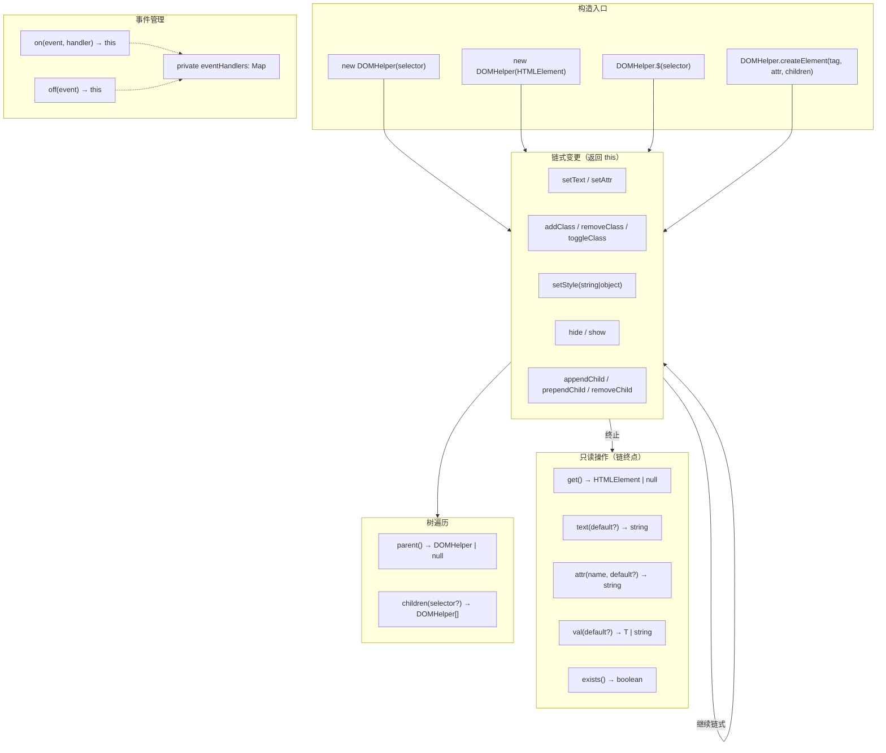

`DOMHelper` 是 jsutils 库中对浏览器 DOM 操作的轻量级封装，以**链式调用**为核心设计范式，将选择器查询、属性读写、样式修改、类名操作、子元素管理和事件绑定统一到一个连贯的 fluent API 中。它不引入虚拟 DOM 或模板引擎的复杂性，而是在原生 DOM API 之上提供一层符合现代 TypeScript 工程化要求的零依赖抽象——适合在工具脚本、轻量级页面交互、或框架之外的原生 DOM 场景中快速编写可读性强的操作代码。

Sources: [domHelper.ts](src/modules/dom/domHelper.ts#L1-L6), [index.ts](src/modules/dom/index.ts#L1-L3)

## 架构总览

`DOMHelper` 的设计围绕三个核心职责展开：**元素定位与读取**、**链式变更写入**、**事件生命周期管理**。所有可变操作（`setText`、`addClass`、`setStyle`、`on`/`off` 等）统一返回 `this`，使得多步 DOM 操作可以在一条语句中完成，消除了中间变量的声明噪音。只读操作（`get`、`text`、`attr`、`val`、`exists`）则作为链的终点，负责从 DOM 中提取数据。



上图中，**构造入口**提供了四种创建 `DOMHelper` 实例的方式；**链式变更**方法群是 API 的核心，每一个都返回 `this` 以延续调用链；**只读操作**作为链的终止节点返回具体数据；**事件管理**通过内部 `Map` 追踪处理器引用，实现安全的解绑。

Sources: [domHelper.ts](src/modules/dom/domHelper.ts#L1-L200)

## 创建实例：双模构造与静态工厂

`DOMHelper` 的构造函数接受 `string | HTMLElement` 双模参数——传入 CSS 选择器字符串时，内部延迟调用 `document.querySelector`；传入已有的 `HTMLElement` 引用时则直接持有。这种设计使得 `DOMHelper` 既能用于从零开始的元素查找，也能无缝包装已有 DOM 引用。

Sources: [domHelper.ts](src/modules/dom/domHelper.ts#L5-L6)

### 实例构造与静态工厂方法对比

| 创建方式                 | 签名                                              | 适用场景                        | 返回类型    |
| ------------------------ | ------------------------------------------------- | ------------------------------- | ----------- |
| 直接构造                 | `new DOMHelper(selector)`                         | 已有选择器字符串或元素引用      | `DOMHelper` |
| `$` 快捷函数             | `$(selector)`                                     | 简洁的 jQuery 风格调用          | `DOMHelper` |
| `DOMHelper.$` 静态方法   | `DOMHelper.$(selector)`                           | 无需 import `$` 时的显式调用    | `DOMHelper` |
| `createElement` 静态方法 | `DOMHelper.createElement(tag, attrs?, children?)` | 从零创建新元素并设置属性/子元素 | `DOMHelper` |

`$` 是从 `DOMHelper.$` 静态方法直接导出的函数别名，两者行为完全等价。`createElement` 静态方法是一个完整的元素工厂：它创建指定标签的元素，批量设置属性，并递归添加子元素（子元素可以是 `HTMLElement` 或已有的 `DOMHelper` 实例），最终返回包装好的 `DOMHelper`。

```typescript
import { $, DOMHelper } from '@mudssky/jsutils'

// 方式一：选择器字符串
const title = new DOMHelper('#app-title')

// 方式二：已有元素引用
const el = document.getElementById('app-title')!
const wrapped = new DOMHelper(el)

// 方式三：$ 快捷函数（推荐）
const nav = $('#main-nav')

// 方式四：从零创建元素
const card = DOMHelper.createElement('div', { class: 'card' }, [
  DOMHelper.createElement('h2', {}, [
    DOMHelper.createElement('span', { class: 'title' }),
  ]),
])
```

Sources: [domHelper.ts](src/modules/dom/domHelper.ts#L74-L77), [domHelper.ts](src/modules/dom/domHelper.ts#L172-L199)

## 链式变更 API：读、写、样式与类名

链式 API 的核心原则是**写操作返回 `this`，读操作返回值**。这意味着你可以在一条语句中完成"查找元素 → 修改文本 → 添加类名 → 设置样式 → 绑定事件"的完整操作流。所有方法都内置了 null 安全检查——当目标元素不存在时，写操作静默跳过，读操作返回合理的默认值。

### 读取方法

| 方法       | 签名                                 | 返回值                 | null 安全行为                                                              |
| ---------- | ------------------------------------ | ---------------------- | -------------------------------------------------------------------------- |
| `get()`    | `get(): HTMLElement \| null`         | 底层 DOM 元素引用      | 选择器无匹配时返回 `null`                                                  |
| `text()`   | `text(defaultValue?): string`        | 去除首尾空白的文本内容 | 元素不存在时返回 `defaultValue`（默认 `''`）                               |
| `attr()`   | `attr(name, defaultValue?): string`  | 指定属性的字符串值     | 属性不存在时返回 `defaultValue`（默认 `''`）                               |
| `val()`    | `val<T>(defaultValue?): T \| string` | 表单元素的值           | 元素不存在时返回 `defaultValue`；支持 `string`/`number`/`boolean` 泛型推断 |
| `exists()` | `exists(): boolean`                  | 元素是否存在于 DOM 中  | 无匹配时返回 `false`                                                       |

`val()` 方法是一个值得关注的类型增强实现：当你传入 `number` 类型的 `defaultValue` 时，它会自动将 `input.value` 转换为数字并处理 `NaN`；传入 `boolean` 时会解析字符串 `"true"`。这种"由默认值推断返回类型"的模式在保持 API 简洁的同时提供了类型安全。

Sources: [domHelper.ts](src/modules/dom/domHelper.ts#L9-L38), [domHelper.ts](src/modules/dom/domHelper.ts#L69-L72)

### 变更方法

所有变更方法都返回 `this`，支持无限链式组合：

| 方法                      | 功能               | 关键实现细节                           |
| ------------------------- | ------------------ | -------------------------------------- |
| `setText(text)`           | 设置 `textContent` | 直接赋值，覆盖所有子节点               |
| `setAttr(name, value)`    | 设置 HTML 属性     | 使用 `setAttribute`                    |
| `addClass(className)`     | 添加 CSS 类名      | 使用 `classList.add`                   |
| `removeClass(className)`  | 移除 CSS 类名      | 使用 `classList.remove`                |
| `toggleClass(className)`  | 切换 CSS 类名      | 使用 `classList.toggle`                |
| `hide()`                  | 隐藏元素           | 设置 `style.display = 'none'`          |
| `show()`                  | 显示元素           | 设置 `style.display = ''`（恢复默认）  |
| `setStyle(style, value?)` | 设置内联样式       | 支持单属性字符串或样式对象两种调用形式 |

`setStyle` 是变更方法中最灵活的一个，它接受两种参数形态：**字符串 + 值** 的单属性形式和 **对象** 的批量形式。两种形式都自动将 camelCase 属性名（如 `backgroundColor`）转换为 CSS 标准的 kebab-case（`background-color`），使用 `style.setProperty` 确保兼容性。

```typescript
// 单属性设置
$('#box').setStyle('color', 'red')

// camelCase 自动转换
$('#box').setStyle('backgroundColor', 'blue')

// 批量对象设置
$('#box').setStyle({
  color: 'green',
  fontSize: '16px',
  marginTop: '10px',
})
```

Sources: [domHelper.ts](src/modules/dom/domHelper.ts#L40-L145)

### 链式组合实战

链式 API 的真正威力在于将多步操作压缩为一条可读的声明式语句。以下示例展示了从选择元素到完成全部配置的完整链式操作流：

```typescript
import { $, DOMHelper } from '@mudssky/jsutils'

// 一条语句完成：查找 → 修改文本 → 设置属性 → 添加类名 → 样式 → 绑定事件
$('#submit-btn')
  .setText('提交订单')
  .setAttr('aria-label', '提交订单按钮')
  .addClass('btn', 'btn-primary') // ⚠️ 注意：addClass 只接受单个类名
  .setStyle({ fontSize: '14px', fontWeight: '600' })
  .on('click', () => console.log('提交中...'))
```

需要注意的是，`addClass`/`removeClass`/`toggleClass` 每次只接受**一个**类名字符串。如果需要操作多个类名，需要链式调用多次：

```typescript
$('#box').addClass('active').addClass('visible').addClass('highlighted')
```

Sources: [domHelper.ts](src/modules/dom/domHelper.ts#L40-L67), [domHelper.ts](src/modules/dom/domHelper.ts#L82-L89)

## DOM 树遍历与子元素管理

### 树遍历

`parent()` 和 `children()` 提供了向上和向下的 DOM 树遍历能力。`parent()` 返回一个新的 `DOMHelper` 实例包装父元素（到达根节点或元素不存在时返回 `null`），`children()` 返回 `DOMHelper[]` 数组，支持可选的 CSS 选择器过滤。

| 方法                 | 返回类型            | 特点                                     |
| -------------------- | ------------------- | ---------------------------------------- |
| `parent()`           | `DOMHelper \| null` | 返回单个包装实例，可继续链式操作         |
| `children()`         | `DOMHelper[]`       | 无参数时返回所有直接子元素               |
| `children(selector)` | `DOMHelper[]`       | 传入选择器时使用 `querySelectorAll` 过滤 |

```typescript
// 向上遍历
const parentHelper = $('#child-element').parent()
parentHelper?.addClass('has-focused-child')

// 向下遍历
const items = $('#list').children('.item')
items.forEach((item) => item.addClass('processed'))
```

Sources: [domHelper.ts](src/modules/dom/domHelper.ts#L101-L112)

### 子元素增删

三个子元素操作方法提供了完整的 DOM 子树修改能力。它们都同时接受 `HTMLElement` 和 `DOMHelper` 作为参数，内部自动解包——这意味着你可以自由混用原生元素和 `DOMHelper` 实例。

| 方法                  | 行为                                     | 对应原生 API                            |
| --------------------- | ---------------------------------------- | --------------------------------------- |
| `appendChild(child)`  | 追加到子元素列表末尾                     | `el.appendChild()`                      |
| `prependChild(child)` | 插入到子元素列表最前面                   | `el.insertBefore(child, el.firstChild)` |
| `removeChild(child)`  | 移除指定子元素（带 `contains` 安全检查） | `el.removeChild()`                      |

```typescript
// 动态构建列表项
const list = $('#todo-list')
const newItem = DOMHelper.createElement('li', { class: 'todo-item' }).setText(
  '学习 DOMHelper API',
)

list.appendChild(newItem)

// 链式添加多个子元素
const header = DOMHelper.createElement('header')
const footer = DOMHelper.createElement('footer')

$('#app')
  .prependChild(header) // header 插到最前
  .appendChild(footer) // footer 追加到末尾
```

`removeChild` 在执行前会通过 `el.contains(childEl)` 检查子元素是否确实属于当前元素的子树，避免原生 `removeChild` 在关系不成立时抛出 `NotFoundError`。这一安全检查是所有子元素操作方法"静默处理异常情况"设计哲学的体现。

Sources: [domHelper.ts](src/modules/dom/domHelper.ts#L147-L169)

## 事件管理：绑定、解绑与处理器追踪

`DOMHelper` 的事件系统通过内部的 `eventHandlers: Map<string, EventListener>` 实现了**处理器引用追踪**。与直接使用 `addEventListener`/`removeEventListener` 的区别在于：`on` 方法在绑定的同时将处理器函数存入 Map，`off` 方法根据事件名从 Map 中取出处理器引用并完成解绑——你不再需要手动保存处理器引用来解绑事件。

```typescript
// 传统方式：需要手动保存引用
const handler = () => {
  /* ... */
}
el.addEventListener('click', handler)
el.removeEventListener('click', handler) // 必须是同一个引用

// DOMHelper 方式：引用由实例内部追踪
$('#my-btn')
  .on('click', () => console.log('clicked'))
  // ... 稍后解绑时无需保存原始引用
  .off('click')
```

### 事件操作方法

| 方法                 | 签名                                              | 行为                    |
| -------------------- | ------------------------------------------------- | ----------------------- |
| `on(event, handler)` | `(event: string, handler: EventListener) => this` | 绑定事件并存入 Map      |
| `off(event)`         | `(event: string) => this`                         | 从 Map 取出处理器并解绑 |

### 使用约束

由于 `eventHandlers` Map 的键是事件名字符串，**每个 `DOMHelper` 实例对同一事件名只追踪一个处理器**。如果对同一事件名连续调用 `on`，后注册的处理器会覆盖 Map 中的引用，但之前注册的原生事件监听器**不会被自动移除**。因此推荐的使用模式是：对同一事件先 `off` 再 `on`，或确保每个事件名只绑定一次。

```typescript
// ✅ 推荐：先 off 再 on
$('#btn').off('click').on('click', newHandler)

// ⚠️ 避免：连续 on 同一事件名
$('#btn')
  .on('click', handler1) // Map 中存储 handler1，DOM 绑定 handler1
  .on('click', handler2) // Map 中覆盖为 handler2，但 DOM 中 handler1 仍然存在
```

Sources: [domHelper.ts](src/modules/dom/domHelper.ts#L79-L99)

## API 速查表

以下表格汇总了 `DOMHelper` 的全部公开方法，作为日常开发的快速参考：

| 类别           | 方法                                              | 返回值                | 链式 |
| -------------- | ------------------------------------------------- | --------------------- | ---- |
| **元素获取**   | `get()`                                           | `HTMLElement \| null` | ✗    |
| **元素检测**   | `exists()`                                        | `boolean`             | ✗    |
| **文本读取**   | `text(defaultValue?)`                             | `string`              | ✗    |
| **文本写入**   | `setText(text)`                                   | `this`                | ✓    |
| **属性读取**   | `attr(name, defaultValue?)`                       | `string`              | ✗    |
| **属性写入**   | `setAttr(name, value)`                            | `this`                | ✓    |
| **表单值读取** | `val(defaultValue?)`                              | `T \| string`         | ✗    |
| **添加类名**   | `addClass(className)`                             | `this`                | ✓    |
| **移除类名**   | `removeClass(className)`                          | `this`                | ✓    |
| **切换类名**   | `toggleClass(className)`                          | `this`                | ✓    |
| **设置样式**   | `setStyle(style, value?)`                         | `this`                | ✓    |
| **隐藏**       | `hide()`                                          | `this`                | ✓    |
| **显示**       | `show()`                                          | `this`                | ✓    |
| **获取父元素** | `parent()`                                        | `DOMHelper \| null`   | ✗    |
| **获取子元素** | `children(selector?)`                             | `DOMHelper[]`         | ✗    |
| **追加子元素** | `appendChild(child)`                              | `this`                | ✓    |
| **前插子元素** | `prependChild(child)`                             | `this`                | ✓    |
| **移除子元素** | `removeChild(child)`                              | `this`                | ✓    |
| **绑定事件**   | `on(event, handler)`                              | `this`                | ✓    |
| **解绑事件**   | `off(event)`                                      | `this`                | ✓    |
| **静态选择器** | `DOMHelper.$(selector)`                           | `DOMHelper`           | —    |
| **静态创建**   | `DOMHelper.createElement(tag, attrs?, children?)` | `DOMHelper`           | —    |

Sources: [domHelper.ts](src/modules/dom/domHelper.ts#L1-L200)

## 设计哲学与适用边界

`DOMHelper` 的设计定位是**"刚好够用的 DOM 抽象层"**——它不追求 jQuery 的全面性，也不引入虚拟 DOM 的运行时开销。其核心价值在于：

1. **链式流畅性**：将分散的 DOM 操作聚合为声明式语句，提升代码可读性
2. **全链路 null 安全**：每个方法都优雅处理元素不存在的情况，避免 `Cannot read property of null` 运行时错误
3. **TypeScript 类型增强**：`val()` 的泛型推断、`DOMHelper | HTMLElement` 参数联合类型等，在编译期捕获类型错误
4. **零依赖轻量化**：纯 TypeScript 实现，不引入任何运行时依赖

在以下场景中，`DOMHelper` 是理想的选择：浏览器扩展的内容脚本、Bookmarklet 工具、简单的页面交互增强、测试中的 DOM 断言辅助、或在已有框架项目中处理框架生命周期之外的 DOM 操作。

而对于复杂的 UI 状态管理、大量动态列表渲染、或需要跨组件状态同步的场景，建议使用专门的前端框架（React、Vue 等），并将 `DOMHelper` 限制在框架之外的辅助操作中。

Sources: [domHelper.ts](src/modules/dom/domHelper.ts#L1-L6), [index.ts](src/index.ts#L5)

## 延伸阅读

- [文本高亮器：Highlighter 多关键词匹配、导航与滚动定位](17-wen-ben-gao-liang-qi-highlighter-duo-guan-jian-ci-pi-pei-dao-hang-yu-gun-dong-ding-wei) — 同属 `dom` 模块的另一核心工具，基于 DOM 节点遍历实现精确文本高亮
- [CSS 类名合并：cn() 函数与 Tailwind CSS 集成](18-css-lei-ming-he-bing-cn-han-shu-yu-tailwind-css-ji-cheng) — 与 `addClass`/`removeClass` 互补的声明式类名管理方案
- [环境检测：浏览器/Node.js/Web Worker 判断与安全执行包装](15-huan-jing-jian-ce-liu-lan-qi-node-js-web-worker-pan-duan-yu-an-quan-zhi-xing-bao-zhuang) — 在调用 DOMHelper 前进行环境安全检查
- [测试体系：Vitest 单元测试、类型测试与构建产物冒烟测试](23-ce-shi-ti-xi-vitest-dan-yuan-ce-shi-lei-xing-ce-shi-yu-gou-jian-chan-wu-mou-yan-ce-shi) — 了解 DOMHelper 测试中使用的 `happy-dom` 环境配置
