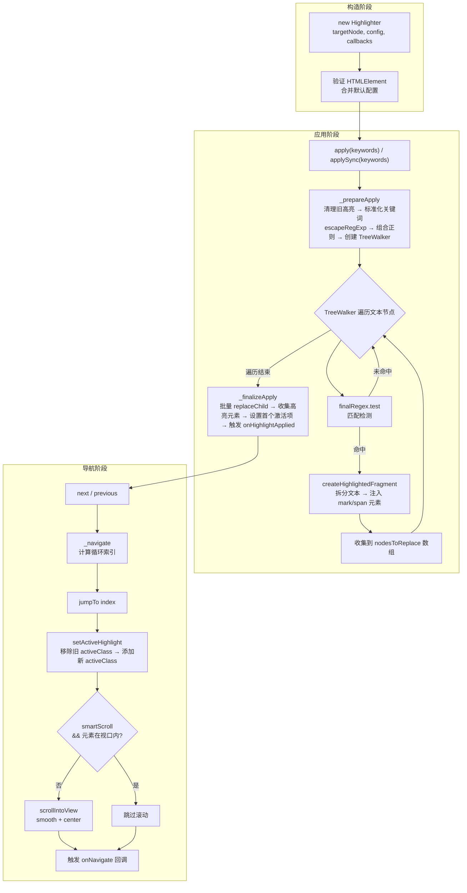

**Highlighter** 是 `@mudssky/jsutils` 中面向 DOM 文本搜索场景的核心工具类。它围绕一个简单的契约构建——给定任意容器元素和一组关键词（或正则表达式），在容器内部完成文本节点的精确匹配、DOM 标记注入、样式激活与滚动定位，形成完整的「搜索 → 高亮 → 导航」闭环。类的设计遵循**单次正则扫描 + 批量节点替换**的核心策略，使得多关键词匹配只需遍历文本树一次，性能开销可控。

Sources: [index.ts](src/modules/dom/highlighter/index.ts#L1-L55), [type.ts](src/modules/dom/highlighter/type.ts#L1-L98)

## 架构总览

Highlighter 的内部运行可以分解为三个阶段：**准备** → **扫描与标记** → **导航循环**。准备阶段负责清理旧高亮、构建正则和创建 TreeWalker；扫描阶段遍历所有文本节点，将匹配片段替换为包含高亮标记的 DocumentFragment；导航阶段维护一个循环索引队列，通过 CSS 类切换与 `scrollIntoView` 实现定位。



图中**蓝色虚线区域**划分了类的三大职责边界。值得注意的是，`apply` 每次调用都会先执行 `remove()` 清理旧状态，保证不会出现嵌套高亮。正则表达式模式下，`currentKeywords` 被置为空数组以区分两种匹配模式。

Sources: [index.ts](src/modules/dom/highlighter/index.ts#L100-L122), [index.ts](src/modules/dom/highlighter/index.ts#L186-L242), [index.ts](src/modules/dom/highlighter/index.ts#L358-L403), [index.ts](src/modules/dom/highlighter/index.ts#L970-L993)

## 类型体系

Highlighter 通过三个接口定义了完整的配置与回调契约，它们均标记为 `@public` 并从包入口导出：

| 接口                 | 职责                                         | 关键字段                                                                                    |
| -------------------- | -------------------------------------------- | ------------------------------------------------------------------------------------------- |
| `HighlighterConfig`  | 构造时配置，控制标记样式、滚动行为与性能策略 | `highlightTag`, `highlightClass`, `activeClass`, `skipTags`, `smartScroll`, `scrollPadding` |
| `HighlightOptions`   | 单次 `apply` 调用的运行时选项                | `caseSensitive`, `wholeWord`                                                                |
| `HighlightCallbacks` | 事件回调钩子，用于 UI 联动                   | `onHighlightApplied`, `onHighlightRemoved`, `onNavigate`                                    |

`HighlighterConfig` 的所有字段在构造函数中通过展开合并获得默认值，最终存储为 `Required<HighlighterConfig>` 类型，确保内部代码无需做空值判断：

| 配置项                          | 类型                    | 默认值                                    | 说明                                       |
| ------------------------------- | ----------------------- | ----------------------------------------- | ------------------------------------------ |
| `highlightTag`                  | `string`                | `'mark'`                                  | 高亮元素的 HTML 标签名                     |
| `highlightClass`                | `string`                | `'highlight'`                             | 所有高亮元素的 CSS 类名                    |
| `activeClass`                   | `string`                | `'highlight-active'`                      | 当前激活项的 CSS 类名                      |
| `skipTags`                      | `string[]`              | `['SCRIPT', 'STYLE', 'NOSCRIPT']`         | TreeWalker 中被 FILTER_REJECT 的父元素标签 |
| `scrollOptions`                 | `ScrollIntoViewOptions` | `{ behavior: 'smooth', block: 'center' }` | 原生 `scrollIntoView` 参数                 |
| `enablePerformanceOptimization` | `boolean`               | `true`                                    | 异步方法中按 100 节点分批让出主线程        |
| `smartScroll`                   | `boolean`               | `true`                                    | 仅当目标不在视口舒适区内时才触发滚动       |
| `scrollPadding`                 | `number`                | `50`                                      | 视口舒适区边距（像素）                     |

Sources: [type.ts](src/modules/dom/highlighter/type.ts#L1-L98), [index.ts](src/modules/dom/highlighter/index.ts#L100-L122)

## 核心机制：多关键词匹配与正则组合

Highlighter 的关键词匹配能力建立在**正则表达式组合**策略之上。当用户传入 `string | string[]` 类型的关键词时，`_prepareApply` 方法执行以下流水线：

1. **标准化**：将输入统一转为数组，过滤掉空字符串和仅含空白字符的项，再 `trim()` 处理。
2. **转义**：调用 `escapeRegExp`（来自 [regex/utils.ts](src/modules/regex/utils.ts#L40-L42)）对每个关键词中的正则特殊字符进行转义，确保 `$100.50`、`[test]`、`(demo)` 等字面量安全匹配。
3. **组合**：用 `|` 操作符连接所有转义后的模式，生成形如 `(JavaScript\|React\|Vue)` 的联合正则。
4. **修饰**：根据 `caseSensitive` 决定是否追加 `i` 标志，根据 `wholeWord` 决定是否包裹 `\b` 边界断言。

```
// 输入: ['JavaScript', 'React', 'Vue'], { caseSensitive: false }
// 生成: /(JavaScript|React|Vue)/gi

// 输入: ['API', 'SDK'], { wholeWord: true, caseSensitive: true }
// 生成: /\b(API|SDK)\b/g
```

**核心优势**在于：无论传入多少个关键词，TreeWalker 只需遍历文本节点树**一次**，每个文本节点只需执行**一次**正则匹配检测。这与「逐关键词分别扫描」的朴素方案相比，将 DOM 遍历开销从 O(n×k) 降低到 O(n)，其中 n 为文本节点数、k 为关键词数。

Sources: [index.ts](src/modules/dom/highlighter/index.ts#L186-L242), [utils.ts](src/modules/regex/utils.ts#L40-L42)

## DOM 遍历与节点替换

文本节点的发现和高亮标记的注入是 Highlighter 的核心执行路径，这一过程依赖两个关键的原生 API 协同工作：

**TreeWalker** 负责发现所有可处理的文本节点。其 `acceptNode` 过滤器实现了两层防护：第一层排除父元素标签名位于 `skipTags` 列表中的节点（如 `SCRIPT`、`STYLE`），第二层排除已被高亮类名标记的节点，从根本上杜绝嵌套高亮。过滤器返回 `NodeFilter.FILTER_REJECT` 而非 `FILTER_SKIP`，这意味着被拒绝节点的子树也不会被遍历。

**DocumentFragment** 负责构建替换内容。`createHighlightedFragment` 方法接收一个文本节点的完整内容和已构建的正则表达式，通过 `regex.exec` 循环逐步拆分文本：匹配前的部分作为纯文本节点插入，匹配到的部分包裹进配置指定的 `highlightTag` 元素中。整个片段构建完成后，在 `_finalizeApply` 中一次性执行 `parentNode.replaceChild`，完成 DOM 修改。

```typescript
// 简化的 createHighlightedFragment 逻辑
const fragment = document.createDocumentFragment()
regex.lastIndex = 0
while ((match = regex.exec(text)) !== null) {
  // 匹配前的普通文本
  fragment.appendChild(
    document.createTextNode(text.substring(lastIndex, match.index)),
  )
  // 匹配部分 → 高亮元素
  const el = document.createElement(this.config.highlightTag)
  el.className = this.config.highlightClass
  el.textContent = match[0]
  fragment.appendChild(el)
  lastIndex = regex.lastIndex
}
// 尾部普通文本
if (lastIndex < text.length) {
  fragment.appendChild(document.createTextNode(text.substring(lastIndex)))
}
```

Sources: [index.ts](src/modules/dom/highlighter/index.ts#L934-L960), [index.ts](src/modules/dom/highlighter/index.ts#L284-L314)

## 正则表达式模式

除关键词模式外，Highlighter 还提供 `applyRegex` / `applyRegexSync` 方法，允许用户直接传入自定义正则表达式。这一模式适用于邮箱地址、日期格式、自定义语法等复杂匹配场景。它与关键词模式的关键差异如下：

| 维度              | 关键词模式 (`apply`)                       | 正则模式 (`applyRegex`)         |
| ----------------- | ------------------------------------------ | ------------------------------- |
| 输入类型          | `string \| string[]` + `HighlightOptions`  | `RegExp`（必须包含 `g` 标志）   |
| 特殊字符处理      | 自动转义（`escapeRegExp`）                 | 用户自行处理                    |
| `currentKeywords` | 存储原始关键词数组                         | 置为空数组 `[]`                 |
| `currentPattern`  | 关键词数组副本                             | 原始 RegExp 引用                |
| 回调参数          | `onHighlightApplied(count, [...keywords])` | `onHighlightApplied(count, [])` |
| 前置校验          | 空值过滤                                   | 正则有效性检查 + `g` 标志强制   |

正则模式会严格校验输入：非 `RegExp` 实例触发 `console.warn` 并返回 0，缺少 `g` 标志则直接 `throw Error`。这是因为在全局匹配场景下，缺少 `g` 标志会导致 `exec` 循环无法推进到后续匹配项。

Sources: [index.ts](src/modules/dom/highlighter/index.ts#L474-L608)

## 导航系统与循环索引

导航系统维护一个 `currentIndex` 指针在 `highlights` 数组上循环移动。核心逻辑封装在私有方法 `_navigate(direction: 1 | -1)` 中，通过取模运算实现首尾循环：

```
nextIndex = (currentIndex + direction + highlights.length) % highlights.length
```

**方向 +1（next）**：当 `currentIndex` 位于最后一个元素时，`(last + 1) % length` 回到 0；**方向 -1（previous）**：当 `currentIndex` 为 0 时，`(0 - 1 + length) % length` 跳到最后一个。`jumpTo(index)` 则提供绝对跳转能力，校验边界后直接设置索引。

导航操作最终都汇聚到 `setActiveHighlight`，该方法执行三件事：移除所有高亮元素的 `activeClass` → 为当前索引元素添加 `activeClass` → 根据智能滚动策略决定是否调用 `scrollIntoView` → 触发 `onNavigate` 回调。

Sources: [index.ts](src/modules/dom/highlighter/index.ts#L656-L729), [index.ts](src/modules/dom/highlighter/index.ts#L970-L993)

## 智能滚动与视口检测

**智能滚动（Smart Scroll）** 是 Highlighter 的一项关键 UX 优化。默认开启（`smartScroll: true`），其设计哲学是：如果目标元素已经在用户的视觉舒适区内，就不应该触发任何滚动动作，避免阅读时出现令人分心的页面跳动。

视口检测由 `_isElementInViewport` 方法实现，它基于 `getBoundingClientRect` 计算元素的视口相对位置，并引入 `scrollPadding` 概念作为"舒适区"边距：

```typescript
private _isElementInViewport(el: HTMLElement): boolean {
  const rect = el.getBoundingClientRect()
  const padding = this.config.scrollPadding // 默认 50px
  return (
    rect.top >= padding &&
    rect.bottom <= (window.innerHeight - padding)
  )
}
```

当 `smartScroll` 关闭时，每次导航都会无条件执行 `scrollIntoView`；开启时，仅当 `_isElementInViewport` 返回 `false` 才滚动。这意味着在一个短页面中连续按 `next()`，如果所有高亮项都可见，用户不会感受到任何滚动抖动。

Sources: [index.ts](src/modules/dom/highlighter/index.ts#L911-L920), [index.ts](src/modules/dom/highlighter/index.ts#L970-L993)

## 屏幕外跳转

除了基础的 `next`/`previous` 循环导航，Highlighter 还提供了一套**屏幕外跳转** API，专门解决长文档场景下"跳过已在视口内的匹配项"的需求：

| 方法                           | 行为                                                            |
| ------------------------------ | --------------------------------------------------------------- |
| `findNextOffscreenIndex()`     | 从当前位置向前搜索第一个不在视口内的元素索引                    |
| `findPreviousOffscreenIndex()` | 从当前位置向后搜索第一个不在视口内的元素索引                    |
| `jumpToNextOffscreen()`        | 跳转到下一个屏幕外的匹配项；若全部在视口内，回退为 `next()`     |
| `jumpToPreviousOffscreen()`    | 跳转到上一个屏幕外的匹配项；若全部在视口内，回退为 `previous()` |

核心算法 `_findOffscreenIndex(direction)` 从当前位置出发，沿指定方向循环遍历所有其他高亮元素，返回第一个 `_isElementInViewport` 判定为 `false` 的索引。若所有元素都在视口内（`total <= 1` 或循环一圈无结果），返回 `-1`。回退机制确保即使所有匹配项都可见，用户操作也不会"失效"——只是退化为普通的 `next`/`previous` 行为。

Sources: [index.ts](src/modules/dom/highlighter/index.ts#L1002-L1073)

## 异步性能优化

`apply` 和 `applyRegex` 的异步版本内置了**分批处理**机制，防止在大文档中长时间阻塞主线程。当 `enablePerformanceOptimization` 为 `true`（默认值）时，每处理 100 个文本节点后，方法会通过 `requestIdleCallback`（优先）或 `setTimeout(0)`（降级）让出主线程控制权，允许浏览器处理用户交互和渲染：

```typescript
const batchSize = this.config.enablePerformanceOptimization ? 100 : Infinity
let processedCount = 0

while (currentNode) {
  // ... 匹配与片段构建 ...
  processedCount++
  if (processedCount >= batchSize) {
    await new Promise((resolve) => requestIdleCallback(() => resolve()))
    processedCount = 0
  }
}
```

同步版本 `applySync` / `applyRegexSync` 不包含此机制，适合已知文档规模较小的场景，避免异步调度带来的微延迟。两种版本的匹配结果完全一致——测试套件通过对比 `apply` 和 `applySync` 的 DOM 产出验证了这一点。

Sources: [index.ts](src/modules/dom/highlighter/index.ts#L358-L403), [index.ts](src/modules/dom/highlighter/index.ts#L447-L472)

## 事件回调体系

Highlighter 通过 `HighlightCallbacks` 接口提供三个生命周期钩子，使 UI 层能够响应高亮器的内部状态变化而无需轮询：

| 回调                 | 触发时机                                  | 参数签名                                                           | 典型用途                                             |
| -------------------- | ----------------------------------------- | ------------------------------------------------------------------ | ---------------------------------------------------- |
| `onHighlightApplied` | `apply`/`applySync`/`applyRegex` 完成后   | `(matchCount: number, keywords: string[])`                         | 更新搜索结果计数、显示匹配关键词标签                 |
| `onHighlightRemoved` | `remove()` 执行后                         | `()`                                                               | 清除搜索面板状态                                     |
| `onNavigate`         | `setActiveHighlight` 中，每次激活项变更时 | `(currentIndex: number, totalCount: number, element: HTMLElement)` | 更新"第 N/M 项"定位器、为激活元素设置 `aria-current` |

回调可在构造时传入，也可通过 `updateCallbacks` 动态替换。`destroy()` 会将 `callbacks` 置为空对象，确保销毁后的操作不会触发已清理的回调引用。回调函数均为可选（`?`），内部通过可选链 `?.` 安全调用。

Sources: [type.ts](src/modules/dom/highlighter/type.ts#L75-L97), [index.ts](src/modules/dom/highlighter/index.ts#L900-L903)

## 完整 API 速查

### 公共方法

| 方法                            | 返回值                | 说明                                |
| ------------------------------- | --------------------- | ----------------------------------- |
| `apply(keywords, options?)`     | `Promise<number>`     | 异步高亮，支持大文档分批处理        |
| `applySync(keywords, options?)` | `number`              | 同步高亮，适合小文档                |
| `applyRegex(regex)`             | `Promise<number>`     | 异步正则高亮，regex 必须含 `g` 标志 |
| `applyRegexSync(regex)`         | `number`              | 同步正则高亮                        |
| `remove()`                      | `void`                | 清除所有高亮并重置状态              |
| `next()`                        | `boolean`             | 导航到下一个匹配项（循环）          |
| `previous()`                    | `boolean`             | 导航到上一个匹配项（循环）          |
| `jumpTo(index)`                 | `boolean`             | 绝对跳转到指定索引                  |
| `getMatchCount()`               | `number`              | 获取匹配总数                        |
| `getCurrentIndex()`             | `number`              | 获取当前激活项索引（无匹配时为 -1） |
| `getCurrentKeywords()`          | `string[]`            | 获取当前关键词数组                  |
| `getCurrentKeyword()`           | `string`              | 逗号分隔的关键词字符串（已弃用）    |
| `getCurrentPattern()`           | `string[] \| RegExp`  | 获取当前匹配模式                    |
| `getCurrentElement()`           | `HTMLElement \| null` | 获取当前激活的 DOM 元素             |
| `getAllHighlights()`            | `HTMLElement[]`       | 获取所有高亮元素数组副本            |
| `findNextOffscreenIndex()`      | `number`              | 查找下一个视口外的索引              |
| `findPreviousOffscreenIndex()`  | `number`              | 查找上一个视口外的索引              |
| `jumpToNextOffscreen()`         | `boolean`             | 跳转到下一个视口外匹配项            |
| `jumpToPreviousOffscreen()`     | `boolean`             | 跳转到上一个视口外匹配项            |
| `updateConfig(newConfig)`       | `void`                | 动态更新配置                        |
| `updateCallbacks(newCallbacks)` | `void`                | 动态更新回调                        |
| `destroy()`                     | `void`                | 销毁实例，清理 DOM、状态与回调引用  |

Sources: [index.ts](src/modules/dom/highlighter/index.ts#L56-L1087)

## 使用模式与最佳实践

### 基础搜索高亮

最简单的使用场景——在页面中搜索并高亮一个关键词，然后通过按钮导航：

```typescript
import { Highlighter } from '@mudssky/jsutils'

const container = document.getElementById('article-content')!
const highlighter = new Highlighter(container)

// 应用高亮
const count = await highlighter.apply('JavaScript')
if (count === 0) {
  console.log('未找到匹配项')
}

// 绑定导航按钮
document.getElementById('btn-next')!.addEventListener('click', () => {
  highlighter.next()
})
document.getElementById('btn-prev')!.addEventListener('click', () => {
  highlighter.previous()
})
```

Sources: [index.ts](src/modules/dom/highlighter/index.ts#L10-L52)

### 多关键词搜索面板

当搜索框支持逗号分隔的多关键词输入时，可以直接将拆分后的数组传给 `apply`，并利用回调更新 UI 状态：

```typescript
const highlighter = new Highlighter(
  container,
  { highlightClass: 'search-result', activeClass: 'current-result' },
  {
    onHighlightApplied: (count, keywords) => {
      infoPanel.textContent = `找到 ${count} 个匹配项`
      keywords.forEach((kw) => {
        const tag = document.createElement('span')
        tag.className = 'keyword-tag'
        tag.textContent = kw
        keywordContainer.appendChild(tag)
      })
    },
    onNavigate: (index, total, element) => {
      positionLabel.textContent = `${index + 1} / ${total}`
    },
  },
)

// 搜索框输入 → 应用多关键词高亮
searchInput.addEventListener('change', async () => {
  const keywords = searchInput.value
    .split(',')
    .map((s) => s.trim())
    .filter(Boolean)
  await highlighter.apply(keywords)
})
```

Sources: [aidocs/highlighter-multiple-keywords.md](aidocs/highlighter-multiple-keywords.md#L64-L76)

### 正则表达式高亮

使用自定义正则匹配复杂模式，如邮箱地址：

```typescript
const emailRegex = /[a-zA-Z0-9._%+-]+@[a-zA-Z0-9.-]+\.[a-zA-Z]{2,}/g
const count = await highlighter.applyRegex(emailRegex)
// 所有邮箱地址将被标记，可通过 next/previous 逐一浏览
```

Sources: [index.ts](src/modules/dom/highlighter/index.ts#L486-L499)

### 长文档中的屏幕外跳转

对于法律文档、技术规范等长页面场景，屏幕外跳转 API 可以快速定位到下一个需要用户关注的区域：

```typescript
const highlighter = new Highlighter(longDocument, {
  smartScroll: true,
  scrollPadding: 80, // 更大的舒适区边距
})

await highlighter.apply(['违约', '赔偿', '解除合同'])

// "下一个区域"按钮：跳过视口内已有的匹配，直接定位到下一屏
document.getElementById('btn-next-section')!.addEventListener('click', () => {
  highlighter.jumpToNextOffscreen()
})
```

Sources: [index.ts](src/modules/dom/highlighter/index.ts#L1044-L1054)

### 生命周期管理

在 SPA 组件卸载时调用 `destroy()` 防止内存泄漏：

```typescript
// Vue 3 组合式 API 示例
import { onUnmounted } from 'vue'

const highlighter = new Highlighter(container.value!)

onUnmounted(() => {
  highlighter.destroy()
})
```

`destroy()` 内部调用 `remove()` 清理 DOM 中的高亮标记，清空 `highlights` 数组，并将 `callbacks` 置为空对象，切断所有外部引用。

Sources: [index.ts](src/modules/dom/highlighter/index.ts#L1081-L1086)

## 设计决策与注意事项

**每次 apply 均清理旧状态**：`_prepareApply` 和 `_prepareApplyRegex` 的第一行都是 `this.remove()`。这意味着连续调用 `apply` 不需要手动清理，但也意味着无法通过多次调用 `apply` 来"叠加"不同关键词的高亮。如果需要同时高亮多个关键词，必须将它们作为数组一次性传入。

**正则特殊字符安全**：关键词模式通过 `escapeRegExp` 转义所有正则元字符（`. * + ? ^ $ { } ( ) | [ ] \`），用户输入 `$100.50` 会被安全地当作字面量匹配。正则模式则不进行任何转义——用户对正则有完全控制权。

**TreeWalker 的 FILTER_REJECT 语义**：`acceptNode` 中返回 `FILTER_REJECT` 而非 `FILTER_SKIP`，这意味着被拒绝的节点及其整个子树都不会被遍历。这对 `SCRIPT`、`STYLE` 等标签尤为重要——它们的嵌套内容也不会被意外匹配。

**remove 后文本完整性**：`remove()` 方法将每个高亮元素替换回纯文本节点，并调用 `parent.normalize()` 合并相邻文本节点。测试验证了 `remove()` 后容器的 `textContent` 与高亮前完全一致。

**回调签名中的 keywords 差异**：关键词模式下 `onHighlightApplied` 回调的第二个参数是关键词数组副本；正则模式下该参数为空数组。UI 层可通过 `getCurrentPattern()` 区分当前匹配模式。

Sources: [index.ts](src/modules/dom/highlighter/index.ts#L186-L202), [index.ts](src/modules/dom/highlighter/index.ts#L624-L645), [utils.ts](src/modules/regex/utils.ts#L40-L42)

---

**相关阅读**：Highlighter 依赖于 [DOM 操作辅助：DOMHelper 链式 API 与事件管理](16-dom-cao-zuo-fu-zhu-domhelper-lian-shi-api-yu-shi-jian-guan-li) 所属的 DOM 模块基础设施；其正则转义能力来自 [正则表达式工具：常用模式校验、密码强度分析与字符转义](13-zheng-ze-biao-da-shi-gong-ju-chang-yong-mo-shi-xiao-yan-mi-ma-qiang-du-fen-xi-yu-zi-fu-zhuan-yi) 中的 `escapeRegExp` 函数；构建产物的 ESM/CJS/UMD 格式请参考 [构建与打包：tsdown 多格式输出（ESM / CJS / UMD）配置详解](22-gou-jian-yu-da-bao-tsdown-duo-ge-shi-shu-chu-esm-cjs-umd-pei-zhi-xiang-jie)。
