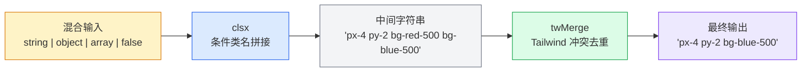

在前端开发中，动态拼接 CSS 类名是一个极其高频的操作——条件样式、组件状态切换、主题适配，每一处都涉及"根据运行时条件组合 class 字符串"。**`cn()` 函数**正是为此而生的轻量工具：它在底层组合了 **clsx**（条件类名拼接）与 **tailwind-merge**（Tailwind 冲突类名去重）两大能力，一行代码即可完成从输入归一化到冲突消解的全部工作。本页将带你从零理解 `cn()` 的设计动机、内部原理与实战用法，并介绍本库附带的 Tailwind 颜色 SCSS 变量与常用 Mixin 集合。

Sources: [style.ts](src/modules/style.ts#L1-L10)

## 为什么需要 cn()：问题场景与设计动机

### 手写类名拼接的典型痛点

假设你在构建一个按钮组件，需要根据 `variant` 和 `disabled` 两个 prop 动态决定类名。手动拼接的代码通常长这样：

```typescript
// ❌ 手动拼接：冗长且易出错
const classes = [
  'px-4 py-2 rounded',
  variant === 'primary'
    ? 'bg-blue-500 text-white'
    : 'bg-gray-200 text-gray-800',
  disabled && 'opacity-50 cursor-not-allowed',
  'font-medium',
]
  .filter(Boolean)
  .join(' ')
```

这段代码存在两个核心问题：

1. **输入格式不统一**——字符串、对象、数组、falsy 值混在一起，需要手动 `.filter(Boolean).join(' ')`。
2. **Tailwind 类名冲突无法自动解决**——如果外部传入 `className="p-6"` 来覆盖默认的 `px-4 py-2`，最终 HTML 上会同时出现 `px-4 py-2 p-6`，Tailwind 的输出顺序决定了谁生效，而非开发者的覆盖意图。

### cn() 的解决思路

`cn()` 将上述两个问题的解决方案封装为 **一个函数调用**：

```typescript
// ✅ 使用 cn()：简洁、安全、自动去冲突
import { cn } from '@mudssky/jsutils'

const classes = cn(
  'px-4 py-2 rounded',
  variant === 'primary' && 'bg-blue-500 text-white',
  variant !== 'primary' && 'bg-gray-200 text-gray-800',
  disabled && 'opacity-50 cursor-not-allowed',
  'font-medium',
  overrideClassName, // 外部传入的覆盖类名
)
```

`cn()` 的返回值是一个干净的、去冲突后的类名字符串。即使 `overrideClassName` 为 `"p-6"`，最终输出中也只会保留 `"p-6"` 而自动移除 `"px-4 py-2"`。

Sources: [style.ts](src/modules/style.ts#L1-L10)

## 内部架构：clsx + tailwind-merge 的协作模式

`cn()` 的完整实现仅有一行核心代码，但它的设计体现了对职责分离的精确把握：

```typescript
import { clsx, type ClassValue } from 'clsx'
import { twMerge } from 'tailwind-merge'

export function cn(...inputs: ClassValue[]): string {
  return twMerge(clsx(inputs))
}
```

Sources: [style.ts](src/modules/style.ts#L1-L10)

### 数据处理流水线

下面这张流程图展示了 `cn()` 的内部数据处理管线：



**第一步：clsx 负责"归一化"**——它接受 `ClassValue` 类型（字符串、对象、数组、布尔值、`undefined`、`null` 的任意嵌套组合），过滤掉所有 falsy 值，将对象中值为 true 的 key 作为类名提取，最终拼成一个空格分隔的字符串。它完全不理解 CSS 语义，只做格式统一。

**第二步：twMerge 负责"语义消解"**——它理解 Tailwind CSS 的完整类名体系。当发现多个类名针对同一个 CSS 属性时（如 `bg-red-500` 和 `bg-blue-500` 同时作用于 `background-color`），它会保留最后一个、移除前面的。这正是"后声明覆盖前声明"这一开发者直觉的形式化实现。

### 两层处理的职责划分

| 处理阶段    | 核心职责                 | 输入                       | 输出                 |  是否理解 CSS 语义   |
| ----------- | ------------------------ | -------------------------- | -------------------- | :------------------: |
| **clsx**    | 条件类名拼接、格式归一化 | `ClassValue[]`（混合类型） | 空格分隔的类名字符串 |          ❌          |
| **twMerge** | Tailwind 类名冲突消解    | 类名字符串                 | 去冲突后的类名字符串 |          ✅          |
| **cn()**    | 以上两步的编排入口       | `ClassValue[]`             | 最终干净的类名字符串 | ✅（委托给 twMerge） |

Sources: [style.ts](src/modules/style.ts#L1-L9)

## 安装与引入

`cn()` 是 `@mudssky/jsutils` 的**运行时依赖**功能。由于库将 `clsx`（`^2.1.1`）和 `tailwind-merge`（`^3.5.0`）声明为 `dependencies`，安装 jsutils 时它们会被自动拉取：

```bash
# 安装 jsutils（clsx 和 tailwind-merge 会作为依赖自动安装）
pnpm add @mudssky/jsutils
```

引入方式与其他模块一致，从包的入口直接导出：

```typescript
// 命名导出
import { cn } from '@mudssky/jsutils'
```

> **关于 Tree-shaking**：`cn()` 作为独立函数，在 ESM 模式下可被正确 tree-shake。库的构建配置中，`clsx` 和 `tailwind-merge` 均被标记为 `neverBundle`，确保 ESM/CJS 消费者通过包管理器解析这些依赖，避免重复打包。仅在 UMD 格式中，它们会被内联进单文件 bundle，以支持 `<script>` 标签直接使用的场景。

Sources: [package.json](package.json#L88-L91), [tsdown.config.ts](tsdown.config.ts#L17-L20), [index.ts](src/index.ts#L19-L19)

## cn() 完整使用指南

### 基础用法：接受多种输入格式

`cn()` 的参数类型 `ClassValue` 继承自 clsx 的类型定义，支持以下所有形式自由组合：

```typescript
// 1. 纯字符串
cn('flex', 'items-center', 'gap-2')
// → "flex items-center gap-2"

// 2. 条件表达式（falsy 值自动过滤）
const isActive = true
const isDisabled = false
cn('btn', isActive && 'btn-active', isDisabled && 'btn-disabled')
// → "btn btn-active"

// 3. 对象语法（值为 true 的 key 被保留）
cn({ 'font-bold': true, italic: false, underline: true })
// → "font-bold underline"

// 4. 数组嵌套
cn(['px-4', 'py-2'], 'rounded', ['text-sm', null, undefined])
// → "px-4 py-2 rounded text-sm"

// 5. 混合使用所有格式
cn(
  'base-class',
  [condition && 'conditional-class', { 'object-class': true }],
  undefined,
  '',
  null,
)
```

Sources: [style.ts](src/modules/style.ts#L1-L10)

### 核心场景：Tailwind 类名冲突消解

这是 `cn()` 区别于"仅使用 clsx"的关键能力。以下场景展示了 `twMerge` 如何自动处理 Tailwind 的类名优先级：

```typescript
// ❌ 不用 cn()：冲突类名同时存在，结果不可预测
const bad = ['px-4', 'py-2', 'p-6'].join(' ')
// → "px-4 py-2 p-6"（px-4、py-2 和 p-6 都会生效，实际效果取决于 CSS 顺序）

// ✅ 使用 cn()：自动保留最后声明的同类属性
cn('px-4', 'py-2', 'p-6')
// → "p-6"（p-6 覆盖了 px-4 和 py-2）

// 颜色冲突
cn('bg-red-500', 'bg-blue-500')
// → "bg-blue-500"

// 响应式前缀
cn('text-base', 'md:text-lg')
// → "text-base md:text-lg"（不同断点，不冲突，都保留）

// 状态前缀
cn('hover:bg-gray-100', 'hover:bg-blue-100')
// → "hover:bg-blue-100"（同一状态前缀下的同类属性冲突，保留后者）

// 复杂混合
cn('w-full max-w-sm p-4 rounded-lg', 'max-w-md p-6')
// → "w-full max-w-md p-6 rounded-lg"
```

### 实战模式：组件 className 合并

在 React / Vue 等 UI 框架中，`cn()` 最常见的用途是**合并组件内部样式与外部传入的 className**。下面展示几种典型模式：

**模式一：基础组件 props 合并**

```typescript
interface ButtonProps {
  variant?: 'primary' | 'secondary'
  size?: 'sm' | 'md'
  className?: string
  children: React.ReactNode
}

function Button({ variant = 'primary', size = 'md', className, children }: ButtonProps) {
  return (
    <button
      className={cn(
        // 基础样式（内部定义）
        'inline-flex items-center justify-center rounded-md font-medium',
        // 变体样式
        variant === 'primary' && 'bg-blue-500 text-white hover:bg-blue-600',
        variant === 'secondary' && 'bg-gray-200 text-gray-800 hover:bg-gray-300',
        // 尺寸样式
        size === 'sm' && 'px-3 py-1.5 text-sm',
        size === 'md' && 'px-4 py-2 text-base',
        // 外部传入——排在最后，可以覆盖上面的任何 Tailwind 类
        className,
      )}
    >
      {children}
    </button>
  )
}

// 使用时，外部 className 可以安全覆盖内部样式
<Button variant="primary" className="bg-red-500 hover:bg-red-600 px-8">
  删除
</Button>
// 最终 class 包含 bg-red-500 而非 bg-blue-500 ✅
```

**模式二：多组件组合**

```typescript
function Card({ className, ...props }: { className?: string }) {
  return <div className={cn('rounded-lg border bg-white shadow-sm', className)} {...props} />
}

function DashboardCard({ highlight, ...props }: { highlight?: boolean; className?: string }) {
  return (
    <Card
      className={cn(
        'p-4',
        highlight && 'ring-2 ring-blue-500',
      )}
      {...props}
    />
  )
}
```

Sources: [style.ts](src/modules/style.ts#L1-L10)

### cn() 支持的输入类型速查表

| 输入类型                    | 示例                                | 处理行为                                  | 是否通过 clsx |
| --------------------------- | ----------------------------------- | ----------------------------------------- | :-----------: |
| 字符串                      | `'flex items-center'`               | 直接保留                                  |      ✅       |
| 空字符串 / null / undefined | `''`, `null`, `undefined`           | 静默忽略                                  |      ✅       |
| 布尔值（false）             | `false`                             | 静默忽略                                  |      ✅       |
| 布尔值（true）              | `true`                              | 静默忽略（注意：不会变成字符串 `"true"`） |      ✅       |
| 数字（0）                   | `0`                                 | 静默忽略                                  |      ✅       |
| 条件表达式                  | `isActive && 'active'`              | falsy 时忽略，truthy 时保留右侧值         |      ✅       |
| 对象                        | `{ active: true, disabled: false }` | 提取值为 true 的 key                      |      ✅       |
| 数组                        | `['a', false && 'b', 'c']`          | 递归展开后逐项处理                        |      ✅       |
| 嵌套混合                    | `['a', { b: true }, [[['c']]]]`     | 任意深度递归展开                          |      ✅       |

Sources: [style.ts](src/modules/style.ts#L1-L10)

## 附属资源：Tailwind 颜色 SCSS 变量

除了 `cn()` 函数，本库还在 `src/style/scss/tailwind/` 目录下提供了一份**完整的 Tailwind CSS 颜色变量 SCSS 文件**。该文件将 Tailwind 官方调色板的所有 22 种颜色（从 `slate` 到 `rose`）以 SCSS Map 的形式导出，每种颜色包含 `50` 到 `950` 共 11 个色阶，共 **242 个颜色值**。

### SCSS 变量结构

文件定义了三类变量供你按需引用：

| 变量类型     | 示例变量名                                | 用途                            |
| ------------ | ----------------------------------------- | ------------------------------- |
| 单色 Map     | `$blue: (50: #eff6ff, ..., 950: #172554)` | 引用某一种颜色的完整色阶        |
| 默认色值 Map | `$defaultColor: ("blue": #60a5fa, ...)`   | 每种颜色取 `400` 色阶作为默认值 |
| 完整色阶 Map | `$colors: ("blue": $blue, ...)`           | 所有颜色的完整色阶集合          |

此外，文件底部还自动生成了对应的工具类：

- `.text-{color}` — 设置文字颜色（使用 `400` 色阶）
- `.text-{color}-{shade}` — 设置文字颜色（指定色阶）
- `.bg-{color}` — 设置背景色
- `.bg-{color}-{shade}` — 设置背景色（指定色阶）
- `.border-{color}-{shade}` — 设置边框颜色

```scss
// 使用示例
@import '@mudssky/jsutils/dist/style/scss/tailwind/colors';

.my-card {
  color: map-get($blue, 600);
  background: map-get($slate, 50);
  border: 1px solid map-get($gray, 200);
}
```

> **注意**：这些 SCSS 变量是为不使用 Tailwind CSS 框架但仍需其调色板的场景设计的。如果你的项目已经配置了 Tailwind CSS 框架，直接使用 Tailwind 的类名即可，无需引入此文件。

Sources: [colors.scss](src/style/scss/tailwind/colors.scss#L1-L361)

## 附属资源：SCSS Mixin 工具集

本库在 `src/style/scss/mixin/` 下提供了四个实用 Mixin 文件，覆盖了常见的样式需求：

| 文件                                                  | Mixin 名称                               | 功能说明                                                   |
| ----------------------------------------------------- | ---------------------------------------- | ---------------------------------------------------------- |
| [animation.scss](src/style/scss/mixin/animation.scss) | `enable-button-throttle($class, $delay)` | 为按钮添加防抖节流动画，点击后禁用 pointer-events 指定时间 |
| [animation.scss](src/style/scss/mixin/animation.scss) | `disable-button-throttle($class)`        | 取消按钮节流动画                                           |
| [scroll.scss](src/style/scss/mixin/scroll.scss)       | `antd-default-scrollbar()`               | 应用轻量滚动条样式（与 Ant Design 风格一致）               |
| [window.scss](src/style/scss/mixin/window.scss)       | `hide-scrollbar($x, $y)`                 | 跨浏览器隐藏滚动条                                         |
| [window.scss](src/style/scss/mixin/window.scss)       | `hide-scrollbarX()`                      | 隐藏水平滚动条                                             |
| [window.scss](src/style/scss/mixin/window.scss)       | `hide-scrollbarY()`                      | 隐藏垂直滚动条                                             |
| [text.scss](src/style/scss/mixin/text.scss)           | `single-line-ellipsis($width)`           | 单行文本溢出省略                                           |
| [text.scss](src/style/scss/mixin/text.scss)           | `multi-line-ellipsis($width, $lines)`    | 多行文本溢出省略（支持指定行数）                           |

使用方式——在 SCSS 中通过 glob 导入一次性引入所有 mixin：

```scss
// 引入所有 mixin（index.scss 使用了 @import './mixin/*'）
@import '@mudssky/jsutils/dist/style/scss';

// 然后直接使用
.card-title {
  @include single-line-ellipsis(200px);
}

.scrollable-panel {
  @include hide-scrollbar();
  max-height: 400px;
  overflow-y: auto;
}
```

Sources: [index.scss](src/style/scss/index.scss#L1-L2), [animation.scss](src/style/scss/mixin/animation.scss#L1-L34), [scroll.scss](src/style/scss/mixin/scroll.scss#L1-L6), [window.scss](src/style/scss/mixin/window.scss#L1-L39), [text.scss](src/style/scss/mixin/text.scss#L1-L19)

## 常见问题与注意事项

### cn() 能否用于非 Tailwind 项目？

可以，但收益有限。`cn()` 中的 clsx 部分对任何 CSS 方案都有效（条件类名拼接），但 `twMerge` 的冲突消解逻辑是专为 Tailwind 类名设计的。如果你的项目不使用 Tailwind：

- **仅用于条件拼接**：`cn()` 仍然可用，`twMerge` 对非 Tailwind 类名会直接透传，不会产生错误。
- **追求极致体积**：如果完全不需要 Tailwind 冲突消解，可以直接使用 `clsx` 本身，省去 `tailwind-merge` 的包体积。

### 性能考量

`twMerge` 内部维护了一个 Tailwind 类名规则表，首次调用时会有初始化开销。对于高频调用场景（如大型列表渲染中的逐行类名计算），建议：

- 在组件外层缓存不变的类名部分，仅在 props 变化时重新调用 `cn()`。
- 如果性能成为瓶颈，可以考虑使用 `twMerge` 的 `createTailwindMerge()` 创建自定义实例并缓存。

### SCSS 资源文件的路径

构建产物中，SCSS 资源文件位于 `dist/` 目录下。具体路径取决于你的构建配置，一般通过以下方式引用：

```scss
// 方式一：直接引用 node_modules 中的源文件
@import '@mudssky/jsutils/style/scss/tailwind/colors';

// 方式二：引用构建产物
@import '@mudssky/jsutils/dist/style/scss';
```

Sources: [style.ts](src/modules/style.ts#L1-L10)

## 推荐阅读

`cn()` 函数的设计体现了本库"组合而非重复造轮子"的哲学——它将两个经过社区充分验证的库通过一个薄层编排函数粘合在一起，而非自行实现类名解析逻辑。如果你想进一步了解本库的其他模块，以下是推荐的阅读路径：

- **如果对 DOM 操作感兴趣**：[DOM 操作辅助：DOMHelper 链式 API 与事件管理](16-dom-cao-zuo-fu-zhu-domhelper-lian-shi-api-yu-shi-jian-guan-li) 提供了链式 DOM 操作 API，其中 `addClass` / `removeClass` 可与 `cn()` 配合使用。
- **如果对文本高亮场景感兴趣**：[文本高亮器：Highlighter 多关键词匹配、导航与滚动定位](17-wen-ben-gao-liang-qi-highlighter-duo-guan-jian-ci-pi-pei-dao-hang-yu-gun-dong-ding-wei) 中的 `highlightClass` 和 `activeClass` 配置项正是 CSS 类名动态管理的典型场景。
- **如果想了解构建配置细节**：[构建与打包：tsdown 多格式输出（ESM / CJS / UMD）配置详解](22-gou-jian-yu-da-bao-tsdown-duo-ge-shi-shu-chu-esm-cjs-umd-pei-zhi-xiang-jie) 详细解释了 `neverBundle` 和 `alwaysBundle` 如何控制 `clsx` / `tailwind-merge` 在不同格式中的打包行为。
