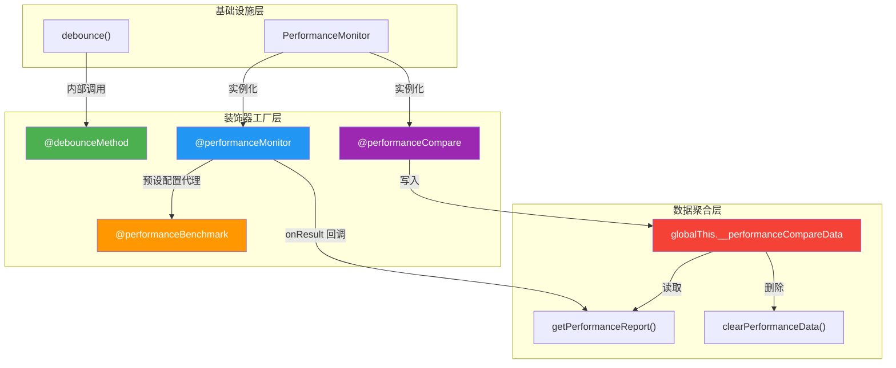
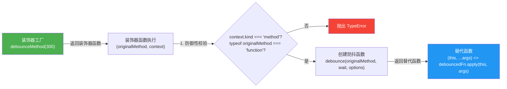
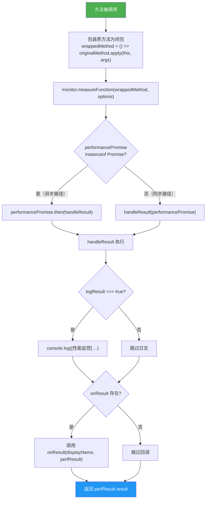

本页深入解析 `@mudssky/jsutils` 装饰器模块的架构设计与实现细节。该模块基于 **TC39 Stage 3 装饰器提案**（`ClassMethodDecoratorContext`），提供两类核心能力：**声明式方法防抖**（`debounceMethod`）与**非侵入式性能监控**（`performanceMonitor`、`performanceBenchmark`、`performanceCompare`）。两个方向共享同一套装饰器工厂模式——外层函数接收配置参数，内层函数接管原始方法并返回增强后的替代实现。这种设计使得行为增强从业务逻辑中彻底解耦，开发者只需在方法签名上方添加一行注解，即可获得防抖或性能分析能力。

Sources: [decorator.ts](src/modules/decorator.ts#L1-L61)

## 装饰器体系架构总览

装饰器模块的整体结构可划分为三个层次：**基础设施层**（`debounce` 函数与 `PerformanceMonitor` 类）负责核心逻辑实现；**装饰器工厂层**（`debounceMethod`、`performanceMonitor` 等）将基础设施包装为符合 Stage 3 规范的方法装饰器；**数据聚合层**（`getPerformanceReport`、`clearPerformanceData`）提供跨方法的性能数据查询与清理。以下 Mermaid 图展示了各导出成员之间的依赖关系与数据流向。



**关键设计决策**：`performanceBenchmark` 并非独立实现，而是对 `performanceMonitor` 的**预设配置代理**——它注入了 `iterations: 100`、`warmupIterations: 10`、`collectMemory: true` 的默认值，然后委托给 `performanceMonitor` 执行。这意味着两者共享完全相同的运行时路径，区别仅在于配置粒度。`performanceCompare` 则采用不同的架构路线，它将每次调用的性能数据持久化到 `globalThis.__performanceCompareData`（一个 `Map<string, Array>` 结构），支持按组名（groupName）跨方法聚合与对比。

Sources: [decorator.ts](src/modules/decorator.ts#L245-L260), [decorator.ts](src/modules/decorator.ts#L301-L366)

## TC39 Stage 3 装饰器规范适配

本模块严格遵循 TC39 Stage 3 装饰器提案，而非已废弃的 TypeScript 实验性装饰器（experimental decorators）。两者的核心差异体现在函数签名上：

| 特性        | Stage 3（本库采用）                                        | 实验性（Legacy）                                  |
| ----------- | ---------------------------------------------------------- | ------------------------------------------------- |
| 签名形式    | `(originalMethod, context) => replacement`                 | `(target, propertyKey, descriptor) => descriptor` |
| 上下文对象  | `ClassMethodDecoratorContext`                              | 无，直接操作 `PropertyDescriptor`                 |
| 元数据传递  | `context.kind`、`context.name`、`context.addInitializer()` | 不支持                                            |
| `this` 绑定 | 返回函数中通过 `this` 参数自然绑定                         | 通过 `descriptor.value` 闭包绑定                  |
| 类型安全    | TypeScript 5.0+ 原生支持                                   | 需要 `experimentalDecorators` 编译选项            |

每个装饰器工厂在入口处都执行了两道**防御性校验**：第一道检查 `context.kind !== 'method'`，确保被装饰的是方法而非字段、getter 或类本身；第二道检查 `typeof originalMethod !== 'function'`，拦截运行时可能出现的非函数值。这些校验在 TypeScript 编译后仍然存在，为消费方在 JavaScript 环境中的误用提供了清晰的错误提示。

Sources: [decorator.ts](src/modules/decorator.ts#L44-L53), [decorator.ts](src/modules/decorator.ts#L146-L154)

## debounceMethod：声明式方法防抖

`debounceMethod` 将函数防抖（debounce）能力从调用侧提升到声明侧。传统模式下，开发者需要在每次调用处手动包裹 `debounce(fn, wait)`；而装饰器模式下，防抖行为成为方法定义的一部分，所有调用者自动获得防抖保护，无需关心底层定时器管理。

### API 签名与参数

```typescript
function debounceMethod(
  wait?: number, // 延迟等待时间（毫秒），默认 200
  options?: {
    leading?: boolean // 是否在延迟开始前立即调用，默认 false
    trailing?: boolean // 是否在延迟结束后调用，默认 true
  },
): MethodDecorator
```

### 装饰器内部工作流

装饰器的实现遵循一个清晰的三阶段流水线：**创建 → 替换 → 代理**。



**关键实现细节**：装饰器在类定义阶段（而非实例化阶段）调用 `debounce()` 创建防抖函数。由于装饰器返回的替代函数通过 `this` 参数捕获调用上下文，再通过 `debouncedFn.apply(this, args)` 转发，防抖函数内部的闭包状态（定时器 ID、最后参数等）被**正确绑定到每个实例**。但需注意——由于 Stage 3 装饰器返回的是替代函数而非修改描述符，`debounce()` 返回的 `cancel()`、`flush()`、`pending()` 等方法在当前实现中**无法从外部直接访问**，这在测试文件中已被标记为 skip。

Sources: [decorator.ts](src/modules/decorator.ts#L31-L61), [decorator.test.ts](test/decorator.test.ts#L131-L208)

### leading / trailing 组合行为

`debounceMethod` 底层调用的 `debounce` 函数支持四种 `leading` × `trailing` 组合，每种组合对应不同的调用时序语义：

| leading | trailing       | 行为描述                                       | 典型场景                      |
| ------- | -------------- | ---------------------------------------------- | ----------------------------- |
| `false` | `true`（默认） | 仅在等待期结束后执行最后一次调用               | 搜索框输入联想                |
| `true`  | `false`        | 仅在等待期开始时执行第一次调用，后续调用被忽略 | 按钮首次点击响应              |
| `true`  | `true`         | 等待期开始时执行第一次，结束后执行最后一次     | 混合场景：即时反馈 + 最终同步 |
| `false` | `false`        | 不自动触发，需通过 `flush()` 手动执行          | 手动批量提交                  |

以下代码展示了默认模式（trailing-only）的实际表现：

```typescript
import { debounceMethod } from '@mudssky/jsutils'

class SearchBox {
  // 默认 trailing: true —— 仅在最后一次调用后 300ms 执行
  @debounceMethod(300)
  onInput(keyword: string) {
    this.fetchSuggestions(keyword)
  }

  // leading 模式 —— 首次调用立即执行，300ms 内的重复调用被丢弃
  @debounceMethod(300, { leading: true, trailing: false })
  onSubmit() {
    this.performSearch()
  }

  private fetchSuggestions(keyword: string) {
    /* ... */
  }
  private performSearch() {
    /* ... */
  }
}

const box = new SearchBox()
box.onInput('h') // 不执行
box.onInput('he') // 不执行
box.onInput('hel') // 不执行
// 300ms 后执行 onInput('hel') —— 仅最后一次参数生效
```

Sources: [function.ts](src/modules/function.ts#L43-L143), [decorator.ts](src/modules/decorator.ts#L31-L40)

## performanceMonitor：非侵入式性能监控

`performanceMonitor` 是性能监控装饰器的**基础原语**。它将 `PerformanceMonitor.measureFunction()` 的调用编织到方法执行流程中，在保留原始返回值的同时，额外收集执行时间、内存占用等性能指标。

### 配置选项全景

`PerformanceDecoratorOptions` 继承了 `PerformanceTestOptions`（迭代控制、内存采集、预热、GC），并扩展了四个装饰器专属选项：

| 选项               | 类型                     | 默认值  | 说明                                             |
| ------------------ | ------------------------ | ------- | ------------------------------------------------ |
| `logResult`        | `boolean`                | `true`  | 是否在控制台输出 `[性能监控]` 前缀的格式化日志   |
| `logPrefix`        | `string`                 | 方法名  | 日志前缀，设值后显示为 `Prefix.methodName`       |
| `onResult`         | `(name, result) => void` | —       | 性能结果回调，用于自定义采集（如发送到监控平台） |
| `devOnly`          | `boolean`                | `true`  | 是否仅在非生产环境启用                           |
| `iterations`       | `number`                 | `1`     | 执行迭代次数                                     |
| `warmupIterations` | `number`                 | `0`     | 预热迭代次数（触发 JIT 优化）                    |
| `collectMemory`    | `boolean`                | `true`  | 是否采集 `performance.memory` 数据               |
| `forceGC`          | `boolean`                | `false` | 是否在测试前强制 GC（需 `--expose-gc`）          |
| `timeLimit`        | `number`                 | —       | 时间上限（毫秒），达到后提前终止迭代             |

### 同步/异步方法的双路径处理

装饰器内部通过检测 `measureFunction` 返回值的类型来区分同步与异步方法。`measureFunction` 本身是 `async` 函数（返回 `Promise<PerformanceResult>`），因此同步方法也会经过 Promise 包装。装饰器在返回函数中判断 `performancePromise instanceof Promise`，为两条路径分别处理：



**核心设计原则**：无论走同步还是异步路径，`handleResult` 始终返回 `perfResult.result`（原始方法的返回值），确保装饰器的介入**不改变被装饰方法的返回语义**。异步方法返回的 Promise 链被正确维持，调用方 `await` 的结果与无装饰器时完全一致。

Sources: [decorator.ts](src/modules/decorator.ts#L136-L207)

### devOnly 环境守卫

当 `devOnly: true`（默认值）且 `process.env.NODE_ENV === 'production'` 时，装饰器直接返回 `originalMethod`，**完全跳过性能监控逻辑**。这一零开销设计确保生产环境不承担任何性能采集的额外开销——没有 `PerformanceMonitor` 实例化，没有闭包创建，没有 `performance.now()` 调用。这一行为在装饰器工厂的入口处判定，属于最早返回路径。

Sources: [decorator.ts](src/modules/decorator.ts#L164-L167)

## performanceBenchmark：预设配置的性能基准

`performanceBenchmark` 是 `performanceMonitor` 的**配置快捷方式**。它不引入新的运行时逻辑，而是在调用 `performanceMonitor` 之前注入了一组更激进的默认值：

```typescript
const defaultOptions: PerformanceDecoratorOptions = {
  iterations: 100, // 比默认的 1 高两个数量级
  warmupIterations: 10, // 10 次预热触发 JIT 编译
  collectMemory: true, // 默认开启内存采集
  logResult: true, // 默认输出日志
  ...options, // 用户配置覆盖默认值
}
return performanceMonitor(defaultOptions)
```

这种**委托模式**确保了 `performanceBenchmark` 与 `performanceMonitor` 的行为完全一致——它不是一个独立的代码路径，而是一个语义化的配置入口。当开发者看到 `@performanceBenchmark` 时，代码意图立刻清晰：这不是一次性的性能监控，而是一场基准测试。

Sources: [decorator.ts](src/modules/decorator.ts#L245-L260)

## performanceCompare：跨方法性能对比

`performanceCompare` 是模块中最复杂的装饰器，它解决了**方法间横向对比**的场景。与 `performanceMonitor` 的单方法纵向分析不同，`performanceCompare` 通过 `groupName` 参数将同一类中多个方法的性能数据聚合到全局存储中，支持事后生成对比报告。

### 数据存储架构

性能数据存储在 `globalThis.__performanceCompareData` 上，类型为 `Map<string, Array<{ methodName: string; result: PerformanceResult }>>`。这个设计有两个重要特征：

1. **全局单例**：使用 `globalThis` 确保跨模块、跨实例的数据共享。同一 `groupName` 下的数据即使来自不同类实例、不同模块文件，也会聚合到同一个 Map 条目中。
2. **去重更新**：每次方法执行后，装饰器会检查 `groupData` 中是否已存在同 `methodName` 的记录。若存在则覆盖更新（`groupData[existingIndex] = { methodName, result }`），若不存在则追加。这意味着同一方法多次调用后，报告中只保留**最后一次**的性能数据。

Sources: [decorator.ts](src/modules/decorator.ts#L316-L355)

### 完整使用流程

```typescript
import {
  performanceCompare,
  getPerformanceReport,
  clearPerformanceData,
} from '@mudssky/jsutils'

class SortingAlgorithms {
  @performanceCompare('sorting', { iterations: 1000 })
  bubbleSort(arr: number[]) {
    const result = [...arr]
    for (let i = 0; i < result.length; i++) {
      for (let j = 0; j < result.length - i - 1; j++) {
        if (result[j] > result[j + 1]) {
          ;[result[j], result[j + 1]] = [result[j + 1], result[j]]
        }
      }
    }
    return result
  }

  @performanceCompare('sorting', { iterations: 1000 })
  nativeSort(arr: number[]) {
    return [...arr].sort((a, b) => a - b)
  }
}

const algo = new SortingAlgorithms()
const data = Array.from({ length: 500 }, () => Math.random())

// 执行所有被监控的方法，触发数据采集
algo.bubbleSort(data)
algo.nativeSort(data)

// 生成对比报告
console.log(getPerformanceReport('sorting'))
// 输出格式：
// === 性能测试报告 ===
//
// 1. nativeSort 🏆
//    执行时间: 2.34ms (1000 次迭代) 平均: 0.00ms/次
//
// 2. bubbleSort
//    执行时间: 156.78ms (1000 次迭代) 平均: 0.16ms/次
//    比最快慢 67.01x

// 清理全局数据
clearPerformanceData('sorting')
```

`getPerformanceReport` 内部调用 `PerformanceMonitor.createReport()`，该方法按执行时间升序排列结果，并为每个非第一名条目计算相对于最快方法的**倍率差**。`clearPerformanceData` 支持两种清理粒度：传入 `groupName` 清除特定组，不传参则清除所有组数据。

Sources: [decorator.ts](src/modules/decorator.ts#L384-L436), [performance.ts](src/modules/performance.ts#L397-L430)

## 装饰器组合与实战模式

### 防抖 + 性能监控的叠加使用

多个装饰器可以叠加在同一方法上。TypeScript 的装饰器求值顺序为**从下到上**（最靠近方法签名的装饰器最先执行包装），因此 `@debounceMethod` 应放在最内侧以确保防抖后的单次触发被正确监控：

```typescript
class SmartSearch {
  // 执行顺序：performanceMonitor 包装 debounceMethod 包装原始方法
  // 最终效果：防抖后的单次执行被性能监控捕获
  @performanceMonitor({ logPrefix: 'SmartSearch', devOnly: true })
  @debounceMethod(300)
  async search(query: string) {
    const response = await fetch(`/api/search?q=${query}`)
    return response.json()
  }
}
```

### 自定义结果采集

通过 `onResult` 回调，可以将性能数据路由到任意消费端（日志平台、APM 系统、开发面板），而不仅限于控制台输出：

```typescript
class DataPipeline {
  @performanceMonitor({
    logResult: false, // 关闭控制台输出
    iterations: 1,
    onResult: (name, result) => {
      // 上报到 APM 系统
      metricsClient.timing(`pipeline.${name}`, result.duration)
      if (result.memory) {
        metricsClient.gauge(
          `pipeline.${name}.memory`,
          result.memory.usedJSHeapSize,
        )
      }
    },
  })
  async transformDataset(records: Record[]) {
    return records.map(this.applyTransform)
  }
}
```

Sources: [decorator.ts](src/modules/decorator.ts#L96-L134)

## 类型系统设计

装饰器模块的类型设计遵循**渐进式约束**原则。`AnyFunction`（`(...args: any) => any`）作为最宽松的函数类型，被用于装饰器内部的统一签名，确保任何签名的方法都能被装饰。而 `PerformanceResult` 与 `PerformanceTestOptions` 两个接口构成了性能数据的**结构化契约**：

```typescript
// PerformanceResult —— 性能采集的结构化输出
interface PerformanceResult {
  duration: number // 执行总时间（毫秒）
  memory?: {
    // 可选，仅在浏览器环境中可用
    usedJSHeapSize: number // 已用 JS 堆大小
    totalJSHeapSize: number // 总 JS 堆大小
    jsHeapSizeLimit: number // JS 堆大小上限
  }
  result: unknown // 原始函数的返回值
  iterations: number // 实际执行次数（可能受 timeLimit 截断）
}

// PerformanceDecoratorOptions —— 继承基础选项 + 装饰器专属配置
interface PerformanceDecoratorOptions extends PerformanceTestOptions {
  logResult?: boolean
  logPrefix?: string
  onResult?: (methodName: string, result: PerformanceResult) => void
  devOnly?: boolean
}
```

`PerformanceDecoratorOptions` 通过 `extends PerformanceTestOptions` 实现了**接口继承**，将底层测试控制参数（iterations、warmupIterations、forceGC）与装饰器行为配置（logResult、devOnly）统一在同一个对象中。这种扁平化设计让用户只需关心一个配置对象，而非分别传递多层参数。`onResult` 回调的签名 `(methodName: string, result: PerformanceResult) => void` 中，`methodName` 是经过 `logPrefix` 处理后的**显示名称**（如 `DataProcessor.processData`），而非原始的 `context.name`。

Sources: [decorator.ts](src/modules/decorator.ts#L68-L93), [performance.ts](src/modules/performance.ts#L6-L64), [global.ts](src/types/global.ts#L34-L34)

## 已知限制与注意事项

| 限制                                            | 说明                                                                                       | 影响范围                                     |
| ----------------------------------------------- | ------------------------------------------------------------------------------------------ | -------------------------------------------- |
| Stage 3 装饰器不支持暴露 `cancel/flush/pending` | `debounceMethod` 返回的替代函数无法直接暴露底层防抖函数的辅助方法                          | `debounceMethod`                             |
| `performance.memory` 仅 Chrome 可用             | `getMemoryInfo()` 在 Firefox/Safari 中返回 `undefined`                                     | 所有性能装饰器                               |
| `devOnly` 依赖 `process.env.NODE_ENV`           | 在浏览器环境中需要构建工具注入该变量，否则条件判断可能不生效                               | `performanceMonitor`、`performanceBenchmark` |
| `performanceCompare` 数据存储在 `globalThis`    | 服务端渲染（SSR）场景下，跨请求的数据可能串扰，需在请求结束时调用 `clearPerformanceData()` | `performanceCompare`                         |
| 去重策略为覆盖更新                              | 同一方法多次调用仅保留最后一次性能数据，无法反映时间维度上的变化趋势                       | `performanceCompare`                         |

Sources: [decorator.test.ts](test/decorator.test.ts#L131-L208), [performance.ts](src/modules/performance.ts#L333-L351)

## 延伸阅读

- **底层防抖/节流实现细节**：[函数增强：防抖（debounce）与节流（throttle）的完整实现](7-han-shu-zeng-qiang-fang-dou-debounce-yu-jie-liu-throttle-de-wan-zheng-shi-xian) —— 了解 `debounce` 函数内部的定时器管理与 leading/trailing 状态机
- **PerformanceMonitor 完整 API**：[性能监控器：PerformanceMonitor 迭代测试、内存追踪与对比基准](20-xing-neng-jian-kong-qi-performancemonitor-die-dai-ce-shi-nei-cun-zhui-zong-yu-dui-bi-ji-zhun) —— 深入 `measureFunction`、`compare`、`benchmark` 等底层方法
- **类型系统设计**：[类型系统设计：工具类型定义与 TypeScript 类型测试最佳实践](25-lei-xing-xi-tong-she-ji-gong-ju-lei-xing-ding-yi-yu-typescript-lei-xing-ce-shi-zui-jia-shi-jian) —— 了解 `AnyFunction` 等基础工具类型的设计哲学
