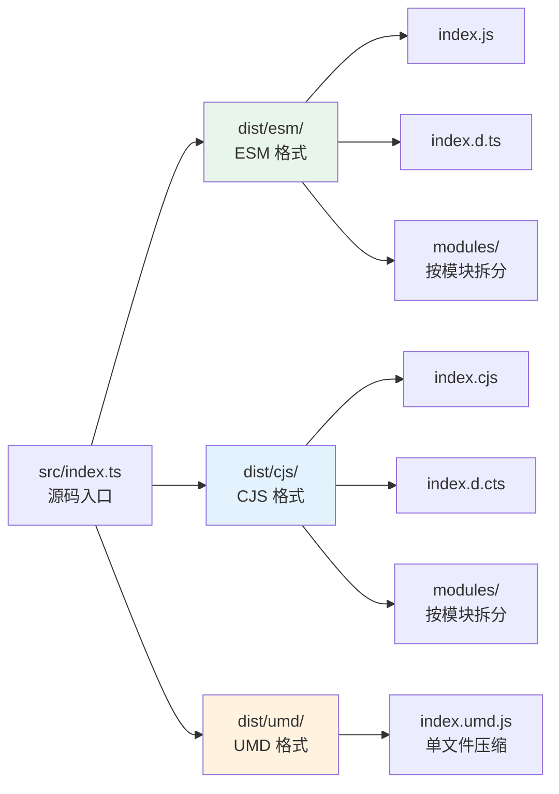
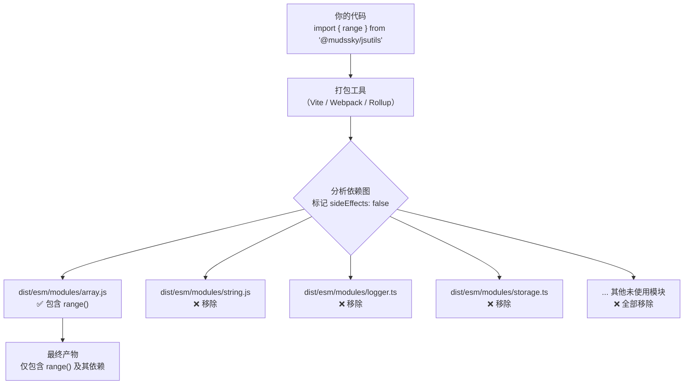

本文将引导你从零开始集成 `@mudssky/jsutils`——一个面向前端与全栈场景的通用 TypeScript 工具函数库。你将了解如何通过包管理器安装、在不同模块系统中引入、借助 Tree Shaking 实现按需加载，以及在浏览器环境中通过 `<script>` 标签直接使用。阅读完成后，你可以在自己的项目中立即上手使用任何模块函数。

Sources: [package.json](package.json#L1-L131), [README.md](README.md#L1-L38)

## 包信息总览

在动手安装之前，先通过下表快速了解本库的核心包元信息，这些信息决定了你如何引入和使用它。

| 属性            | 值                       | 说明                                  |
| --------------- | ------------------------ | ------------------------------------- |
| **包名**        | `@mudssky/jsutils`       | npm 上的 scoped package               |
| **当前版本**    | `1.34.1`                 | 遵循语义化版本（Semantic Versioning） |
| **许可证**      | MIT                      | 可自由用于商业项目                    |
| **模块格式**    | ESM / CJS / UMD          | 覆盖所有主流运行环境                  |
| **TypeScript**  | ✅ 内置类型声明          | 无需额外安装 `@types/` 包             |
| **sideEffects** | `false`                  | 标记为无副作用，启用 Tree Shaking     |
| **运行时依赖**  | `clsx`, `tailwind-merge` | 仅 `cn()` 函数使用，其他函数零依赖    |
| **编译目标**    | ES2017                   | 兼容所有现代浏览器与 Node.js 8+       |

Sources: [package.json](package.json#L1-L48), [tsdown.config.ts](tsdown.config.ts#L1-L55)

## 安装

`@mudssky/jsutils` 已发布至 npm 公共仓库，你可以使用任意主流包管理器安装。推荐使用 **pnpm**——这也是本库开发时使用的包管理器。

```bash
# 推荐：pnpm
pnpm add @mudssky/jsutils

# 或使用 npm
npm install @mudssky/jsutils

# 或使用 yarn
yarn add @mudssky/jsutils
```

安装完成后，`node_modules/@mudssky/jsutils` 目录下将包含编译后的产物（`dist/` 目录），其中内置完整的 TypeScript 类型声明文件（`.d.ts` / `.d.cts`）。无需任何额外配置，你的 TypeScript 项目即可自动获得类型提示和编译时检查。

Sources: [package.json](package.json#L44-L47), [package.json](package.json#L88-L91)

## 模块格式与产物结构

本库通过 [tsdown](tsdown.config.ts) 构建为三种模块格式，每种格式针对不同的运行场景做了优化。理解产物结构有助于你在正确环境中获得最佳体验。



三种格式的详细对比如下：

| 格式    | 文件路径                | 适用场景                                  | Tree Shaking             | 依赖处理                       |
| ------- | ----------------------- | ----------------------------------------- | ------------------------ | ------------------------------ |
| **ESM** | `dist/esm/index.js`     | 现代打包工具（Vite、Webpack 5+、Rollup）  | ✅ 支持（unbundle 模式） | `clsx`/`tailwind-merge` 不打包 |
| **CJS** | `dist/cjs/index.cjs`    | Node.js、旧版打包工具、Serverless 函数    | ⚠️ 部分支持              | `clsx`/`tailwind-merge` 不打包 |
| **UMD** | `dist/umd/index.umd.js` | `<script>` 标签、CDN 引入、无构建工具场景 | ❌ 不支持                | 所有依赖内联打包               |

**关键设计决策**：ESM 和 CJS 格式采用 `unbundle` 模式构建，保留原始模块结构。这意味着打包工具可以精确分析依赖图，只将你实际用到的函数纳入最终产物，实现真正的按需加载。而 UMD 格式采用单文件打包 + 压缩策略，将所有代码（含 `clsx` 和 `tailwind-merge`）内联为一个文件，适合直接在浏览器中通过全局变量 `window.utils` 访问。

Sources: [tsdown.config.ts](tsdown.config.ts#L1-L55), [package.json](package.json#L29-L41)

## 引入方式

`package.json` 中的 `exports` 字段定义了条件导出（Conditional Exports），Node.js 和打包工具会根据当前环境自动选择最合适的格式。你只需使用统一的主入口路径即可。

### ESM 项目（推荐）

这是最推荐的引入方式。当你的项目使用 ESM（`"type": "module"` 或 `.mjs` 文件）时，打包工具会自动解析到 `dist/esm/index.js`：

```typescript
// 按需引入单个函数
import { range } from '@mudssky/jsutils'

console.log(range(1, 10))
// 输出: [1, 2, 3, 4, 5, 6, 7, 8, 9]

// 同时引入多个函数
import { debounce, throttle, chunk } from '@mudssky/jsutils'

// 引入类型（TypeScript 项目中自动可用）
import type { EnumArrayObj } from '@mudssky/jsutils'
```

### CJS 项目

如果你的项目使用 CommonJS 模块系统，Node.js 会自动解析到 `dist/cjs/index.cjs`：

```javascript
// 解构引入
const { range, isString } = require('@mudssky/jsutils')

console.log(range(1, 5)) // [1, 2, 3, 4]
console.log(isString('hi')) // true
```

### 浏览器 `<script>` 标签

在没有构建工具的场景下（例如快速原型、演示页面、传统 Web 项目），可以通过 UMD 格式直接引入。UMD 格式会在全局注册 `window.utils` 对象：

```html
<!-- 通过 CDN 引入（以 jsDelivr 为例） -->
<script src="https://cdn.jsdelivr.net/npm/@mudssky/jsutils/dist/umd/index.umd.js"></script>

<script>
  // 所有函数通过全局变量 utils 访问
  const result = utils.range(1, 5)
  console.log(result) // [1, 2, 3, 4]

  const text = utils.genAllCasesCombination('ab')
  console.log(text) // ['ab', 'aB', 'Ab', 'AB']
</script>
```

三种引入方式的对比：

| 引入方式        | 自动类型提示 | Tree Shaking | 需要构建工具 | 全局变量       |
| --------------- | ------------ | ------------ | ------------ | -------------- |
| **ESM import**  | ✅           | ✅           | 是           | ❌             |
| **CJS require** | ✅ (.d.cts)  | ⚠️ 部分      | 是           | ❌             |
| **UMD script**  | ❌           | ❌           | 否           | `window.utils` |

Sources: [package.json](package.json#L31-L41), [src/index.ts](src/index.ts#L1-L23), [src/modules/string.ts](src/modules/string.ts#L4-L13)

## Tree Shaking 与按需使用

`@mudssky/jsutils` 从设计之初就为 Tree Shaking 做了充分准备。`package.json` 中声明了 `"sideEffects": false`，告诉打包工具这个包的所有模块都是纯函数——没有任何模块会产生副作用（例如修改全局状态、注册事件监听器等）。因此，即使你只引入一个函数，打包工具也只会将那个函数及其依赖纳入最终产物。

### 工作原理



你不需要做任何额外配置——只需像平常一样 `import` 你需要的函数，打包工具会自动完成 Tree Shaking。这也是为什么推荐使用 **ESM** 引入方式的原因：ESM 的静态 `import` 语法让打包工具可以在编译期精确分析哪些导出被实际使用。

### 最佳实践

```typescript
// ✅ 推荐：具名引入，Tree Shaking 友好
import { range, chunk, debounce } from '@mudssky/jsutils'

// ❌ 不推荐：引入整个命名空间，打包工具无法确定哪些被使用
import * as utils from '@mudssky/jsutils'
utils.range(1, 5)
```

Sources: [package.json](package.json#L29-L29), [tsdown.config.ts](tsdown.config.ts#L4-L21)

## 可用模块速览

下面列出所有可通过 `@mudssky/jsutils` 主入口访问的功能模块。每个模块都可以单独按需引入——你只需要 `import` 对应的函数名即可。

| 模块分类       | 模块名称        | 典型导出函数                                        | 适用场景                          |
| -------------- | --------------- | --------------------------------------------------- | --------------------------------- |
| **核心工具**   | `array`         | `range`, `chunk`, `sortBy`, `sum`                   | 数组生成、分页、聚合              |
|                | `string`        | `genAllCasesCombination`, `uuid`, `numberToChinese` | 字符串变换、唯一标识              |
|                | `object`        | `pick`, `omit`, `mapKeys`, `deepMerge`              | 对象筛选、深度合并                |
|                | `function`      | `debounce`, `throttle`                              | 函数调用频率控制                  |
|                | `math`          | `clamp`, `randomInt`, `sumBy`                       | 数值计算、范围限制                |
|                | `lang`          | 通用语言工具                                        | 语言处理辅助                      |
| **类型守卫**   | `typed`         | `isString`, `isObject`, `isArray`, `isEqual`        | 运行时类型判断                    |
| **函数式**     | `fp`            | `pipe`, `compose`, `curry`                          | 函数组合与柯里化                  |
| **领域模块**   | `enum`          | `createEnum`                                        | 增强枚举系统                      |
|                | `storage`       | `WebLocalStorage`, `WebSessionStorage`              | 带前缀的存储抽象                  |
|                | `logger`        | `Logger`, `BrowserLogger`                           | 分级日志输出                      |
|                | `regex`         | `emailRegex`, `passwordStrength`                    | 正则校验与密码强度                |
|                | `bytes`         | `Bytes` 类                                          | 字节单位转换                      |
|                | `env`           | `isBrowser`, `isNode`, `isWebWorker`                | 运行环境检测                      |
| **浏览器/DOM** | `dom`           | `DOMHelper`, `Highlighter`                          | DOM 链式操作、文本高亮            |
|                | `style`         | `cn`                                                | CSS 类名合并（Tailwind CSS 友好） |
| **高级特性**   | `decorator`     | `debounceMethod`, `performanceMonitor`              | TypeScript 装饰器                 |
|                | `performance`   | `PerformanceMonitor`                                | 性能测试与基准对比                |
|                | `proxy`         | `singletonProxy`                                    | 单例构造器包装                    |
|                | `error`         | `ArgumentError`                                     | 自定义错误类                      |
|                | `config/rollup` | 配置常量                                            | 内部配置导出                      |
|                | `test`          | 测试辅助工具                                        | 单元测试辅助                      |
|                | `async`         | 异步工具函数                                        | 异步流程控制                      |

Sources: [src/index.ts](src/index.ts#L1-L23), [src/modules](src/modules)

## 运行时依赖说明

本库仅包含两个运行时依赖，且它们只服务于 `cn()` 函数（CSS 类名合并工具）。如果你不使用 `cn()`，则实际上你的项目不会引入任何额外依赖——`clsx` 和 `tailwind-merge` 会在 Tree Shaking 阶段被移除。

| 依赖             | 版本     | 用途                      | 影响范围       |
| ---------------- | -------- | ------------------------- | -------------- |
| `clsx`           | `^2.1.1` | 条件类名拼接              | 仅 `cn()` 函数 |
| `tailwind-merge` | `^3.5.0` | Tailwind CSS 类名冲突合并 | 仅 `cn()` 函数 |

如果你使用的是 UMD 格式（`<script>` 标签引入），这两个依赖已经被内联打包，无需额外加载。

Sources: [package.json](package.json#L88-L91), [src/modules/style.ts](src/modules/style.ts#L1-L10), [tsdown.config.ts](tsdown.config.ts#L49-L53)

## 快速验证安装

安装完成后，你可以用以下代码片段快速验证库是否正常工作：

```typescript
// test-jsutils.ts
import { range, isString, isBrowser } from '@mudssky/jsutils'

// 数组生成
console.log(range(1, 5)) // [1, 2, 3, 4]

// 类型守卫
console.log(isString('hello')) // true
console.log(isString(123)) // false

// 环境检测
console.log(isBrowser()) // 浏览器中为 true，Node.js 中为 false
```

如果你使用 TypeScript，将鼠标悬停在任意函数上即可看到完整的类型签名和 JSDoc 文档注释——无需额外配置。

Sources: [src/modules/array.ts](src/modules/array.ts#L7-L21), [src/modules/typed.ts](src/modules/typed.ts#L47-L51), [src/modules/env.ts](src/modules/env.ts#L10-L17)

## 下一步

安装并验证完成后，你可以按照以下路径深入了解各个模块：

1. **了解项目全貌**：阅读 [项目结构与模块地图](3-xiang-mu-jie-gou-yu-mo-kuai-di-tu)，掌握每个源码模块的职责划分和依赖关系。

2. **从核心函数入手**：
   - [数组操作：range、chunk、排序、聚合与集合运算](4-shu-zu-cao-zuo-range-chunk-pai-xu-ju-he-yu-ji-he-yun-suan)
   - [字符串处理：大小写转换、模板解析、UUID 生成与数字转文字](5-zi-fu-chuan-chu-li-da-xiao-xie-zhuan-huan-mo-ban-jie-xi-uuid-sheng-cheng-yu-shu-zi-zhuan-wen-zi)
   - [函数增强：防抖（debounce）与节流（throttle）的完整实现](7-han-shu-zeng-qiang-fang-dou-debounce-yu-jie-liu-throttle-de-wan-zheng-shi-xian)

3. **探索领域功能**：
   - [增强枚举系统：createEnum、O(1) 查找与链式匹配](10-zeng-qiang-mei-ju-xi-tong-createenum-o-1-cha-zhao-yu-lian-shi-pi-pei)
   - [存储抽象层：WebLocalStorage/WebSessionStorage 与前缀命名空间](11-cun-chu-chou-xiang-ceng-weblocalstorage-websessionstorage-yu-qian-zhui-ming-ming-kong-jian)
   - [日志系统：分级过滤、格式化输出与上下文注入](12-ri-zhi-xi-tong-fen-ji-guo-lu-ge-shi-hua-shu-chu-yu-shang-xia-wen-zhu-ru)

4. **浏览器场景**：
   - [DOM 操作辅助：DOMHelper 链式 API 与事件管理](16-dom-cao-zuo-fu-zhu-domhelper-lian-shi-api-yu-shi-jian-guan-li)
   - [CSS 类名合并：cn() 函数与 Tailwind CSS 集成](18-css-lei-ming-he-bing-cn-han-shu-yu-tailwind-css-ji-cheng)
