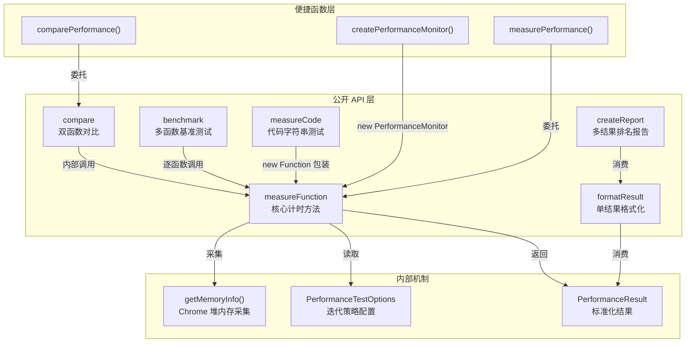
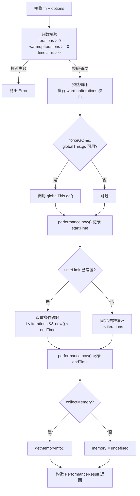

`PerformanceMonitor` 是 `@mudssky/jsutils` 中的核心性能分析引擎，提供从单函数计时到多函数基准对比的完整工具链。它通过可配置的迭代策略（固定次数 / 时间限制）、JIT 预热机制和 Chrome 内存堆快照采集，使开发者能够在不引入第三方 benchmark 库的前提下，对同步和异步代码片段进行精确的性能量化。本文将深入其架构设计、核心 API 的执行语义、内存追踪的运行时限制以及测试覆盖中的边界条件，帮助高级开发者在实际项目中高效运用该模块。

Sources: [performance.ts](src/modules/performance.ts#L1-L507)

## 架构总览

`PerformanceMonitor` 的设计遵循**单入口、多维度输出**的模式：核心方法 `measureFunction` 是唯一的计时执行路径，其余所有上层 API（`compare`、`benchmark`、`measureCode`）均基于它组合构建。这种设计确保了计时逻辑的一致性——无论通过哪条路径调用，性能数据的采集语义完全相同。



三层架构的职责划分十分清晰：**公开 API 层**面向开发者的直接使用场景，每个方法对应一种测试模式；**便捷函数层**通过工厂模式消除实例化步骤，适用于一次性测试；**内部机制层**封装了与运行时交互的细节（如 Chrome 内存 API 的类型安全访问），对外完全透明。

Sources: [performance.ts](src/modules/performance.ts#L105-L431)

## 核心数据结构

### PerformanceResult — 标准化测试结果

`PerformanceResult` 是所有性能测试方法的统一输出格式，它将时间、内存、返回值和迭代元数据封装为不可变的数据对象：

| 字段                     | 类型                  | 说明                                                    |
| ------------------------ | --------------------- | ------------------------------------------------------- |
| `duration`               | `number`              | 总执行时间（毫秒），使用 `performance.now()` 高精度计时 |
| `memory`                 | `object \| undefined` | V8 堆内存快照，仅 Chrome 环境可用                       |
| `memory.usedJSHeapSize`  | `number`              | 当前已使用的 JS 堆大小（字节）                          |
| `memory.totalJSHeapSize` | `number`              | 当前 JS 堆总量（字节）                                  |
| `memory.jsHeapSizeLimit` | `number`              | JS 堆大小上限（字节）                                   |
| `result`                 | `unknown`             | 被测函数最后一次迭代的返回值                            |
| `iterations`             | `number`              | 实际完成的迭代次数（时间限制模式下可能少于预期）        |

`iterations` 与 `result` 的语义值得注意：当启用 `timeLimit` 时，实际迭代次数取决于函数在时限内能执行多少次，而非配置的 `iterations` 上限。`result` 字段始终保存最后一次迭代的返回值，这意味着在迭代过程中函数的中间结果会被覆盖——这是**有意的设计**，因为性能测试关注的是时间指标，而非累积结果。

Sources: [performance.ts](src/modules/performance.ts#L1-L30)

### PerformanceTestOptions — 迭代策略配置

`PerformanceTestOptions` 控制测试的执行策略，其默认值经过精心选择以满足最常见的"快速计时"场景：

| 字段               | 类型                  | 默认值      | 说明                                               |
| ------------------ | --------------------- | ----------- | -------------------------------------------------- |
| `iterations`       | `number`              | `1`         | 最大迭代次数                                       |
| `collectMemory`    | `boolean`             | `true`      | 是否在测试结束后采集内存快照                       |
| `warmupIterations` | `number`              | `0`         | 预热迭代次数（不计入结果）                         |
| `forceGC`          | `boolean`             | `false`     | 是否在正式测试前强制垃圾回收                       |
| `timeLimit`        | `number \| undefined` | `undefined` | 时间上限（毫秒），与 `iterations` 取**较早到达者** |

`warmupIterations` 的存在是为了应对 V8 引擎的 **JIT 编译优化**：JavaScript 引擎在多次执行同一段代码后会将其编译为优化的机器码。预热迭代确保正式计时时引擎已完成优化，避免首次执行的编译开销污染结果。`forceGC` 依赖 Node.js 启动时的 `--expose-gc` 标志，在浏览器环境中无效——其目的是在内存敏感测试前消除垃圾回收器的不确定性影响。

`timeLimit` 与 `iterations` 形成双重终止条件的**竞速机制**：测试在两者中任一条件满足时停止。这允许开发者在不确定函数执行时间的情况下，设定一个合理的测试窗口而非盲目设置迭代次数。

Sources: [performance.ts](src/modules/performance.ts#L37-L64)

## measureFunction — 核心计时引擎

`measureFunction` 是整个模块的基石，所有其他测试方法最终都委托给它执行。其内部执行流程如下：



其方法签名支持泛型 `<T>`，接收同步函数 `() => T` 和异步函数 `() => Promise<T>` 两种形式，内部通过 `await` 统一处理。这意味着即使被测函数是同步的，`measureFunction` 本身始终返回 `Promise<PerformanceResult>`：

```typescript
const monitor = new PerformanceMonitor()

// 同步函数测试
const syncResult = await monitor.measureFunction(() => {
  return Array.from({ length: 1000 }, (_, i) => i * 2)
})

// 异步函数测试
const asyncResult = await monitor.measureFunction(async () => {
  await new Promise((resolve) => setTimeout(resolve, 100))
  return 'done'
})
```

参数校验阶段的三项检查各有其设计动机：`iterations <= 0` 意味着零数据产出，无法构成有效测试；`warmupIterations < 0` 是语义错误（预热次数不能为负）；`timeLimit <= 0` 会导致循环瞬间终止或永不终止。测试用例对这些边界条件进行了明确验证——传入 `iterations: 0` 和 `iterations: -1` 时均抛出异常。

Sources: [performance.ts](src/modules/performance.ts#L134-L203), [performance.test.ts](test/performance.test.ts#L28-L81), [performance.test.ts](test/performance.test.ts#L349-L367)

## 内存追踪机制

内存追踪通过 `getMemoryInfo()` 私有方法实现，它读取 `performance.memory` 对象——这是 **Chrome 浏览器专有的非标准 API**，在 Firefox、Safari 和 Node.js 环境中不可用。模块通过类型断言安全地访问该属性：

```typescript
private getMemoryInfo(): PerformanceResult['memory'] | undefined {
  const performanceWithMemory = performance as Performance & {
    memory?: {
      usedJSHeapSize: number
      totalJSHeapSize: number
      jsHeapSizeLimit: number
    }
  }
  if (typeof performanceWithMemory.memory !== 'undefined') {
    const memory = performanceWithMemory.memory
    return {
      usedJSHeapSize: memory.usedJSHeapSize,
      totalJSHeapSize: memory.totalJSHeapSize,
      jsHeapSizeLimit: memory.jsHeapSizeLimit,
    }
  }
  return undefined
}
```

三个堆内存字段的含义构成了 V8 内存管理的完整视图：`usedJSHeapSize` 是当前活跃对象占用的堆空间；`totalJSHeapSize` 是 V8 已从操作系统申请的堆空间（包含碎片）；`jsHeapSizeLimit` 是 V8 配置的堆上限。**比率 `usedJSHeapSize / totalJSHeapSize`** 可以反映堆的碎片化程度，而 **`usedJSHeapSize / jsHeapSizeLimit`** 则反映整体内存压力。

值得强调的是，内存采集发生在所有迭代完成之后，而非迭代过程中。这是一个**快照式**的设计——它捕获的是测试结束瞬间的堆状态，而非峰值或平均值。如果需要追踪内存随迭代的变化趋势，需要在外部循环中多次调用 `measureFunction` 并逐次采集。

`collectMemory` 选项默认为 `true`，但在不支持 `performance.memory` 的环境中，无论该选项如何设置，结果中的 `memory` 字段始终为 `undefined`。这保证了代码在不兼容环境中的零异常运行。

Sources: [performance.ts](src/modules/performance.ts#L333-L351)

## compare — 双函数对比分析

`compare` 方法将两个函数置于相同的测试条件下执行，并计算其性能比率：

```typescript
const comparison = await monitor.compare(
  () => [1, 2, 3].map((x) => x * 2),
  () => {
    const result: number[] = []
    for (const x of [1, 2, 3]) {
      result.push(x * 2)
    }
    return result
  },
  { iterations: 10000 },
)

console.log(comparison.faster) // 'fn1' 或 'fn2'
console.log(comparison.ratio) // 快慢比率（< 1 时 fn1 更快）
```

返回对象的结构如下：

| 字段     | 类型                | 说明                                   |
| -------- | ------------------- | -------------------------------------- |
| `fn1`    | `PerformanceResult` | 第一个函数的完整测试结果               |
| `fn2`    | `PerformanceResult` | 第二个函数的完整测试结果               |
| `ratio`  | `number`            | `fn1.duration / fn2.duration` 的绝对值 |
| `faster` | `'fn1' \| 'fn2'`    | 执行时间更短的函数标识                 |

**`ratio` 的解读需要谨慎**：其计算方式为 `Math.abs(fn1.duration / fn2.duration)`。当 `faster === 'fn1'` 时，`ratio < 1` 表示 fn1 比 fn2 快（fn1 耗时更短）；当 `faster === 'fn2'` 时，`ratio > 1` 表示 fn2 比 fn1 快。测试用例验证了这一语义——快速函数被测为 `fn1` 时，`ratio` 落在 `(0, 1)` 区间。

两个函数**串行执行**（fn1 先于 fn2），这意味着它们共享同一时间线上可能存在的 GC 事件或系统负载变化。对于更高精度的对比需求，建议增加 `warmupIterations` 以稳定 JIT 编译状态，并考虑多次调用 `compare` 取中位数。

Sources: [performance.ts](src/modules/performance.ts#L234-L256), [performance.test.ts](test/performance.test.ts#L83-L118)

## benchmark — 多函数基准测试

`benchmark` 是 `compare` 的泛化版本，接受函数数组并逐一测量：

```typescript
const results = await monitor.benchmark(
  [
    () => [1, 2, 3].map((x) => x * 2),
    () => [1, 2, 3].forEach((x, i, arr) => (arr[i] = x * 2)),
    () => {
      const result = []
      for (const x of [1, 2, 3]) {
        result.push(x * 2)
      }
      return result
    },
  ],
  { iterations: 10000, timeLimit: 5000 },
)
```

`benchmark` 的核心特性是与 `createReport` 配合生成排名报告。测试用例验证了两个维度的控制能力：通过 `timeLimit` 限制测试时长时，`duration` 不会大幅超过时间限制（测试允许 ±50ms 的误差）；通过 `iterations` 限制迭代次数时，在极大 `timeLimit` 下实际迭代次数等于配置值。

Sources: [performance.ts](src/modules/performance.ts#L286-L298), [performance.test.ts](test/performance.test.ts#L121-L152)

## measureCode — 代码字符串动态评测

`measureCode` 提供了一种从字符串直接执行性能测试的途径，其实现依赖 JavaScript 的 `Function` 构造器：

```typescript
const result = await monitor.measureCode(
  `
  const arr = Array.from({ length: 1000 }, (_, i) => i)
  return arr.reduce((sum, x) => sum + x, 0)
`,
  { iterations: 100 },
)

console.log(result.result) // 499500
```

内部实现非常简洁——通过 `new Function` 将代码字符串包装为可执行函数，然后委托给 `measureFunction`：

```typescript
public async measureCode(
  code: string,
  options: PerformanceTestOptions = {},
): Promise<PerformanceResult> {
  const fn = new Function(`return (function() { ${code} })`)()
  return this.measureFunction(fn, options)
}
```

注意代码字符串中需要使用 `return` 语句来产出结果值，因为代码被嵌入在一个匿名函数体内。测试用例验证了两种场景：包含变量声明和 `reduce` 调用的复杂代码字符串，以及简单的 `'return 1 + 1'` 表达式，后者正确返回 `2`。

**安全提示**：`measureCode` 使用 `new Function` 动态执行代码，等同于 `eval` 的安全风险。**切勿**将未经校验的用户输入传入此方法。它适用于开发阶段的快速原型验证和算法性能探索，而非生产环境。

Sources: [performance.ts](src/modules/performance.ts#L317-L324), [performance.test.ts](test/performance.test.ts#L154-L175)

## formatResult 与 createReport — 结果可视化

### formatResult — 单结果格式化

`formatResult` 将单个 `PerformanceResult` 转换为人类可读的字符串，其输出根据数据内容自适应：

```typescript
const formatted = monitor.formatResult({
  duration: 12.34567,
  iterations: 10,
  result: 'test result',
  memory: {
    usedJSHeapSize: 1024 * 1024, // 1MB
    totalJSHeapSize: 2048 * 1024, // 2MB
    jsHeapSizeLimit: 4096 * 1024, // 4MB
  },
})
// 输出: "执行时间: 12.35ms (10 次迭代) 平均: 1.23ms/次 内存使用: 1.00MB"
```

格式化逻辑的三个分支：

| 条件             | 追加内容                     | 示例                          |
| ---------------- | ---------------------------- | ----------------------------- |
| 始终             | `执行时间: X.XXms`           | `执行时间: 12.35ms`           |
| `iterations > 1` | `(N 次迭代) 平均: X.XXms/次` | `(10 次迭代) 平均: 1.23ms/次` |
| `memory` 存在    | `内存使用: X.XXMB`           | `内存使用: 1.00MB`            |

当 `iterations === 1` 时，输出精简为 `执行时间: X.XXms`，不显示迭代和平均信息——这是最常见的快速计时场景。

### createReport — 多结果排名报告

`createReport` 在 `formatResult` 之上增加了排名逻辑，按 `duration` 升序排列并标注最快函数：

```
=== 性能测试报告 ===

1. Map 🏆
   执行时间: 0.05ms (10000 次迭代) 平均: 0.00ms/次

2. ForEach
   执行时间: 0.08ms (10000 次迭代) 平均: 0.00ms/次
   比最快慢 1.60x

3. For Loop
   执行时间: 0.12ms (10000 次迭代) 平均: 0.00ms/次
   比最快慢 2.40x
```

`speedRatio` 的计算以最快函数为基准（`1.00x`），其余函数显示相对于它的倍率差。`labels` 参数为数组中的每个函数提供自定义名称，未提供时回退为 `函数1`、`函数2` 的默认格式。空数组输入返回 `'没有性能测试结果'`。

Sources: [performance.ts](src/modules/performance.ts#L366-L430), [performance.test.ts](test/performance.test.ts#L177-L242)

## 便捷函数 — 零实例化快捷路径

模块导出三个独立的便捷函数，无需手动创建 `PerformanceMonitor` 实例即可完成常见性能测试：

| 函数                                     | 等价代码                                                | 适用场景               |
| ---------------------------------------- | ------------------------------------------------------- | ---------------------- |
| `createPerformanceMonitor()`             | `new PerformanceMonitor()`                              | 工厂函数，便于依赖注入 |
| `measurePerformance(fn, options?)`       | `new PerformanceMonitor().measureFunction(fn, options)` | 一次性计时             |
| `comparePerformance(fn1, fn2, options?)` | `new PerformanceMonitor().compare(fn1, fn2, options)`   | 一次性对比             |

这些便捷函数的内部实现极为简洁——每次调用都会创建一个全新的 `PerformanceMonitor` 实例：

```typescript
export async function measurePerformance<T>(
  fn: () => T | Promise<T>,
  options?: PerformanceTestOptions,
): Promise<PerformanceResult> {
  const monitor = new PerformanceMonitor()
  return monitor.measureFunction(fn, options)
}
```

**实例不复用的设计是有意的**：`PerformanceMonitor` 本身是无状态的（没有实例级缓存或累积状态），每次创建新实例的开销可以忽略不计，且避免了在并发场景下的状态污染。测试用例验证了 `measurePerformance` 和 `comparePerformance` 的完整功能——包括选项传递和结果结构正确性。

Sources: [performance.ts](src/modules/performance.ts#L446-L507), [performance.test.ts](test/performance.test.ts#L245-L310)

## 边界条件与测试策略

测试套件覆盖了生产环境中可能遇到的关键边界条件：

| 场景                        | 预期行为                              | 验证方式                        |
| --------------------------- | ------------------------------------- | ------------------------------- |
| 极快函数（`() => true`）    | `duration >= 0`，`iterations > 0`     | 10000 次迭代下不抛异常          |
| 变速函数（随机负载）        | 正确累积时间，`iterations` 等于配置值 | 10 次随机迭代                   |
| `iterations: 0`             | 抛出异常                              | `rejects.toThrow()`             |
| `iterations: -1`            | 抛出异常                              | `rejects.toThrow()`             |
| 异步函数（含 `setTimeout`） | `duration > 8ms`（宽松断言）          | 15ms 延迟的 async 函数          |
| 抛错函数                    | 异常透传，不吞没                      | `rejects.toThrow('Test error')` |

异步函数测试中的宽松断言（`duration > 8` 而非精确的 `duration >= 15`）是跨环境兼容性的体现——不同 JavaScript 引擎的定时器精度和系统调度延迟差异显著，过紧的断言会在 CI 环境中产生误报。

极快函数的测试验证了 `performance.now()` 的精度边界：在微秒级操作中，`duration` 可能为 `0`（某些环境精度不足），因此断言使用 `toBeGreaterThanOrEqual(0)` 而非 `toBeGreaterThan(0)`。

Sources: [performance.test.ts](test/performance.test.ts#L313-L369)

## 实战模式与最佳实践

### 模式一：带预热的精确计时

对于 V8 优化的函数，预热是获得稳定数据的前提：

```typescript
const monitor = new PerformanceMonitor()
const result = await monitor.measureFunction(() => expensiveComputation(data), {
  iterations: 100,
  warmupIterations: 20, // 20次预热让JIT完成优化
  forceGC: true, // Node.js 下需要 --expose-gc 标志
  collectMemory: true,
})
```

### 模式二：时间窗口基准测试

当不确定函数执行耗时量级时，用 `timeLimit` 替代 `iterations` 作为主控制参数：

```typescript
const results = await monitor.benchmark([fn1, fn2, fn3], {
  timeLimit: 1000, // 最多运行1秒
  iterations: 100000, // 同时设置上限防止无限运行
})
const report = monitor.createReport(results, ['实现A', '实现B', '实现C'])
```

### 模式三：装饰器集成

对于类方法级别的性能监控，推荐使用 [TypeScript 装饰器：debounceMethod 与 performanceMonitor](19-typescript-zhuang-shi-qi-debouncemethod-yu-performancemonitor) 中介绍的 `@performanceMonitor` 和 `@performanceBenchmark` 装饰器——它们内部正是委托给 `PerformanceMonitor` 执行的。对于跨方法的性能比较场景，`@performanceCompare` 装饰器配合 `getPerformanceReport()` 函数可以自动收集并排名同一组内多个方法的性能数据。

Sources: [performance.ts](src/modules/performance.ts#L105-L203), [decorator.ts](src/modules/decorator.ts#L136-L208)

## 相关阅读

- [TypeScript 装饰器：debounceMethod 与 performanceMonitor](19-typescript-zhuang-shi-qi-debouncemethod-yu-performancemonitor) — 了解如何通过装饰器将 `PerformanceMonitor` 无侵入地集成到类方法中
- [Proxy 工具：singletonProxy 单例构造器包装](21-proxy-gong-ju-singletonproxy-dan-li-gou-zao-qi-bao-zhuang) — 另一种运行时增强模式
- [测试体系：Vitest 单元测试、类型测试与构建产物冒烟测试](23-ce-shi-ti-xi-vitest-dan-yuan-ce-shi-lei-xing-ce-shi-yu-gou-jian-chan-wu-mou-yan-ce-shi) — 性能测试套件的完整工程化上下文
