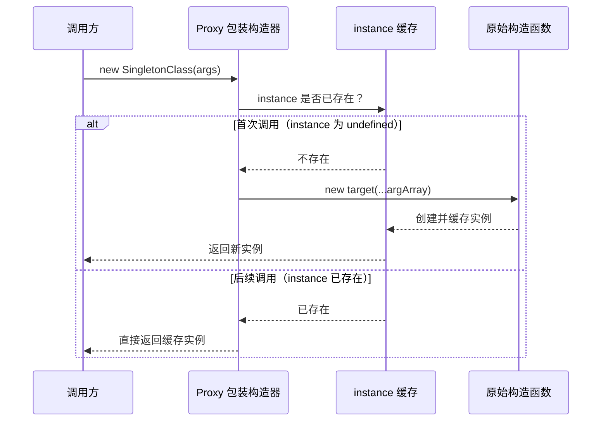

`singletonProxy` 是一个基于 ES6 Proxy 的**单例构造器包装函数**，它接收任意构造函数，返回一个行为完全等价的新构造函数——唯一的区别在于，无论你调用多少次 `new`，永远只会得到同一个实例。这一工具将单例模式的实现成本压缩到一行代码，同时保留了原始构造函数的完整类型签名与 `this` 绑定语义。

Sources: [proxy.ts](src/modules/proxy.ts#L1-L29)

## 设计动机：为什么用 Proxy 实现单例

传统的 JavaScript 单例模式通常依赖以下几种手段：模块顶层变量缓存、静态属性挂载、或是惰性初始化函数。这些方案各有取舍——模块缓存需要手动判断 `null`，静态属性要求修改原始类定义，惰性函数则丢失了 `new` 调用的语义一致性。`singletonProxy` 选择了一条更优雅的路径：通过 Proxy 的 `construct` 陷阱（trap）拦截 `new` 操作符的执行流程，在保持调用方式不变的前提下，透明地替换实例创建逻辑。这意味着调用方无需感知任何变化，使用 `new` 的习惯代码天然就是单例的。

Sources: [proxy.ts](src/modules/proxy.ts#L1-L29)

## 工作原理

`singletonProxy` 的核心机制可以用一个简洁的流程图来描述：



关键的设计决策在于使用了 Proxy 的 **`construct` 陷阱**而非 `apply` 陷阱。`construct` 陷阱专门拦截 `new` 操作符，这是唯一能正确捕获构造调用的 Proxy handler 方法。闭包变量 `instance` 充当缓存容器，其生命周期与返回的 Proxy 对象一致——只要 Proxy 构造器被引用，缓存的实例就不会被垃圾回收。

Sources: [proxy.ts](src/modules/proxy.ts#L15-L29)

## API 签名

```typescript
function singletonProxy<T extends object>(
  obj: new (...args: any[]) => T,
): new (...args: any[]) => T
```

| 参数       | 类型                        | 说明                                       |
| ---------- | --------------------------- | ------------------------------------------ |
| `obj`      | `new (...args: any[]) => T` | 任意具有构造签名的类或构造函数             |
| **返回值** | `new (...args: any[]) => T` | 与入参类型相同的构造函数，但已具备单例行为 |

**类型参数 `T`**：约束为 `object`，代表构造函数产出的实例类型。返回值的构造签名与入参完全一致，这意味着 TypeScript 能够正确推断出实例的类型，无需额外类型标注。

> ⚠️ **关于构造参数的说明**：当前实现中，`construct` 陷阱仅在首次调用时将 `argArray` 传递给原始构造函数。后续调用虽然可以传入参数，但这些参数会被静默忽略，直接返回已缓存的实例。

Sources: [proxy.ts](src/modules/proxy.ts#L15-L29)

## 基础用法

### 包装内置构造函数

最常见的场景是确保某个工具类在整个应用中只存在一个实例：

```typescript
import { singletonProxy } from '@mudssky/jsutils'

// 将 Date 构造函数包装为单例
const SingleDate = singletonProxy(Date)

const date1 = new SingleDate()
const date2 = new SingleDate()

console.log(date1 === date2) // true —— 始终是同一个实例
```

### 包装自定义类

对于自定义的业务类，`singletonProxy` 同样适用。全局状态管理器、配置中心、WebSocket 连接管理器等场景，都可以用一行代码获得单例保障：

```typescript
import { singletonProxy } from '@mudssky/jsutils'

class ConfigManager {
  private config: Record<string, unknown> = {}

  set(key: string, value: unknown) {
    this.config[key] = value
  }

  get(key: string) {
    return this.config[key]
  }
}

// 包装为单例 —— 无论在哪个模块中 new，操作的都是同一个配置实例
const SingletonConfig = singletonProxy(ConfigManager)

// 模块 A
const configA = new SingletonConfig()
configA.set('apiEndpoint', 'https://api.example.com')

// 模块 B
const configB = new SingletonConfig()
console.log(configB.get('apiEndpoint')) // 'https://api.example.com'
console.log(configA === configB) // true
```

Sources: [proxy.ts](src/modules/proxy.ts#L8-L13), [proxy.test.ts](test/proxy.test.ts#L5-L10)

## 与其他单例模式的对比

下表从多个维度对比了常见的 JavaScript 单例实现方案：

| 维度           | `singletonProxy` | 模块顶层变量    | 静态 `getInstance()`  | Symbol.hasInstance |
| -------------- | ---------------- | --------------- | --------------------- | ------------------ |
| **实现复杂度** | 一行调用         | 需手写判空逻辑  | 需额外方法定义        | 需理解元编程       |
| **调用方式**   | `new Wrapper()`  | 直接引用变量    | `Class.getInstance()` | `new Class()`      |
| **类型安全**   | ✅ 完整保留      | ✅ 需手动标注   | ✅ 需手动标注         | ⚠️ 类型欺骗风险    |
| **this 绑定**  | ✅ 不受影响      | ✅ 不适用       | ✅ 不适用             | ⚠️ 可能异常        |
| **延迟初始化** | ✅ 首次 new 时   | ❌ 模块加载时   | ✅ 首次调用时         | ✅ 首次 new 时     |
| **可逆性**     | ❌ 无法恢复      | ✅ 重赋值即可   | ⚠️ 需额外方法         | ❌ 需删除陷阱      |
| **实例隔离**   | ❌ 全局共享      | ✅ 按模块作用域 | ❌ 全局共享           | ❌ 全局共享        |

`singletonProxy` 的优势在于**零侵入**——不需要修改原始类定义、不需要添加静态方法、不需要改变团队的 `new` 调用习惯。它的局限在于缓存实例与 Proxy 构造器的生命周期绑定：只要有人持有这个 Proxy 构造器的引用，缓存的实例就无法被释放。这在大多数场景下是期望行为（单例的生命周期本就应该是应用级的），但在需要重置或销毁的场景下则需要额外设计。

Sources: [proxy.ts](src/modules/proxy.ts#L15-L29), [proxy.test.ts](test/proxy.test.ts#L5-L10)

## 适用场景与注意事项

**适合使用的场景**：

- **全局状态容器**：配置中心、主题管理器、国际化仓库——这些对象在整个应用生命周期中只需要一个
- **连接/资源管理**：WebSocket 连接、IndexedDB 实例、Web Worker 池——避免重复创建带来资源浪费
- **工具类单例化**：将原本按需创建的工具类（如日志器、格式化器）约束为单实例，减少内存开销
- **第三方库适配**：在不修改第三方类源码的前提下，将其包装为单例使用

**需要注意的限制**：

1. **参数只生效一次**：首次 `new` 时传入的构造参数决定了实例的初始化状态，后续调用的参数会被忽略
2. **不支持重置**：一旦实例被创建并缓存，无法通过 API 重置——如需重置，应重新调用 `singletonProxy` 创建新的包装器
3. **`instanceof` 行为**：`new SingletonProxy(Date) instanceof Date` 返回 `true`，因为 Proxy 的 `construct` 陷阱不会改变实例的原型链
4. **环境要求**：依赖 ES6 Proxy 支持（IE11 不支持，现代浏览器和 Node.js 均已全面支持）

Sources: [proxy.ts](src/modules/proxy.ts#L15-L29)

## 延伸阅读

`singletonProxy` 是 `@mudssky/jsutils` 中 Proxy 元编程能力的代表性应用。在本库的其他模块中，还有更多利用语言特性实现模式简化的工具：

- [TypeScript 装饰器：debounceMethod 与 performanceMonitor](19-typescript-zhuang-shi-qi-debouncemethod-yu-performancemonitor) —— 利用装饰器元编程实现方法级防抖和性能监控，与 `singletonProxy` 同属"用元编程简化模式"的设计理念
- [函数增强：防抖（debounce）与节流（throttle）的完整实现](7-han-shu-zeng-qiang-fang-dou-debounce-yu-jie-liu-throttle-de-wan-zheng-shi-xian) —— `debounceMethod` 装饰器底层的函数级实现
- [存储抽象层：WebLocalStorage/WebSessionStorage 与前缀命名空间](11-cun-chu-chou-xiang-ceng-weblocalstorage-websessionstorage-yu-qian-zhui-ming-ming-kong-jian) —— 另一个适合搭配单例模式使用的场景，全局唯一的存储实例
