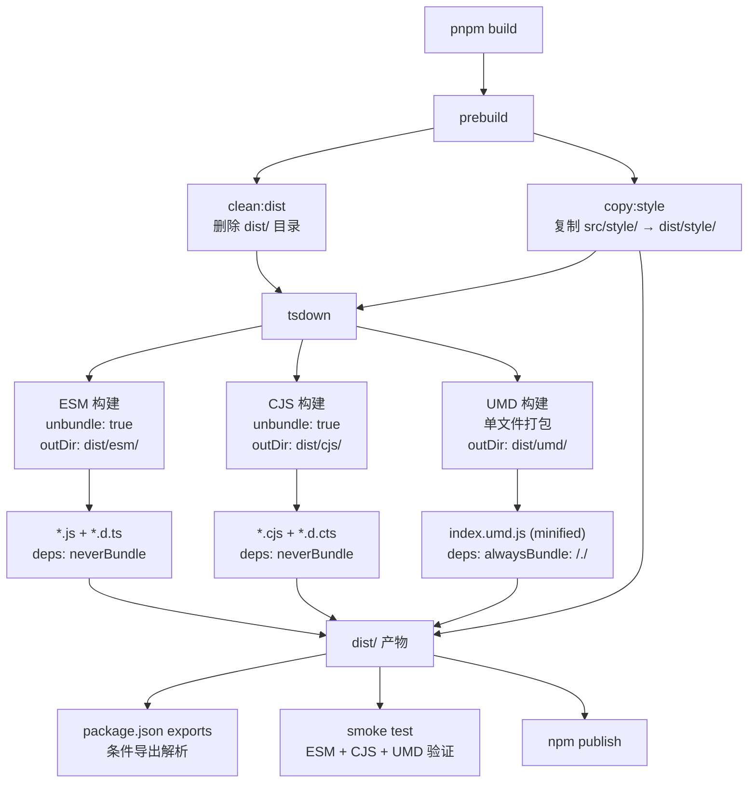
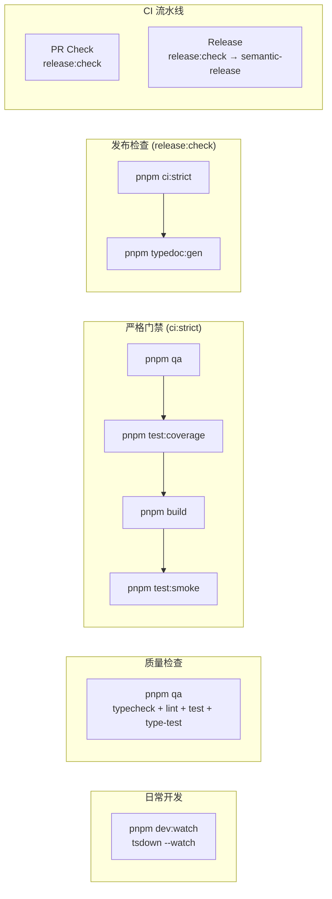
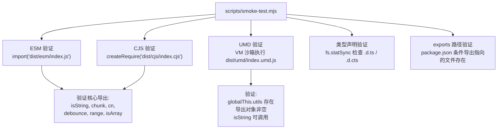

**@mudssky/jsutils** 的构建系统基于 **tsdown**——一个由 Rolldown 团队为库打包场景设计的高层构建工具，底层引擎为 Rust 编写的 Rolldown 和 Oxc。本页将深入解析 `tsdown.config.ts` 中三套并行构建配置的设计意图、格式差异与依赖策略，帮助开发者理解"为什么 ESM/CJS 用 unbundle 而 UMD 用单文件打包"等核心架构决策，并掌握从源码到发布产物的完整构建流水线。

Sources: [tsdown.config.ts](tsdown.config.ts#L1-L55), [package.json](package.json#L48-L87)

## 构建架构全景

整个构建过程遵循 **"清理 → 资源复制 → 多格式并行编译"** 的三阶段模型。tsdown 接收单一的入口文件 `src/index.ts`，同时输出三种模块格式和对应的类型声明文件。以下流程图展示了从 `pnpm build` 命令触发到最终产物生成的完整数据流：



**关键设计约束**：tsdown 的内置 `clean` 选项被显式禁用——因为 `copy:style`（将 SCSS 样式资源复制到 `dist/style/`）在 `tsdown` 执行之前完成，如果启用 tsdown 的清理功能，会删除已经复制好的样式文件。这一时序依赖是构建流水线设计中的核心考量。

Sources: [package.json](package.json#L52-L53), [scripts.ps1](scripts.ps1#L20-L28), [tsdown.config.ts](tsdown.config.ts#L1-L55)

## 迁移背景：从 Rollup 到 tsdown

在采用 tsdown 之前，项目使用 **Rollup v4 + 9 个插件**，配置分散在 `rollup.config.js`（生产构建）和 `rollup.config.dev.js`（开发构建）两个文件中，总计约 150 行配置代码。这套方案面临三个核心痛点：**插件膨胀**（9 个插件需要独立维护版本兼容性）、**构建速度**（JavaScript 实现的 Rollup 在模块增长后性能下降）、以及**工具碎片化**（生产用 typescript2、开发用 esbuild、类型用 dts，三种编译方案并存）。

迁移到 tsdown 后，**15 个构建相关依赖缩减为 1 个**，两个配置文件合并为单个 `tsdown.config.ts`（55 行），且构建速度因 Rust 引擎获得显著提升。下表对比了迁移前后的关键差异：

| 维度            | Rollup 方案（迁移前）                      | tsdown 方案（迁移后）            |
| --------------- | ------------------------------------------ | -------------------------------- |
| 构建工具        | Rollup v4                                  | tsdown (Rolldown + Oxc)          |
| 配置文件        | 2 个（生产 + 开发）                        | 1 个 `tsdown.config.ts`          |
| 构建依赖数量    | 15 个                                      | 1 个 (`tsdown`)                  |
| TypeScript 编译 | `rollup-plugin-typescript2`                | 内置（Oxc isolatedDeclarations） |
| 类型声明生成    | `rollup-plugin-dts`                        | 内置 `dts: true`                 |
| 代码压缩        | `@rollup/plugin-terser`                    | 内置 `minify: true`              |
| 模块解析        | `@rollup/plugin-node-resolve` + `commonjs` | 内置                             |
| 开发监听        | 独立 `rollup.config.dev.js`                | `tsdown --watch`                 |

Sources: [docs/brainstorms/2026-03-13-migrate-to-tsdown-brainstorm.md](docs/brainstorms/2026-03-13-migrate-to-tsdown-brainstorm.md#L1-L43), [docs/plans/2026-03-13-001-feat-migrate-build-to-tsdown-plan.md](docs/plans/2026-03-13-001-feat-migrate-build-to-tsdown-plan.md#L18-L32)

## 三格式配置详解

tsdown 采用**配置数组**的方式定义三套独立的构建任务。每套配置各自指定入口、输出格式、目标目录和依赖处理策略，tsdown 在单次执行中并行处理所有配置块。

### ESM 构建：保留模块结构的 Tree-Shaking 优化方案

```typescript
{
  entry: ['src/index.ts'],
  format: 'esm',
  outDir: 'dist/esm',
  unbundle: true,
  dts: true,
  target: 'es2017',
  sourcemap: false,
  outExtensions: () => ({
    js: '.js',
    dts: '.d.ts',
  }),
  deps: {
    neverBundle: ['clsx', 'tailwind-merge'],
  },
}
```

ESM 格式是本库的**主要消费格式**，设计目标是为打包工具（Webpack、Vite、Rollup）提供最优的 tree-shaking 支持。核心配置决策如下：

- **`unbundle: true`**：这是 tsdown 中等同于 Rollup `preserveModules` 的选项。启用后，tsdown 不会将所有模块合并为单个文件，而是保留源码的模块结构——源码中每个 `.ts` 文件对应产物中一个 `.js` 文件。这意味着消费者在使用 `import { range } from '@mudssky/jsutils'` 时，打包工具只需包含 `range` 所在的 `array.js` 模块，而非整个库。
- **`dts: true`**：基于 Oxc `isolatedDeclarations` 引擎生成类型声明文件，输出 `.d.ts` 到 `dist/esm/` 目录。这要求源码中所有导出函数和变量具有显式的类型标注——迁移过程中约 56 处代码被添加了返回类型标注以满足这一前置条件。
- **`deps.neverBundle: ['clsx', 'tailwind-merge']`**：这两个运行时依赖（`cn()` 函数依赖 `clsx` 和 `tailwind-merge`）被声明为永不打包。产物中的 `import` 语句会保留为 `from 'clsx'` 和 `from 'tailwind-merge'`，由消费端自行安装和解析。这避免了库中内联重复代码导致的版本冲突和包体积膨胀。
- **`outExtensions`**：显式控制输出文件扩展名为 `.js` 和 `.d.ts`，确保与 `package.json` 中的 `exports.import` 路径精确匹配。
- **`target: 'es2017'`**：编译目标为 ES2017，覆盖所有现代浏览器和 Node.js 8+ 环境，与 `tsconfig.json` 中的 `target` 保持一致。

Sources: [tsdown.config.ts](tsdown.config.ts#L4-L21), [package.json](package.json#L31-L41), [src/modules/style.ts](src/modules/style.ts#L1-L9)

### CJS 构建：Node.js 传统模块兼容方案

```typescript
{
  entry: ['src/index.ts'],
  format: 'cjs',
  outDir: 'dist/cjs',
  unbundle: true,
  dts: true,
  target: 'es2017',
  sourcemap: false,
  outExtensions: () => ({
    js: '.cjs',
    dts: '.d.cts',
  }),
  deps: {
    neverBundle: ['clsx', 'tailwind-merge'],
  },
}
```

CJS 格式为 Node.js 传统 `require()` 环境提供向后兼容。配置与 ESM 高度对称，关键差异在于**输出扩展名**：

- **`.cjs` 扩展名**：Node.js 使用文件扩展名来判定模块类型。在 `package.json` 声明了 `"type": "module"` 的项目中，只有 `.cjs` 扩展名的文件才会被正确识别为 CommonJS 模块。使用 `.cjs` 而非 `.js` 确保了本库在任何类型的消费端项目中都能正确工作。
- **`.d.cts` 类型声明**：TypeScript 对 `.cjs` 文件对应的类型声明使用 `.d.cts` 扩展名。这使 TypeScript 能够根据 `package.json` 中的 `exports.require.types` 条件正确解析 CJS 类型。

`deps.neverBundle` 策略与 ESM 相同——CJS 产物中的 `require('clsx')` 和 `require('tailwind-merge')` 调用保持原样，由消费端解析。

Sources: [tsdown.config.ts](tsdown.config.ts#L22-L39), [package.json](package.json#L29-L44)

### UMD 构建：浏览器 `<script>` 标签直接加载方案

```typescript
{
  entry: { index: 'src/index.ts' },
  format: 'umd',
  outDir: 'dist/umd',
  globalName: 'utils',
  minify: true,
  target: 'es2017',
  sourcemap: false,
  deps: {
    alwaysBundle: [/./],
  },
}
```

UMD 格式面向**非构建工具场景**——直接通过 `<script>` 标签在浏览器中加载。其设计哲学与 ESM/CJS 完全不同：

- **单文件打包**：不使用 `unbundle`（默认为 `false`），所有模块被合并为单个 `index.umd.js` 文件。在 `<script>` 标签场景下无法处理模块间的 `import/export`，单文件是唯一可行的方案。
- **`globalName: 'utils'`**：UMD 包装器将整个库挂载到 `window.utils` 全局变量上。加载后可通过 `utils.range(1, 10)`、`utils.isString('hello')` 等方式调用所有导出函数。
- **`minify: true`**：启用代码压缩以减小文件体积。对于直接在浏览器中引用的文件，体积优化尤为关键。
- **`deps.alwaysBundle: [/./]`**：使用正则 `/./` 匹配所有包名，将 **所有外部依赖强制内联**到 UMD 文件中。与 ESM/CJS 的 `neverBundle` 策略相反——`<script>` 标签场景下没有 `node_modules` 可供解析，`clsx` 和 `tailwind-merge` 的代码必须完整包含在 UMD 文件中。
- **`entry` 使用对象格式**：`{ index: 'src/index.ts' }` 显式指定输出文件名前缀为 `index`（生成 `index.umd.js`），而 ESM/CJS 使用数组格式 `['src/index.ts']`。

Sources: [tsdown.config.ts](tsdown.config.ts#L40-L55), [docs/brainstorms/2026-03-13-migrate-to-tsdown-brainstorm.md](docs/brainstorms/2026-03-13-migrate-to-tsdown-brainstorm.md#L49-L53)

## 三格式差异对比

| 特性         | ESM                     | CJS                     | UMD                              |
| ------------ | ----------------------- | ----------------------- | -------------------------------- |
| 输出目录     | `dist/esm/`             | `dist/cjs/`             | `dist/umd/`                      |
| 输出结构     | 多文件（unbundle）      | 多文件（unbundle）      | 单文件                           |
| JS 扩展名    | `.js`                   | `.cjs`                  | `.umd.js`                        |
| 类型声明     | `.d.ts`                 | `.d.cts`                | 无                               |
| 依赖处理     | `neverBundle`（外部化） | `neverBundle`（外部化） | `alwaysBundle: /./`（全部内联）  |
| 代码压缩     | 否                      | 否                      | `minify: true`                   |
| 目标场景     | 打包工具消费            | Node.js `require()`     | 浏览器 `<script>` 标签           |
| 全局变量     | 不适用                  | 不适用                  | `window.utils`                   |
| Tree-Shaking | ✅ 完全支持             | ⚠️ 有限支持             | ❌ 不支持                        |
| 入口格式     | 数组 `['src/index.ts']` | 数组 `['src/index.ts']` | 对象 `{ index: 'src/index.ts' }` |

Sources: [tsdown.config.ts](tsdown.config.ts#L1-L55)

## package.json 条件导出映射

三种格式的产物通过 `package.json` 的 **Conditional Exports** 机制精确路由到不同的消费场景。这是 Node.js 和打包工具解析模块路径的标准机制：

```json
{
  "type": "module",
  "exports": {
    ".": {
      "types": "./dist/esm/index.d.ts",
      "require": {
        "types": "./dist/cjs/index.d.cts",
        "default": "./dist/cjs/index.cjs"
      },
      "import": "./dist/esm/index.js",
      "default": "./dist/esm/index.js"
    }
  },
  "main": "./dist/cjs/index.cjs",
  "module": "./dist/esm/index.js",
  "typings": "./dist/esm/index.d.ts"
}
```

**条件匹配优先级**（从上到下）：

1. **`types`**（最优先）：TypeScript 在任何解析场景下首先查找类型声明，确保 IDE 自动补全和类型检查正确工作。
2. **`require.types` + `require.default`**：当消费端使用 `require('@mudssky/jsutils')` 时，Node.js 匹配 `require` 条件，加载 CJS 格式的类型声明和代码。
3. **`import`**：当消费端使用 `import ... from '@mudssky/jsutils'` 时，匹配 `import` 条件，加载 ESM 格式代码。
4. **`default`**：兜底条件，指向 ESM 格式。

**`"type": "module"`** 声明此包为 ESM 优先，这意味着包中 `.js` 文件被解释为 ES 模块，而 CJS 文件必须使用 `.cjs` 扩展名。同时，`"sideEffects": false` 声明所有模块均无副作用，允许打包工具进行更激进的 tree-shaking 优化——未使用的导出会被完整移除。

**传统字段兼容**：`main`、`module`、`typings` 三个字段为不支持 Conditional Exports 的旧工具（如 Webpack 4、旧版 Node.js）提供回退路径。

Sources: [package.json](package.json#L29-L47)

## 构建流水线与 CI 集成

构建命令通过 `package.json` scripts 定义了分层级的质量门禁：



| 命令                 | 执行内容                                 | 运行时机         |
| -------------------- | ---------------------------------------- | ---------------- |
| `pnpm build`         | `prebuild`（清理 + 复制样式）→ `tsdown`  | 发布前、手动触发 |
| `pnpm dev:watch`     | `tsdown --watch`（增量编译）             | 开发时实时预览   |
| `pnpm qa`            | typecheck + lint + test + type-test 并行 | 每次提交         |
| `pnpm ci:strict`     | qa → test:coverage → build → smoke test  | PR 合并前        |
| `pnpm release:check` | ci:strict → typedoc:gen                  | 发布前完整验证   |
| `pnpm test:smoke`    | `node scripts/smoke-test.mjs`            | 构建后验证       |

**`prepublishOnly: "pnpm build"`** 确保在 `npm publish` 之前自动执行构建，避免发布过时的产物。GitHub Actions 中，PR 检查和发布流程都执行 `release:check`，覆盖了从代码质量到构建产物完整性的全链路验证。

Sources: [package.json](package.json#L48-L87), [.github/workflows/pr-check.yml](.github/workflows/pr-check.yml#L29-L30), [.github/workflows/release.yml](.github/workflows/release.yml#L43-L44)

## 构建产物冒烟测试

构建产物冒烟测试（Smoke Test）在 `scripts/smoke-test.mjs` 中实现，作为 `ci:strict` 门禁的最后一道防线。其核心价值在于：项目的 672 个 Vitest 单元测试通过路径别名直接引用 `src/index.ts` 源码，而非 `dist/` 产物。这意味着测试通过**不能保证构建产物可用**——smoke test 正是为了弥补这一验证缺口。



**验证策略**：选取 6 个核心导出覆盖不同模块——`isString`（类型守卫）、`chunk`（数组操作）、`cn`（依赖 `clsx` + `tailwind-merge`，验证外部依赖策略正确性）、`debounce`（高阶函数）、`range`（纯函数）、`isArray`（类型守卫）。每个导出仅验证 `typeof === 'function'` 和一次基本调用，不做深度功能测试（功能正确性已由单元测试覆盖）。

**UMD 特殊验证**：由于 UMD 文件设计为浏览器环境加载，smoke test 使用 Node.js 的 `vm.runInNewContext` 模拟 `globalThis` 环境，在沙箱中执行 UMD 代码并检查 `globalThis.utils` 全局变量。

Sources: [scripts/smoke-test.mjs](scripts/smoke-test.mjs#L1-L121), [docs/brainstorms/2026-03-14-build-artifact-smoke-test-brainstorm.md](docs/brainstorms/2026-03-14-build-artifact-smoke-test-brainstorm.md#L89-L110)

## 常见问题与排查指南

| 问题                       | 症状                           | 原因                                               | 解决方案                                                                 |
| -------------------------- | ------------------------------ | -------------------------------------------------- | ------------------------------------------------------------------------ |
| `MODULE_NOT_FOUND` @/ 路径 | 消费端报找不到 `@/modules/xxx` | tsdown 未正确解析 `tsconfig.json` 的 `paths` 别名  | tsdown 内置读取 tsconfig paths，确认 `tsconfig.json` 中 `paths` 配置正确 |
| 类型声明缺失               | IDE 无类型提示                 | `dts: true` 未生效或 `isolatedDeclarations` 报错   | 确保所有导出函数有显式返回类型标注                                       |
| `dist/style/` 丢失         | SCSS 文件未被复制到产物        | `prebuild` 中 `copy:style` 未执行或被 `clean` 覆盖 | 确保 tsdown 未启用 `clean` 选项，手动运行 `pnpm prebuild`                |
| CJS 导入失败               | `require()` 报语法错误         | `.cjs` 扩展名未正确生成                            | 检查 `outExtensions` 回调是否返回 `{ js: '.cjs', dts: '.d.cts' }`        |
| UMD 体积异常大             | UMD 文件超过预期               | `deps.alwaysBundle` 未生效，额外包被内联           | 检查 `alwaysBundle: [/./]` 正则是否正确配置                              |
| 构建后 smoke test 失败     | `test:smoke` 报导出不存在      | 构建产物与 exports 路径不匹配                      | 运行 `pnpm prebuild && pnpm build` 后重试                                |

Sources: [docs/plans/2026-03-13-001-feat-migrate-build-to-tsdown-plan.md](docs/plans/2026-03-13-001-feat-migrate-build-to-tsdown-plan.md#L403-L414), [tsdown.config.ts](tsdown.config.ts#L1-L55)

## 延伸阅读

- 了解测试体系中如何验证构建产物：[测试体系：Vitest 单元测试、类型测试与构建产物冒烟测试](23-ce-shi-ti-xi-vitest-dan-yuan-ce-shi-lei-xing-ce-shi-yu-gou-jian-chan-wu-mou-yan-ce-shi)
- 了解代码质量门禁如何集成构建验证：[代码质量与 CI/CD：ESLint + Biome + Husky + Semantic Release 流水线](24-dai-ma-zhi-liang-yu-ci-cd-eslint-biome-husky-semantic-release-liu-shui-xian)
- 了解类型声明生成的源码要求：[类型系统设计：工具类型定义与 TypeScript 类型测试最佳实践](25-lei-xing-xi-tong-she-ji-gong-ju-lei-xing-ding-yi-yu-typescript-lei-xing-ce-shi-zui-jia-shi-jian)
- 回顾项目整体架构：[项目结构与模块地图](3-xiang-mu-jie-gou-yu-mo-kuai-di-tu)
