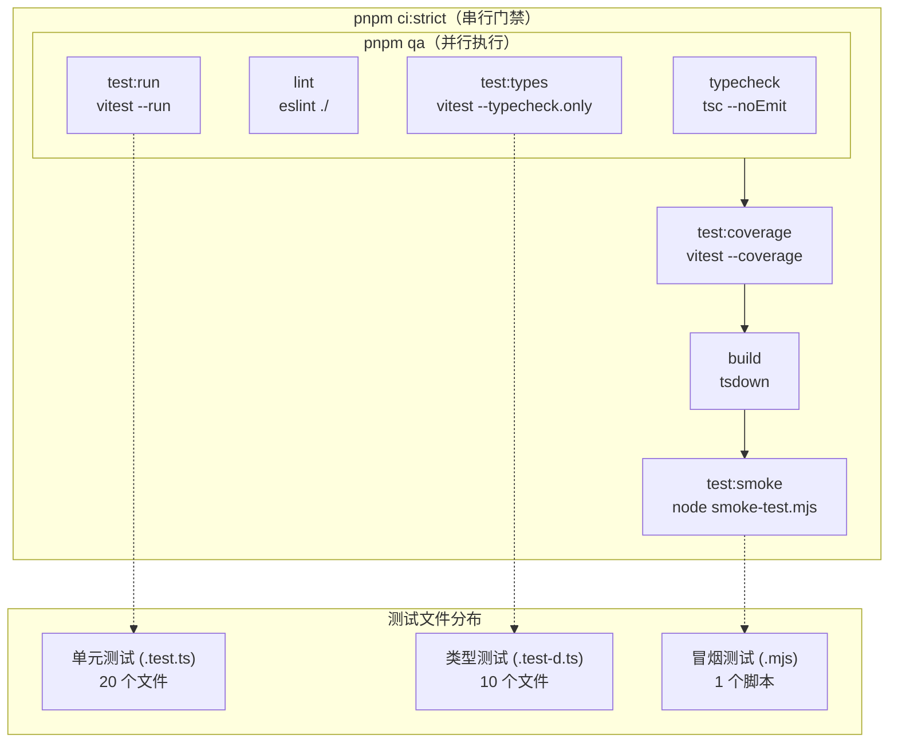
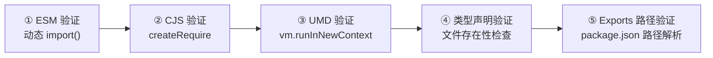
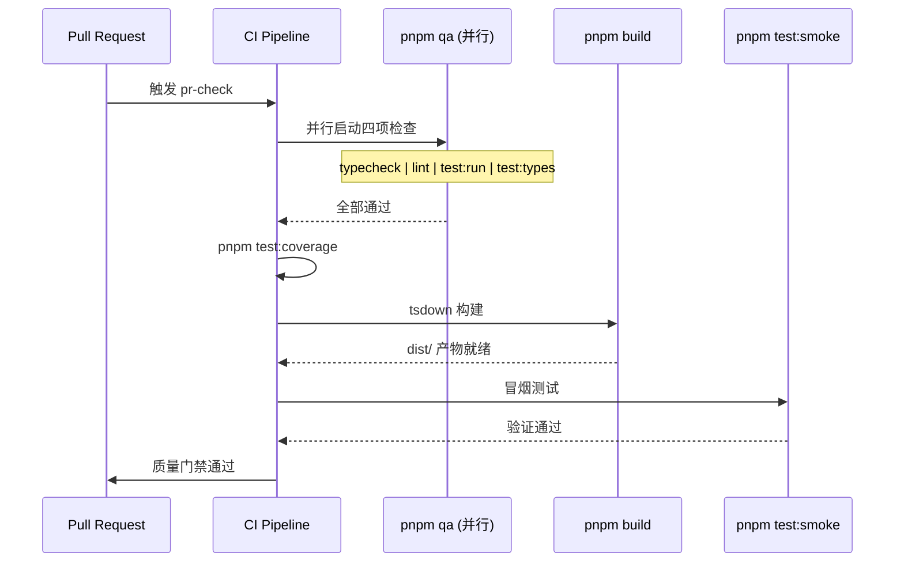

本项目的测试体系采用**三层验证架构**：Vitest 单元测试保障运行时逻辑的正确性，类型测试（type-level testing）验证 TypeScript 工具类型的推导精度，构建产物冒烟测试确保打包后的 ESM / CJS / UMD 三种格式均可被消费者正确导入。三层测试从源码到产物形成完整质量闭环，通过 `pnpm ci:strict` 命令串联执行，作为 PR 合并与版本发布的质量门禁。

## 测试架构总览

整个测试体系的执行流程遵循一条清晰的流水线：**源码级验证 → 类型级验证 → 构建产物验证**。单元测试和类型测试针对 `src/` 源码工作，冒烟测试针对 `dist/` 产物工作，两者之间通过构建步骤衔接，确保"测试全绿"等价于"发布产物可用"。



Sources: [package.json](package.json#L55-L86), [vitest.config.ts](vitest.config.ts#L1-L44), [scripts/smoke-test.mjs](scripts/smoke-test.mjs#L1-L122)

## Vitest 配置与路径别名

项目使用 Vitest 4.x 作为测试运行器，核心配置集中在 [vitest.config.ts](vitest.config.ts)。由于 Vitest 不读取 `tsconfig.json` 的 `paths` 字段，需要在配置中显式声明路径别名，将 `@mudssky/jsutils` 映射到 `src/index.ts` 源码入口。这样测试文件可以通过 `import { chunk } from '@mudssky/jsutils'` 的方式引入被测模块，与消费者在项目中使用该库的方式保持一致。

配置中的 `typecheck.include` 指定了类型测试的文件匹配模式 `test/types/**/*.test-d.ts`，这是 Vitest 类型测试功能的入口配置。覆盖率部分采用 V8 引擎覆盖率提供者（`@vitest/coverage-v8`），对 `src/` 目录下的源码进行覆盖分析，并设置了明确的阈值门槛。

| 配置项                         | 值                          | 说明                |
| ------------------------------ | --------------------------- | ------------------- |
| alias.`@mudssky/jsutils`       | `./src/index.ts`            | 模拟 npm 包导入路径 |
| alias.`@`                      | `./src`                     | 源码快捷路径        |
| typecheck.include              | `test/types/**/*.test-d.ts` | 类型测试文件范围    |
| coverage.provider              | V8                          | 覆盖率引擎          |
| coverage.thresholds.statements | 90%                         | 语句覆盖最低线      |
| coverage.thresholds.lines      | 90%                         | 行覆盖最低线        |
| coverage.thresholds.functions  | 88%                         | 函数覆盖最低线      |
| coverage.thresholds.branches   | 83%                         | 分支覆盖最低线      |

覆盖率排除项涵盖了不应计入覆盖的辅助文件：入口聚合文件 `src/index.ts`、纯类型定义 `src/types/**`、配置模块 `src/modules/config/**`、样式相关 `src/style/**`，以及 DOM/正则模块的桶导出文件。

Sources: [vitest.config.ts](vitest.config.ts#L1-L44), [package.json](package.json#L102-L103)

## 单元测试：组织模式与实践

项目共有 **20 个单元测试文件**，分布在 `test/` 目录下，其中 `test/dom/` 子目录专门存放需要浏览器环境的 DOM 相关测试。每个测试文件对应一个源码模块，形成一对一的映射关系。

### 导入策略

测试文件采用两种导入模式。**包级别导入**使用 `import * as _ from '@mudssky/jsutils'`，通过 Vitest 别名解析到源码入口，适合验证整体导出完整性；**具名导入**直接引入待测函数和类型，如 `import { range, chunk } from '@mudssky/jsutils'`，减少命名空间前缀，提高可读性。部分测试（如 `test/dom/storage.test.ts`）直接使用相对路径 `../src/modules/storage` 导入，绕过别名解析以测试特定内部路径。

### 测试组织结构

所有测试遵循 `describe → test` 的嵌套结构。`describe` 按函数名分组，`test` 描述具体的测试场景。每个测试用例遵循 **Arrange-Act-Assert** 模式：准备输入数据、调用被测函数、断言输出结果。

```typescript
// 典型测试结构示例
describe('range', () => {
  test('returns an empty array for zero range', () => {
    expect(range(0)).toEqual([])
  })

  test('test invalid param', () => {
    expect(() => range(0.5, 5)).toThrowError('unsupport decimal number')
  })
})
```

### 断言 API 选择

项目混用了两种 Vitest 断言风格。`expect()` 风格用于值比较和匹配器链式调用，如 `expect(result).toEqual([])` 和 `expect(fn).toThrowError()`；`assert` 风格用于直接的布尔判断，如 `assert.isFalse(result)` 和 `assert.equal(result, 'Hello')`。两种风格在功能上等价，选择取决于团队对可读性的偏好。

### 参数化测试：tableTest 模式

项目内置了一个轻量级参数化测试工具 `tableTest`，定义在 [src/modules/test.ts](src/modules/test.ts)。它接受一个测试用例数组和校验函数，对每个用例执行相同的断言逻辑。这种模式特别适合对同一函数的多种输入/输出组合进行批量验证，避免重复编写 `test()` 块。

```typescript
// tableTest 使用示例
const testCases: TestCase<[string, string]>[] = [
  { input: ['jk', 'jkl;djaksl'], expect: true },
  { input: ['jkk', 'jkl;djaksl'], expect: false },
]
tableTest(testCases, (tcase) => {
  expect(fuzzyMatch(...tcase.input)).toBe(tcase.expect)
})
```

`TestCase<INPUT, EXPECT>` 泛型接口确保输入和期望值的类型安全，`tableTest` 函数遍历用例数组并逐一执行校验函数。

Sources: [src/modules/test.ts](src/modules/test.ts#L1-L24), [test/string.test.ts](test/string.test.ts#L39-L51), [test/array.test.ts](test/array.test.ts#L1-L44)

## DOM 环境测试

涉及 DOM 操作的测试文件（[test/dom/](test/dom/)）需要浏览器环境支持。项目使用 **happy-dom** 作为测试环境的 DOM 模拟器，通过文件级注解 `@vitest-environment happy-dom` 声明。这与默认的 Node.js 环境不同，happy-dom 提供了完整的 `document`、`window`、`localStorage` 等浏览器全局对象。

```typescript
/**
 * @vitest-environment happy-dom
 */
describe('Highlighter', () => {
  beforeEach(() => {
    container = document.createElement('div')
    container.innerHTML = `<p>JavaScript tutorial</p>`
    document.body.appendChild(container)
  })
  // ...
})
```

对于 `localStorage` / `sessionStorage` 相关测试，项目还采用了**手动 Mock** 策略。[test/storage.test.ts](test/storage.test.ts) 自定义了 `LocalStorageMock` 类来模拟浏览器 Storage API，在 Node.js 环境中提供完整的 `getItem`、`setItem`、`removeItem`、`clear` 等方法。而 [test/dom/storage.test.ts](test/dom/storage.test.ts) 则直接使用 happy-dom 提供的 `localStorage`，并通过 `vi.useFakeTimers()` 控制定时器行为来测试 `autoSaveForm` 的防抖保存逻辑。

两种环境策略的选择取决于测试需求：需要完整 DOM API 交互时使用 happy-dom，仅需 Storage 接口时手动 Mock 更轻量可控。

Sources: [test/dom/highlighter.test.ts](test/dom/highlighter.test.ts#L1-L29), [test/storage.test.ts](test/storage.test.ts#L4-L42), [test/dom/storage.test.ts](test/dom/storage.test.ts#L1-L65)

## 类型测试：工具类型验证

类型测试是本项目的**独创亮点**。项目导出了大量 TypeScript 工具类型（Utility Types），如 `Equal`、`DeepReadonly`、`IsUnion` 等，这些类型在编译时进行类型运算，无法通过运行时断言验证。Vitest 的 `--typecheck` 模式为此提供了专门的解决方案。

### 文件约定与分布

类型测试文件统一存放在 `test/types/` 目录，采用 `.test-d.ts` 扩展名（`-d` 后缀是社区约定，表示"declaration-level"测试），共 **10 个文件**，与 `src/types/` 下的类型定义文件一一对应：

| 类型测试文件         | 对应类型定义文件    | 覆盖的关键类型                                            |
| -------------------- | ------------------- | --------------------------------------------------------- |
| `array.test-d.ts`    | `types/array.ts`    | `First`, `Last`, `Includes`, `Zip`, `Chunk`, `BuildArray` |
| `class.test-d.ts`    | `types/class.ts`    | 类相关工具类型                                            |
| `enum.test-d.ts`     | `types/enum.ts`     | 枚举相关工具类型                                          |
| `function.test-d.ts` | `types/function.ts` | `ParameterType`, `AppendArgument`, `PromiseReturnType`    |
| `math.test-d.ts`     | `types/math.ts`     | 数学类型运算                                              |
| `object.test-d-d.ts` | `types/object.ts`   | `FilterRecordByValue`, `ExtractOptional`, `DeepRecord`    |
| `promise.test-d.ts`  | `types/promise.ts`  | Promise 相关类型                                          |
| `string.test-d.ts`   | `types/string.ts`   | `Replace`, `Trim`, `ReverseStr`, `KebabCaseToCamelCase`   |
| `union.test-d.ts`    | `types/union.ts`    | `IsUnion`, `UnionToIntersection`                          |
| `utils.test-d.ts`    | `types/utils.ts`    | `Equal`, `Expect`, `IsAny`, `DeepReadonly`, `If`          |

### 核心测试手法

类型测试依赖两种核心机制：

**`assertType<T>()`** — Vitest 提供的类型断言函数，验证表达式的类型是否与 `T` 兼容。编译器在类型检查阶段推导两边类型，如果不匹配则报错。这是正向验证手段，确认类型推导产生正确结果。

**`@ts-expect-error`** — TypeScript 编译指令，标记下一行"预期会产生类型错误"。如果下一行实际上没有类型错误，编译器反而会报错。这是**负向验证**手段，确认类型系统能正确拒绝非法用法。

```typescript
// 正向验证：assertType 确认类型推导正确
assertType<Equal<Includes<[1, 2, 3], 2>, true>>(true)

// 负向验证：@ts-expect-error 确认非法输入被拒绝
// @ts-expect-error not Array
assertType<First<'notArray'>>(n)
```

这种"正向 + 负向"双保险策略确保工具类型既能在合法输入上正确推导，又能在非法输入上给出编译错误，是类型测试的最佳实践。项目中 `Equal` 工具类型被广泛用于嵌套类型断言，如 `assertType<Equal<Condition, ExpectedType>>(true)`，因为 `assertType` 只检查兼容性而非严格相等，需要借助 `Equal` 实现精确类型匹配。

### 运行方式

类型测试通过 `pnpm test:types` 单独执行（即 `vitest --run --typecheck.only`），同时也可通过 `pnpm test` 合并执行单元测试和类型测试（`vitest --run --typecheck`）。在 CI 门禁 `pnpm qa` 中，`test:types` 与 `typecheck`、`lint`、`test:run` 并行执行，最大化流水线效率。

Sources: [test/types/array.test-d.ts](test/types/array.test-d.ts#L1-L33), [test/types/utils.test-d.ts](test/types/utils.test-d.ts#L1-L65), [test/types/string.test-d.ts](test/types/string.test-d.ts#L1-L131), [test/types/union.test-d.ts](test/types/union.test-d.ts#L1-L26)

## 构建产物冒烟测试

冒烟测试解决的是一个关键风险：**单元测试通过 Vitest 别名直接引用 `src/index.ts` 源码，从不测试 `dist/` 产物，理论上存在"测试全绿但构建产物不可用"的可能**。冒烟测试作为最后一道防线，验证构建产物的可加载性和完整性。

### 测试脚本设计

[scripts/smoke-test.mjs](scripts/smoke-test.mjs) 使用纯 Node.js API 实现，零外部依赖，执行时间控制在 3 秒以内。脚本通过自定义的 `check()` 函数逐一执行验证项，汇总通过/失败计数，失败时以非零退出码终止进程。

### 五大验证阶段



**① ESM 验证**：通过动态 `import()` 加载 `dist/esm/index.js`，使用 `pathToFileURL()` 将本地路径转为 file URL。逐一检查 `CORE_EXPORTS` 中的 6 个函数（`isString`、`chunk`、`cn`、`debounce`、`range`、`isArray`）是否存在且类型为 `function`，并执行 `isString('hello') === true` 和 `chunk([1,2,3], 2).length === 2` 两次基本调用断言。

**② CJS 验证**：通过 `createRequire()` 创建 require 函数加载 `dist/cjs/index.cjs`，检查相同的 6 个核心导出并执行调用断言，确保 CommonJS 模块消费者的 `require()` 调用链正常。

**③ UMD 验证**：由于 UMD 格式需要全局对象，脚本使用 `vm.runInNewContext()` 在隔离上下文中执行 `dist/umd/index.umd.js`，验证 `globalThis.utils`（由 tsdown 配置的 `globalName: 'utils'` 生成）非空且包含有效导出。这种 VM 沙箱方式避免了全局命名空间污染。

**④ 类型声明验证**：检查 `dist/esm/index.d.ts` 和 `dist/cjs/index.d.cts` 两个类型声明文件存在且非空（`stat.size > 0`），确保 TypeScript 消费者能获取类型提示。

**⑤ Exports 路径验证**：解析 `package.json` 的 `exports["."]` 字段，提取 `types`、`require.types`、`require.default`、`import`、`default` 五个路径，验证每个路径指向的文件确实存在于文件系统。

| 验证阶段 | 验证目标           | 技术手段                       | 覆盖模块数       |
| -------- | ------------------ | ------------------------------ | ---------------- |
| ESM      | 动态导入可行性     | `import()` + `pathToFileURL()` | 6 个核心导出     |
| CJS      | require 加载可行性 | `createRequire()`              | 6 个核心导出     |
| UMD      | 全局变量挂载       | `vm.runInNewContext()`         | globalThis.utils |
| DTS      | 类型声明完整性     | `statSync()` 文件检查          | 2 个声明文件     |
| Exports  | 包路径解析正确性   | `package.json` 解析            | 5 个路径         |

Sources: [scripts/smoke-test.mjs](scripts/smoke-test.mjs#L1-L122), [tsdown.config.ts](tsdown.config.ts#L1-L56)

## CI 流水线集成

测试体系在 CI 中通过两个关键工作流驱动。[pr-check.yml](.github/workflows/pr-check.yml) 在 PR 合并到 `main` 分支时触发，执行 `pnpm release:check`；[release.yml](.github/workflows/release.yml) 在 `main` 分支推送时触发，同样执行 `pnpm release:check` 后进行语义化发布。

### 质量门禁流程

`pnpm release:check` 展开为 `pnpm ci:strict && pnpm typedoc:gen`，其中 `ci:strict` 的完整执行链为：

```
pnpm qa          → 并行：typecheck + lint + test:run + test:types
pnpm test:coverage → 串行：单元测试 + 覆盖率报告
pnpm build       → 串行：tsdown 多格式构建
pnpm test:smoke  → 串行：构建产物冒烟测试
```

`pnpm qa` 使用 `concurrently` 并行执行四项检查，利用多核 CPU 加速。构建步骤必须串行排在覆盖率之后，因为冒烟测试需要 `dist/` 目录中的构建产物。这种 **"并行 QA + 串行产物验证"** 的混合策略在保证速度的同时覆盖了完整的质量链。



Sources: [.github/workflows/pr-check.yml](.github/workflows/pr-check.yml#L1-L31), [.github/workflows/release.yml](.github/workflows/release.yml#L1-L78), [package.json](package.json#L55-L73)

## 常用测试命令速查

| 命令                 | 作用                                     | 适用场景       |
| -------------------- | ---------------------------------------- | -------------- |
| `pnpm test`          | 运行单元测试 + 类型测试                  | 日常开发验证   |
| `pnpm test:run`      | 仅运行单元测试（跳过类型检查）           | 快速反馈循环   |
| `pnpm test:watch`    | 监听模式，文件变更自动重跑               | TDD 开发流程   |
| `pnpm test:types`    | 仅运行类型测试                           | 验证类型推导   |
| `pnpm test:coverage` | 单元测试 + 覆盖率报告                    | 评估覆盖情况   |
| `pnpm test:smoke`    | 构建产物冒烟测试                         | 验证打包结果   |
| `pnpm test:ui`       | Vitest Web UI（含类型测试）              | 可视化调试     |
| `pnpm qa`            | 并行执行 typecheck + lint + test + types | 提交前全量检查 |
| `pnpm ci:strict`     | qa + 覆盖率 + 构建 + 冒烟测试            | CI 完整门禁    |
| `pnpm release:check` | ci:strict + 文档生成                     | 发布前最终验证 |

Sources: [package.json](package.json#L48-L87)

## 延伸阅读

- 了解构建配置如何产出被冒烟测试验证的三种格式：[构建与打包：tsdown 多格式输出（ESM / CJS / UMD）配置详解](22-gou-jian-yu-da-bao-tsdown-duo-ge-shi-shu-chu-esm-cjs-umd-pei-zhi-xiang-jie)
- 了解类型测试中验证的工具类型定义细节：[类型系统设计：工具类型定义与 TypeScript 类型测试最佳实践](25-lei-xing-xi-tong-she-ji-gong-ju-lei-xing-ding-yi-yu-typescript-lei-xing-ce-shi-zui-jia-shi-jian)
- 了解测试体系如何嵌入 CI/CD 全流程：[代码质量与 CI/CD：ESLint + Biome + Husky + Semantic Release 流水线](24-dai-ma-zhi-liang-yu-ci-cd-eslint-biome-husky-semantic-release-liu-shui-xian)
