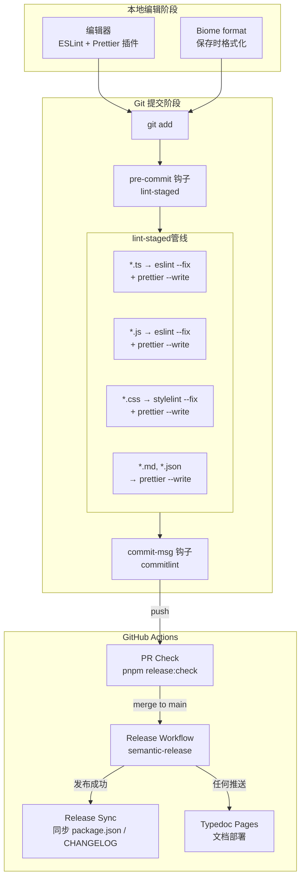
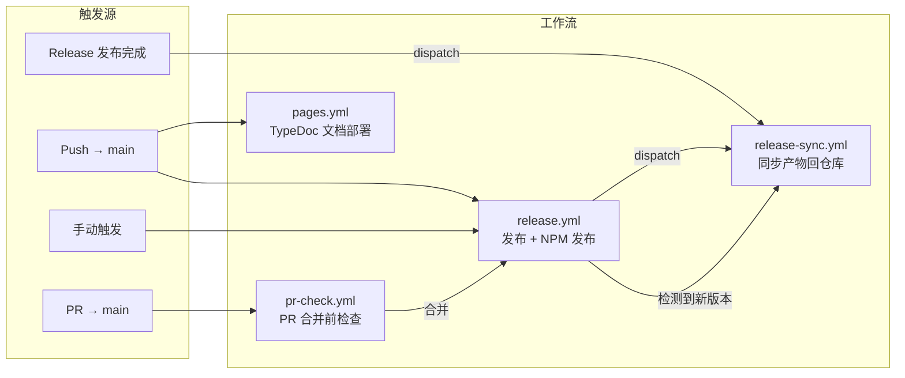
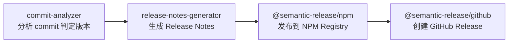
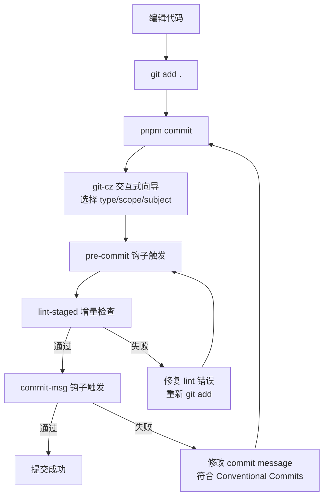

本页系统阐述 `@mudssky/jsutils` 项目的**代码质量保障体系**与**持续集成/持续部署流水线**。项目采用多层级质量门禁架构——从 Git 提交阶段的 Husky + lint-staged + commitlint 本地拦截，到 ESLint + Biome + Prettier 的三重代码规范引擎，再到 GitHub Actions 上 Semantic Release 驱动的全自动化发布流程。理解这套流水线的运作机制，是参与本项目协作的基础前提。

Sources: [package.json](package.json#L48-L87), [eslint.config.mjs](eslint.config.mjs#L1-L75), [biome.json](biome.json#L1-L61)

## 质量门禁全景架构

项目的质量保障分布在**三个执行阶段**：本地编辑时（编辑器集成）、Git 提交时（Husky 钩子）和远程 CI/CD（GitHub Actions）。每一层门禁各司其职，形成纵深防御。



这套架构的核心设计理念是**分层拦截、逐步收窄**：低成本问题（格式化、import 排序）在编辑器层面实时修复；中成本问题（lint 错误、commit 规范）在 Git 钩子层面拦截；高成本问题（构建失败、类型错误、测试回归）在 CI 层面阻断。每一层只关注自己擅长的检查维度，避免重复工作。

Sources: [.husky/pre-commit](.husky/pre-commit#L1-L1), [.husky/commit-msg](.husky/commit-msg#L1-L1), [lint-staged.config.js](lint-staged.config.js#L1-L6), [.github/workflows/release.yml](.github/workflows/release.yml#L1-L78)

## ESLint：代码质量检查核心

ESLint 是项目的**主要静态分析引擎**，负责捕获潜在的逻辑错误、类型安全问题和不规范的代码模式。项目采用 ESLint Flat Config（`eslint.config.mjs`），这是 ESLint 9+ 引入的新配置体系，用声明式数组取代了传统 `.eslintrc` 的继承模型。

### 配置分层结构

配置文件采用**自上而下的优先级叠加**模式——数组中后出现的配置块覆盖先前的规则，形成精确的规则分层：

| 层级        | 作用域                   | 核心规则                                                  | 设计意图                                                 |
| ----------- | ------------------------ | --------------------------------------------------------- | -------------------------------------------------------- |
| 基础层      | 全局                     | `js.configs.recommended` + `tseslint.configs.recommended` | JavaScript 推荐规则 + TypeScript 严格检查                |
| TSDoc 层    | `src/**/*.ts`            | `tsdoc/syntax: warn`                                      | 强制源码中的 JSDoc 注释符合 TSDoc 规范                   |
| Scripts 层  | `scripts/**/*.mjs`       | 全局 `console`/`process` 只读                             | 为 Node.js 脚本环境注入全局变量声明                      |
| CJS 兼容层  | 各种 `.cjs` 配置文件     | `sourceType: commonjs`                                    | 避免 ESLint 对 CommonJS 配置文件报错                     |
| 源码+测试层 | `src/**/*.ts`, `test/**` | `no-console: warn`                                        | 库代码不应包含 `console.log` 调试语句                    |
| 测试覆盖层  | `test/**`                | `no-unused-expressions: off`                              | 允许测试框架（如 `expect().to.be.true`）中的链式断言语法 |

Sources: [eslint.config.mjs](eslint.config.mjs#L1-L75)

**TypeScript 集成**通过 `typescript-eslint` 包实现——它同时包含了 parser（将 TS 代码解析为 ESLint 可理解的 AST）和 plugin（提供 `@typescript-eslint/*` 系列规则）。配置中直接展开 `tseslint.configs.recommended`，启用了约 30 条经过社区验证的 TypeScript 特有规则（如 `no-explicit-any`、`no-non-null-assertion` 等）。[eslint.config.mjs](eslint.config.mjs#L4-L16)

**TSDoc 插件**（`eslint-plugin-tsdoc`）是本项目的特色配置——它确保源码中所有 JSDoc 注释都遵循 [TSDoc 标准](https://tsdoc.org/)，这对后续通过 API Extractor 自动生成 API 文档至关重要。该规则以 `warn` 级别运行，不会阻断提交但会在编辑器中给出明显提示。[eslint.config.mjs](eslint.config.mjs#L18-L26)

**忽略策略**采用顶层 `ignores` 声明，排除 `node_modules`、`dist`、`temp`、`typedoc` 和 `vitedocs/.vitepress` 目录，避免对生成产物和第三方代码进行不必要的检查。[eslint.config.mjs](eslint.config.mjs#L8-L10)

## Biome：高性能格式化引擎

Biome 在本项目中定位为**格式化器**而非 linter——其 linter 功能被显式禁用（`"enabled": false`），将代码质量检查的职责完全交给 ESLint。这种职责分离策略避免了两个工具在 lint 规则上的冲突，同时充分利用了 Biome 在格式化性能上的优势（Rust 实现，比 Prettier 快 25 倍以上）。

### Biome 配置解析

| 配置项                                  | 值           | 设计意图                                   |
| --------------------------------------- | ------------ | ------------------------------------------ |
| `formatter.enabled`                     | `true`       | 启用 Biome 格式化                          |
| `formatter.useEditorconfig`             | `true`       | 读取 `.editorconfig` 作为基础缩进配置      |
| `formatter.lineEnding`                  | `lf`         | 强制 LF 换行，与 `.gitattributes` 保持一致 |
| `formatter.lineWidth`                   | `80`         | 标准行宽                                   |
| `linter.enabled`                        | `false`      | **禁用 lint**，职责交给 ESLint             |
| `assist.actions.source.organizeImports` | `"on"`       | 自动组织 import 语句排序                   |
| `javascript.formatter.semicolons`       | `"asNeeded"` | 行尾分号按需添加                           |
| `javascript.formatter.quoteStyle`       | `"single"`   | 单引号风格                                 |
| `json.formatter.enabled`                | `false`      | JSON 文件格式化交给 Prettier               |

Sources: [biome.json](biome.json#L1-L61)

Biome 的 **`organizeImports` 动作**是其最具价值的功能——它在 `biome check --write` 时自动排序和组织 import 语句，将类型导入与值导入分离、第三方包排在前面、项目内部模块排在后面。这与 `prettier-plugin-organize-imports` 形成双保险，确保无论开发者使用哪种格式化工具，import 排序始终保持一致。[biome.json](biome.json#L49-L55)

**VCS 集成**配置（`"vcs.enabled": true, "clientKind": "git", "useIgnoreFile": true`）使 Biome 自动尊重 `.gitignore` 文件，无需在 Biome 配置中重复维护忽略列表。[biome.json](biome.json#L3-L7)

## Prettier：代码风格的最终裁决者

Prettier 作为**代码风格的统一出口**，与 Biome 形成互补关系。Prettier 的配置非常精简——仅声明了两个核心风格规则和两个增强插件：

```javascript
// .prettierrc.cjs
module.exports = {
  plugins: ['prettier-plugin-organize-imports', 'prettier-plugin-packagejson'],
  semi: false, // 不在行尾添加分号
  singleQuote: true, // 使用单引号
}
```

Sources: [.prettierrc.cjs](.prettierrc.cjs#L1-L5)

**插件生态**是 Prettier 在本项目中不可替代的原因：`prettier-plugin-organize-imports` 利用 TypeScript Language Service 自动排序 import 语句，而 `prettier-plugin-packagejson` 则规范化 `package.json` 的字段排序（按字母序排列 dependencies、scripts 等）。这两个插件确保了项目元数据文件的结构一致性。

**风格一致性保障链**由三重机制构成：`.editorconfig` 定义基础缩进（2 空格、LF 换行），`.gitattributes` 通过 `* text=auto eol=lf` 强制所有文本文件使用 LF 换行，而 Prettier 和 Biome 都配置为尊重 `.editorconfig`。这三个配置文件形成了一个从文件存储层到格式化工具层的**单向风格传播链**，确保无论在 Windows 还是 macOS/Linux 环境下开发，代码风格始终统一。

Sources: [.editorconfig](.editorconfig#L1-L27), [.gitattributes](.gitattributes#L1-L5)

### 三大格式化工具的职责分工

| 职责维度            | ESLint                 | Biome                    | Prettier                   |
| ------------------- | ---------------------- | ------------------------ | -------------------------- |
| 代码质量检查        | ✅ 主力                | ❌ 已禁用                | ❌                         |
| TypeScript 语法检查 | ✅ `typescript-eslint` | ❌                       | ❌                         |
| TSDoc 规范检查      | ✅ `tsdoc/syntax`      | ❌                       | ❌                         |
| JS/TS 格式化        | ⚠️ `eslint --fix`      | ✅ `biome check --write` | ✅ `prettier --write`      |
| JSON 格式化         | ❌                     | ❌ 已禁用                | ✅ 含 `packagejson` 插件   |
| CSS 格式化          | ❌                     | ❌                       | ✅                         |
| Import 排序         | ❌                     | ✅ `organizeImports`     | ✅ `organize-imports` 插件 |
| Markdown 格式化     | ❌                     | ❌                       | ✅                         |

## Husky + lint-staged：Git 提交门禁

Husky 是 Git 钩子的**托管框架**，它将 Git 原生的 `pre-commit` 和 `commit-msg` 钩子委托给 lint-staged 和 commitlint 执行。项目采用 Husky 9+ 的新式配置——每个钩子就是一个独立的可执行文件，不再依赖已废弃的 `husky.sh` 脚本。

### pre-commit 钩子：lint-staged 增量检查

```bash
# .husky/pre-commit
pnpm lint-staged
```

Sources: [.husky/pre-commit](.husky/pre-commit#L1-L1)

lint-staged 的核心设计原则是**只检查暂存区的文件**——它不会对整个项目跑 lint，而是根据 `lint-staged.config.js` 中定义的 glob 模式，为每个暂存文件匹配对应的检查管线：

| 文件模式       | 检查管线                                                | 说明                        |
| -------------- | ------------------------------------------------------- | --------------------------- |
| `*.{md,json}`  | `prettier --write`                                      | Markdown 和 JSON 仅做格式化 |
| `*.{css,less}` | `stylelint --fix` → `prettier --write`                  | 先 CSS lint 再格式化        |
| `*.{js,jsx}`   | `eslint --fix` → `prettier --write`                     | 先 JS lint 再格式化         |
| `*.{ts,tsx}`   | `eslint --fix` → `prettier --parser=typescript --write` | TypeScript 特殊处理         |

Sources: [lint-staged.config.js](lint-staged.config.js#L1-L6)

注意 **TypeScript 文件的处理差异**——它使用 `prettier --parser=typescript` 而非直接 `prettier --write`，这确保 Prettier 以 TypeScript 解析器处理 `.ts` 文件，避免与 ESLint 的 TypeScript 解析器产生冲突。执行顺序是**先 ESLint 修复后 Prettier 格式化**，这是因为 ESLint 的 `--fix` 可能产生格式问题（如自动插入分号），由 Prettier 做最终修正。

### commit-msg 钩子：commitlint 规范校验

```bash
# .husky/commit-msg
pnpm --no -- commitlint --edit ${1}
```

Sources: [.husky/commit-msg](.husky/commit-msg#L1-L1)

commitlint 强制所有 commit message 遵循 [Conventional Commits 规范](https://www.conventionalcommits.org/)——即 `type(scope): subject` 的格式。项目继承 `@commitlint/config-conventional` 预设，同时禁用了 `body-max-line-length` 规则（设为 `[0, 'never']`），允许 commit body 中包含长 URL 或代码片段而不被截断。

Sources: [commitlint.config.cjs](commitlint.config.cjs#L1-L6)

### 交互式提交工具：git-cz

项目集成了 `git-cz`（通过 `.czrc` 配置），提供交互式 commit 向导。当开发者运行 `pnpm commit` 时，它会依次引导选择 type、scope、subject 等字段，自动生成符合 Conventional Commits 的 message。`changelog.config.cjs` 定义了完整的提交类型清单及其对应的 emoji 标识：

| 类型       | Emoji | 用途          | Semantic Release 影响   |
| ---------- | ----- | ------------- | ----------------------- |
| `feat`     | 🎸    | 新功能        | **触发 minor 版本发布** |
| `fix`      | 🐛    | Bug 修复      | **触发 patch 版本发布** |
| `perf`     | ⚡️    | 性能优化      | 触发 patch 版本发布     |
| `refactor` | 💡    | 代码重构      | 无版本变更              |
| `docs`     | ✏️    | 文档更新      | 无版本变更              |
| `test`     | 💍    | 测试补充      | 无版本变更              |
| `chore`    | 🤖    | 构建/工具变更 | 无版本变更              |
| `ci`       | 🎡    | CI 配置变更   | 无版本变更              |
| `style`    | 💄    | 代码格式调整  | 无版本变更              |

Sources: [changelog.config.cjs](changelog.config.cjs#L1-L88), [.czrc](.czrc#L1-L3)

其中 **`feat` 和 `fix` 是版本发布的决定性类型**——Semantic Release 的 commit-analyzer 会扫描这两个关键词来判定新版本号。在 commit body 中加入 `BREAKING CHANGE:` 关键词则会触发 **major 版本**发布。

## GitHub Actions：四条自动化流水线

项目的 CI/CD 由四条独立的 GitHub Actions 工作流组成，各自承担不同的自动化职责：



### 1. PR 检查流水线（pr-check.yml）

PR 检查是**合并前的最终门禁**。每当创建或更新针对 `main` 分支的 PR 时触发，执行完整的 `release:check` 命令链：

```bash
pnpm release:check
# 等价于：
pnpm ci:strict && pnpm typedoc:gen
# 即：
pnpm qa && pnpm test:coverage && pnpm build && pnpm test:smoke && pnpm typedoc:gen
```

Sources: [.github/workflows/pr-check.yml](.github/workflows/pr-check.yml#L1-L31), [package.json](package.json#L74-L74)

其中 `pnpm qa` 使用 `concurrently` **并行执行四项检查**——类型检查（`tsc --noEmit`）、ESLint 检查、单元测试运行和类型测试运行——显著缩短 CI 等待时间。覆盖 `release:check` 后的完整门禁链路为：**QA 并行检查 → 覆盖率测试 → 构建 → 冒烟测试 → TypeDoc 生成**。只有所有步骤通过，PR 才允许合并。

Sources: [package.json](package.json#L55-L56)

### 2. 发布流水线（release.yml）

发布流水线是项目的**核心自动化引擎**，在 `main` 分支每次推送时触发。它采用**条件执行**策略——跳过以 `chore(release-sync):` 开头的 commit（避免 release-sync 回写触发循环发布），并通过 `fetch-depth: 0` 获取完整 git 历史以确保 Semantic Release 能正确分析 commit 记录。

Sources: [.github/workflows/release.yml](.github/workflows/release.yml#L1-L33)

流水线的关键步骤分为三个阶段：

**阶段一：预检**——执行 `pnpm release:check`，确保代码在 CI 环境下通过完整的质量门禁（类型检查 + lint + 测试 + 构建 + 冒烟测试 + 文档生成）。这相当于在远程环境重新验证 PR 检查的结论。[.github/workflows/release.yml](.github/workflows/release.yml#L44-L44)

**阶段二：Semantic Release 执行**——通过 `pnpm semantic-release` 调用 Semantic Release，依次执行四个插件：



| 插件                                        | 功能                                | 版本判定逻辑                                             |
| ------------------------------------------- | ----------------------------------- | -------------------------------------------------------- |
| `@semantic-release/commit-analyzer`         | 解析 Conventional Commits           | `feat` → minor, `fix` → patch, `BREAKING CHANGE` → major |
| `@semantic-release/release-notes-generator` | 生成结构化 Release Notes            | 按 feat/fix/breaking 分类汇总                            |
| `@semantic-release/npm`                     | 发布到 NPM                          | 仅在版本号变更时发布                                     |
| `@semantic-release/github`                  | 创建 GitHub Release + 关联 Issue/PR | 仅在版本号变更时创建                                     |

Sources: [.releaserc.cjs](.releaserc.cjs#L1-L9), [.github/workflows/release.yml](.github/workflows/release.yml#L45-L49)

**阶段三：Release Sync 调度**——发布成功后，流水线通过 GitHub API 检测最新 release 是否与当前 commit SHA 匹配。若匹配，则通过 `gh workflow run` 命令触发 `release-sync.yml` 工作流，将 release 元数据回写到仓库的 `package.json` 和 `CHANGELOG.md`。这个两阶段设计确保了 Semantic Release 的无 commit 模式（`persist-credentials: false`）与 release-sync 的有 commit 模式互不干扰。[.github/workflows/release.yml](.github/workflows/release.yml#L50-L77)

### 3. Release 同步流水线（release-sync.yml）

Release Sync 是一个**被调度的工作流**（仅通过 `workflow_dispatch` 触发），负责将 Semantic Release 生成的 GitHub Release 元数据同步回 Git 仓库。这个设计解决了 Semantic Release 纯净模式的固有矛盾——Semantic Release 不在仓库中留下任何版本变更 commit，但项目需要 `package.json` 中的 `version` 字段和 `CHANGELOG.md` 始终反映最新发布版本。

Sources: [.github/workflows/release-sync.yml](.github/workflows/release-sync.yml#L1-L66)

同步脚本 `sync-release-artifacts.mjs` 的核心逻辑包含**多重安全保护**：

- **版本比较保护**——如果目标版本低于当前 `package.json` 中的版本且 CHANGELOG 中不存在该版本段落，直接抛出错误阻止版本回退。[scripts/lib/release-sync.mjs](scripts/lib/release-sync.mjs#L228-L241)
- **幂等写入**——`writeFileIfChanged` 函数在落盘前比较文件内容，仅在内容真正变化时写入，避免产生无意义的 diff。[scripts/sync-release-artifacts.mjs](scripts/sync-release-artifacts.mjs#L103-L113)
- **CHANGELOG 去重**——`upsertReleaseSection` 函数通过版本号去重，确保同一版本的段落只出现一次。[scripts/lib/release-sync.mjs](scripts/lib/release-sync.mjs#L194-L216)
- **commit 标记**——同步 commit 使用 `chore(release-sync):` 前缀和 `[skip ci]` 标记，确保不会触发 release 工作流的循环执行。[.github/workflows/release-sync.yml](.github/workflows/release-sync.yml#L56-L65)

### 4. TypeDoc 文档部署流水线（pages.yml）

文档部署流水线在每次 `main` 分支推送时触发，将 TypeDoc 生成的 API 文档自动部署到 GitHub Pages。它使用 `peaceiris/actions-gh-pages` action 将 `./typedoc` 目录的内容推送到 `gh-pages` 分支。

Sources: [.github/workflows/pages.yml](.github/workflows/pages.yml#L1-L42)

## Dependabot：自动化依赖更新

项目配置了 Dependabot 进行**按月自动依赖检查**，覆盖 GitHub Actions 和 npm 两个生态系统：

| 生态系统         | 检查频率       | 并发 PR 限制 | 分组策略                                  |
| ---------------- | -------------- | ------------ | ----------------------------------------- |
| `github-actions` | 每月 09:00 CST | 最多 2 个    | 非破坏性更新（minor/patch）合并为 1 个 PR |
| `npm`            | 每月 09:30 CST | 最多 2 个    | 所有非破坏性更新合并为 1 个 PR            |

Sources: [.github/dependabot.yml](.github/dependabot.yml#L1-L35)

**分组策略**是 Dependabot 配置的关键优化——默认情况下 Dependabot 为每个依赖创建独立 PR，这在依赖数量较多时会产生大量噪音。通过 `groups.non-breaking` 将所有 minor/patch 更新合并为单个 PR，显著降低了维护负担。major 版本更新仍然保持独立 PR，确保破坏性变更能被充分审查。

## QA 命令体系与质量门禁清单

项目在 `package.json` 中定义了一套层次化的质量检查命令，从单一关注点到全链路验证：

| 命令                 | 执行内容                                 | 使用场景                    |
| -------------------- | ---------------------------------------- | --------------------------- |
| `pnpm lint`          | ESLint 检查                              | 日常开发快速检查            |
| `pnpm lint:fix`      | ESLint 自动修复                          | 批量修复 lint 问题          |
| `pnpm biome:check`   | Biome 格式化检查                         | CI 中格式一致性验证         |
| `pnpm biome:fixAll`  | Biome 格式化修复                         | 本地批量格式化              |
| `pnpm format`        | Prettier 全量格式化                      | 全项目风格统一              |
| `pnpm typecheck`     | `tsc --noEmit`                           | 类型安全验证                |
| `pnpm test`          | Vitest 单元测试 + 类型检查               | 日常测试运行                |
| `pnpm test:run`      | 仅运行单元测试                           | 快速测试反馈                |
| `pnpm test:coverage` | 单元测试 + 覆盖率报告                    | CI 覆盖率门禁               |
| `pnpm test:smoke`    | 构建产物冒烟测试                         | 验证 ESM/CJS/UMD 导出正确性 |
| `pnpm test:types`    | 仅类型测试                               | 类型系统专项验证            |
| `pnpm qa`            | 并行执行 typecheck + lint + test + types | 本地快速全检                |
| `pnpm ci:strict`     | qa + coverage + build + smoke            | CI 严格模式                 |
| `pnpm release:check` | ci:strict + typedoc:gen                  | 发布前完整验证              |

Sources: [package.json](package.json#L48-L87)

**`pnpm qa`** 是日常开发中最高频使用的命令——它通过 `concurrently` 并行启动四个进程（类型检查、lint、单元测试、类型测试），利用多核 CPU 显著缩短等待时间。这四个维度恰好覆盖了 TypeScript 项目最常见的质量问题：类型错误、代码规范违规、功能回归和类型推导异常。

Sources: [package.json](package.json#L73-L73)

**覆盖率阈值**配置在 `vitest.config.ts` 中，要求语句覆盖率 ≥ 90%、行覆盖率 ≥ 90%、函数覆盖率 ≥ 88%、分支覆盖率 ≥ 83%。这些阈值是 CI 中 `test:coverage` 步骤的硬性门禁——未达标将直接导致流水线失败。

Sources: [vitest.config.ts](vitest.config.ts#L20-L41)

## 本地工作流实践指南

### 日常提交流程



**推荐工作流**：使用 `pnpm commit`（而非 `git commit`）提交代码。该命令会先执行 `git add .`，然后启动 git-cz 交互式向导，引导生成符合规范的 commit message。如果直接使用 `git commit`，commitlint 钩子仍会拦截不合规的 message。

Sources: [package.json](package.json#L57-L57)

### 快速修复命令速查

| 场景              | 命令                 | 说明                           |
| ----------------- | -------------------- | ------------------------------ |
| ESLint 报错       | `pnpm lint:fix`      | 自动修复可修复的 lint 问题     |
| 格式不一致        | `pnpm biome:fixAll`  | Biome 全量格式化 + import 排序 |
| Prettier 风格偏差 | `pnpm format`        | Prettier 全量格式化            |
| 快速全检          | `pnpm qa`            | 并行执行四项核心检查           |
| 发布前验证        | `pnpm release:check` | 完整 CI 链路本地复现           |

### CI 故障排查指南

当 GitHub Actions 流水线失败时，可按以下顺序排查：

| 失败步骤         | 可能原因                | 本地复现命令                   |
| ---------------- | ----------------------- | ------------------------------ |
| release check    | 类型/lint/测试/构建失败 | `pnpm release:check`           |
| QA 阶段          | 类型检查失败            | `pnpm typecheck`               |
| QA 阶段          | ESLint 报错             | `pnpm lint`                    |
| QA 阶段          | 单元测试失败            | `pnpm test:run`                |
| 覆盖率阶段       | 覆盖率未达阈值          | `pnpm test:coverage`           |
| 构建阶段         | tsdown 打包失败         | `pnpm build`                   |
| 冒烟测试阶段     | 产物导出异常            | `pnpm test:smoke`              |
| Semantic Release | commit 不含 feat/fix    | 确认 commit message 格式       |
| Release Sync     | 版本回退保护触发        | 检查 `package.json` 当前版本号 |

Sources: [package.json](package.json#L55-L56), [scripts/smoke-test.mjs](scripts/smoke-test.mjs#L1-L122)

## 架构设计总结

整套质量体系的核心设计哲学可以概括为**三层纵深防御**：

**第一层——实时反馈**（编辑器集成）：ESLint、Prettier 和 Biome 通过编辑器插件在保存文件时即时提供反馈和自动修复，将格式问题和明显错误消灭在编码阶段。

**第二层——提交拦截**（Git Hooks）：Husky 通过 pre-commit 和 commit-msg 两个钩子，确保每次提交的代码和 commit message 都经过规范化检查。lint-staged 的增量检查策略保证了即使项目规模增大，提交时的等待时间也保持在可接受范围内。

**第三层——远程保障**（GitHub Actions）：PR 检查确保只有通过完整验证的代码才能合并到 main 分支；发布流水线在 main 分支上自动执行版本分析、NPM 发布和 GitHub Release 创建；Release Sync 将发布产物回写到仓库，维持 `package.json` 和 `CHANGELOG.md` 与实际发布版本的同步。

这种分层架构的**关键优势**在于——每一层只做自己最擅长的事，工具之间通过明确的职责边界避免功能重叠和冲突，同时通过渐进式的检查粒度，让开发者在最早期、成本最低的阶段发现并修复问题。

Sources: [package.json](package.json#L48-L87), [.github/workflows/release.yml](.github/workflows/release.yml#L1-L78), [.husky/pre-commit](.husky/pre-commit#L1-L1)

---

**相关阅读**：

- [构建与打包：tsdown 多格式输出（ESM / CJS / UMD）配置详解](22-gou-jian-yu-da-bao-tsdown-duo-ge-shi-shu-chu-esm-cjs-umd-pei-zhi-xiang-jie)——了解构建产物如何通过冒烟测试验证
- [测试体系：Vitest 单元测试、类型测试与构建产物冒烟测试](23-ce-shi-ti-xi-vitest-dan-yuan-ce-shi-lei-xing-ce-shi-yu-gou-jian-chan-wu-mou-yan-ce-shi)——理解 QA 命令背后的测试架构
- [类型系统设计：工具类型定义与 TypeScript 类型测试最佳实践](25-lei-xing-xi-tong-she-ji-gong-ju-lei-xing-ding-yi-yu-typescript-lei-xing-ce-shi-zui-jia-shi-jian)——深入了解 `pnpm typecheck` 和类型测试的设计哲学
