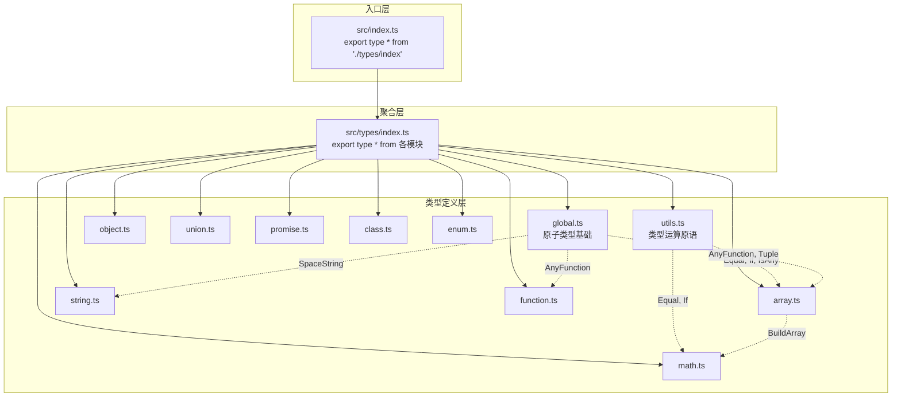

在 `@mudssky/jsutils` 中，类型系统并非运行时代码的附属品，而是与模块实现**并行演进的独立架构层**。项目将所有纯类型定义集中在 `src/types/` 目录下，按领域划分为 12 个类型文件；同时在 `test/types/` 中以 `.test-d.ts` 命名约定建立了一套编译期类型断言测试体系。本文将从**类型架构设计**、**核心工具类型实现剖析**、**类型测试方法论**三个维度，系统性地拆解这套类型系统的设计思路与工程实践。

Sources: [index.ts](src/types/index.ts#L1-L12), [index.ts](src/index.ts#L22-L22)

## 类型架构总览

类型定义按照「**基础 → 组合 → 领域**」的三层架构组织。最底层是 `global.ts` 中的原子类型别名（`AnyFunction`、`Tuple` 等），中间层是 `utils.ts` 中的类型运算原语（`Equal`、`IsAny`、`If` 等），最上层则是面向具体领域的数组、字符串、对象、数学等类型操作。所有类型通过 `src/types/index.ts` 的 `export type *` 聚合后，由主入口 `src/index.ts` 以 `export type * from './types/index'` 对外暴露，确保类型与运行时值在发布时干净分离。



### 模块职责矩阵

| 类型文件                             | 职责                       | 导出数量 | 依赖关系        |
| ------------------------------------ | -------------------------- | -------- | --------------- |
| [global.ts](src/types/global.ts)     | 原子基础类型别名           | 7        | 无（最底层）    |
| [utils.ts](src/types/utils.ts)       | 类型运算原语、测试断言工具 | 16       | → global        |
| [array.ts](src/types/array.ts)       | 元组/数组类型变换          | 15       | → global, utils |
| [string.ts](src/types/string.ts)     | 模板字面量字符串操作       | 17       | → global        |
| [object.ts](src/types/object.ts)     | Record 索引类型操作        | 10       | 无              |
| [math.ts](src/types/math.ts)         | 编译期正整数算术           | 8        | → array, utils  |
| [function.ts](src/types/function.ts) | 函数类型提取与变换         | 6        | → global        |
| [union.ts](src/types/union.ts)       | 联合/交叉类型转换          | 3        | 无              |
| [promise.ts](src/types/promise.ts)   | Promise 类型解包           | 3        | 无              |
| [class.ts](src/types/class.ts)       | Class 类型提取             | 1        | 无              |
| [enum.ts](src/types/enum.ts)         | 枚举辅助类型               | 4        | 无              |

Sources: [index.ts](src/types/index.ts#L1-L12), [global.ts](src/types/global.ts#L1-L50)

## 基础类型层：global.ts

`global.ts` 定义了整个类型系统的共享词汇表。这些类型别名看似简单，却是上层所有复杂类型操作的**类型约束基石**。例如 `Tuple<T>` 被用作 `Concat`、`Includes`、`Push` 等数组类型的泛型约束，确保传入的必须是只读元组而非任意对象；`AnyFunction` 则被 `DeepReadonly` 用于区分函数与普通对象，避免将函数误递归。

```typescript
// 基础类型约束
export type PropertyName = keyof any // 自适应 keyof 配置
export type AnyFunction = (...args: any) => any // 最宽松的函数类型
export type AnyConstructor = new (...args: any) => any // 构造器类型
export type Tuple<T = any> = readonly T[] // 只读元组约束
export type AnyObject = Record<string, any> // 对象字面量约束
export type SpaceString = ' ' | '\t' | '\n' // 空白字符联合类型
export interface Dictionary<T> {
  [index: string]: T
} // 索引签名接口
```

值得注意的是 `PropertyName` 使用 `keyof any` 而非硬编码 `string | number | symbol`，这是因为 TypeScript 的 `keyof` 语义会受 `KeyofStringsOnly` 编译选项影响——当该选项开启时 `keyof any` 仅为 `string`。使用 `keyof any` 让类型库自动适配下游项目的编译配置，而不是与之对抗。

Sources: [global.ts](src/types/global.ts#L1-L50)

## 类型运算原语：utils.ts

`utils.ts` 是整个类型系统的**运算核心**，提供了类型级别的比较、判断与控制流能力。这些工具类型既是项目内部类型实现的基础设施，也是类型测试的断言武器。

### Equal：精确的类型相等判断

`Equal` 是类型编程中最关键的原语之一。TypeScript 的 `extends` 只能判断子类型关系，无法判断两个类型是否完全相同——例如 `any extends string ? 1 : 2` 结果为联合类型 `1 | 2` 而非简单的 `1` 或 `2`。`Equal` 利用了一个精妙的技巧：**函数类型在处理 `any` 时具有特殊的行为**。

```typescript
export type Equal<X, Y> =
  (<T>() => T extends X ? 1 : 2) extends <T>() => T extends Y ? 1 : 2
    ? true
    : false
```

这个实现的原理是：当 `X` 或 `Y` 为 `any` 时，`T extends any ? 1 : 2` 会同时匹配 `1` 和 `2`（因为 `any` 既是所有类型的子类型也是所有类型的父类型），导致函数签名不匹配。通过将两个类型包装到泛型函数的条件类型中，`Equal` 能够区分 `any` 与 `unknown`、区分 `{ a: 1 } & { b: 2 }` 与 `{ a: 1; b: 2 }` 等微妙差异。在类型测试中，`Equal<A, B>` 配合 `assertType` 或 `Expect` 是验证类型行为正确性的核心手段。

Sources: [utils.ts](src/types/utils.ts#L28-L31)

### IsAny 与 any 类型检测

`any` 是 TypeScript 类型系统中唯一的**类型系统逃逸口**——它既是所有类型的子类型，也是所有类型的超类型。检测 `any` 需要利用其与交叉类型的特殊交互：

```typescript
export type IsAny<T> = 0 extends 1 & T ? true : false
```

正常情况下 `1 & string` 会变成 `never`（不存在的交叉），但 `1 & any` 的结果仍是 `any`。由于 `any` 可以被任何类型 extends，`0 extends any` 成立，而 `0 extends never` 不成立。这个模式源自 StackOverflow 上的经典回答，是处理 `any` 类型逃逸的标准方案。

Sources: [utils.ts](src/types/utils.ts#L46-L50)

### 条件控制与递归只读

`utils.ts` 还提供了类型级别的控制流与递归变换：

| 类型              | 签名                                  | 用途                                              |
| ----------------- | ------------------------------------- | ------------------------------------------------- |
| `If`              | `If<Condition extends boolean, T, F>` | 类型级三元表达式                                  |
| `IsNever`         | `IsNever<T>`                          | 检测 never（需 `[T] extends [never]` 避免分布式） |
| `IsTuple`         | `IsTuple<T>`                          | 区分元组与数组（通过 `length` 是否为 `number`）   |
| `DeepReadonly`    | `DeepReadonly<Obj>`                   | 递归添加 readonly，跳过函数类型                   |
| `Debug`           | `Debug<T>`                            | 强制 TypeScript 展开计算类型                      |
| `MergeInsertions` | `MergeInsertions<T>`                  | 递归合并交叉类型为单一对象                        |

`DeepReadonly` 是一个典型的递归类型模式——它通过条件判断区分「普通对象」和「函数」，对前者递归应用 `readonly`，对后者直接保留原类型。这种「递归 + 分支」的模式贯穿了整个类型库的实现：

```typescript
export type DeepReadonly<Obj extends Record<string, any>> = {
  readonly [Key in keyof Obj]: Obj[Key] extends object
    ? Obj[Key] extends AnyFunction // 函数不递归
      ? Obj[Key]
      : DeepReadonly<Obj[Key]> // 对象递归
    : Obj[Key] // 原始类型直接返回
}
```

Sources: [utils.ts](src/types/utils.ts#L92-L126)

## 数组类型变换：array.ts

数组/元组类型的变换是 TypeScript 类型编程中最具表现力的领域之一。`array.ts` 实现了 15 个元组操作类型，覆盖了从基础的 `First`/`Last` 提取到复杂的 `Chunk` 分组和 `TupleToNestedObject` 嵌套构造。

### 模式匹配提取

TypeScript 4.0 引入的可变元组语法 `[infer F, ...infer Rest]` 是数组类型编程的核心引擎。`First` 和 `Last` 利用这一语法从元组两端提取元素类型：

```typescript
export type First<T extends unknown[]> = T extends [infer F, ...unknown[]]
  ? F
  : never
export type Last<T extends unknown[]> = T extends [...unknown[], infer L]
  ? L
  : never
```

当元组为空时，模式匹配失败，返回 `never`——这在类型测试中通过 `declare const n: never` 配合 `assertType<First<[]>>(n)` 来验证。

### 递归元组变换

更复杂的操作如 `ReverseArr`、`RemoveArrItem`、`Chunk` 采用**尾递归累积器模式**——通过额外的泛型参数 `Result` 携带中间计算结果，每一步递归将一个元素从输入转移到输出：

```typescript
// 反转数组：每步取出头部，放入结果尾部
export type ReverseArr<Arr extends unknown[]> = Arr extends [
  infer First,
  ...infer Rest,
]
  ? [...ReverseArr<Rest>, First] // First 放到最后
  : Arr

// 分组：维护当前分组 CurItem 和已完成分组 Res
export type Chunk<
  Arr extends unknown[],
  ItemLen extends number,
  CurItem extends unknown[] = [],
  Res extends unknown[] = [],
> = Arr extends [infer First, ...infer Rest]
  ? CurItem['length'] extends ItemLen
    ? Chunk<Rest, ItemLen, [First], [...Res, CurItem]> // 满一组，入 Res
    : Chunk<Rest, ItemLen, [...CurItem, First], Res> // 累积 CurItem
  : [...Res, CurItem] // 剩余元素入 Res
```

`Includes` 类型则展示了如何将 `Equal` 嵌入递归中实现精确的元素存在性判断——它不使用 `extends` 直接比较（因为 `{ a: 'A' } extends { readonly a: 'A' }` 为 `true` 但二者并不相等），而是通过 `Equal<First, Item>` 确保严格类型匹配。

Sources: [array.ts](src/types/array.ts#L1-L189)

## 字符串模板类型：string.ts

TypeScript 4.1 引入的**模板字面量类型**（Template Literal Types）赋予了类型系统字符串级别的操作能力。`string.ts` 基于此实现了 17 个字符串类型操作，涵盖模式匹配、替换、大小写转换和类型转换。

### 模式匹配与替换

模板字面量的 `${infer Prefix}${From}${infer Suffix}` 语法实现了类型级别的字符串模式匹配。`Replace` 仅替换首次匹配，而 `ReplaceAll` 通过递归实现全局替换：

```typescript
export type ReplaceAll<
  Str extends string,
  From extends string,
  To extends string,
> = Str extends `${infer Prefix}${From}${infer Suffix}`
  ? `${Prefix}${To}${ReplaceAll<Suffix, From, To>}` // 递归替换剩余部分
  : Str
```

Trim 系列操作（`TrimLeft`、`TrimRight`、`Trim`）利用 `SpaceString` 联合类型 ` ' ' | '\t' | '\n'` 作为模式匹配的边界条件，递归消费空白字符直到遇到非空白内容。

### infer extends 语法与字面量类型转换

TypeScript 4.7 引入的 `infer ... extends` 语法让模板字面量能够直接推导出原始字面量类型：

```typescript
export type StrToNum<Str> = Str extends `${infer Num extends number}`
  ? Num
  : Str
export type StrToBoolean<Str> = Str extends `${infer Bool extends boolean}`
  ? Bool
  : Str
```

这意味着 `StrToNum<'123'>` 的结果不是泛化的 `number`，而是精确的字面量 `123`；`StrToBoolean<'false'>` 的结果是 `false` 而非 `boolean`。当无法匹配时（如 `StrToNum<'abc'>`），类型原样返回，实现了安全的类型转换。

### 分布式条件类型与排列组合

`AllCombinations` 是类型级别编程中最精妙的技巧之一。它利用 `A extends A` 触发**分布式条件类型**，将联合类型的每个成员逐一取出，再递归生成所有排列组合：

```typescript
export type AllCombinations<
  A extends string,
  B extends string = A,
> = A extends A ? Combination<A, AllCombinations<Exclude<B, A>>> : never
```

当 `A = 'a' | 'b' | 'c'` 时，`A extends A` 会将联合类型分配为三个分支 `'a'`、`'b'`、`'c'`，每个分支与剩余元素的排列组合拼接，最终生成 15 种组合。这种分布式特性是 TypeScript 类型系统中最强大但也最易引发困惑的特性。

Sources: [string.ts](src/types/string.ts#L1-L194)

## 编译期算术：math.ts

`math.ts` 展示了 TypeScript 类型系统的图灵完备性——通过**数组长度计数器**实现编译期的正整数算术运算。核心思想是：构建一个特定长度的数组，然后读取其 `['length']` 属性获得数字字面量类型。

### 加减乘除的实现

```typescript
// 加法：拼接两个数组，取长度
export type Add<Num1 extends number, Num2 extends number> = [
  ...BuildArray<Num1>,
  ...BuildArray<Num2>,
]['length']

// 减法：从被减数数组中匹配减数，取剩余部分长度
export type Subtract<Num1 extends number, Num2 extends number> =
  BuildArray<Num1> extends [...arr1: BuildArray<Num2>, ...arr2: infer Rest]
    ? Rest['length']
    : never

// 乘法：递归累加，Num2 次拼接 Num1 长度的数组
export type Mutiply<
  Num1,
  Num2,
  ResultArr extends unknown[] = [],
> = Num2 extends 0
  ? ResultArr['length']
  : Mutiply<Num1, Subtract<Num2, 1>, [...BuildArray<Num1>, ...ResultArr]>
```

`Fibonacci` 则是这套算术系统的集成验证——它通过 `FibonacciLoop` 递归维护「前一项数组」和「当前项数组」，每一步通过数组拼接实现加法，最终在目标索引处返回数组长度作为斐波那契数：

```typescript
export type FibonacciLoop<
  PrevArr extends unknown[], // 上一个数的数组表示
  CurrentArr extends unknown[], // 当前数的数组表示
  IndexArr extends unknown[], // 递增的索引
  Num extends number = 1,
> = IndexArr['length'] extends Num
  ? CurrentArr['length']
  : FibonacciLoop<
      CurrentArr,
      [...PrevArr, ...CurrentArr],
      [...IndexArr, unknown],
      Num
    >
```

Sources: [math.ts](src/types/math.ts#L1-L113)

## 对象索引类型操作：object.ts

`object.ts` 聚焦于 TypeScript 索引类型的高级操作——从 Record 中过滤、提取、变换键和值，以及递归路径提取。这些类型在实际业务中处理配置对象、API 响应类型变换时极为实用。

### 键的过滤与提取

`FilterRecordByValue` 使用 `as` 子句（Key Remapping）实现按值类型过滤键：

```typescript
export type FilterRecordByValue<Obj extends Record<string, any>, ValueType> = {
  [Key in keyof Obj as Obj[Key] extends ValueType ? Key : never]: Obj[Key]
}
```

`ExtractOptional` 和 `ExtractRequired` 则利用了一个精妙的技巧——**空对象 `{}` 是所有可选属性的子类型**。当 `{} extends Pick<Obj, Key>` 成立时，说明 `Key` 对应的属性是可选的（因为空对象可以赋值给只包含可选属性的类型）：

```typescript
export type ExtractOptional<Obj extends Record<string, any>> = {
  [Key in keyof Obj as Record<string, any> extends Pick<Obj, Key>
    ? Key
    : never]: Obj[Key]
}
```

### 路径提取与键变换

`AllKeyPath` 递归遍历嵌套对象，生成所有叶子节点的点号路径联合类型：

```typescript
export type AllKeyPath<Obj extends Record<string, any>> = {
  [Key in keyof Obj]: Key extends string
    ? Obj[Key] extends Record<string, any>
      ? Key | `${Key}.${AllKeyPath<Obj[Key]>}` // 递归拼接路径
      : Key
    : never
}[keyof Obj] // 立即索引获取联合类型
```

这使得 `{ a: { b: { b1: string } } }` 生成 `'a' | 'a.b' | 'a.b.b1'`，可用于构建类型安全的深层属性访问器。

Sources: [object.ts](src/types/object.ts#L1-L109)

## 联合类型高级操作：union.ts

`union.ts` 处理的是 TypeScript 类型系统中联合类型与交叉类型的深层变换，涉及**逆变**和**分布式条件类型**两个核心概念。

### UnionToIntersection：联合转交叉

将 `{ a: 1 } | { b: 1 }` 转为 `{ a: 1 } & { b: 1 }` 的关键在于函数参数的**逆变**性质。在 TypeScript 中，函数参数类型是逆变位置——如果 `A extends B`，那么 `(k: B) => void extends (k: A) => void`。利用这一点：

```typescript
export type UnionToIntersection<U> = (
  U extends any ? (k: U) => void : never
) extends (k: infer I) => void
  ? I
  : never
```

当 `U = A | B` 时，`U extends any` 触发分布式，生成 `(k: A) => void | (k: B) => void`。这个联合函数类型在 `extends (k: infer I) => void` 推断时，TypeScript 会将多个重载的参数取交集（逆变），最终 `I = A & B`。

### IsUnion：联合类型检测

判断一个类型是否为联合类型利用了分布式条件类型的「有和无」差异。`A extends A` 当 `A` 是联合类型时会触发分布式（每个成员分别处理），而 `[B] extends [A]` 不会触发。因此如果两者不相等，说明 `A` 是联合类型：

```typescript
export type IsUnion<A, B = A> = A extends A
  ? [B] extends [A]
    ? false
    : true
  : never
```

Sources: [union.ts](src/types/union.ts#L1-L47)

## 函数与 Promise 类型提取：function.ts 与 promise.ts

这两个模块提供了对函数签名和 Promise 链的类型解包能力，是处理高阶函数和异步代码类型安全的基础设施。

`function.ts` 中的 `AppendArgument` 展示了如何保持函数签名的完整性——通过 `infer` 提取参数列表和返回值类型，再用可变元组语法 `[...Args, Arg]` 追加新参数：

```typescript
export type AppendArgument<Func extends AnyFunction, Arg> = Func extends (
  ...args: infer Args
) => infer ReturnType
  ? (...args: [...Args, Arg]) => ReturnType
  : never
```

`promise.ts` 中的 `DeepPromiseType` 递归解包嵌套 Promise——当 `Promise<Promise<string>>` 这样的类型出现时，它会逐层 `infer` 直到抵达非 Promise 的值类型。同时，`DeepAwaited` 处理的是更广泛的 `PromiseLike`（任何具有 `then` 方法的对象），但其已标记为 `@deprecated`，因为 TypeScript 内置的 `Awaited` 提供了等效功能。

Sources: [function.ts](src/types/function.ts#L1-L68), [promise.ts](src/types/promise.ts#L1-L40)

## 类型测试方法论

### 测试架构与配置

项目的类型测试采用 Vitest 的 `--typecheck` 模式，测试文件以 `.test-d.ts` 后缀命名。在 `vitest.config.ts` 中通过 `typecheck.include` 配置项明确指定匹配模式：

```typescript
// vitest.config.ts
test: {
  typecheck: {
    include: ['test/types/**/*.test-d.ts'],
  }
}
```

对应的 npm 脚本体系提供了三个层级的测试命令：`test:types` 仅运行类型检查（`vitest --run --typecheck.only`），`test` 同时运行单元测试和类型检查（`vitest --run --typecheck`），`qa` 在并发模式下执行类型检查、lint、单元测试和类型测试四项质量门禁。

Sources: [vitest.config.ts](vitest.config.ts#L16-L18), [package.json](package.json#L75-L80)

### 类型断言的三种武器

项目中的类型测试依赖三种互补的断言技术：

**`assertType<T>(value)`** — Vitest 提供的编译期断言函数。它在编译期验证 `value` 的类型是否与 `T` 兼容，运行时不执行任何操作。这是最常用的正向断言：

```typescript
assertType<Equal<First<[3, 2, 1]>, 3>>(true) // 验证 First 返回 3
assertType<Add<3, 5>>(8) // 验证加法结果
assertType<ReplaceAll<'123333', '3', '4'>>('124444') // 验证替换结果
```

**`Equal<A, B>` 组合断言** — 对于返回布尔类型的工具类型（如 `Includes`、`IsUnion`），通过 `Equal<Result, Expected>` 双重包装确保精确匹配：

```typescript
assertType<Equal<Includes<[1, 2, 3], 2>, true>>(true)
assertType<Equal<IsUnion<'a' | 'b' | 'c'>, true>>(true)
```

**`@ts-expect-error` 注释** — TypeScript 编译器指令，确保**下一行代码必须产生类型错误**。这是反向断言，验证不合法的类型使用确实被拒绝：

```typescript
// @ts-expect-error not satisfy the constraint
assertType<Expect<false>>(true) // false 不满足 extends true

// @ts-expect-error not Array
assertType<First<'notArray'>>(n) // 字符串不是数组
```

Sources: [utils.test-d.ts](test/types/utils.test-d.ts#L15-L65), [array.test-d.ts](test/types/array.test-d.ts#L23-L33)

### 测试文件与源文件对应关系

每个类型定义文件都有严格对应的测试文件，测试粒度达到**每个导出类型至少一个测试用例**：

| 源文件                               | 测试文件                                            | 测试覆盖的类型数量                                           |
| ------------------------------------ | --------------------------------------------------- | ------------------------------------------------------------ |
| [utils.ts](src/types/utils.ts)       | [utils.test-d.ts](test/types/utils.test-d.ts)       | 7（Equal, IsAny, Alike, If, DeepReadonly, Expect, NotEqual） |
| [array.ts](src/types/array.ts)       | [array.test-d.ts](test/types/array.test-d.ts)       | 15（全覆盖）                                                 |
| [string.ts](src/types/string.ts)     | [string.test-d.ts](test/types/string.test-d.ts)     | 17（全覆盖）                                                 |
| [math.ts](src/types/math.ts)         | [math.test-d.ts](test/types/math.test-d.ts)         | 8（全覆盖）                                                  |
| [object.ts](src/types/object.ts)     | [object.test-d.ts](test/types/object.test-d.ts)     | 7（核心类型）                                                |
| [function.ts](src/types/function.ts) | [function.test-d.ts](test/types/function.test-d.ts) | 5（核心类型）                                                |
| [union.ts](src/types/union.ts)       | [union.test-d.ts](test/types/union.test-d.ts)       | 2（核心类型）                                                |
| [promise.ts](src/types/promise.ts)   | [promise.test-d.ts](test/types/promise.test-d.ts)   | 2（核心类型）                                                |
| [enum.ts](src/types/enum.ts)         | [enum.test-d.ts](test/types/enum.test-d.ts)         | 10+（含运行时类型交互）                                      |
| [class.ts](src/types/class.ts)       | [class.test-d.ts](test/types/class.test-d.ts)       | 1                                                            |

Sources: [utils.test-d.ts](test/types/utils.test-d.ts#L1-L86), [array.test-d.ts](test/types/array.test-d.ts#L1-L199)

### 类型测试中的特殊模式

**never 值声明**：对于返回 `never` 的边界情况（如空数组的 `First<[]>`），测试中声明 `declare const n: never` 或 `let n!: never` 作为断言值：

```typescript
declare const n: never
assertType<First<[]>>(n) // 空数组返回 never
```

**运行时与类型系统的桥梁**：枚举类型测试（[enum.test-d.ts](test/types/enum.test-d.ts)）展示了类型测试与运行时值的交互——通过 `as const` 断言的数组既能参与运行时计算，又能提供精确的字面量类型信息给 `ValueOf`、`LabelOf` 等类型提取器。

**已知不稳定标记**：`UnionToTuple` 的测试被注释掉，注释说明了「GitHub Actions 上类型测试未通过，本地偶尔报错」——这反映了 TypeScript 编译器在处理复杂递归类型时可能存在的不确定行为，也展示了务实的工程态度：**不稳定的类型断言宁可跳过也不引入 CI 噪音**。

Sources: [union.test-d.ts](test/types/union.test-d.ts#L10-L16), [enum.test-d.ts](test/types/enum.test-d.ts#L18-L31)

## 类型设计原则总结

基于对整个类型系统的考古分析，可以提炼出以下核心设计原则：

**第一，层次分明的基础设施**。`global.ts` → `utils.ts` → 领域类型的依赖链确保了每一层只依赖比自己更基础的类型，避免了循环依赖和不必要的耦合。`Equal` 和 `If` 这样的原语被广泛复用，而不是在每个文件中重复实现。

**第二，递归 + 累积器的统一模式**。从 `ReverseArr` 到 `Chunk` 到 `Fibonacci`，所有递归类型操作都遵循相同的三要素结构：匹配当前状态 → 递归处理剩余 → 累积器携带结果。这种一致性降低了理解成本。

**第三，`@public` 标注与 API 文档集成**。每个导出类型都标记了 `@public` JSDoc 标签，配合 `api-extractor.json` 的配置，这些类型定义会被自动提取到 API 文档中，确保类型系统与文档体系同步演进。

**第四，测试即文档**。类型测试文件不仅验证正确性，更充当了每个工具类型的**可编译示例**。开发者可以通过阅读 `assertType<Equal<Chunk<[1,2,3,4,5], 2>, [[1,2],[3,4],[5]]>>(true)` 直接理解 `Chunk` 的行为。

Sources: [index.ts](src/types/index.ts#L1-L12), [utils.ts](src/types/utils.ts#L1-L126)

## 延伸阅读

- 要了解运行时类型守卫（`isString`、`isEqual`、`isEmpty` 等）的实现与测试策略，参见 [类型守卫体系：isString、isEqual、isEmpty 等运行时类型判断](8-lei-xing-shou-wei-ti-xi-isstring-isequal-isempty-deng-yun-xing-shi-lei-xing-pan-duan)
- 要了解枚举系统中 `ValueOf`、`LabelOf` 等类型如何在运行时被消费，参见 [增强枚举系统：createEnum、O(1) 查找与链式匹配](10-zeng-qiang-mei-ju-xi-tong-createenum-o-1-cha-zhao-yu-lian-shi-pi-pei)
- 要了解类型测试如何融入整体 CI 流水线，参见 [测试体系：Vitest 单元测试、类型测试与构建产物冒烟测试](23-ce-shi-ti-xi-vitest-dan-yuan-ce-shi-lei-xing-ce-shi-yu-gou-jian-chan-wu-mou-yan-ce-shi)
- 要了解完整的构建产物类型声明生成流程，参见 [构建与打包：tsdown 多格式输出（ESM / CJS / UMD）配置详解](22-gou-jian-yu-da-bao-tsdown-duo-ge-shi-shu-chu-esm-cjs-umd-pei-zhi-xiang-jie)
