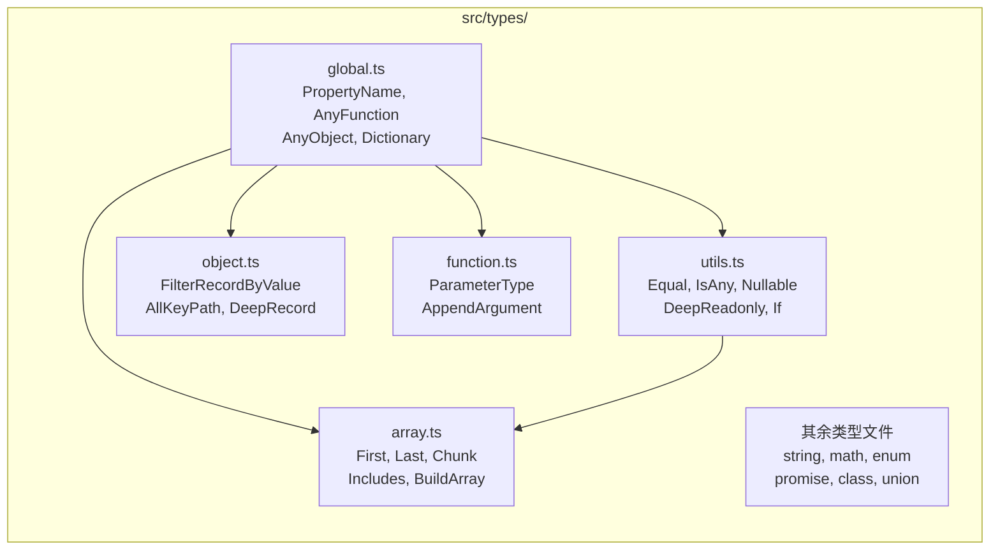

本文档是 `@mudssky/jsutils` 项目的完整结构导航图。你将了解源代码的组织方式、每个模块的职责边界、模块之间的依赖关系，以及测试与构建体系如何与源码对应。掌握这张"地图"后，你就能快速定位任何功能所在的文件，并理解修改某个模块可能影响的范围。

Sources: [index.ts](src/index.ts#L1-L23), [package.json](package.json#L1-L132)

## 顶层目录概览

项目根目录遵循**关注点分离**原则，将源码、测试、构建配置、文档、脚本等分置不同目录。下表列出了每个顶层路径的职责：

| 路径        | 职责                                           | 关键内容                                       |
| ----------- | ---------------------------------------------- | ---------------------------------------------- |
| `src/`      | **源代码**：所有运行时模块与类型定义           | `modules/`、`types/`、`style/`                 |
| `test/`     | **测试代码**：单元测试、类型测试、冒烟测试     | 与 `src/modules/` 一一对应                     |
| `scripts/`  | **工程脚本**：发布同步、构建产物冒烟测试       | `smoke-test.mjs`、`sync-release-artifacts.mjs` |
| `docs/`     | **工程文档**：头脑风暴、方案计划、解决方案记录 | `brainstorms/`、`plans/`、`solutions/`         |
| `examples/` | **使用示例**：HTML/Markdown 格式的功能演示     | 高亮器、日志器、存储模块示例                   |
| `vitedocs/` | **文档站点**：基于 VitePress 的 API 文档       | `.vitepress/config.ts`                         |
| `aidocs/`   | **AI 辅助文档**：功能设计说明                  | 高亮器、性能监控、装饰器说明                   |

配置文件按职责散布在根目录：`tsdown.config.ts`（构建）、`vitest.config.ts`（测试）、`biome.json`（格式化）、`eslint.config.mjs`（代码检查）、`.releaserc.cjs`（发布流程）等。

Sources: [package.json](package.json#L48-L87)

## 源代码架构总览

项目源码位于 `src/` 目录下，分为三个子体系：**运行时模块**（`src/modules/`）、**类型定义**（`src/types/`）和 **样式资源**（`src/style/`）。入口文件 `src/index.ts` 是唯一的聚合点，它通过 `export *` 将所有模块统一导出。

```mermaid
graph TB
    subgraph 入口
        INDEX["src/index.ts<br/>统一导出入口"]
    end

    subgraph 运行时模块 src/modules/
        direction TB
        CORE["核心工具"]
        DOMAIN["领域功能"]
        DOM_MOD["浏览器/DOM"]
        ADV["高级特性"]
        INFRA["工程辅助"]
    end

    subgraph 类型定义 src/types/
        TYPES["工具类型体系"]
    end

    subgraph 样式资源 src/style/
        STYLES["SCSS 样式"]
    end

    INDEX --> CORE
    INDEX --> DOMAIN
    INDEX --> DOM_MOD
    INDEX --> ADV
    INDEX --> INFRA
    INDEX -.->|export type *| TYPES

    CORE --- array["array.ts"]
    CORE --- string["string.ts"]
    CORE --- object["object.ts"]
    CORE --- function["function.ts"]
    CORE --- typed["typed.ts"]
    CORE --- fp["fp.ts"]
    CORE --- math["math.ts"]
    CORE --- lang["lang.ts"]
    CORE --- async["async.ts"]
    CORE --- error["error.ts"]

    DOMAIN --- enum["enum.ts"]
    DOMAIN --- storage["storage.ts"]
    DOMAIN --- logger["logger.ts"]
    DOMAIN --- regex["regex/"]
    DOMAIN --- bytes["bytes.ts"]
    DOMAIN --- env["env.ts"]

    DOM_MOD --- dom["dom/"]
    DOM_MOD --- style["style.ts"]

    ADV --- decorator["decorator.ts"]
    ADV --- performance["performance.ts"]
    ADV --- proxy["proxy.ts"]

    INFRA --- test["test.ts"]
    INFRA --- config["config/"]
```

上图展示了模块的**四层分类**。核心工具层无外部依赖，领域功能层依赖核心层，浏览器/DOM 层依赖正则等核心模块，高级特性层依赖函数增强与性能监控模块。这种分层确保了修改某个上层模块不会波及底层。

Sources: [index.ts](src/index.ts#L1-L23)

## 运行时模块详解

### 核心工具模块

核心工具模块是整个库的基础设施，提供最通用的数据处理能力。它们之间仅有少量内部引用（如 `array.ts` 引用 `typed.ts` 的类型守卫），对外零第三方依赖。

| 模块文件                               | 核心导出                                                                                                                                                                                | 功能概述                                                                                             |
| -------------------------------------- | --------------------------------------------------------------------------------------------------------------------------------------------------------------------------------------- | ---------------------------------------------------------------------------------------------------- |
| [array.ts](src/modules/array.ts)       | `range`、`rangeIter`、`createQuery`、`chunk`、`getSortDirection`、`sum`、`countBy`                                                                                                      | 数组范围生成、链式查询（filter/sort/groupBy）、分块、排序方向检测、聚合统计                          |
| [string.ts](src/modules/string.ts)     | `generateUUID`、`generateBase62Code`、`capitalize`、`camelCase`、`snake_case`、`kebabCase`、`pascalCase`、`getFileExtension`、`fuzzyMatch`、`genAllCasesCombination`、`numberToChinese` | 字符串大小写转换（5 种命名风格）、UUID/Base62 生成、文件扩展名提取、模糊匹配、数字转中文             |
| [object.ts](src/modules/object.ts)     | `pick`、`omit`、`pickBy`、`omitBy`、`mapKeys`、`mapValues`、`merge`、`removeNonSerializableProps`                                                                                       | 对象属性选取/剔除、键值映射、递归深度合并、JSON 序列化清理（移除函数/Symbol/循环引用）               |
| [function.ts](src/modules/function.ts) | `debounce`、`throttle`、`DebouncedFunction`、`ThrottledFunction`                                                                                                                        | 防抖（leading/trailing 可选）与节流（leading/trailing 可选），均支持 `cancel`/`flush`/`pending` 控制 |
| [typed.ts](src/modules/typed.ts)       | `isString`、`isNumber`、`isArray`、`isObject`、`isFunction`、`isDate`、`isPromise`、`isSymbol`、`isInt`、`isFloat`、`isPrimitive`、`isEmpty`、`isEqual`                                 | 13 个运行时类型守卫函数，`isEqual` 支持深度递归比较（含 Date/RegExp/嵌套对象）                       |
| [fp.ts](src/modules/fp.ts)             | `pipe`、`compose`、`curry`、`identity`、`Monad`                                                                                                                                         | 函数式编程工具：管道组合、反向组合、通用柯里化、恒等函数、Monad 函子（含 `map`/`flatMap`）           |
| [math.ts](src/modules/math.ts)         | `randomInt`、`getRandomItemFromArray`                                                                                                                                                   | 整数随机数生成（支持单参数 `[0, n)` 模式）、数组随机取值                                             |
| [lang.ts](src/modules/lang.ts)         | `getTag`                                                                                                                                                                                | 获取值的 `Object.prototype.toString` 标签，用于底层类型判断                                          |
| [async.ts](src/modules/async.ts)       | `sleepAsync`                                                                                                                                                                            | 异步延迟函数，返回 `Promise<void>`                                                                   |
| [error.ts](src/modules/error.ts)       | `ArgumentError`                                                                                                                                                                         | 自定义参数错误类，被 `array.ts`、`fp.ts`、`math.ts` 等模块使用                                       |

Sources: [typed.ts](src/modules/typed.ts#L1-L145), [fp.ts](src/modules/fp.ts#L1-L149), [error.ts](src/modules/error.ts#L1-L19), [async.ts](src/modules/async.ts#L1-L18)

### 领域功能模块

领域功能模块构建在核心工具之上，解决特定业务场景的问题。它们可能依赖核心模块或第三方库。

| 模块文件                             | 核心导出                                                                                      | 功能概述                                                                                                                                                |
| ------------------------------------ | --------------------------------------------------------------------------------------------- | ------------------------------------------------------------------------------------------------------------------------------------------------------- |
| [enum.ts](src/modules/enum.ts)       | `createEnum`、`EnumArray`、`EnumMatchBuilder`                                                 | 增强枚举系统：基于 `as const` 数组创建类型安全的枚举对象，O(1) 的 value/label 查找（内部 Map），链式匹配器（`match().value().labelIsIn()`），重复值检查 |
| [storage.ts](src/modules/storage.ts) | `AbstractStorage`、`WebLocalStorage`、`WebSessionStorage`                                     | 存储抽象层：统一接口（同步/异步方法），前缀命名空间隔离，可选内存缓存，JSON 自动序列化/反序列化                                                         |
| [logger.ts](src/modules/logger.ts)   | `Logger`、`LogLevel`、`LoggerOptions`                                                         | 分级日志系统：trace/debug/info/warn/error 五级过滤，可选格式化输出，上下文信息注入                                                                      |
| [regex/](src/modules/regex)          | `RegexChecker`、`escapeRegExp`、`getPasswordStrength`                                         | 正则工具集：常用模式校验（用户名/邮箱/手机号）、密码强度分析、正则特殊字符转义                                                                          |
| [bytes.ts](src/modules/bytes.ts)     | `Bytes`                                                                                       | 字节单位转换类：双向格式化（数字↔"1.5 MB"），支持千分位分隔、自定义精度、B/KB/MB/GB/TB/PB 全单位                                                        |
| [env.ts](src/modules/env.ts)         | `isBrowser`、`isNode`、`isWebWorker`、`getEnvironmentInfo`、`runInBrowser`、`runWithDocument` | 环境检测：多平台判断、安全执行包装（带 fallback）                                                                                                       |

其中 `storage.ts` 的 `WebLocalStorage` 和 `WebSessionStorage` 继承自 `AbstractStorage` 抽象类，实现了模板方法模式——公共的前缀处理和序列化逻辑在基类中，平台特定的读写操作在子类中。`enum.ts` 的 `EnumArray` 类继承了原生 `Array`，通过内部维护的 `Map<string, EnumArrayObj>` 和 `Map<string | number, EnumArrayObj>` 实现了 O(1) 的双向查找。

Sources: [enum.ts](src/modules/enum.ts#L1-L200), [storage.ts](src/modules/storage.ts#L1-L200), [env.ts](src/modules/env.ts#L1-L153)

### 浏览器与 DOM 模块

这组模块专用于浏览器环境，涉及 DOM 操作和样式处理。它们在非浏览器环境下使用时需要条件引入。

| 模块文件                                         | 核心导出      | 功能概述                                                                                                            |
| ------------------------------------------------ | ------------- | ------------------------------------------------------------------------------------------------------------------- |
| [dom/domHelper.ts](src/modules/dom/domHelper.ts) | `DOMHelper`   | DOM 链式操作类：元素查询、文本/属性/表单值读写、事件管理（on/off/once）、CSS 类切换、元素创建与样式设置             |
| [dom/highlighter/](src/modules/dom/highlighter)  | `Highlighter` | 文本高亮器：多关键词匹配、前进/后退导航、智能滚动定位、自定义高亮标签与样式、跳过指定标签（SCRIPT/STYLE 等）        |
| [style.ts](src/modules/style.ts)                 | `cn`          | CSS 类名合并函数：整合 `clsx`（条件类名）与 `tailwind-merge`（Tailwind 冲突解决），是本库唯一的运行时外部依赖消费者 |

`dom/` 是一个复合模块目录，通过 `dom/index.ts` 将 `domHelper` 和 `highlighter` 统一导出。`Highlighter` 内部依赖 `regex/utils.ts` 的 `escapeRegExp` 函数来安全处理用户输入的关键词。

Sources: [dom/index.ts](src/modules/dom/index.ts#L1-L3), [domHelper.ts](src/modules/dom/domHelper.ts#L1-L50), [style.ts](src/modules/style.ts#L1-L10)

### 高级特性模块

高级特性模块提供元编程和性能分析能力，适合在特定场景下使用。

| 模块文件                                     | 核心导出                               | 功能概述                                                                                                              |
| -------------------------------------------- | -------------------------------------- | --------------------------------------------------------------------------------------------------------------------- |
| [decorator.ts](src/modules/decorator.ts)     | `debounceMethod`、`performanceMonitor` | TypeScript 装饰器（stage 3 标准）：`debounceMethod` 为类方法添加防抖，`performanceMonitor` 自动采集方法执行时间与内存 |
| [performance.ts](src/modules/performance.ts) | `PerformanceMonitor`                   | 性能监控器：迭代测试（可配置预热次数）、内存追踪、多函数对比基准测试、统计摘要（平均/最小/最大/标准差）               |
| [proxy.ts](src/modules/proxy.ts)             | `singletonProxy`                       | Proxy 工具：将任意构造函数包装为单例模式，通过 `Proxy` 的 `construct` 拦截实现                                        |

`decorator.ts` 的两个装饰器分别依赖 `function.ts` 的 `debounce` 和 `performance.ts` 的 `PerformanceMonitor`，形成了清晰的模块复用链。

Sources: [decorator.ts](src/modules/decorator.ts#L1-L50), [performance.ts](src/modules/performance.ts#L1-L50), [proxy.ts](src/modules/proxy.ts#L1-L30)

### 工程辅助模块

| 模块文件                                         | 核心导出                | 功能概述                                                          |
| ------------------------------------------------ | ----------------------- | ----------------------------------------------------------------- |
| [test.ts](src/modules/test.ts)                   | `tableTest`、`TestCase` | 简易表驱动测试辅助函数，用于快速定义输入-期望测试用例             |
| [config/rollup.ts](src/modules/config/rollup.ts) | `vendorRollupOption`    | Vite/Rollup 分包策略配置：将 `node_modules` 打包为 `vendor` chunk |

Sources: [test.ts](src/modules/test.ts#L1-L24), [config/rollup.ts](src/modules/config/rollup.ts#L1-L24)

## 类型定义体系

`src/types/` 目录独立于运行时模块，专门存放**纯类型导出**。入口 `src/index.ts` 通过 `export type * from './types/index'` 将类型与值分离导出，确保打包时类型定义不会增加产物体积。



类型文件之间的依赖关系如上图所示。`global.ts` 定义了最基础的 `AnyFunction`、`PropertyName`、`AnyObject` 等类型，被几乎所有其他类型文件引用。`utils.ts` 提供了类型编程工具（如 `Equal`、`IsAny`），`array.ts` 的 `Includes` 类型依赖 `utils.ts` 的 `Equal` 来实现精确的元素判断。

Sources: [types/index.ts](src/types/index.ts#L1-L12), [types/global.ts](src/types/global.ts#L1-L50), [types/utils.ts](src/types/utils.ts#L1-L126)

## 样式资源

`src/style/scss/` 目录存放了与库配套的 SCSS 样式资源，不参与 TypeScript 编译，通过构建脚本的 `copy:style` 命令复制到产物目录：

| 路径                        | 内容                |
| --------------------------- | ------------------- |
| `scss/index.scss`           | 样式入口文件        |
| `scss/mixin/animation.scss` | 动画相关 mixin      |
| `scss/mixin/scroll.scss`    | 滚动条样式 mixin    |
| `scss/mixin/text.scss`      | 文本处理 mixin      |
| `scss/mixin/window.scss`    | 窗口相关 mixin      |
| `scss/tailwind/colors.scss` | Tailwind 自定义色板 |

Sources: [package.json](package.json#L52-L53)

## 模块间依赖关系

理解模块间的引用链对定位问题和评估修改影响至关重要。下图展示了主要模块之间的依赖方向：

```mermaid
graph TD
    error["error.ts<br/>ArgumentError"]
    typed["typed.ts<br/>类型守卫"]
    async["async.ts<br/>sleepAsync"]
    lang["lang.ts<br/>getTag"]

    array["array.ts"] --> typed
    array --> error
    fp["fp.ts"] --> error
    math["math.ts"] --> error

    function["function.ts<br/>debounce/throttle"] --> async
    object["object.ts<br/>pick/omit/merge"]
    string["string.ts"]

    enum["enum.ts<br/>createEnum"] --> object
    storage["storage.ts"] --> env["env.ts"]
    regex_utils["regex/utils.ts<br/>escapeRegExp"]
    regex_checker["regex/regexChecker.ts"] --> object

    dom_helper["dom/domHelper.ts"]
    highlighter["dom/highlighter"] --> regex_utils
    style["style.ts<br/>cn()"]
    decorator["decorator.ts"] --> function
    decorator --> performance["performance.ts"]
    proxy["proxy.ts"]

    logger["logger.ts"] --> object
    bytes["bytes.ts"]
```

从图中可以提炼出几条关键依赖链：**`decorator.ts` → `function.ts` → `async.ts`**（装饰器防抖依赖防抖函数，防抖函数使用异步延迟）；**`highlighter` → `regex/utils`**（高亮器依赖正则转义）；**`enum.ts` → `object.ts`**（枚举系统使用 `mapKeys`）。而 `typed.ts`、`error.ts`、`lang.ts` 作为叶子节点，被多个上游模块引用但不依赖其他业务模块。

Sources: [array.ts](src/modules/array.ts#L1-L5), [fp.ts](src/modules/fp.ts#L1-L4), [decorator.ts](src/modules/decorator.ts#L1-L8), [highlighter/index.ts](src/modules/dom/highlighter/index.ts#L1-L3)

## 测试目录结构

测试目录 `test/` 与源码模块一一对应，采用**镜像命名**规则：`src/modules/array.ts` 对应 `test/array.test.ts`。此外还有专门的类型测试目录 `test/types/`，使用 `.test-d.ts` 扩展名。

| 测试文件                        | 对应源模块                     | 测试类型     |
| ------------------------------- | ------------------------------ | ------------ |
| `test/array.test.ts`            | `modules/array.ts`             | 单元测试     |
| `test/string.test.ts`           | `modules/string.ts`            | 单元测试     |
| `test/object.test.ts`           | `modules/object.ts`            | 单元测试     |
| `test/function.test.ts`         | `modules/function.ts`          | 单元测试     |
| `test/typed.test.ts`            | `modules/typed.ts`             | 单元测试     |
| `test/fp.test.ts`               | `modules/fp.ts`                | 单元测试     |
| `test/enum.test.ts`             | `modules/enum.ts`              | 单元测试     |
| `test/storage.test.ts`          | `modules/storage.ts`           | 单元测试     |
| `test/logger.test.ts`           | `modules/logger.ts`            | 单元测试     |
| `test/regex.test.ts`            | `modules/regex/`               | 单元测试     |
| `test/bytes.test.ts`            | `modules/bytes.ts`             | 单元测试     |
| `test/env.test.ts`              | `modules/env.ts`               | 单元测试     |
| `test/decorator.test.ts`        | `modules/decorator.ts`         | 单元测试     |
| `test/performance.test.ts`      | `modules/performance.ts`       | 单元测试     |
| `test/proxy.test.ts`            | `modules/proxy.ts`             | 单元测试     |
| `test/math.test.ts`             | `modules/math.ts`              | 单元测试     |
| `test/lang.test.ts`             | `modules/lang.ts`              | 单元测试     |
| `test/dom/domHelper.test.ts`    | `modules/dom/domHelper.ts`     | 单元测试     |
| `test/dom/highlighter.test.ts`  | `modules/dom/highlighter/`     | 单元测试     |
| `test/dom/storage.test.ts`      | DOM 存储相关                   | 单元测试     |
| `test/types/array.test-d.ts`    | `types/array.ts`               | **类型测试** |
| `test/types/object.test-d.ts`   | `types/object.ts`              | **类型测试** |
| `test/types/function.test-d.ts` | `types/function.ts`            | **类型测试** |
| `test/types/string.test-d.ts`   | `types/string.ts`              | **类型测试** |
| `test/types/math.test-d.ts`     | `types/math.ts`                | **类型测试** |
| `test/types/enum.test-d.ts`     | `types/enum.ts`                | **类型测试** |
| `test/types/promise.test-d.ts`  | `types/promise.ts`             | **类型测试** |
| `test/types/class.test-d.ts`    | `types/class.ts`               | **类型测试** |
| `test/types/union.test-d.ts`    | `types/union.ts`               | **类型测试** |
| `test/types/utils.test-d.ts`    | `types/utils.ts`               | **类型测试** |
| `test/release-sync.test.mjs`    | `scripts/lib/release-sync.mjs` | 冒烟测试     |

测试体系分为三层：**单元测试**（`.test.ts`，验证运行时逻辑正确性）、**类型测试**（`.test-d.ts`，使用 `vitest --typecheck.only` 验证类型推导正确性）、**构建冒烟测试**（`scripts/smoke-test.mjs`，验证产物可正常导入使用）。Vitest 配置中的路径别名确保测试代码可以直接引用源文件。

Sources: [vitest.config.ts](vitest.config.ts#L1-L44)

## 构建产物映射

项目使用 **tsdown** 构建，配置文件 [tsdown.config.ts](tsdown.config.ts) 定义了三种输出格式：

| 格式    | 输出目录    | 特点                                         | 适用场景                            |
| ------- | ----------- | -------------------------------------------- | ----------------------------------- |
| **ESM** | `dist/esm/` | unbundle 模式保留模块结构，支持 Tree-shaking | 现代打包工具（Webpack/Vite/Rollup） |
| **CJS** | `dist/cjs/` | unbundle 模式，`.cjs`/`.d.cts` 扩展名        | Node.js 传统 `require()` 环境       |
| **UMD** | `dist/umd/` | 单文件打包，minified，内联所有依赖           | `<script>` 标签直接引入             |

`package.json` 的 `exports` 字段精确配置了条件导出路径，确保不同环境自动选择正确的格式和类型声明文件。`sideEffects: false` 标记告诉打包工具本库所有模块均可安全 Tree-shake。

Sources: [tsdown.config.ts](tsdown.config.ts#L1-L56), [package.json](package.json#L29-L47)

## 阅读导航

根据你的学习目标，推荐以下阅读路径：

- **想快速上手使用**：阅读 [快速开始：安装、引入与按需使用](2-kuai-su-kai-shi-an-zhuang-yin-ru-yu-an-xu-shi-yong) → 然后按需查阅具体模块指南
- **想深入理解核心工具**：[数组操作：range、chunk、排序、聚合与集合运算](4-shu-zu-cao-zuo-range-chunk-pai-xu-ju-he-yu-ji-he-yun-suan) → [字符串处理：大小写转换、模板解析、UUID 生成与数字转文字](5-zi-fu-chuan-chu-li-da-xiao-xie-zhuan-huan-mo-ban-jie-xi-uuid-sheng-cheng-yu-shu-zi-zhuan-wen-zi) → [对象操作：pick/omit、mapKeys/mapValues、深度合并与序列化清理](6-dui-xiang-cao-zuo-pick-omit-mapkeys-mapvalues-shen-du-he-bing-yu-xu-lie-hua-qing-li)
- **想了解工程化体系**：[构建与打包：tsdown 多格式输出（ESM / CJS / UMD）配置详解](22-gou-jian-yu-da-bao-tsdown-duo-ge-shi-shu-chu-esm-cjs-umd-pei-zhi-xiang-jie) → [测试体系：Vitest 单元测试、类型测试与构建产物冒烟测试](23-ce-shi-ti-xi-vitest-dan-yuan-ce-shi-lei-xing-ce-shi-yu-gou-jian-chan-wu-mou-yan-ce-shi) → [代码质量与 CI/CD：ESLint + Biome + Husky + Semantic Release 流水线](24-dai-ma-zhi-liang-yu-ci-cd-eslint-biome-husky-semantic-release-liu-shui-xian)
