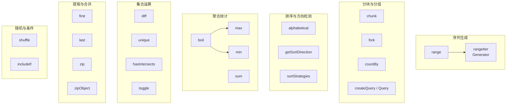
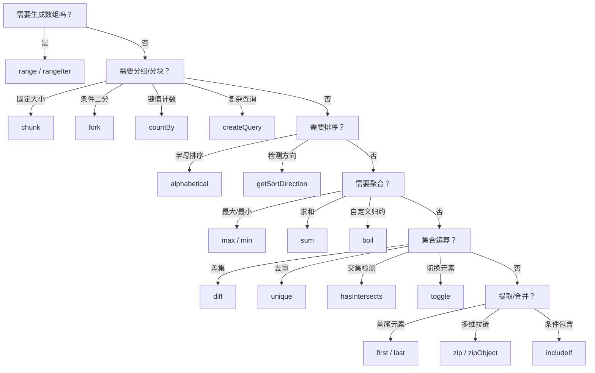

`@mudssky/jsutils` 的数组模块提供了 **22 个运行时函数**和 **16 个类型级别工具类型**，覆盖了从序列生成、分块切割、排序检测、聚合统计到集合运算的完整链路。所有函数均遵循 **空安全（null-safe）** 设计——传入 `null` 或 `undefined` 不会抛出异常，而是返回合理的默认值。这一设计哲学使得这些函数可以直接用在不确定数据来源的场景（如 API 响应解析、表单聚合），而不需要额外的防空判断。

Sources: [array.ts](src/modules/array.ts#L1-L622), [array.ts (types)](src/types/array.ts#L1-L189)

---

## 模块架构总览



上图中每一列对应一个功能域，`boil` 是 `max`/`min` 的底层归约引擎，`rangeIter` 是 `range` 的惰性生成器版本，`createQuery` 封装了 `where`/`sortBy`/`groupBy` 的链式查询模式。理解这些依赖关系有助于你在正确的抽象层级选择 API。

Sources: [array.ts](src/modules/array.ts#L595-L622)

---

## 序列生成：range 与 rangeIter

**`range`** 生成一个左闭右开 `[start, end)` 的整数数组，签名与 Python 的 `range()` 类似但参数语义略有不同。当只传入一个参数时，区间自动变为 `[0, start)`。

| 调用方式          | 等价语义                                  | 结果示例          |
| ----------------- | ----------------------------------------- | ----------------- |
| `range(5)`        | `[0, 5)` 步长 1                           | `[0, 1, 2, 3, 4]` |
| `range(1, 5)`     | `[1, 5)` 步长 1                           | `[1, 2, 3, 4]`    |
| `range(1, 7, 2)`  | `[1, 7)` 步长 2                           | `[1, 3, 5]`       |
| `range(5, 1, -1)` | `[5, 1)` 步长 -1                          | `[5, 4, 3, 2]`    |
| `range(5, 1)`     | `[5, 1)` 步长 1（正步长 + 终值 < 起始值） | `[]`              |

函数内部通过 `Array.from(rangeIter(...))` 实现，核心逻辑全在生成器 **`rangeIter`** 中。这意味着如果你不需要一次性拿到全部结果（例如遍历百万级序列），可以直接使用 `rangeIter` 获得惰性求值的 `Generator<number>`，显著降低内存占用。

```typescript
import { range, rangeIter } from '@mudssky/jsutils'

// 一次性生成数组
const pages = range(1, 11) // [1, 2, ..., 10]，用于分页器

// 惰性遍历——不分配整个数组
for (const num of rangeIter(0, 1_000_000)) {
  if (num % 100000 === 0) console.log(num)
}
```

**参数校验**：`step` 不能为 0（抛出 `ArgumentError`），所有参数必须为整数（小数抛出 `ArgumentError: unsupport decimal number`）。负步长时循环条件自动反转——`for (i = start; i > end; i += step)`——因此 `range(1, 5, -1)` 会返回空数组而非报错。

Sources: [array.ts](src/modules/array.ts#L6-L70), [error.ts](src/modules/error.ts#L1-L18)

---

## 分块与分组

### chunk — 固定尺寸切割

**`chunk`** 将数组按指定大小分割为若干子数组，最后一个子数组可能不满。默认 `size = 2`。

```typescript
import { chunk } from '@mudssky/jsutils'

chunk([1, 1, 1, 1, 1, 1, 1, 1]) // [[1,1], [1,1], [1,1], [1,1]]
chunk([1, 1, 1, 1, 1, 1, 1, 1, 1, 2, 2], 3)
// [[1,1,1], [1,1,1], [1,1,1], [2,2]]
```

实现上通过 `Math.ceil(length / size)` 预分配外层数组，再用 `Array.map` + `Array.slice` 一次性完成切割，避免了逐次 `push` 的开销。

Sources: [array.ts](src/modules/array.ts#L233-L244)

### fork — 条件二分

**`fork`** 根据一个布尔判断函数将数组一分为二，返回 `[满足条件, 不满足条件]` 的元组。适合将"通过/未通过"的元素分组。

```typescript
import { fork } from '@mudssky/jsutils'

const [xs, ys] = fork(
  [
    { name: 'ray', group: 'X' },
    { name: 'bo', group: 'Y' },
  ],
  (x) => x.group === 'X',
)
// xs → [{ name: 'ray', group: 'X' }]
// ys → [{ name: 'bo', group: 'Y' }]
```

Sources: [array.ts](src/modules/array.ts#L314-L335)

### countBy — 键值计数

**`countBy`** 对数组按 `identity` 函数生成的键进行分组计数，返回 `Record<TKey, number>`。在数据面板、统计报表等场景中非常实用。

```typescript
import { countBy } from '@mudssky/jsutils'

const people = [
  { name: 'ray', group: 'X' },
  { name: 'sara', group: 'X' },
  { name: 'bo', group: 'Y' },
]
countBy(people, (p) => p.group) // { X: 2, Y: 1 }
```

Sources: [array.ts](src/modules/array.ts#L246-L266)

### createQuery — LINQ 风格链式查询

**`createQuery`** 返回一个继承自 `Array` 的 `Query<T>` 实例，支持 `where`、`sortBy`、`groupBy` 三个链式方法，最终通过 `execute()` 触发计算。`Query` 类的设计灵感来自 .NET LINQ——将过滤、排序、分组三种操作组合成一个声明式管道。

```typescript
import { createQuery } from '@mudssky/jsutils'

const data = [
  { name: 'apple', category: 'fruit', price: 10 },
  { name: 'banana', category: 'fruit', price: 5 },
  { name: 'carrot', category: 'vegetable', price: 3 },
  { name: 'orange', category: 'fruit', price: 8 },
]

const result = createQuery(data)
  .where((item) => item.category === 'fruit' && item.price > 5)
  .sortBy('price')
  .groupBy('name')
  .execute()
// → {
//     orange: [{ name: 'orange', category: 'fruit', price: 8 }],
//     apple:  [{ name: 'apple',  category: 'fruit', price: 10 }]
//   }
```

**执行流程**：`where` 会注册多个 `Filter<T>`，`execute` 时用 `Array.every` 确保**所有**过滤器都满足；`sortBy` 支持多次调用（多字段排序）；`groupBy` 会将结果从 `T[]` 转变为 `Record<string, T[]>`。注意：`sortBy` 目前使用字符串比较 (`a[key] > b[key] ? 1 : -1`)，对数字排序可能不满足预期，建议对数字排序场景使用下文的 `alphabetical` 或自定义排序。


Sources: [array.ts](src/modules/array.ts#L76-L140)

---

## 排序与方向检测

### alphabetical — 字母排序

**`alphabetical`** 返回一个排序后的**新数组**（不修改原数组），通过 `localeCompare` 进行本地化字符串比较，支持升序/降序切换。

```typescript
import { alphabetical } from '@mudssky/jsutils'

const list = [{ name: 'Leo' }, { name: 'AJ' }, { name: 'Cynthia' }]

alphabetical(list, (i) => i.name)
// [{ name: 'AJ' }, { name: 'Cynthia' }, { name: 'Leo' }]

alphabetical(list, (i) => i.name, 'desc')
// [{ name: 'Leo' }, { name: 'Cynthia' }, { name: 'AJ' }]
```

传入 `null` 时安全返回 `[]`，不会崩溃。

Sources: [array.ts](src/modules/array.ts#L200-L215)

### getSortDirection — 排序方向检测

**`getSortDirection`** 检测一个**已排序**数组的排序方向，返回 `'asc'`、`'desc'` 或 `'none'`。它通过比较相邻元素的首对差异来快速判断方向——找到一个不一致即返回结果，时间复杂度 O(n) 最坏情况。

```typescript
import { getSortDirection } from '@mudssky/jsutils'

getSortDirection([1, 2, 3, 4]) // 'asc'
getSortDirection([4, 3, 2, 1]) // 'desc'
getSortDirection([]) // 'none'
getSortDirection([1]) // 'none'

// 自定义比较函数
const data = [
  { name: 'apple', price: 10 },
  { name: 'banana', price: 5 },
]
getSortDirection(data, (a, b) => a.price - b.price) // 'desc'
```

`sortStrategies` 导出了两个预置的比较策略 `defaultAsc` 和 `defaultDesc`，它们将值统一转为字符串后比较，适用于混合类型数组的通用排序。

Sources: [array.ts](src/modules/array.ts#L145-L198)

---

## 聚合统计

### boil — 归约竞争

**`boil`** 是一个通用的"竞争归约"函数——遍历数组，对每两个相邻元素执行 `compareFunc`，保留胜者。它是 `max` 和 `min` 的底层引擎。空数组或 `null` 输入返回 `null`。

```typescript
import { boil } from '@mudssky/jsutils'

const list = [
  { game: 'a', score: 100 },
  { game: 'b', score: 500 },
  { game: 'c', score: 300 },
]

// 找最大
boil(list, (a, b) => (a.score > b.score ? a : b))
// → { game: 'b', score: 500 }
```

Sources: [array.ts](src/modules/array.ts#L217-L231)

### max / min — 极值提取

**`max`** 和 **`min`** 是 `boil` 的高层封装，提供了多个函数重载以获得精确的类型推断。当作用于纯数字数组且数组非空时，返回 `number`；否则返回 `number | null`。作用于对象数组时，需要提供 `getter` 函数来提取比较依据，返回值是原始对象。

```typescript
import { max, min } from '@mudssky/jsutils'

max([5, 5, 10, 2]) // 10
min([5, 5, 10, 2]) // 2

const list = [
  { game: 'a', score: 100 },
  { game: 'e', score: 500 },
]
max(list, (x) => x.score) // { game: 'e', score: 500 }
min(list, (x) => x.score) // { game: 'a', score: 100 }
```

类型系统区分了 `readonly [number, ...number[]]`（保证至少一个元素）和 `readonly number[]`（可能为空），前者返回 `number`，后者返回 `number | null`，让你在编译期就能感知空值风险。

Sources: [array.ts](src/modules/array.ts#L359-L407)

### sum — 求和

**`sum`** 提供两个重载：纯数字数组直接求和；对象数组通过 `getter` 提取数值后求和。`null` 输入安全返回 `0`。

```typescript
import { sum } from '@mudssky/jsutils'

sum([5, 5, 10, 2]) // 22
sum([{ value: 5 }, { value: 10 }], (x) => x.value) // 15
sum(null as unknown as readonly number[]) // 0
```

Sources: [array.ts](src/modules/array.ts#L440-L461)

---

## 集合运算

### diff — 差集

**`diff`** 返回第一个数组中**不在**第二个数组中的元素，类似集合的 A − B。通过 `identity` 函数支持对象数组去重——默认使用引用相等，自定义 `identity` 后基于键值匹配。

```typescript
import { diff } from '@mudssky/jsutils'

diff(['a', 'b', 'c'], ['c', 'd', 'e']) // ['a', 'b']

// 对象数组——按 letter 字段判断
diff(
  [{ letter: 'a' }, { letter: 'b' }, { letter: 'c' }],
  [{ letter: 'c' }, { letter: 'd' }],
  (item) => item.letter,
)
// [{ letter: 'a' }, { letter: 'b' }]
```

实现原理：先将 `other` 数组通过 `identity` 构建为哈希表（`Record`），再用 `Array.filter` 过滤 `root`，复杂度 O(n + m)。边界处理：两侧均为空返回 `[]`，`root` 为空返回 `other` 的副本，`other` 为空返回 `root` 的副本。

Sources: [array.ts](src/modules/array.ts#L268-L290)

### unique — 去重

**`unique`** 通过键值去重，返回去重后的新数组。默认以元素自身为键（适用于基本类型），可通过 `toKey` 函数自定义去重依据。实现上使用 `reduce` 构建键值映射，保证**首次出现的元素优先保留**。

```typescript
import { unique } from '@mudssky/jsutils'

unique([1, 1, 2]) // [1, 2]

unique(
  [
    { id: 'a', word: 'hello' },
    { id: 'a', word: 'hello' },
    { id: 'b', word: 'oh' },
  ],
  (x) => x.id,
)
// [{ id: 'a', word: 'hello' }, { id: 'b', word: 'oh' }]
```

Sources: [array.ts](src/modules/array.ts#L541-L562)

### hasIntersects — 交集检测

**`hasIntersects`** 判断两个数组是否存在**任意**公共元素，返回布尔值。语义上等价于"交集是否非空"的快速短路检测——找到第一个匹配即返回 `true`。支持自定义 `identity` 函数，实现原理与 `diff` 相同（哈希表 + `Array.some`）。

```typescript
import { hasIntersects } from '@mudssky/jsutils'

hasIntersects(['a', 'b'], [1, 2, 'b', 'x']) // true
hasIntersects(['a', 'b', 'c'], ['x', 'y']) // false
hasIntersects([{ value: 23 }], [{ value: 12 }], (x) => x.value) // false
```

Sources: [array.ts](src/modules/array.ts#L338-L357)

### toggle — 切换元素

**`toggle`** 实现"存在则移除、不存在则添加"的切换逻辑，是复选框、标签选择器、过滤条件面板等 UI 交互的核心原语。

| 参数               | 说明                                             |
| ------------------ | ------------------------------------------------ |
| `list`             | 原数组                                           |
| `item`             | 要切换的元素                                     |
| `toKey`            | 可选，自定义匹配键函数                           |
| `options.strategy` | `'append'`（默认）或 `'prepend'`，添加时插入位置 |

```typescript
import { toggle } from '@mudssky/jsutils'

toggle(['a'], 'b') // ['a', 'b']  添加
toggle(['a', 'b'], 'b') // ['a']       移除
toggle(['a'], 'b', null, { strategy: 'prepend' }) // ['b', 'a'] 头部添加

// 对象数组用 toKey 匹配
toggle([{ value: 'a' }], { value: 'b' }, (v) => v.value)
// [{ value: 'a' }, { value: 'b' }]
```

Sources: [array.ts](src/modules/array.ts#L409-L438)

---

## 数组提取与合并

### first / last — 首尾取值

**`first`** 和 **`last`** 安全地获取数组首尾元素，数组为空或 `null` 时返回 `defaultValue`（默认 `undefined`）。省去了手动写 `arr?.[0] ?? fallback` 的样板代码。

```typescript
import { first, last } from '@mudssky/jsutils'

const list = [
  { game: 'a', score: 100 },
  { game: 'b', score: 200 },
]

first(list) // { game: 'a', score: 100 }
last(list) // { game: 'b', score: 200 }
first([], 'yolo') // 'yolo'
first(null) // null
```

Sources: [array.ts](src/modules/array.ts#L293-L312)

### zip — 多数组拉链

**`zip`** 将多个数组按索引位置合并，返回一个"转置"后的二维数组。提供 2~5 个数组的重载签名以获得精确的元组类型推断。

```typescript
import { zip } from '@mudssky/jsutils'

zip(['a', 'b'], [1, 2], [true, false])
// [['a', 1, true], ['b', 2, false]]
```

长度不等时，以最长的数组为基准，缺失位置填充 `undefined`。

Sources: [array.ts](src/modules/array.ts#L495-L539)

### zipObject — 键值对构造

**`zipObject`** 将键数组与值（或值数组、或生成函数）合并为对象。三种值模式让它在不同场景下灵活使用。

```typescript
import { zipObject } from '@mudssky/jsutils'

// 值数组
zipObject(['a', 'b'], [1, 2]) // { a: 1, b: 2 }

// 生成函数——接收 key 和 index
zipObject(['a', 'b'], (k, i) => k + i) // { a: 'a0', b: 'b1' }

// 固定值
zipObject(['a', 'b'], 1) // { a: 1, b: 1 }
```

Sources: [array.ts](src/modules/array.ts#L463-L493)

---

## 随机与条件工具

### shuffle — 随机洗牌

**`shuffle`** 返回随机打乱后的**新数组**，不修改原数组。实现方式是 Fisher-Yates 的变体——为每个元素附加随机权重后排序再剥离，简洁但非等概率分布（`Math.random` 产生的浮点数理论上可能重复）。对于严格均匀分布需求，建议使用 Knuth shuffle。

```typescript
import { shuffle } from '@mudssky/jsutils'

const list = [1, 2, 3, 4, 5]
const shuffled = shuffle(list)
// list 仍为 [1, 2, 3, 4, 5]，shuffled 为随机排列
```

Sources: [array.ts](src/modules/array.ts#L564-L573)

### includeIf — 条件包含

**`includeIf`** 根据布尔条件决定是否将值包含在数组中。`condition` 为 `true` 时返回值（单值包装为数组，已是数组则原样返回）；`false` 时返回空数组。常用于构建条件性的数组字面量，避免 `if/else` 破坏表达式的连贯性。

```typescript
import { includeIf } from '@mudssky/jsutils'

includeIf(true, 1) // [1]
includeIf(true, [1, 2]) // [1, 2]
includeIf(false, 1) // []
includeIf(false, [1, 2]) // []

// 实际应用：条件列配置
const columns = [
  { key: 'name', label: '名称' },
  ...includeIf(isAdmin, { key: 'admin_action', label: '管理操作' }),
]
```

Sources: [array.ts](src/modules/array.ts#L575-L594)

---

## 类型级别工具类型

除运行时函数外，`src/types/array.ts` 导出了一套 **TypeScript 类型级别**的数组工具类型。它们在编译期对元组进行变换和推导，适用于需要精确类型推断的高级场景。

| 类型工具                    | 功能                           | 示例                                                              |
| --------------------------- | ------------------------------ | ----------------------------------------------------------------- |
| `First<T>`                  | 获取元组首元素类型             | `First<[1, 2, 3]>` → `1`                                          |
| `Last<T>`                   | 获取元组末元素类型             | `Last<[1, 2, 3]>` → `3`                                           |
| `Length<T>`                 | 获取元组长度（字面量数字类型） | `Length<['a', 'b']>` → `2`                                        |
| `PopArray<T>`               | 移除末尾元素                   | `PopArray<[3, 2, 1]>` → `[3, 2]`                                  |
| `ShiftArray<T>`             | 移除首元素                     | `ShiftArray<[3, 2, 1]>` → `[2, 1]`                                |
| `Concat<A, B>`              | 拼接两个元组                   | `Concat<[1], [2]>` → `[1, 2]`                                     |
| `Push<T, U>`                | 尾部追加                       | `Push<[1], 2>` → `[1, 2]`                                         |
| `Unshift<T, U>`             | 头部追加                       | `Unshift<[1], 2>` → `[2, 1]`                                      |
| `Includes<Arr, Item>`       | 判断是否包含（严格相等）       | `Includes<[1, 2, 3], 2>` → `true`                                 |
| `Zip<A, B>`                 | 拉链两个元组                   | `Zip<[1, 2], ['a', 'b']>` → `[[1, 'a'], [2, 'b']]`                |
| `ReverseArr<T>`             | 反转元组                       | `ReverseArr<[3, 2, 1]>` → `[1, 2, 3]`                             |
| `RemoveArrItem<Arr, Item>`  | 移除所有匹配项                 | `RemoveArrItem<[3, 2, 1, 3], 3>` → `[2, 1]`                       |
| `BuildArray<N, Ele>`        | 创建定长同元素元组             | `BuildArray<3, 'a'>` → `['a', 'a', 'a']`                          |
| `Chunk<Arr, Size>`          | 编译期分块                     | `Chunk<[1,2,3,4,5], 2>` → `[[1,2],[3,4],[5]]`                     |
| `TupleToObject<T>`          | 元组转键值相等的对象           | `TupleToObject<['a', 'b']>` → `{ a: 'a', b: 'b' }`                |
| `TupleToNestedObject<T, V>` | 元组转嵌套对象                 | `TupleToNestedObject<['a','b'], number>` → `{ a: { b: number } }` |

**`Includes`** 类型使用递归逐项比较，结合 `Equal` 工具类型实现**严格类型相等**判断（区分 `boolean` 与 `true`、`{ a: 'A' }` 与 `{ readonly a: 'A' }` 等），这比 TypeScript 内置的 `includes` 类型推导更精确。

**`Chunk`** 是编译期对应运行时 `chunk` 函数的类型版本，通过递归条件类型逐步累充分组，让你在类型层面也能获得分块后的精确元组结构。

Sources: [array.ts (types)](src/types/array.ts#L1-L189), [array.test-d.ts](test/types/array.test-d.ts#L1-L199)

---

## API 速查表

下表汇总了所有运行时函数的签名与核心语义，供快速查阅。

| 函数               | 签名摘要                         | 返回值                   | 空值行为              |
| ------------------ | -------------------------------- | ------------------------ | --------------------- |
| `range`            | `(start, end?, step?)`           | `number[]`               | —                     |
| `rangeIter`        | `(start, end?, step?)`           | `Generator<number>`      | —                     |
| `chunk`            | `(list, size?)`                  | `T[][]`                  | —                     |
| `fork`             | `(list, condition)`              | `[T[], T[]]`             | `null` → `[[], []]`   |
| `countBy`          | `(list, identity)`               | `Record<K, number>`      | `null` → `{}`         |
| `createQuery`      | `(list)`                         | `Query<T>`               | —                     |
| `alphabetical`     | `(array, getter, dir?)`          | `T[]`                    | `null` → `[]`         |
| `getSortDirection` | `(sortedArr, compareFn?)`        | `SortDirection`          | ≤1 元素 → `'none'`    |
| `boil`             | `(array, compareFunc)`           | `T \| null`              | 空/null → `null`      |
| `max`              | `(array, getter?)`               | `T \| number \| null`    | 空/null → `null`      |
| `min`              | `(array, getter?)`               | `T \| number \| null`    | 空/null → `null`      |
| `sum`              | `(array, fn?)`                   | `number`                 | `null` → `0`          |
| `diff`             | `(root, other, identity?)`       | `T[]`                    | 双空 → `[]`           |
| `unique`           | `(array, toKey?)`                | `T[]`                    | —                     |
| `hasIntersects`    | `(listA, listB, identity?)`      | `boolean`                | 任一 `null` → `false` |
| `toggle`           | `(list, item, toKey?, options?)` | `T[]`                    | `null`+`null` → `[]`  |
| `first`            | `(array, defaultValue?)`         | `T \| null \| undefined` | `null` → `null`       |
| `last`             | `(array, defaultValue?)`         | `T \| null \| undefined` | `null` → `null`       |
| `zip`              | `(...arrays)`                    | `T[][]`                  | 空参数 → `[]`         |
| `zipObject`        | `(keys, values)`                 | `Record<K, V>`           | 空 keys → `{}`        |
| `shuffle`          | `(array)`                        | `T[]`                    | —                     |
| `includeIf`        | `(condition, value)`             | `T[]`                    | `false` → `[]`        |

Sources: [array.ts](src/modules/array.ts#L1-L622)

---

## 函数选择决策指南

当你面对一个具体的数组处理需求时，可参考以下决策路径选择合适的函数：



如果你正在构建一个涉及复杂数据流的管道，可以将本页的函数与 [函数式编程工具：pipe、compose、curry 与 Monad 函子](9-han-shu-shi-bian-cheng-gong-ju-pipe-compose-curry-yu-monad-han-zi) 结合使用，通过 `pipe` 将多个数组操作串联为声明式管道。如果需要对数组元素进行运行时类型判断后再分支处理，请参考 [类型守卫体系：isString、isEqual、isEmpty 等运行时类型判断](8-lei-xing-shou-wei-ti-xi-isstring-isequal-isempty-deng-yun-xing-shi-lei-xing-pan-duan)。对数组中对象属性的深度操作（如 pick/omit、mapValues）则在 [对象操作：pick/omit、mapKeys/mapValues、深度合并与序列化清理](6-dui-xiang-cao-zuo-pick-omit-mapkeys-mapvalues-shen-du-he-bing-yu-xu-lie-hua-qing-li) 中详细展开。
