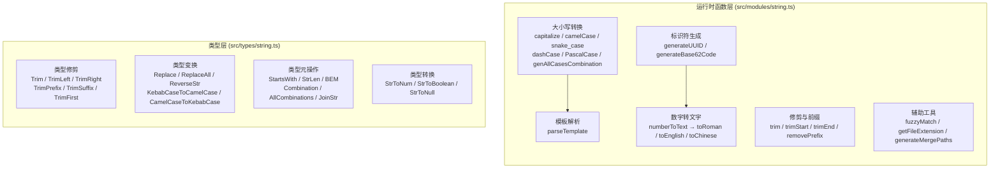
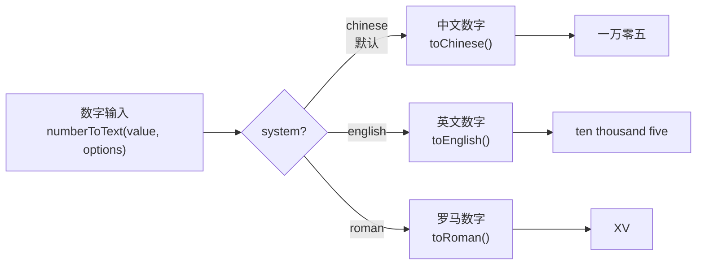

`@mudssky/jsutils` 的字符串模块提供了一套覆盖 **运行时转换** 与 **编译时类型推导** 的双层字符串工具链。运行时层包含命名格式互转（camelCase / snake_case / dashCase / PascalCase）、模板占位符解析、UUID 与 Base62 随机码生成、以及支持中英罗马三种数字系统的 `numberToText`；类型层则利用 TypeScript 模板字面量类型实现了 `Replace`、`Trim`、`ReverseStr`、`KebabCaseToCamelCase` 等编译期字符串变换。两层共享同一套命名直觉——运行时函数处理值，类型工具处理类型，协同覆盖前端开发中几乎所有字符串处理场景。

Sources: [string.ts](src/modules/string.ts#L1-L624), [types/string.ts](src/types/string.ts#L1-L194)

## 模块架构总览

字符串工具的内部组织遵循"单一职责 + 按功能域聚合"的原则。下方 Mermaid 图展示了所有导出函数与类型之间的逻辑分组关系：



所有运行时函数通过 `import { ... } from '@mudssky/jsutils'` 统一导出，类型工具则通过 `import type { ... } from '@mudssky/jsutils'` 引入。

Sources: [index.ts](src/index.ts#L18-L22), [string.ts](src/modules/string.ts#L604-L623)

## 大小写转换函数族

命名格式转换是字符串模块中函数最密集的功能域。六个函数覆盖了前端开发中最常见的四种命名约定（camelCase、snake_case、kebab-case、PascalCase），加上首字母大写（capitalize）和全排列组合生成（genAllCasesCombination）。

### 四种命名格式的转换矩阵

| 函数              | 输出示例                          | 典型场景                             |
| ----------------- | --------------------------------- | ------------------------------------ |
| `capitalize(str)` | `'hello world'` → `'Hello world'` | UI 标题、按钮文案                    |
| `camelCase(str)`  | `'hello world'` → `'helloWorld'`  | JS 对象属性、API 字段映射            |
| `snake_case(str)` | `'helloWorld'` → `'hello_world'`  | Python/Ruby API 对接、数据库列名     |
| `dashCase(str)`   | `'helloWorld'` → `'hello-world'`  | HTML 属性、CSS 类名、URL slug        |
| `PascalCase(str)` | `'hello world'` → `'HelloWorld'`  | React 组件名、TypeScript 类型/接口名 |

这些函数共享一个核心拆分策略：先用正则将大写字母序列替换为 `capitalize` 形式，再以大写字母前瞻位置或 `. - _ \s` 等分隔符进行 `split`，最后用 `reduce` 拼接成目标格式。这种统一策略保证了无论输入是哪种命名格式，都能被正确识别和转换。

Sources: [string.ts](src/modules/string.ts#L130-L246)

### capitalize — 首字母大写

`capitalize` 将字符串的第一个字符转为大写，其余字符统一转为小写。空字符串和 falsy 值安全返回 `''`。

```typescript
import { capitalize } from '@mudssky/jsutils'

capitalize('hello') // → 'Hello'
capitalize('hello Bob') // → 'Hello bob'（注意 "Bob" 被小写化）
capitalize('') // → ''
capitalize(null) // → ''
```

Sources: [string.ts](src/modules/string.ts#L141-L145)

### camelCase — 驼峰转换

`camelCase` 将各种分隔格式的字符串统一转为小驼峰（lowerCamelCase）。它通过复合正则 `/(?=[A-Z])|[.\-\s_]/` 同时识别大写字母边界和四种常见分隔符，确保混合格式输入也能正确处理。

```typescript
import { camelCase } from '@mudssky/jsutils'

camelCase('hello world') // → 'helloWorld'
camelCase('va va-VOOM') // → 'vaVaVoom'
camelCase('helloWorld') // → 'helloWorld'（已是驼峰则不变）
camelCase('hello_world') // → 'helloWorld'
camelCase('hello.world') // → 'helloWorld'
```

Sources: [string.ts](src/modules/string.ts#L159-L170)

### snake_case — 蛇形转换

`snake_case` 是 camelCase 的对偶函数，额外提供了 `splitOnNumber` 选项来控制是否在字母与数字之间插入下划线。默认启用此行为（`splitOnNumber` 为 `undefined` 时等同于 `true`），适配数据库列名中常见的 `"field_12"` 风格。

```typescript
import { snake_case } from '@mudssky/jsutils'

snake_case('hello world') // → 'hello_world'
snake_case('helloWorld') // → 'hello_world'
snake_case('hello-world12_19-bye') // → 'hello_world_12_19_bye'
snake_case('hello-world12_19-bye', { splitOnNumber: false })
// → 'hello_world12_19_bye'（字母与数字之间不插入下划线）
```

**注意**：函数名本身使用 `snake_case` 命名（而非 `snakeCase`），以与其输出格式语义保持一致。

Sources: [string.ts](src/modules/string.ts#L185-L204)

### dashCase — 短横线转换

`dashCase`（又称 kebab-case）生成以 `-` 连接的字符串，广泛用于 CSS 类名、HTML 属性和 URL 路径片段。

```typescript
import { dashCase } from '@mudssky/jsutils'

dashCase('hello world') // → 'hello-world'
dashCase('va va_VOOM') // → 'va-va-voom'
dashCase('helloWorld') // → 'hello-world'
dashCase('hello-world') // → 'hello-world'（已符合格式则不变）
```

Sources: [string.ts](src/modules/string.ts#L218-L229)

### PascalCase — 帕斯卡转换

`PascalCase`（大驼峰）将每个单词的首字母都大写，是 React 组件命名、TypeScript 接口命名的标准格式。它的拆分策略与前述函数略有不同——仅以 `[.\-\s_]` 作为分隔符（不包含大写字母边界），因为 PascalCase 场景中输入通常已经是分隔符分隔的短语。

```typescript
import { PascalCase } from '@mudssky/jsutils'

PascalCase('Exobase Starter_flash AND-go') // → 'ExobaseStarterFlashAndGo'
PascalCase('hello') // → 'Hello'
PascalCase('hello world') // → 'HelloWorld'
```

Sources: [string.ts](src/modules/string.ts#L242-L246)

### genAllCasesCombination — 全排列大小写组合

`genAllCasesCombination` 使用 **深度优先搜索（DFS）** 算法，对字符串中每个字母位置枚举大小写两种可能，生成所有排列组合。非字母字符保持不变。当输入长度为 _n_（含 _k_ 个字母）时，输出数组长度为 2^k。

```typescript
import { genAllCasesCombination } from '@mudssky/jsutils'

genAllCasesCombination('mb')
// → ['mb', 'mB', 'Mb', 'MB']（2² = 4 种）

genAllCasesCombination('k1b')
// → ['k1b', 'K1b', 'k1B', 'K1B']（数字 1 不参与排列）
```

**典型场景**：构建需要匹配多种大小写变体的查找表（如代码高亮关键词匹配、命令行参数别名映射）。

Sources: [string.ts](src/modules/string.ts#L14-L43)

## 模板解析：parseTemplate

`parseTemplate` 将模板字符串中的占位符替换为数据对象中的对应值，默认匹配 `{{placeholder}}` 格式，同时支持自定义正则表达式。

### 工作原理

函数通过 `String.prototype.matchAll(regex)` 提取所有匹配项，再用 `reduce` 逐个将 `match[0]`（完整匹配）替换为 `data[match[1]]`（捕获组对应的值）。这种实现保证了同一占位符可以多次出现且都能被替换。

```typescript
import { parseTemplate } from '@mudssky/jsutils'

// 默认 {{}} 占位符
const result = parseTemplate(
  'Hello {{name}}, welcome to {{place}}! Thank You - {{name}}',
  { name: 'World', place: 'our app' },
)
// → 'Hello World, welcome to our app! Thank You - World'

// 自定义 <> 占位符
const custom = parseTemplate(
  'Hi <user>, your id is <id>.',
  { user: 'Alex', id: '123' },
  /<(.+?)>/g,
)
// → 'Hi Alex, your id is 123.'
```

### 参数说明

| 参数    | 类型                  | 默认值             | 说明                                       |
| ------- | --------------------- | ------------------ | ------------------------------------------ |
| `str`   | `string`              | —                  | 包含占位符的模板字符串                     |
| `data`  | `Record<string, any>` | —                  | 键为占位符名称（不含括号），值为替换内容   |
| `regex` | `RegExp`              | `/\{\{(.+?)\}\}/g` | 用于匹配占位符的正则，第一个捕获组作为键名 |

**设计要点**：默认正则使用 `(.+?)` 非贪婪匹配，避免多个占位符被错误地合并为一个匹配。自定义正则也应遵循此模式。

Sources: [string.ts](src/modules/string.ts#L248-L278)

## UUID 与随机码生成

### generateUUID — UUID v4 生成

`generateUUID` 生成符合 RFC 4122 v4 规范的 UUID 字符串。它通过将模板字符串 `'xxxxxxxx-xxxx-4xxx-yxxx-xxxxxxxxxxxx'` 中的 `x` 和 `y` 替换为随机十六进制字符实现。其中 `4` 字段固定为版本号 4，`y` 字段（variant）的二进制高位固定为 `10`（通过 `(r & 0x3) | 0x8` 保证）。

```typescript
import { generateUUID } from '@mudssky/jsutils'

generateUUID() // → '3b241101-e2bb-4a7f-b124-288e0d5614c2'
```

**唯一性保障**：库的测试套件通过生成 100,000 个 UUID 并验证 `Set` 去重后长度不变来确保碰撞概率极低（基于 `Math.random()` 的 122 位随机性）。

Sources: [string.ts](src/modules/string.ts#L50-L56)

### generateBase62Code — Base62 随机码

`generateBase62Code` 生成指定长度的 Base62 随机字符串，字符集为 `0-9A-Za-z`（共 62 个字符）。默认长度为 6，适合生成短链编码、邀请码、临时令牌等场景。

```typescript
import { generateBase62Code } from '@mudssky/jsutils'

generateBase62Code() // → 'aB3x9K'（默认 6 位）
generateBase62Code(10) // → '7kP2mN9qR4'
generateBase62Code(1) // → 'Q'
generateBase62Code(0) // → ''（长度为 0）
generateBase62Code(-5) // → throw Error: 'len must be greater than 0'
```

| 参数  | 类型     | 默认值 | 说明                                       |
| ----- | -------- | ------ | ------------------------------------------ |
| `len` | `number` | `6`    | 生成字符串长度。`0` 返回空串；负数抛出异常 |

Sources: [string.ts](src/modules/string.ts#L58-L80)

## 数字转文字：numberToText

`numberToText` 是一个多系统数字转换器，通过 `system` 参数切换三种输出格式：



### 参数配置

| 参数             | 类型                                | 默认值      | 说明                                                           |
| ---------------- | ----------------------------------- | ----------- | -------------------------------------------------------------- |
| `value`          | `number`                            | —           | 要转换的数字，仅整数部分会被处理（`Math.trunc` 截断）          |
| `options.system` | `'chinese' \| 'english' \| 'roman'` | `'chinese'` | 转换系统                                                       |
| `options.useAnd` | `boolean`                           | `false`     | 英文模式下是否在百位后加 "and"（如 "one hundred **and** one"） |

三种系统均支持负数处理：中文加"负"前缀，英文加"minus"前缀，罗马数字加 `-` 前缀。

Sources: [string.ts](src/modules/string.ts#L410-L427)

### 中文数字（默认系统）

`toChinese` 采用 **四位分组法**（万、亿、兆），每组内部按千-百-十-个位逐级处理，自动插入"零"填补空位。一个关键细节是 `十` 的特殊处理——当十位为 1 且更高位都为 0 时（如 10-19 范围内的独立数字），省略前缀"一"直接输出"十"。

```typescript
import { numberToText } from '@mudssky/jsutils'

numberToText(0) // → '零'
numberToText(10) // → '十'（不是 '一十'）
numberToText(15) // → '十五'
numberToText(20) // → '二十'
numberToText(101) // → '一百零一'
numberToText(110) // → '一百一十'
numberToText(1005) // → '一千零五'
numberToText(10000) // → '一万'
numberToText(10005) // → '一万零五'
numberToText(1234567) // → '一百二十三万四千五百六十七'
numberToText(101000000) // → '一亿零一百万'
numberToText(-42) // → '负四十二'
```

**算法要点**：先将数字按每 4 位一组拆分（对应 `unitsBig` 的 `['', '万', '亿', '兆']`），然后从高位到低位拼接。跨组时如果低组值在 `(0, 1000)` 范围内，需要在前方插入"零"。

Sources: [string.ts](src/modules/string.ts#L540-L602)

### 英文数字

`toEnglish` 采用 **三位分组法**（thousand、million、billion、trillion），每组内部按百位-十位-个位处理。20 以下的数字直接查表，20 及以上的十位数用连字符拼接个位。

```typescript
import { numberToText } from '@mudssky/jsutils'

numberToText(0, { system: 'english' }) // → 'zero'
numberToText(21, { system: 'english' }) // → 'twenty-one'
numberToText(101, { system: 'english' }) // → 'one hundred one'
numberToText(101, { system: 'english', useAnd: true }) // → 'one hundred and one'
numberToText(1234567, { system: 'english' })
// → 'one million two hundred thirty-four thousand five hundred sixty-seven'
numberToText(-5, { system: 'english' }) // → 'minus five'
```

Sources: [string.ts](src/modules/string.ts#L461-L537)

### 罗马数字

`toRoman` 使用经典的 **贪心减法** 算法，遍历从大到小排列的罗马数字映射表 `[M, CM, D, CD, C, XC, L, XL, X, IX, V, IV, I]`，每次尽可能多地减去最大可匹配值。0 的表示为 `'N'`（拉丁语 _nulla_）。

```typescript
import { numberToText } from '@mudssky/jsutils'

numberToText(4, { system: 'roman' }) // → 'IV'
numberToText(9, { system: 'roman' }) // → 'IX'
numberToText(58, { system: 'roman' }) // → 'LVIII'
numberToText(1994, { system: 'roman' }) // → 'MCMXCIV'
numberToText(0, { system: 'roman' }) // → 'N'
```

Sources: [string.ts](src/modules/string.ts#L430-L458)

## 字符串修剪与前缀移除

`trim` / `trimStart` / `trimEnd` 是原生 `String.prototype.trim()` 的增强版本，支持自定义待移除字符集。`removePrefix` 则提供了安全的前缀剥离操作。

### 增强修剪函数

三个修剪函数共享相同的实现模式：将 `charsToTrim` 中的特殊字符进行正则转义（`[\W]` → `\\$&`），构建字符集正则 `[chars]+` 分别作用于开头、末尾或两端。

```typescript
import { trim, trimStart, trimEnd } from '@mudssky/jsutils'

// 默认移除空格（与原生 String.trim 相同）
trim('  hello  ') // → 'hello'

// 自定义字符集：字符集中的每个字符都会被匹配
trim('__hello__', '_') // → 'hello'
trim('-!-hello-!-', '-!') // → 'hello'（'-' 和 '!' 都会被移除）
trim('//repos////', '/') // → 'repos'

// 单方向修剪
trimStart('__hello__', '_') // → 'hello__'
trimEnd('__hello__', '_') // → '__hello'

// null / undefined 安全返回 ''
trim(null) // → ''
trimStart(undefined) // → ''
```

**与原生 trim 的关键差异**：`charsToTrim` 是一个字符**集合**而非字符串——`trim('abc', 'ac')` 会移除开头和结尾的所有 `a` 和 `c`，而非精确匹配 `"ac"` 子串。

Sources: [string.ts](src/modules/string.ts#L280-L349)

### removePrefix — 前缀移除

`removePrefix` 使用 `String.prototype.startsWith()` 检测前缀，匹配则用 `slice` 移除，不匹配则返回原字符串。比正则方案更安全、更高效。

```typescript
import { removePrefix } from '@mudssky/jsutils'

removePrefix('hello world', 'hello ') // → 'world'
removePrefix('__hello__', '__') // → 'hello__'
removePrefix('test', 'no') // → 'test'（前缀不存在，返回原串）
removePrefix(null, 'prefix') // → ''
removePrefix('test', '') // → 'test'
```

Sources: [string.ts](src/modules/string.ts#L365-L368)

## 辅助工具函数

### fuzzyMatch — 模糊匹配

`fuzzyMatch` 构建一个带 `i` 标志（忽略大小写）的 `RegExp` 来检测 `searchValue` 是否出现在 `targetString` 中。适用于搜索框实时过滤、列表项高亮等场景。

```typescript
import { fuzzyMatch } from '@mudssky/jsutils'

fuzzyMatch('jk', 'jkl;djaksl') // → true
fuzzyMatch('jkk', 'jkl;djaksl') // → false
fuzzyMatch('jK', 'jkl;djaksl') // → true（忽略大小写）
```

**注意**：`searchValue` 会直接作为正则模式使用，如果包含正则元字符（如 `.`、`*`、`+`）会被解释为正则语法。如需纯文本匹配，请先用正则转义处理。

Sources: [string.ts](src/modules/string.ts#L88-L91)

### getFileExtension — 文件扩展名提取

`getFileExtension` 提取文件路径的最后一个 `.` 之后的扩展名，返回小写且不含点号的结果。对隐藏文件（`.bashrc`）、无扩展名（`filename`）、尾部点号（`file.`）等情况均安全返回空字符串。

```typescript
import { getFileExtension } from '@mudssky/jsutils'

getFileExtension('document.pdf') // → 'pdf'
getFileExtension('archive.tar.gz') // → 'gz'
getFileExtension('.bashrc') // → ''（隐藏文件无扩展名）
getFileExtension('filename') // → ''
getFileExtension('file.name.with.multiple.dots.txt') // → 'txt'
getFileExtension('image.JPEG') // → 'jpeg'（统一小写）
```

> `getFileExt` 是 `getFileExtension` 的已弃用别名，功能完全相同。

Sources: [string.ts](src/modules/string.ts#L98-L128)

### generateMergePaths — Git 分支合并路径

`generateMergePaths` 将一组有序的分支名称数组转换为相邻分支对的合并路径列表。这是为 CI/CD 自动化合并流程设计的辅助函数。

```typescript
import { generateMergePaths } from '@mudssky/jsutils'

generateMergePaths(['feature', 'dev', 'test', 'prod'])
// → [['feature', 'dev'], ['dev', 'test'], ['test', 'prod']]

generateMergePaths(['dev', 'main'])
// → [['dev', 'main']]

generateMergePaths(['main'])
// → []（不足两个分支，返回空数组）
```

Sources: [string.ts](src/modules/string.ts#L384-L393)

## 类型级字符串工具

除了运行时函数，`@mudssky/jsutils` 还通过 `src/types/string.ts` 导出了一套基于 TypeScript **模板字面量类型**（Template Literal Types）的编译期字符串变换工具。这些类型在类型推断、条件类型分支和泛型约束中极为有用。

### 字符串修剪类型

| 类型             | 功能         | 示例                           |
| ---------------- | ------------ | ------------------------------ |
| `TrimLeft<Str>`  | 移除左侧空白 | `TrimLeft<'  abc'>` → `'abc'`  |
| `TrimRight<Str>` | 移除右侧空白 | `TrimRight<'abc  '>` → `'abc'` |
| `Trim<Str>`      | 移除两侧空白 | `Trim<' abc  '>` → `'abc'`     |

其中空白定义为 `SpaceString = ' ' \| '\t' \| '\n'`（来自 [global.ts](src/types/global.ts#L29)），`Trim` 组合了 `TrimRight<TrimLeft<Str>>`。

Sources: [types/string.ts](src/types/string.ts#L55-L73)

### 字符串替换类型

| 类型                        | 功能         | 示例                                          |
| --------------------------- | ------------ | --------------------------------------------- |
| `Replace<Str, From, To>`    | 替换首个匹配 | `Replace<'123333', '3', '4'>` → `'124333'`    |
| `ReplaceAll<Str, From, To>` | 替换所有匹配 | `ReplaceAll<'123333', '3', '4'>` → `'124444'` |

`ReplaceAll` 通过递归类型实现——每次替换首个匹配后，对剩余后缀继续递归调用，直到无法匹配为止。

Sources: [types/string.ts](src/types/string.ts#L17-L36)

### 命名格式互转类型

| 类型                        | 功能                   | 示例                                       |
| --------------------------- | ---------------------- | ------------------------------------------ |
| `KebabCaseToCamelCase<Str>` | kebab-case → camelCase | `'who-is-your-daddy'` → `'whoIsYourDaddy'` |
| `CamelCaseToKebabCase<Str>` | camelCase → kebab-case | `'whoIsYourDaddy'` → `'who-is-your-daddy'` |

`CamelCaseToKebabCase` 通过递归检查每个字符是否为大写（`First extends Lowercase<First>` 判断），大写则插入 `-` 前缀并转为小写。

Sources: [types/string.ts](src/types/string.ts#L133-L147)

### 元操作与组合类型

| 类型                             | 功能           | 示例                                                           |
| -------------------------------- | -------------- | -------------------------------------------------------------- |
| `StartsWith<Str, Prefix>`        | 前缀判断       | `StartsWith<'1234', '123'>` → `true`                           |
| `StrLen<Str>`                    | 计算字符串长度 | `StrLen<'1234'>` → `4`                                         |
| `ReverseStr<Str>`                | 反转字符串     | `ReverseStr<'1234'>` → `'4321'`                                |
| `TrimPrefix<Str, Prefix>`        | 移除前缀       | `TrimPrefix<'abc', 'ab'>` → `'c'`                              |
| `TrimSuffix<Str, Suffix>`        | 移除后缀       | `TrimSuffix<'abc', 'bc'>` → `'a'`                              |
| `TrimFirst<Str>`                 | 移除首字符     | `TrimFirst<'abc'>` → `'bc'`                                    |
| `JoinStr<Items, Delimiter>`      | 元组拼接       | `JoinStr<['a','b','c'], '-'>` → `'a-b-c'`                      |
| `BEM<Block, Element, Modifiers>` | BEM 命名       | `BEM<'btn', ['icon'], ['disabled']>` → `'btn__icon--disabled'` |
| `AllCombinations<A>`             | 全排列组合     | `AllCombinations<'a' \| 'b'>` → `'a' \| 'b' \| 'ab' \| 'ba'`   |

**`AllCombinations` 的实现精髓**：利用 `A extends A` 触发分布式条件类型（当条件类型左边是联合类型时自动展开），将每个字面量类型与剩余类型的排列组合递归拼接，最终得到所有可能的字符串排列。

Sources: [types/string.ts](src/types/string.ts#L8-L128)

### 字面量类型转换

| 类型                | 功能              | 示例                            |
| ------------------- | ----------------- | ------------------------------- |
| `StrToNum<Str>`     | 字符串 → 数字类型 | `StrToNum<'123'>` → `123`       |
| `StrToBoolean<Str>` | 字符串 → 布尔类型 | `StrToBoolean<'true'>` → `true` |
| `StrToNull<Str>`    | 字符串 → null     | `StrToNull<'null'>` → `null`    |

这三个类型使用 TypeScript 4.7 引入、4.8 完善的 `infer extends` 语法（如 `Str extends \`${infer Num extends number}\``），让编译器自动将匹配的字面量字符串推导为对应的字面量类型。不匹配时返回原类型不变。

Sources: [types/string.ts](src/types/string.ts#L175-L194)

## 完整 API 速查表

| 函数 / 类型              | 签名                                | 一句话描述               |
| ------------------------ | ----------------------------------- | ------------------------ |
| `capitalize`             | `(str: string) => string`           | 首字母大写，其余小写     |
| `camelCase`              | `(str: string) => string`           | 转为小驼峰命名           |
| `snake_case`             | `(str: string, options?) => string` | 转为蛇形命名             |
| `dashCase`               | `(str: string) => string`           | 转为短横线命名           |
| `PascalCase`             | `(str: string) => string`           | 转为大驼峰命名           |
| `genAllCasesCombination` | `(str: string) => string[]`         | 枚举所有大小写排列组合   |
| `parseTemplate`          | `(str, data, regex?) => string`     | 模板占位符替换           |
| `generateUUID`           | `() => string`                      | 生成 UUID v4             |
| `generateBase62Code`     | `(len?) => string`                  | 生成 Base62 随机码       |
| `numberToText`           | `(value, options?) => string`       | 数字转文字（中/英/罗马） |
| `trim`                   | `(str, chars?) => string`           | 双端字符修剪             |
| `trimStart`              | `(str, chars?) => string`           | 前端字符修剪             |
| `trimEnd`                | `(str, chars?) => string`           | 末端字符修剪             |
| `removePrefix`           | `(str, prefix) => string`           | 安全前缀移除             |
| `fuzzyMatch`             | `(search, target) => boolean`       | 忽略大小写模糊匹配       |
| `getFileExtension`       | `(filename) => string`              | 文件扩展名提取           |
| `generateMergePaths`     | `(branches) => string[][]`          | 分支合并路径生成         |

Sources: [string.ts](src/modules/string.ts#L604-L623)

## 延伸阅读

- 如果你需要深入了解对象属性名的批量变换（如将 API 响应从 snake_case 映射为 camelCase），请参考 [对象操作：pick/omit、mapKeys/mapValues、深度合并与序列化清理](6-dui-xiang-cao-zuo-pick-omit-mapkeys-mapvalues-shen-du-he-bing-yu-xu-lie-hua-qing-li)。
- 正则相关的字符串校验和密码强度分析在 [正则表达式工具：常用模式校验、密码强度分析与字符转义](13-zheng-ze-biao-da-shi-gong-ju-chang-yong-mo-shi-xiao-yan-mi-ma-qiang-du-fen-xi-yu-zi-fu-zhuan-yi) 中单独介绍。
- 类型系统的更多高级用法请参考 [类型系统设计：工具类型定义与 TypeScript 类型测试最佳实践](25-lei-xing-xi-tong-she-ji-gong-ju-lei-xing-ding-yi-yu-typescript-lei-xing-ce-shi-zui-jia-shi-jian)。
