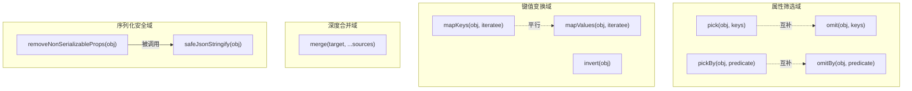
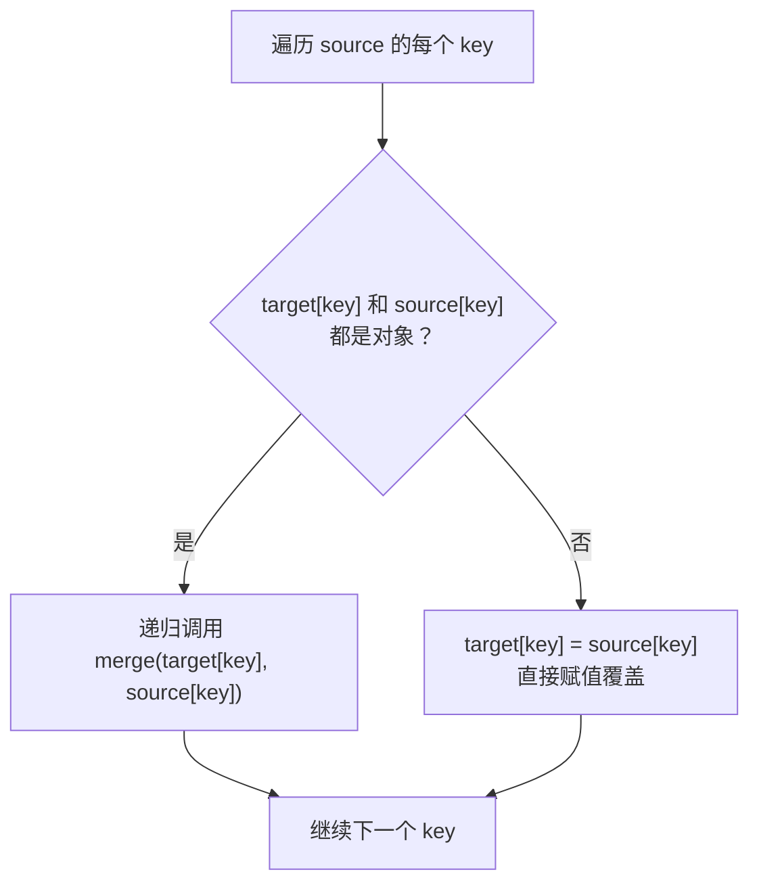

对象是 JavaScript 中最核心的数据结构，但原生 API 在对象属性筛选、键值变换、深度合并等场景中往往力不从心。`@mudssky/jsutils` 的 `object` 模块提供了一套完整的对象操作工具函数，覆盖**属性选取与剔除**、**键值映射**、**递归深度合并**、**序列化安全清理**和**键值反转**五大能力域。所有函数均为纯函数（`merge` 除外，它会修改 target），对 `null`/`undefined` 输入做了防御性处理，并通过 TypeScript 泛型约束保证类型安全。

Sources: [object.ts](src/modules/object.ts#L1-L267), [index.ts](src/index.ts#L13)

## 功能架构总览

本模块的 10 个导出函数可以划分为五个能力域，各司其职又相互配合：



| 能力域     | 函数                         | 核心用途                    | 纯函数         |
| ---------- | ---------------------------- | --------------------------- | -------------- |
| 属性筛选   | `pick` / `omit`              | 按键名白名单/黑名单提取子集 | ✅             |
| 属性筛选   | `pickBy` / `omitBy`          | 按谓词函数条件筛选          | ✅             |
| 键值变换   | `mapKeys`                    | 变换对象的键名              | ✅             |
| 键值变换   | `mapValues`                  | 变换对象的值                | ✅             |
| 键值变换   | `invert`                     | 键值对反转                  | ✅             |
| 深度合并   | `merge`                      | 多源对象递归合并            | ❌ 修改 target |
| 序列化安全 | `removeNonSerializableProps` | 清理不可 JSON 序列化的属性  | ✅             |
| 序列化安全 | `safeJsonStringify`          | 安全执行 `JSON.stringify`   | ✅             |

Sources: [object.ts](src/modules/object.ts#L255-L266)

## 属性选取与剔除：pick / omit 家族

### pick：按键名白名单提取

`pick` 从源对象中选取指定键名列表对应的属性，返回一个**新对象**。它的行为类似 lodash 的 `_.pick`，但类型签名更严格——通过 `Pick<T, K>` 泛型约束，返回值的类型精确地只包含被选取的键。

```typescript
import { pick } from '@mudssky/jsutils'

const user = {
  name: 'Alice',
  age: 30,
  email: 'alice@example.com',
  role: 'admin',
}

// 只保留 name 和 email
const publicProfile = pick(user, ['name', 'email'])
// => { name: 'Alice', email: 'alice@example.com' }
// TypeScript 类型自动推导为 Pick<typeof user, 'name' | 'email'>
```

实现上有两个值得注意的设计细节。第一，`obj` 参数接受 `T | undefined | null` 联合类型，当传入 `null` 或 `undefined` 时直接返回空对象，避免运行时抛错。第二，遍历 `keys` 数组时使用 `key in obj` 做存在性检查，而非直接访问——这意味着如果源对象上不存在某个键，该键会被静默跳过而非填入 `undefined`。

Sources: [object.ts](src/modules/object.ts#L12-L26)

### pickBy：按谓词函数条件筛选

当筛选条件无法用静态键名列表表达时，`pickBy` 允许传入一个谓词函数来逐属性判断。**默认谓词**会对值做 `!!value` 真值检查——即自动剔除 `null`、`undefined`、`false`、`0`、`''` 等 falsy 值对应的属性。

```typescript
import { pickBy } from '@mudssky/jsutils'

const config = { host: 'localhost', port: 0, debug: false, timeout: 5000 }

// 默认谓词：保留所有真值属性
pickBy(config)
// => { host: 'localhost', timeout: 5000 }

// 自定义谓词：只保留字符串类型的值
pickBy(config, (value) => typeof value === 'string')
// => { host: 'localhost' }
```

遍历策略使用 `for...in` + `Object.prototype.hasOwnProperty.call`，确保只处理对象自身的可枚举属性，不会误拾原型链上的属性。

Sources: [object.ts](src/modules/object.ts#L36-L57)

### omit：按键名黑名单剔除

`omit` 是 `pick` 的互补操作——传入要**排除**的键名列表，保留其余所有属性。返回类型通过 `Omit<T, K>` 精确反映剔除后的结构。

```typescript
import { omit } from '@mudssky/jsutils'

const response = {
  id: 1,
  name: 'Product',
  createdAt: '2024-01-01',
  _internal: true,
}

// 剔除内部字段，对外暴露干净的 DTO
const publicDto = omit(response, ['_internal'])
// => { id: 1, name: 'Product', createdAt: '2024-01-01' }
```

`keys` 参数默认值为空数组 `[]`，因此 `omit(obj)` 不传第二参数时返回源对象的浅拷贝。

Sources: [object.ts](src/modules/object.ts#L65-L85)

### omitBy：按谓词函数条件剔除

`omitBy` 是 `pickBy` 的互补操作，实现上直接复用 `pickBy` 并对谓词结果取反：

```typescript
import { omitBy } from '@mudssky/jsutils'

const data = { a: 1, b: null, c: 3, d: false, e: undefined }

// 默认谓词：剔除所有 falsy 值的属性
omitBy(data)
// => { b: null, d: false, e: undefined }
```

这种「**反向复用**」的实现模式（`omitBy` 内部调用 `pickBy` 并取反谓词）体现了函数式编程中的**组合复用**思想——两个互逆操作共享同一套遍历逻辑，减少了代码重复和维护成本。

Sources: [object.ts](src/modules/object.ts#L94-L101)

### pick 与 omit 的选择决策

| 场景                   | 推荐函数 | 原因                                 |
| ---------------------- | -------- | ------------------------------------ |
| 明确知道需要哪些字段   | `pick`   | 白名单语义更清晰，类型推断更精确     |
| 明确知道要排除哪些字段 | `omit`   | 排除少量字段比列举大量保留字段更简洁 |
| 需要按值的特征筛选     | `pickBy` | 谓词函数提供灵活条件判断             |
| 清理含 falsy 值的对象  | `omitBy` | 默认谓词天然剔除 falsy 值            |

Sources: [object.ts](src/modules/object.ts#L12-L101)

## 键值变换：mapKeys / mapValues / invert

### mapKeys：变换对象的键名

`mapKeys` 对对象的每个自有属性执行迭代函数，用返回值作为**新键名**，原值不变。迭代函数签名遵循 `ObjectIterator<T, string>` 约定，接收三个参数：`(value, key, obj)`。

```typescript
import { mapKeys } from '@mudssky/jsutils'

const scores = { alice: 90, bob: 85, charlie: 92 }

// 键名添加前缀
mapKeys(scores, (value, key) => `student_${key}`)
// => { student_alice: 90, student_bob: 85, student_charlie: 92 }

// 键名拼接值
mapKeys({ a: 1, b: 2 }, (value, key) => key + value)
// => { a1: 1, b2: 2 }
```

返回类型为 `Record<string, T[keyof T]>`——因为键名经过了动态变换，TypeScript 无法静态推导新的键名集合，所以统一退化为 `string` 索引签名。

Sources: [object.ts](src/modules/object.ts#L110-L122)

### mapValues：变换对象的值

`mapValues` 保持键名不变，对每个属性的**值**执行变换。这是数据管道中极为常用的操作——将一个对象映射为同结构但不同值的新对象。

```typescript
import { mapValues } from '@mudssky/jsutils'

const prices = { apple: 5, banana: 3, cherry: 8 }

// 所有价格打八折
mapValues(prices, (value) => value * 0.8)
// => { apple: 4, banana: 2.4, cherry: 6.4 }

// 键值拼接为字符串
mapValues({ a: 1, b: 2, c: 3 }, (value, key) => key + value)
// => { a: 'a1', b: 'b2', c: 'c3' }
```

返回类型为 `Record<keyof T, U>`，其中 `U` 是迭代函数的返回值类型。相比 `mapKeys`，`mapValues` 的类型安全性更高——键名集合保持不变，只是值类型发生了变换。

Sources: [object.ts](src/modules/object.ts#L131-L143)

### invert：键值对反转

`invert` 将对象的键变为值、值变为键，要求值类型必须是 `PropertyName`（即 `string | number | symbol`）的可序列化类型。当值存在重复时，后遍历到的键会覆盖前面的。

```typescript
import { invert } from '@mudssky/jsutils'

const roleMap = { admin: 'jay', user: 'fey', guest: 'bray' }
const nameToRole = invert(roleMap)
// => { jay: 'admin', fey: 'user', bray: 'guest' }
```

内部实现使用 `Object.keys` + `reduce`，对 `null`/`undefined` 输入返回空对象。`invert` 常用于构建反向查找表——例如从「角色→用户名」映射生成「用户名→角色」映射。

Sources: [object.ts](src/modules/object.ts#L241-L253)

### mapKeys vs mapValues 对比

| 维度     | `mapKeys`                    | `mapValues`                      |
| -------- | ---------------------------- | -------------------------------- |
| 变换目标 | 键名                         | 值                               |
| 返回类型 | `Record<string, T[keyof T]>` | `Record<keyof T, U>`             |
| 类型安全 | 较低（键退化为 string）      | 较高（键保持原始联合类型）       |
| 典型场景 | 添加前缀/后缀、键名格式转换  | 数据格式化、类型转换、计算派生值 |

Sources: [object.ts](src/modules/object.ts#L110-L143)

## 深度合并：merge

`merge` 对多个对象执行**递归深度合并**。与 `Object.assign` 或展开运算符 `{...a, ...b}` 的浅合并不同，当遇到嵌套对象时，`merge` 会递归地合并子对象而非直接覆盖。

```typescript
import { merge } from '@mudssky/jsutils'

const defaults = {
  theme: { color: '#333', fontSize: 14 },
  layout: { padding: 10 },
}

const userConfig = {
  theme: { color: '#000' },
  layout: { margin: 20 },
}

merge(defaults, userConfig)
// => {
//   theme: { color: '#000', fontSize: 14 },  // color 被覆盖，fontSize 保留
//   layout: { padding: 10, margin: 20 },     // margin 被合并进来
// }
```

### 递归合并策略



核心判断逻辑通过内部的 `isObject` 辅助函数完成，该函数检查 `typeof obj === 'object' && obj !== null`，将数组、正则、Date 等都视为"对象"。这意味着**数组与数组之间不会做元素级合并，而是直接覆盖**。

Sources: [object.ts](src/modules/object.ts#L150-L172)

### ⚠️ 注意事项：merge 会修改 target

`merge` 会**直接修改** `target` 对象并返回它，这是一个需要特别注意的行为。如果你需要保留原始对象，应先对 target 做深拷贝：

```typescript
// ❌ 危险：original 会被修改
const original = { a: { b: 1 } }
const merged = merge(original, { a: { c: 2 } })
// original 现在是 { a: { b: 1, c: 2 } }

// ✅ 安全：先浅拷贝第一层，再 merge
const safe = merge({ ...original }, { a: { c: 2 } })
```

### 多源合并

`merge` 支持同时传入多个源对象，按从左到右的顺序依次合并到 target 中。后传入的源对象属性会覆盖先传入的同名属性：

```typescript
import { merge } from '@mudssky/jsutils'

const result = merge({ a: 1, b: 2, c: 3 }, { a: 11, b: 22 }, { d: 66, c: 9 })
// => { a: 11, b: 22, c: 9, d: 66 }
```

Sources: [object.ts](src/modules/object.ts#L161-L172)

## 序列化安全：removeNonSerializableProps / safeJsonStringify

JavaScript 对象中经常包含 `function`、`Symbol`、`undefined` 等无法被 `JSON.stringify` 正确序列化的值。直接调用 `JSON.stringify` 会丢失这些属性或抛出 TypeError。`removeNonSerializableProps` 和 `safeJsonStringify` 就是为此设计的**安全网**。

### removeNonSerializableProps：清理不可序列化属性

该函数递归遍历对象的所有层级，移除 `function` 和 `Symbol` 类型的属性，并正确处理**循环引用**。

```typescript
import { removeNonSerializableProps } from '@mudssky/jsutils'

const obj = {
  name: 'Test',
  greet: () => 'Hello', // 函数 → 被移除
  id: Symbol('unique'), // Symbol → 被移除
  nested: {
    callback: () => {}, // 嵌套函数 → 被移除
    value: 42, // 普通值 → 保留
  },
  data: [1, 2, () => 'fn'], // 数组中的函数 → 被过滤
}

removeNonSerializableProps(obj)
// => { name: 'Test', nested: { value: 42 }, data: [1, 2] }
```

### 循环引用处理

这是该函数最精巧的部分。内部使用 `WeakSet` 追踪已访问过的对象引用——当再次遇到同一个对象时，将其替换为字符串 `'[Circular]'`，避免无限递归。

```typescript
const circular: any = { name: 'Circular' }
circular.self = circular // 自引用

removeNonSerializableProps(circular)
// => { name: 'Circular', self: '[Circular]' }
```

选择 `WeakSet` 而非 `Set` 是有意为之的设计决策：`WeakSet` 对对象持弱引用，不会阻止垃圾回收机制回收那些已处理完毕的临时对象，在处理大型对象图时内存更友好。

Sources: [object.ts](src/modules/object.ts#L179-L222)

### safeJsonStringify：一步到位的安全序列化

`safeJsonStringify` 是 `removeNonSerializableProps` 的便捷封装——先清理不可序列化属性，再执行 `JSON.stringify`：

```typescript
import { safeJsonStringify } from '@mudssky/jsutils'

const obj = {
  name: 'John',
  greet: () => 'Hello',
  ref: null as any,
}
obj.ref = obj // 循环引用

safeJsonStringify(obj)
// => '{"name":"John","ref":"[Circular]"}'

// 对比原生行为：
// JSON.stringify(obj) → TypeError: Converting circular structure to JSON
```

下表对比了 `safeJsonStringify` 与原生 `JSON.stringify` 在各种边界情况下的行为差异：

| 输入               | `JSON.stringify`   | `safeJsonStringify`      |
| ------------------ | ------------------ | ------------------------ |
| `{ a: 1 }`         | `'{"a":1}'`        | `'{"a":1}'`              |
| `{ fn: () => {} }` | `'{}'`（静默丢失） | `'{}'`（显式移除）       |
| 循环引用对象       | **TypeError**      | `'{"ref":"[Circular]"}'` |
| `null`             | `'null'`           | `'null'`                 |
| `undefined`        | `undefined`        | `undefined`              |

Sources: [object.ts](src/modules/object.ts#L230-L233)

## 配套类型工具

`src/types/object.ts` 中定义了一系列与对象操作相关的**类型级别工具**，它们不产生运行时代码，纯粹在 TypeScript 类型系统中工作，为对象类型提供查询和变换能力。

| 类型工具                              | 用途                            | 示例                                                                      |
| ------------------------------------- | ------------------------------- | ------------------------------------------------------------------------- |
| `FilterRecordByValue<Obj, ValueType>` | 按值类型过滤属性                | `FilterRecordByValue<{name:string,age:number}, string>` → `{name:string}` |
| `ExtractOptional<Obj>`                | 提取所有可选属性                | `ExtractOptional<{name:string, age?:number}>` → `{age?:number}`           |
| `ExtractRequired<Obj>`                | 提取所有必选属性                | `ExtractRequired<{name:string, age?:number}>` → `{name:string}`           |
| `IsRequired<Key, Obj>`                | 判断某个键是否必选              | `IsRequired<'name', {name:string, age?:number}>` → `true`                 |
| `RemoveIndexSignature<Obj>`           | 移除索引签名 `[key:string]:any` | 清理动态索引，只保留明确声明的键                                          |
| `CopyRecord<Obj>`                     | 触发类型计算，展开索引类型      | 用于让 TypeScript 立即计算类型结果                                        |
| `PartialBy<Obj, Key>`                 | 将指定键设为可选                | `PartialBy<{a:string,b:number}, 'a'>` → `{a?:string, b:number}`           |
| `PrefixKeyBy<Obj, Prefix>`            | 给所有键添加前缀                | `PrefixKeyBy<{name:string}, 'my_'>` → `{my_name:string}`                  |
| `AllKeyPath<Obj>`                     | 获取所有嵌套路径的联合类型      | `'a' \| 'a.b' \| 'a.b.c1'`                                                |
| `DeepRecord<Obj>`                     | 递归添加 `Record<string, any>`  | 让每一层都支持额外的任意字段                                              |

### AllKeyPath：嵌套路径推导

`AllKeyPath` 利用递归条件类型，从嵌套对象类型中推导出所有可能的访问路径，这对构建类型安全的深层属性访问器非常有用：

```typescript
import type { AllKeyPath } from '@mudssky/jsutils'

type Config = {
  database: {
    host: string
    port: number
  }
  cache: {
    ttl: number
  }
}

type ConfigPaths = AllKeyPath<Config>
// => 'database' | 'database.host' | 'database.port' | 'cache' | 'cache.ttl'
```

Sources: [object.ts](src/types/object.ts#L1-L109)

## 迭代器约定：ObjectIterator

`mapKeys` 和 `mapValues` 使用的迭代函数遵循统一的 `ObjectIterator<T, TResult>` 约定，定义在 `src/types/global.ts` 中：

```typescript
type ObjectIterator<T extends object, TResult> = (
  value: T[keyof T], // 当前属性的值
  key: keyof T, // 当前属性的键
  obj: T, // 原始对象
) => TResult
```

这个三元组签名 `(value, key, obj)` 与 JavaScript 原生的 `Array.prototype.map` 的 `(element, index, array)` 保持设计一致性，降低认知负担。三个参数的可用性总结如下：

| 参数    | `mapKeys` 中的角色 | `mapValues` 中的角色 |
| ------- | ------------------ | -------------------- |
| `value` | 可用于生成新键名   | 被变换为新值         |
| `key`   | 可用于生成新键名   | 可用于条件化变换     |
| `obj`   | 可访问完整上下文   | 可访问完整上下文     |

Sources: [global.ts](src/types/global.ts#L19-L23)

## 防御性编程设计

本模块所有函数对 `null`/`undefined` 输入都做了防御处理，这是 API 设计中的一致性约定。具体行为如下：

| 函数                         | `null` 输入        | `undefined` 输入     |
| ---------------------------- | ------------------ | -------------------- |
| `pick`                       | 返回 `{}`          | 返回 `{}`            |
| `pickBy`                     | 返回 `{}`          | 返回 `{}`            |
| `omit`                       | 返回 `{}`          | 返回 `{}`            |
| `omitBy`                     | 返回 `{}`          | 返回 `{}`            |
| `mapKeys`                    | 不接受（类型约束） | 不接受               |
| `mapValues`                  | 不接受（类型约束） | 不接受               |
| `merge`                      | 不接受（类型约束） | 不接受               |
| `removeNonSerializableProps` | 原样返回 `null`    | 原样返回 `undefined` |
| `safeJsonStringify`          | 返回 `'null'`      | 返回 `undefined`     |
| `invert`                     | 返回 `{}`          | 返回 `{}`            |

这种分层防御策略——属性筛选类函数返回空对象（"无副作用地降级"），序列化类函数保留原始 null/undefined 语义——体现了**最小意外原则**。

Sources: [object.ts](src/modules/object.ts#L12-L266)

## 推荐阅读

- 如果你想了解这些对象操作函数在函数式编程管线中如何与 `pipe`/`compose` 组合使用，请参阅 [函数式编程工具：pipe、compose、curry 与 Monad 函子](9-han-shu-shi-bian-cheng-gong-ju-pipe-compose-curry-yu-monad-han-zi)
- 如果你想深入了解本模块使用的 TypeScript 类型系统工具类型的设计思想，请参阅 [类型系统设计：工具类型定义与 TypeScript 类型测试最佳实践](25-lei-xing-xi-tong-she-ji-gong-ju-lei-xing-ding-yi-yu-typescript-lei-xing-ce-shi-zui-jia-shi-jian)
- 如果你想了解存储模块中如何使用 `pick`/`omit` 进行数据清理，请参阅 [存储抽象层：WebLocalStorage/WebSessionStorage 与前缀命名空间](11-cun-chu-chou-xiang-ceng-weblocalstorage-websessionstorage-yu-qian-zhui-ming-ming-kong-jian)
