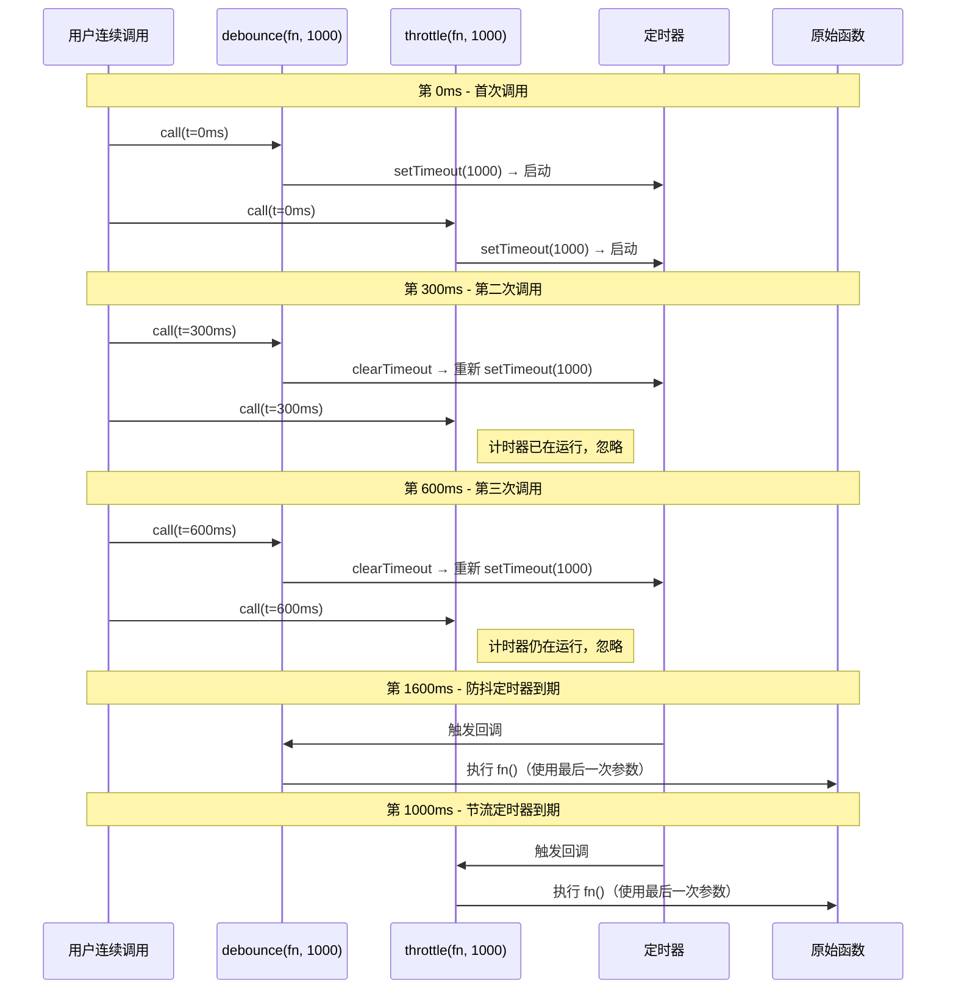
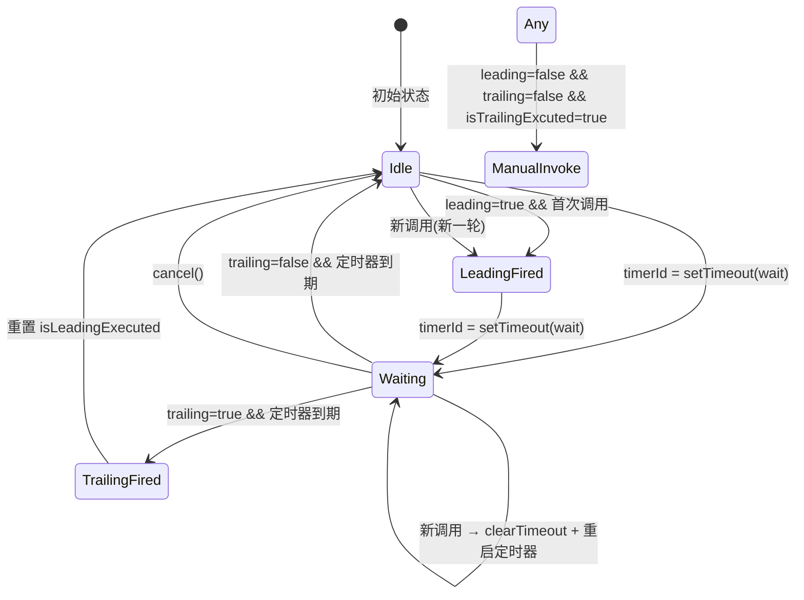
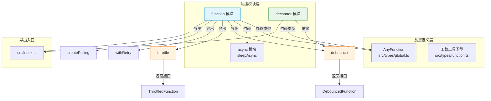

**防抖**和**节流**是前端开发中控制高频事件的两把核心利器——前者确保"停下来再做"，后者确保"匀速地做"。`@mudssky/jsutils` 在 `function` 模块中提供了生产级的 `debounce` 与 `throttle` 实现，不仅支持 `leading`（前缘触发）/ `trailing`（后缘触发）的四种组合模式，还通过 `cancel`、`flush`、`pending` 三个附加方法赋予了完整的生命周期控制能力。本文将从设计动机出发，逐层剖析其内部机制、选项语义、接口契约，并通过装饰器形式展示其在类方法中的优雅集成。

Sources: [function.ts](src/modules/function.ts#L1-L465)

## 核心概念：防抖与节流的本质区别

在深入源码之前，必须建立对两个概念的第一性认知。**防抖（debounce）** 的核心语义是：在连续调用期间，每次调用都会重置计时器——只有当调用真正"停下来"并经过 `wait` 毫秒后，函数才会执行。它适用于搜索框输入联想、窗口 resize 后重新布局等"只需最终结果"的场景。**节流（throttle）** 的核心语义是：在 `wait` 时间窗口内，函数最多执行一次——计时器一旦启动便不会被重置，后续调用只是"排队等待"。它适用于滚动事件限流、鼠标移动追踪等"需要匀速采样"的场景。

下面的时序图清晰地展示了两者的行为差异——注意防抖会反复重置计时器，而节流的计时器一旦启动便不可中断：



Sources: [function.ts](src/modules/function.ts#L43-L177)

## 接口契约：DebouncedFunction 与 ThrottledFunction

两个函数的返回值并非普通的包装函数，而是附加了控制方法的增强函数对象。库通过 `DebouncedFunction` 和 `ThrottledFunction` 两个接口定义了这些能力：

| 方法             |       DebouncedFunction        | ThrottledFunction | 说明                                                |
| ---------------- | :----------------------------: | :---------------: | --------------------------------------------------- |
| `(...args)` 调用 | ✅ 返回 `unknown \| undefined` |  ✅ 返回 `void`   | 防抖版本支持返回上次计算结果                        |
| `cancel()`       |               ✅               |        ✅         | 取消待执行的定时器，重置所有内部状态                |
| `pending()`      |               ✅               |         —         | 查询是否有待执行的定时器（`timerId !== undefined`） |
| `flush()`        |               ✅               |        ✅         | 立即执行待处理的函数调用并返回结果                  |

值得注意的是，`DebouncedFunction` 多了一个 `pending()` 方法，这是因为防抖场景下调用者更常需要知道"当前是否还在等待中"（例如判断搜索请求是否已发出）。而节流的 `ThrottledFunction` 虽然没有 `pending()`，但保留了 `flush()` 和 `cancel()`，以满足"立即采样"和"中止节流"的需求。

Sources: [function.ts](src/modules/function.ts#L8-L30)

## debounce：防抖函数的完整实现

### 函数签名与默认行为

```typescript
function debounce(
  func: AnyFunction,
  wait = 200,
  options: { leading?: boolean; trailing?: boolean } = {
    leading: false,
    trailing: true,
  },
): DebouncedFunction
```

`wait` 默认为 `200ms`，`options` 默认为 `{ leading: false, trailing: true }`——即"仅后缘触发"，这是最常见的防抖模式（等待用户停止操作后再执行）。`AnyFunction` 类型定义为 `(...args: any) => any`，确保任意签名的函数都可以被防抖包装。

Sources: [function.ts](src/modules/function.ts#L43-L53), [global.ts](src/types/global.ts#L34-L34)

### 内部状态模型

防抖函数通过闭包维护以下关键状态变量，这些变量构成了一个完整的**有限状态机**：



闭包中的具体变量及其作用如下：

| 变量                | 类型                                         | 职责                                           |
| ------------------- | -------------------------------------------- | ---------------------------------------------- |
| `timerId`           | `ReturnType<typeof setTimeout> \| undefined` | 定时器标识，`undefined` 表示空闲               |
| `isLeadingExecuted` | `boolean`                                    | 标记当前周期内 leading 是否已执行              |
| `isTrailingExcuted` | `boolean`                                    | 标记 trailing 执行后的状态（用于手动触发模式） |
| `lastArgs`          | `unknown[]`                                  | 缓存最近一次调用的参数列表                     |
| `lastThis`          | `unknown`                                    | 缓存最近一次调用的 `this` 上下文               |
| `funcRes`           | `unknown`                                    | 缓存最近一次函数执行的返回值                   |

Sources: [function.ts](src/modules/function.ts#L54-L63)

### 核心执行流程

防抖的核心逻辑分为三个内部函数和一个主入口函数：

**`invokeFunc()`**——实际执行原始函数，使用缓存的 `lastThis` 和 `lastArgs`，将返回值存入 `funcRes`，然后调用 `resetState()` 清除 leading/trailing 标记。

**`startTimer()`**——启动定时器的前奏阶段。在 `timerId === undefined`（即空闲状态）时执行三步逻辑：

1. 若 `leading=true` 且尚未执行过 leading，立即调用 `invokeFunc()` 并标记 `isLeadingExecuted = true`
2. 若 `leading=false` 且 `trailing=false` 且 `isTrailingExcuted=true`，执行手动调用模式
3. 设置 `setTimeout` 回调：若 `trailing=true` 则在延迟到期时调用 `invokeFunc()`，然后重置状态并将 `isTrailingExcuted` 设为 `true`

**`debounced()` 主入口**——这是返回给外部的增强函数。每次被调用时，先缓存 `args` 和 `this`，然后检查 `timerId`：

- 若 `timerId === undefined`（空闲），直接启动 `startTimer()`，并尝试返回缓存的 `funcRes`
- 若 `timerId` 已存在（等待中），执行 `clearTimeout(timerId)` 并将 `timerId` 置为 `undefined`，然后重新调用 `startTimer()`——**这正是防抖"重置计时器"的关键所在**

Sources: [function.ts](src/modules/function.ts#L65-L118)

### cancel、pending 与 flush

这三个附加方法赋予了调用者完整的控制权：

- **`cancel()`**：调用 `clearTimeout(timerId)`，将 `timerId` 置为 `undefined`，然后调用 `resetState()` 清除所有执行标记。效果是完全中止当前等待周期，回到初始空闲状态。

- **`pending()`**：简单返回 `timerId !== undefined` 的布尔值。当定时器正在运行时返回 `true`，否则返回 `false`。这非常适合在 UI 中展示"正在等待输入完成"的加载状态。

- **`flush()`**：若 `timerId === undefined`（空闲状态），直接返回缓存的 `funcRes`；否则先 `clearTimeout` 并重置状态，然后立即调用 `invokeFunc()` 执行函数并返回结果。它确保了在需要"立刻获取结果"时不必等待定时器到期。

Sources: [function.ts](src/modules/function.ts#L121-L142)

## throttle：节流函数的完整实现

### 函数签名与默认行为

```typescript
function throttle(
  func: AnyFunction,
  wait: number = 200,
  options: { leading: boolean; trailing: boolean } = {
    leading: false,
    trailing: true,
  },
): ThrottledFunction
```

节流的签名与防抖几乎一致，唯一的细微差异是 `options` 的属性类型声明为 `boolean`（非可选），但默认值同样是 `{ leading: false, trailing: true }`。返回类型是 `ThrottledFunction`，不包含 `pending()` 方法。

Sources: [function.ts](src/modules/function.ts#L190-L200)

### 与防抖的关键差异：计时器不重置

节流的核心逻辑集中在 `throttled()` 主入口函数中。与防抖的关键区别在于**计时器管理策略**：

```typescript
function throttled(this: unknown, ...args: unknown[]) {
  lastArgs = args
  lastThis = this
  if (!timerId) {
    // ① 判断 leading 和手动模式
    // ② 启动 setTimeout，到期后执行 trailing
    timerId = setTimeout(() => { ... }, wait)
  }
  // 注意：timerId 已存在时，什么都不做！
}
```

当 `timerId` 已存在时（即处于等待周期内），节流函数**仅更新 `lastArgs` 和 `lastThis`，但不重置定时器**。这意味着高频调用只有最后一次的参数会被记住，而执行节奏始终由定时器的固定间隔控制——这便是"匀速采样"的实现原理。

Sources: [function.ts](src/modules/function.ts#L221-L245)

### cancel 与 flush

节流的 `cancel()` 和 `flush()` 实现与防抖基本一致，唯一差异在于 `cancel()` 会先检查 `timerId` 是否存在（因为节流使用 `null` 而非 `undefined` 作为空值标记）：

- **`cancel()`**：当 `timerId` 非空时，清除定时器并重置状态
- **`flush()`**：当 `timerId === null` 时返回缓存结果，否则清除定时器并立即执行函数

Sources: [function.ts](src/modules/function.ts#L247-L265)

## 选项矩阵：leading 与 trailing 的四种组合

`leading` 和 `trailing` 两个布尔选项产生了四种截然不同的行为模式，适用于不同的业务场景。下面的表格对照了所有组合的语义差异：

| leading | trailing | 防抖行为                                         | 节流行为                                     | 典型场景                       |
| :-----: | :------: | ------------------------------------------------ | -------------------------------------------- | ------------------------------ |
| `false` |  `true`  | **默认模式**。等待 `wait` ms 后执行最后一次调用  | **默认模式**。每个 `wait` 窗口结束时执行一次 | 搜索框输入联想、滚动事件采样   |
| `true`  | `false`  | 仅在首次调用时立即执行，后续调用被忽略直至新周期 | 仅在每个周期首次调用时执行                   | 按钮防重复点击（只响应第一次） |
| `true`  |  `true`  | 首次立即执行 + 延迟后再执行一次（两次调用）      | 每个周期开始和结束时各执行一次               | 需要即时反馈 + 最终确认的场景  |
| `false` | `false`  | 不自动执行，需在定时器到期后手动调用触发         | 不自动执行，需在定时器到期后手动调用触发     | 完全手动的速率限制器           |

**第四种组合（`leading=false, trailing=false`）** 是一个特殊模式。当两个选项都为 `false` 时，定时器仍会启动，但回调中不执行任何函数调用。然而，当定时器到期后 `isTrailingExcuted` 被设为 `true`，此时若再次调用防抖/节流函数，内部会检测到该条件并立即执行一次 `invokeFunc()`——这就是所谓的"手动触发"机制。测试用例中对此有明确覆盖。

Sources: [function.ts](src/modules/function.ts#L43-L100), [function.test.ts](test/function.test.ts#L58-L78)

## 装饰器集成：debounceMethod

库在 `decorator` 模块中提供了 `debounceMethod` 装饰器，将 `debounce` 的能力以声明式方式注入到类方法中。这是防抖功能在面向对象场景下的优雅延伸：

```typescript
import { debounceMethod } from '@mudssky/jsutils'

class SearchBox {
  @debounceMethod(300, { leading: false, trailing: true })
  handleInput(text: string) {
    console.log('搜索：', text)
  }
}

const box = new SearchBox()
box.handleInput('h') // 不执行
box.handleInput('he') // 不执行（重置计时器）
box.handleInput('hel') // 不执行（重置计时器）
// 300ms 后执行：搜索：hel
```

装饰器的实现非常精简——它在内部调用 `debounce(originalMethod, wait, options)` 创建防抖函数，然后返回一个新的函数将其包装，通过 `debouncedFn.apply(this, args)` 确保 `this` 上下文正确传递。装饰器还会进行运行时校验：只允许装饰 `method` 类型的类成员，且被装饰的成员必须是函数。

Sources: [decorator.ts](src/modules/decorator.ts#L31-L61)

## 实战模式：从基础到进阶

### 模式一：搜索框输入防抖

这是最常见的防抖应用场景。用户每输入一个字符都会触发 `input` 事件，但我们只希望在他停止输入 `300ms` 后才发起搜索请求：

```typescript
import { debounce } from '@mudssky/jsutils'

const searchInput = document.querySelector('#search')
const performSearch = (keyword: string) => {
  /* 发起 API 请求 */
}
const debouncedSearch = debounce(performSearch, 300)

searchInput.addEventListener('input', (e) => {
  debouncedSearch((e.target as HTMLInputElement).value)
})
```

由于使用默认配置 `{ leading: false, trailing: true }`，搜索只会在用户停止输入 $300\text{ms}$ 后触发。

Sources: [function.ts](src/modules/function.ts#L43-L53)

### 模式二：滚动事件节流采样

滚动事件每秒可以触发数十次，但视觉更新只需约 $16\text{ms}$（$60\text{fps}$）一次。使用 `throttle` 可以将更新频率固定在合理范围内：

```typescript
import { throttle } from '@mudssky/jsutils'

const throttledScroll = throttle(() => {
  const scrollY = window.scrollY
  // 更新吸顶栏、懒加载图片、进度条等
  updateStickyHeader(scrollY)
}, 100) // 每 100ms 最多采样一次

window.addEventListener('scroll', throttledScroll)
```

### 模式三：按钮防重复点击（leading-only）

使用 `{ leading: true, trailing: false }` 确保只响应第一次点击，在等待窗口内的重复点击被完全忽略：

```typescript
import { debounce } from '@mudssky/jsutils'

const submitForm = () => {
  /* 提交表单 */
}
const safeSubmit = debounce(submitForm, 2000, {
  leading: true,
  trailing: false,
})

submitButton.addEventListener('click', safeSubmit)
// 第一次点击：立即提交
// 2 秒内的后续点击：被忽略
```

### 模式四：主动控制生命周期

在组件卸载或场景切换时，通过 `cancel()` 清理待执行的调用，通过 `flush()` 在卸载前立即执行：

```typescript
import { debounce } from '@mudssky/jsutils'

const autoSave = debounce(saveToServer, 1000)

editor.on('change', autoSave)

// 用户离开页面时
window.addEventListener('beforeunload', () => {
  if (autoSave.pending()) {
    autoSave.flush() // 立即保存，不等待 1000ms
  }
})

// 组件销毁时
editor.on('destroy', () => {
  autoSave.cancel() // 取消任何待执行的保存
})
```

Sources: [function.ts](src/modules/function.ts#L121-L142)

## 测试覆盖：行为验证体系

库对 `debounce` 和 `throttle` 分别编写了独立的测试套件，采用 Vitest 的 `vi.useFakeTimers()` 精确控制时间流逝。核心测试用例覆盖以下行为维度：

| 测试维度                        | 防抖测试   | 节流测试     | 验证要点                       |
| ------------------------------- | ---------- | ------------ | ------------------------------ |
| 参数传递                        | ✅         | ✅           | 函数是否以正确的参数被调用     |
| 等待期间不执行                  | ✅         | ✅           | `wait` 期间函数未被调用        |
| 计时器行为                      | 重置计时器 | 不重置计时器 | 防抖重置 vs 节流忽略的核心差异 |
| `leading=true, trailing=false`  | ✅         | ✅           | 仅首次立即执行，延迟到期不执行 |
| `leading=false, trailing=true`  | ✅         | ✅           | 仅延迟到期后执行               |
| `leading=true, trailing=true`   | ✅         | ✅           | 首次立即 + 延迟后再执行        |
| `leading=false, trailing=false` | ✅         | ✅           | 手动触发模式                   |
| `cancel()`                      | ✅         | ✅           | 取消后函数不再被调用           |
| `flush()`                       | ✅         | ✅           | 立即执行并返回结果             |
| `pending()`                     | ✅         | —            | 状态查询准确性                 |

测试中的关键模式是使用 `vi.advanceTimersByTime()` 精确推进时间，配合 `expect(fn).toHaveBeenNthCalledWith()` 验证每次调用的参数和调用次数。值得注意的是，大部分测试使用 `test.concurrent` 并行运行，这要求每个测试用例完全独立、无共享状态——这本身就是对防抖/节流实现中闭包隔离性的间接验证。

Sources: [function.test.ts](test/function.test.ts#L7-L395)

## 架构总览：模块关系图

下面的图表展示了防抖和节流在整个库中的位置，以及它们与其他模块的依赖关系：



Sources: [index.ts](src/index.ts#L1-L23), [function.ts](src/modules/function.ts#L464-L465), [decorator.ts](src/modules/decorator.ts#L1-L3)

## 延伸阅读

- 如果你想了解 `debounceMethod` 装饰器的更多细节和 `performanceMonitor` 装饰器的实现，请参阅 [TypeScript 装饰器：debounceMethod 与 performanceMonitor](19-typescript-zhuang-shi-qi-debouncemethod-yu-performancemonitor)
- 如果你想了解 `function` 模块中 `withRetry`（重试包装器）和 `createPolling`（轮询控制器）的设计思路，它们与防抖/节流同属"函数增强"范畴，可参考源码中的 JSDoc 注释
- 对于防抖/节流在高性能渲染场景中的应用，可进一步阅读 [性能监控器：PerformanceMonitor 迭代测试、内存追踪与对比基准](20-xing-neng-jian-kong-qi-performancemonitor-die-dai-ce-shi-nei-cun-zhui-zong-yu-dui-bi-ji-zhun)
