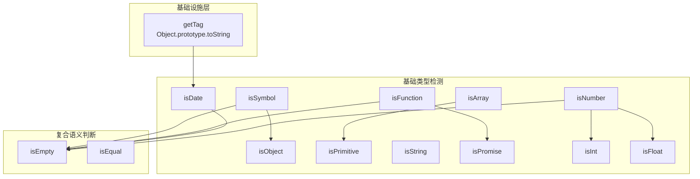
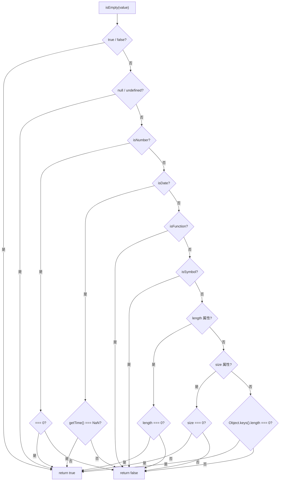

jsutils 的类型守卫体系是库中运行时类型判断的核心基础设施，分布在 `typed` 和 `lang` 两个模块中。它提供了一套从基础类型检测（`isString`、`isNumber`）到复合语义判断（`isEmpty`、`isEqual`）的完整工具链，所有守卫函数均采用 TypeScript **类型谓词（Type Predicate）** 签名，在运行时返回布尔值的同时为编译器提供精确的类型收窄信息。这套体系的设计哲学可以概括为：**用最小的运行时开销换取最大的类型安全**。

Sources: [typed.ts](src/modules/typed.ts#L1-L145), [lang.ts](src/modules/lang.ts#L1-L76)

## 架构全景：两层检测模型

类型守卫体系的函数并非扁平排列，而是呈现出清晰的分层依赖关系。底层是面向单一 JavaScript 内置类型的**基础检测函数**（如 `isString`、`isNumber`），上层是组合多个基础函数完成复合语义判断的**聚合检测函数**（如 `isEmpty`、`isEqual`）。`getTag` 工具函数作为最底层的基础设施，通过 `Object.prototype.toString` 提供通用类型标签提取能力。



上图中可以观察到两个关键依赖链：`isNumber` 衍生出 `isInt` 和 `isFloat` 两个更精细的数值检测；`isEmpty` 则是最复杂的聚合节点，它内部调用了 `isNumber`、`isDate`、`isFunction`、`isSymbol` 四个基础函数来完成全覆盖的空值判定。

Sources: [typed.ts](src/modules/typed.ts#L1-L145), [lang.ts](src/modules/lang.ts#L1-L15)

## 基础类型检测函数

基础类型检测函数是最直接的工具，每个函数专注于判断一个 JavaScript 内置类型。它们有两个共同特征：接收 `any` 类型参数以兼容所有可能的输入，以及通过 `value is Type` 类型谓词返回值让 TypeScript 编译器在后续代码中自动收窄类型。

### 检测策略一览

不同类型采用不同的检测策略，这是由 JavaScript 语言本身的设计决定的。下表总结了每个函数的核心检测机制：

| 函数          | 签名                             | 检测策略                          | 关键特性                                                      |
| ------------- | -------------------------------- | --------------------------------- | ------------------------------------------------------------- |
| `isString`    | `(any) => value is string`       | `typeof` + `instanceof`           | 兼容 `new String()` 包装对象                                  |
| `isNumber`    | `(any) => value is number`       | `Number(value) === value`         | **排除 NaN**（`NaN !== NaN`）                                 |
| `isSymbol`    | `(any) => value is symbol`       | `constructor === Symbol`          | 直接比较构造器引用                                            |
| `isObject`    | `(any) => value is object`       | `constructor === Object`          | **仅匹配纯对象**，排除类实例和数组                            |
| `isArray`     | `(any) => value is any[]`        | `Array.isArray`                   | 委托原生 API                                                  |
| `isFunction`  | `(any) => value is AnyFunction`  | `constructor && call && apply`    | 三重属性检测                                                  |
| `isPrimitive` | `(any) => boolean`               | `typeof` 排除 `object`/`function` | 涵盖 null、undefined、boolean、number、string、symbol、bigint |
| `isDate`      | `(any) => value is Date`         | `Object.prototype.toString`       | 匹配 `[object Date]` 标签                                     |
| `isPromise`   | `(any) => value is Promise<any>` | `then` 属性 + `isFunction`        | 最佳猜测策略，非 100% 可靠                                    |

Sources: [typed.ts](src/modules/typed.ts#L7-L97)

### isString：双通道字符串检测

`isString` 的实现采用了 `typeof` 和 `instanceof` 双重检测，这是一个精心考量的设计决策。`typeof value === 'string'` 能覆盖 99% 的场景（字符串字面量和 `String('abc')` 显式调用），但 `new String('abc')` 创建的包装对象 `typeof` 返回 `'object'`，需要 `instanceof String` 来兜底：

```typescript
export const isString = (value: any): value is string => {
  return typeof value === 'string' || value instanceof String
}
```

Sources: [typed.ts](src/modules/typed.ts#L50-L52)

### isNumber：NaN 安全的数值检测

`isNumber` 的实现利用了 JavaScript 中 `NaN !== NaN` 这一语言特性。`Number(value) === value` 对于普通数值会返回 `true`，但对于 `NaN`、字符串、`null`、`undefined`、对象等都会返回 `false`。使用 `try-catch` 包装是为了防御可能抛出异常的极端情况（例如带有自定义 `valueOf` 的对象）：

```typescript
export const isNumber = (value: any): value is number => {
  try {
    return Number(value) === value
  } catch {
    return false
  }
}
```

**重要行为差异**：与 JavaScript 原生 `typeof NaN === 'number'` 不同，`isNumber(NaN)` 返回 `false`。这是有意为之的设计——在绝大多数业务场景中，NaN 不应被视为有效数值。

Sources: [typed.ts](src/modules/typed.ts#L71-L77)

### isInt 与 isFloat：isNumber 的精细化衍生

`isInt` 和 `isFloat` 都以 `isNumber` 为前置条件，通过取模运算 `value % 1` 进一步区分整数和浮点数。由于 `isNumber` 已经排除了 NaN 和非数值类型，这里只需关注小数部分是否为零：

```typescript
export const isInt = (value: any): value is number => {
  return isNumber(value) && value % 1 === 0
}

export const isFloat = (value: any): value is number => {
  return isNumber(value) && value % 1 !== 0
}
```

| 输入      | `isInt` | `isFloat` | `isNumber` |
| --------- | ------- | --------- | ---------- |
| `22`      | `true`  | `false`   | `true`     |
| `22.0567` | `false` | `true`    | `true`     |
| `NaN`     | `false` | `false`   | `false`    |
| `'abc'`   | `false` | `false`   | `false`    |
| `null`    | `false` | `false`   | `false`    |

Sources: [typed.ts](src/modules/typed.ts#L57-L66)

### isObject：纯对象的严格匹配

`isObject` 使用 `value.constructor === Object` 进行检测，这意味着只有通过 `{}` 或 `Object()` 创建的纯对象才会返回 `true`。数组、`Date`、`Map`、自定义类实例等全部返回 `false`：

```typescript
export const isObject = (value: any): value is object => {
  return !!value && value.constructor === Object
}
```

| 输入                      | 结果    | 原因                    |
| ------------------------- | ------- | ----------------------- |
| `{}`                      | `true`  | constructor 指向 Object |
| `Object.create(null)`     | `false` | 无 constructor 属性     |
| `new Map()`               | `false` | constructor 指向 Map    |
| `[1, 2]`                  | `false` | constructor 指向 Array  |
| `class Foo {}; new Foo()` | `false` | constructor 指向 Foo    |

Sources: [typed.ts](src/modules/typed.ts#L19-L21)

### isFunction：三重属性验证

`isFunction` 检查三个属性的存在性：`constructor`、`call` 和 `apply`。这种策略比简单的 `typeof value === 'function'` 更精确——它能正确识别所有可调用对象，同时过滤掉偶然带有 `typeof === 'function'` 标签的边界情况。返回类型使用 `value is AnyFunction`，其中 `AnyFunction` 定义为 `(...args: any) => any`，比内置的 `Function` 类型更灵活。

Sources: [typed.ts](src/modules/typed.ts#L43-L45), [global.ts](src/types/global.ts#L34-L34)

### isDate 与 isPromise：复杂对象的检测

`isDate` 通过 `Object.prototype.toString.call(value) === '[object Date]'` 实现检测。这种 `toString` 策略比 `instanceof Date` 更可靠——它能正确处理跨 iframe / 跨 realm 的 Date 对象。`isPromise` 则采用启发式检测（检查 `.then` 属性是否为函数），文档注释中明确标注这是一个**最佳猜测**，建议使用 `Promise.resolve(value)` 获得完全可靠的结果：

```typescript
export const isPromise = (value: any): value is Promise<any> => {
  if (!value) return false
  if (!value.then) return false
  if (!isFunction(value.then)) return false
  return true
}
```

Sources: [typed.ts](src/modules/typed.ts#L82-L97)

### getTag：通用类型标签提取

`getTag` 是 `lang` 模块导出的底层工具函数，它封装了 `Object.prototype.toString.call()` 这一经典类型检测模式。对于 `null` 和 `undefined` 这两个特殊情况，它直接返回对应的标签字符串，避免调用 `toString` 时可能出现的异常。`isDate` 函数本质上就是 `getTag(value) === '[object Date]'` 的内联版本：

```typescript
function getTag(value: any): string {
  const toString = Object.prototype.toString
  if (value == null) {
    return value === undefined ? '[object Undefined]' : '[object Null]'
  }
  return toString.call(value)
}
```

| 输入        | 返回值                 |
| ----------- | ---------------------- |
| `undefined` | `'[object Undefined]'` |
| `null`      | `'[object Null]'`      |
| `'Hello'`   | `'[object String]'`    |
| `123`       | `'[object Number]'`    |
| `new Map()` | `'[object Map]'`       |
| `/test/`    | `'[object RegExp]'`    |

Sources: [lang.ts](src/modules/lang.ts#L9-L15)

## 复合语义判断函数

### isEmpty：多维度空值判定

`isEmpty` 是整个类型守卫体系中最复杂的函数。它不仅判断"无值"（null/undefined），还判断"空容器"（空字符串、空数组、空对象、空 Map/Set），甚至处理了 `0`、`true`/`false` 等边界值。其内部按照从特殊到一般的顺序执行短路判定：



这个判定流程的设计暗含一个重要的优先级逻辑：**具有特定位语义的值先处理，通用容器语义后处理**。布尔值和 null/undefined 最先检查，因为它们没有 `length` 或 `size` 属性，不能走通用路径。函数和 Symbol 始终返回 `false`（非空），是因为它们有明确的语义身份，不应被视为"空"。

```typescript
export const isEmpty = (value: any): boolean => {
  if (value === true || value === false) return true
  if (value === null || value === undefined) return true
  if (isNumber(value)) return value === 0
  if (isDate(value)) return isNaN(value.getTime())
  if (isFunction(value)) return false
  if (isSymbol(value)) return false
  const length = (value as any).length
  if (isNumber(length)) return length === 0
  const size = (value as any).size
  if (isNumber(size)) return size === 0
  const keys = Object.keys(value).length
  return keys === 0
}
```

Sources: [typed.ts](src/modules/typed.ts#L102-L115)

**判定结果速查表**：

| 输入                  | 结果    | 判定路径                             |
| --------------------- | ------- | ------------------------------------ |
| `null`                | `true`  | 布尔值检查 → null 检查               |
| `undefined`           | `true`  | 布尔值检查 → null 检查               |
| `true` / `false`      | `true`  | 布尔值检查（首批）                   |
| `0`                   | `true`  | isNumber 检查 → `0 === 0`            |
| `22`                  | `false` | isNumber 检查 → `22 !== 0`           |
| `''`                  | `true`  | length 检查 → `length === 0`         |
| `'abc'`               | `false` | length 检查 → `length !== 0`         |
| `[]`                  | `true`  | length 检查 → `length === 0`         |
| `[1, 2]`              | `false` | length 检查 → `length !== 0`         |
| `{}`                  | `true`  | Object.keys 检查 → `length === 0`    |
| `{ name: 'x' }`       | `false` | Object.keys 检查 → `length !== 0`    |
| `new Map()`           | `true`  | size 检查 → `size === 0`             |
| `new Set()`           | `true`  | size 检查 → `size === 0`             |
| `() => {}`            | `false` | isFunction 检查 → 直接返回 false     |
| `Symbol('')`          | `false` | isSymbol 检查 → 直接返回 false       |
| `new Date('invalid')` | `true`  | isDate 检查 → `getTime()` 为 NaN     |
| `new Date()`          | `false` | isDate 检查 → `getTime()` 为有效数字 |
| `new MyClass()`       | `true`  | 最终 Object.keys 检查                |

Sources: [typed.ts](src/modules/typed.ts#L102-L115), [typed.test.ts](test/typed.test.ts#L294-L330)

### isEqual：深度递归等值比较

`isEqual` 实现了完整的深度等值比较，能正确处理嵌套对象、数组、Date、RegExp、Symbol 键以及循环引用。其核心算法是递归 + `Reflect.ownKeys` 遍历：

```typescript
export const isEqual = <TType>(x: TType, y: TType): boolean => {
  if (Object.is(x, y)) return true
  if (x instanceof Date && y instanceof Date) {
    return x.getTime() === y.getTime()
  }
  if (x instanceof RegExp && y instanceof RegExp) {
    return x.toString() === y.toString()
  }
  if (
    typeof x !== 'object' ||
    x === null ||
    typeof y !== 'object' ||
    y === null
  ) {
    return false
  }
  const keysX = Reflect.ownKeys(x as unknown as object) as (keyof typeof x)[]
  const keysY = Reflect.ownKeys(y as unknown as object)
  if (keysX.length !== keysY.length) return false
  for (let i = 0; i < keysX.length; i++) {
    if (!Reflect.has(y as unknown as object, keysX[i])) return false
    if (!isEqual(x[keysX[i]], y[keysX[i]])) return false
  }
  return true
}
```

算法的关键设计决策：

1. **`Object.is` 而非 `===`**：`Object.is` 正确处理 `NaN === NaN`（返回 `true`）和 `+0 === -0`（返回 `false`）两个 `===` 无法正确处理的边界情况
2. **Date 通过时间戳比较**：`new Date(0)` 和 `new Date(0)` 虽然是不同对象引用，但时间戳相同即判为相等
3. **RegExp 通过字符串比较**：`/a*s/gi` 和 `/a*s/gi` 的 `toString()` 结果一致即判为相等
4. **`Reflect.ownKeys` 覆盖 Symbol 键**：相比 `Object.keys()`，`Reflect.ownKeys` 同时包含字符串键和 Symbol 键，确保 Symbol 属性也参与比较
5. **循环引用安全**：对于包含自身引用的对象（如 `obj.self = obj`），`Object.is` 的引用相等检查在递归前短路，避免了无限递归

Sources: [typed.ts](src/modules/typed.ts#L120-L144)

**深度比较行为示例**：

```typescript
// 复杂嵌套对象：Symbol 键 + 循环引用 + Date + RegExp
const symbolKey = Symbol('symkey')
const complex = {
  num: 0,
  str: '',
  boolean: true,
  unf: void 0,
  nul: null,
  obj: { name: 'object', id: 1, chilren: [0, 1, 2] },
  arr: [0, 1, 2],
  func() {},
  loop: null as any,
  date: new Date(0),
  reg: new RegExp('/regexp/ig'),
  [symbolKey]: 'symbol',
}
complex.loop = complex // 循环引用

isEqual(complex, { ...complex }) // true — 深拷贝后仍相等
isEqual([complex, complex], [{ ...complex }, { ...complex }]) // true
isEqual(Symbol('hello'), Symbol('goodbye')) // false — 不同 Symbol 实例
```

Sources: [typed.test.ts](test/typed.test.ts#L481-L543)

## 类型谓词与编译时收窄

本库类型守卫的核心价值不仅在于运行时判断，更在于 TypeScript 编译时的**类型收窄**能力。通过 `value is Type` 谓词签名，守卫函数在 `if` 条件分支中自动将 `any` 或宽泛类型收窄为目标类型：

```typescript
import { isString, isNumber, isFunction } from '@mudssky/jsutils'

function process(value: unknown) {
  if (isString(value)) {
    // 此处 value 类型收窄为 string
    console.log(value.toUpperCase()) // ✅ 编译通过
  }
  if (isNumber(value)) {
    // 此处 value 类型收窄为 number（不含 NaN，因为 isNumber 排除了 NaN）
    value.toFixed(2) // ✅ 编译通过
  }
  if (isFunction(value)) {
    // 此处 value 类型收窄为 AnyFunction
    value() // ✅ 编译通过
  }
}
```

`isPrimitive` 是一个例外——它返回 `boolean` 而非类型谓词。这是因为原始类型是一个联合类型（`string | number | boolean | symbol | bigint | null | undefined`），无法用单一类型谓词表达，需要与 `typeof` 配合进一步细分。

Sources: [typed.ts](src/modules/typed.ts#L32-L38)

## 实战场景与最佳实践

### 表单数据的空值过滤

`isEmpty` 在表单处理中特别有用，它能统一处理各种类型的空值，避免逐个判断：

```typescript
import { isEmpty, isString, isNumber } from '@mudssky/jsutils'

function cleanFormData(data: Record<string, unknown>) {
  const cleaned: Record<string, unknown> = {}
  for (const [key, value] of Object.entries(data)) {
    if (!isEmpty(value)) {
      cleaned[key] = value
    }
  }
  return cleaned
}

// { name: 'Alice', age: 25, hobbies: ['reading'] }
cleanFormData({
  name: 'Alice',
  age: 25,
  nickname: '', // 过滤：空字符串
  hobbies: ['reading'],
  metadata: {}, // 过滤：空对象
  tags: [], // 过滤：空数组
  score: 0, // 过滤：数值 0（注意！）
})
```

**注意**：`isEmpty(0)` 返回 `true`，这在数值上下文中可能不符合预期。如果 `0` 是有效值，应该用 `value == null || value === ''` 等更精确的条件替代。

Sources: [typed.ts](src/modules/typed.ts#L102-L115)

### 配置对象的深度比较

`isEqual` 在判断配置对象是否变更时极为高效，避免了手动逐字段比较：

```typescript
import { isEqual } from '@mudssky/jsutils'

let prevConfig = { theme: 'dark', fontSize: 14, features: { sidebar: true } }

function updateConfig(newConfig: typeof prevConfig) {
  if (!isEqual(prevConfig, newConfig)) {
    prevConfig = newConfig
    // 只在配置真正变更时触发更新
    applyConfig(newConfig)
  }
}
```

Sources: [typed.ts](src/modules/typed.ts#L120-L144)

### API 响应的类型安全解析

组合使用多个守卫函数可以在 API 响应解析时建立类型安全的防护网：

```typescript
import { isString, isNumber, isObject, isArray } from '@mudssky/jsutils'

interface UserProfile {
  name: string
  age: number
  tags: string[]
}

function parseUserProfile(data: unknown): UserProfile | null {
  if (!isObject(data)) return null

  const profile = data as Record<string, unknown>
  if (!isString(profile.name)) return null
  if (!isNumber(profile.age)) return null
  if (!isArray(profile.tags)) return null

  return { name: profile.name, age: profile.age, tags: profile.tags }
}
```

Sources: [typed.ts](src/modules/typed.ts#L14-L52)

## API 速查表

| 函数          | 导入路径           | 返回类型                | 核心用途                         |
| ------------- | ------------------ | ----------------------- | -------------------------------- |
| `isString`    | `@mudssky/jsutils` | `value is string`       | 字符串检测（含 String 包装对象） |
| `isNumber`    | `@mudssky/jsutils` | `value is number`       | 数值检测（排除 NaN）             |
| `isInt`       | `@mudssky/jsutils` | `value is number`       | 整数检测                         |
| `isFloat`     | `@mudssky/jsutils` | `value is number`       | 浮点数检测                       |
| `isSymbol`    | `@mudssky/jsutils` | `value is symbol`       | Symbol 检测                      |
| `isObject`    | `@mudssky/jsutils` | `value is object`       | 纯对象检测（排除类实例、数组）   |
| `isArray`     | `@mudssky/jsutils` | `value is any[]`        | 数组检测                         |
| `isFunction`  | `@mudssky/jsutils` | `value is AnyFunction`  | 函数检测                         |
| `isPrimitive` | `@mudssky/jsutils` | `boolean`               | 原始类型检测                     |
| `isDate`      | `@mudssky/jsutils` | `value is Date`         | Date 对象检测                    |
| `isPromise`   | `@mudssky/jsutils` | `value is Promise<any>` | Promise 启发式检测               |
| `isEmpty`     | `@mudssky/jsutils` | `boolean`               | 多维度空值判定                   |
| `isEqual`     | `@mudssky/jsutils` | `boolean`               | 深度递归等值比较                 |
| `getTag`      | `@mudssky/jsutils` | `string`                | 通用类型标签提取                 |

Sources: [index.ts](src/index.ts#L11-L21)

## 延伸阅读

类型守卫体系作为运行时检测基础设施，与库中其他模块存在紧密的协作关系。了解以下内容有助于形成完整的知识图谱：

- [环境检测：浏览器/Node.js/Web Worker 判断与安全执行包装](15-huan-jing-jian-ce-liu-lan-qi-node-js-web-worker-pan-duan-yu-an-quan-zhi-xing-bao-zhuang) — 环境级别的 `isBrowser()`、`isNode()` 等检测函数，它们关注运行平台而非数据类型
- [函数增强：防抖（debounce）与节流（throttle）的完整实现](7-han-shu-zeng-qiang-fang-dou-debounce-yu-jie-liu-throttle-de-wan-zheng-shi-xian) — `isFunction` 在 debounce/throttle 中用于前置参数校验
- [对象操作：pick/omit、mapKeys/mapValues、深度合并与序列化清理](6-dui-xiang-cao-zuo-pick-omit-mapkeys-mapvalues-shen-du-he-bing-yu-xu-lie-hua-qing-li) — 内部使用 `isObject` 辅助递归合并，`isEmpty` 常用于对象过滤
- [类型系统设计：工具类型定义与 TypeScript 类型测试最佳实践](25-lei-xing-xi-tong-she-ji-gong-ju-lei-xing-ding-yi-yu-typescript-lei-xing-ce-shi-zui-jia-shi-jian) — `AnyFunction` 等工具类型是类型谓词签名的基石
