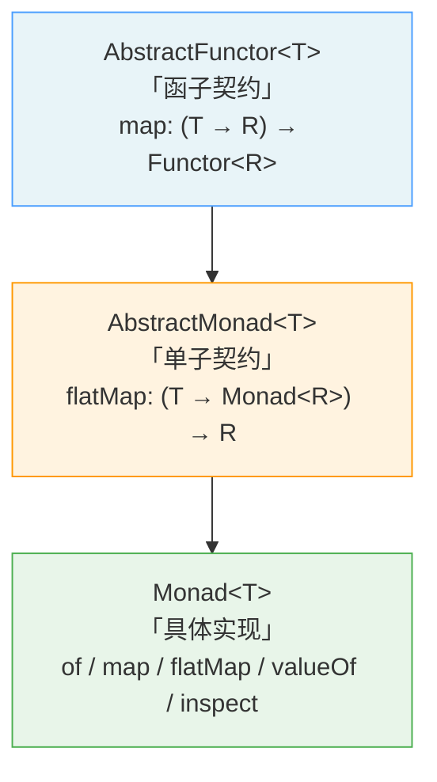

jsutils 的 `fp` 模块提供了一套精练的函数式编程原语，涵盖**函数组合**（`pipe` / `compose`）、**柯里化**（`curry`）、**恒等函数**（`identity`）以及**Monad 函子**（`Monad`）。这些工具遵循"小而完整"的设计哲学——每个 API 只做一件事，但通过组合可以构建出表达力极强的数据处理管线。本文将从底层实现出发，逐层剖析每个工具的设计动机、核心机制与使用模式，帮助你在实际项目中以函数式思维重构命令式逻辑。

Sources: [fp.ts](src/modules/fp.ts#L1-L149)

---

## 模块架构总览

在深入每个 API 之前，先建立整体认知地图。以下 Mermaid 图展示了 `fp` 模块各导出实体之间的关系——从类型契约（`AnyFunction`）到具体实现，以及它们在函数式管线中的协作方式：

```mermaid
classDiagram
    direction TB

    class AbstractFunctor~T~ {
        <<abstract>>
        +map~R~(f: (val: T) =&gt; R) AbstractFunctor~R~
    }

    class AbstractMonad~T~ {
        <<abstract>>
        +flatMap~R~(f: (arg: T) =&gt; R) AbstractMonad~R~
    }

    class Monad~T~ {
        -val: T
        +static of~U~(val: U): Monad~U~
        +map(f: (arg: T) =&gt; any): Monad~any~
        +flatMap(f: (arg0: T) =&gt; any): any
        +valueOf(): T
        +inspect(): string
    }

    AbstractFunctor &lt;|-- AbstractMonad
    AbstractMonad &lt;|-- Monad

    note for pipe "pipe(f, g, h)(x) → h(g(f(x)))\n左到右，数据流方向直观"
    note for compose "compose(f, g, h)(x) → f(g(h(x)))\n右到左，数学书写习惯"
    note for curry "curry(add)(1)(2) ≡ add(1, 2)\n支持任意粒度的部分应用"

    class pipe {
        &lt;&lt;function&gt;&gt;
        +pipe(...functions: AnyFunction[]): Function
    }
    class compose {
        &lt;&lt;function&gt;&gt;
        +compose(...functions: AnyFunction[]): Function
    }
    class curry {
        &lt;&lt;function&gt;&gt;
        +curry(func, arity?): CurriedFunction
    }
    class identity {
        &lt;&lt;function&gt;&gt;
        +identity~T~(x: T): T
    }
```

**类型依赖**方面，`pipe` 和 `compose` 依赖 [`AnyFunction`](src/types/global.ts#L34) 类型约束来确保输入合法性，而 `Monad` 体系则建立在 `AbstractFunctor` → `AbstractMonad` 的抽象层级之上——这种分层为将来扩展 `Maybe`、`Either` 等代数数据类型预留了空间（源码中被注释的 `MayBe` 类即为此意图的佐证）。

Sources: [fp.ts](src/modules/fp.ts#L84-L148), [global.ts](src/types/global.ts#L34-L34)

---

## pipe —— 从左到右的函数流水线

### 设计动机

数据处理管线在业务代码中极为常见：取原始值 → 转换 → 过滤 → 格式化 → 输出。传统写法通过嵌套调用 `format(filter(transform(getRaw())))` 表达，但阅读顺序与执行顺序相反，代码可读性随管线长度线性下降。**`pipe` 将执行顺序与阅读顺序统一为从左到右**，使数据流动方向一目了然。

### 核心实现

```typescript
function pipe<OUT = any>(...functions: AnyFunction[]): (...args: any) => OUT {
  if (functions.length === 0) {
    throw new ArgumentError('pipe requires at least one argument')
  }
  return functions.reduce(
    (f, g) =>
      (...args: any[]) =>
        g(f(...args)),
  ) as (...args: any) => OUT
}
```

`pipe` 的核心机制是 `Array.prototype.reduce`：将函数列表折叠为一个复合函数。每一次 reduce 迭代，将前一个函数 `f` 的返回值作为后一个函数 `g` 的输入，即 `g(f(...args))`。第一个函数可以接受任意数量的参数（`...args`），后续函数必须是一元函数（只接收前一步的返回值）。空参数列表会抛出 `ArgumentError`，防止静默返回无意义结果。

Sources: [fp.ts](src/modules/fp.ts#L1-L21), [error.ts](src/modules/error.ts#L5-L16)

### 使用示例

以测试用例中的经典算术管线为例，验证 `pipe(5) → add5 → double → square` 的计算过程：

```typescript
import { pipe } from '@mudssky/jsutils'

const add5 = (x: number) => x + 5
const double = (x: number) => x * 2
const square = (x: number) => x * x

const pipeline = pipe<number>(add5, double, square)

pipeline(5)
// 执行轨迹：5 → add5 → 10 → double → 20 → square → 400
```

**关键约束**：管线中除第一个函数外，所有函数必须是**一元函数**（接收单个参数）。如果某个中间步骤需要多参数，应先通过 `curry` 进行部分应用，这一点在后续"pipe + curry 联合实战"章节中将详细展示。

Sources: [fp.test.ts](test/fp.test.ts#L4-L16)

---

## compose —— 从右到左的数学组合

### 与 pipe 的对称关系

`compose` 是 `pipe` 的**对偶操作**——执行方向从右到左，与数学中函数组合符号 `(f ∘ g)(x) = f(g(x))` 的书写习惯一致。两者接收的函数顺序相反，但最终计算结果等价：

```typescript
// pipe：左到右，先执行的写在前面
pipe(add5, double, square)(5) // → 400

// compose：右到左，先执行的写在后面
compose(square, double, add5)(5) // → 400
```

### 核心实现差异

```typescript
function compose<OUT = any>(...functions: AnyFunction[]): (...args: any) => OUT {
  if (functions.length === 0) {
    throw new ArgumentError('pipe requires at least one argument')  // 注意：此处保留了原始错误信息
  }
  return functions.reduceRight(
    (f, g) =>
      (...args: any[]) =>
        g(f(...args)),
  ) as (...args => => OUT
}
```

与 `pipe` 唯一的实现差异在于使用了 `reduceRight` 代替 `reduce`——从数组末尾向头部折叠。其余约束完全一致：空参数抛出 `ArgumentError`，第一个（对 `compose` 而言是最右侧）函数可接受任意参数，其余必须一元。

**选择建议**：如果你更关注"数据从哪来、到哪去"的直觉式阅读体验，优先使用 `pipe`；如果你更习惯数学推导的书写方式，`compose` 更自然。在同一个项目中应保持一致选择，避免团队成员在两种风格间频繁切换。

Sources: [fp.ts](src/modules/fp.ts#L23-L40)

---

## curry —— 通用柯里化与部分应用

### 柯里化的本质

柯里化将一个多参数函数转化为一系列单参数函数的嵌套调用。例如 `f(a, b, c)` 被转化为 `f(a)(b)(c)`。这不仅是语法变换——它赋予了函数**部分应用**（Partial Application）的能力：可以预设部分参数，生成更具体的新函数，极大提升代码复用性。

### 递归式实现解析

```typescript
function curry(
  func: (...args: any) => any,
  arity: number = func.length,
): (...args: any[]) => any {
  function generateCurried(...prevArgs: any[]) {
    return function curried(...nextArg: any[]) {
      const args = [...prevArgs, ...nextArg]
      if (args.length >= arity) {
        // 递归边界：参数收集完毕，执行原函数
        return func(...args)
      } else {
        // 递归步进：将已收集参数传递给下一层
        return generateCurried(...args)
      }
    }
  }
  return generateCurried()
}
```

这个实现采用**递归嵌套闭包**策略，分为三层结构：

| 层级              | 角色       | 职责                                                   |
| ----------------- | ---------- | ------------------------------------------------------ |
| `curry`           | 入口层     | 捕获原函数 `func` 和目标元数 `arity`，启动递归         |
| `generateCurried` | 闭包工厂   | 保持 `prevArgs`（已记忆参数），生成新的 `curried` 函数 |
| `curried`         | 参数收集器 | 接收新参数 `nextArg`，判断是否达到递归边界             |

`arity` 参数默认取 `func.length`（函数声明时的参数数量），也可以手动指定——这意味着你可以**覆盖**函数的原始元数，实现超出声明参数数量的柯里化行为。

Sources: [fp.ts](src/modules/fp.ts#L42-L72)

### 多模式调用

`curry` 的一个显著优势是**调用模式无关性**——无论一次性传入所有参数、逐步传入，还是混合传入，结果完全一致：

```typescript
const multiply = (a: number, b: number, c: number) => a * b * c
const curriedMultiply = curry(multiply)

curriedMultiply(1, 2, 3, 4) // 一次传入全部（甚至多余）→ 6
curriedMultiply(1, 2)(3) // 分两步 → 6
curriedMultiply(1)(2)(3) // 逐个传入 → 6
```

这种灵活性来自 `args.length >= arity` 的判断逻辑——只要累计参数数量达到或超过目标元数，就立即执行原函数。这使得柯里化后的函数既能作为**全量调用**的替代品，也能作为**部分应用**的工厂。

Sources: [fp.test.ts](test/fp.test.ts#L32-L66)

### pipe + curry 联合实战

`curry` 与 `pipe` 的组合是函数式管线中最强大的模式之一。通过 `curry` 预设参数，可以将多参数函数转化为 `pipe` 所需的一元函数：

```typescript
import { curry, pipe } from '@mudssky/jsutils'

const add = (a: number, b: number) => a + b
const multiply = (a: number, b: number, c: number) => a * b * c
const addMore = (a: number, b: number, c: number, d: number) => a + b + c + d
const divide = (a: number, b: number) => a / b

const curriedAdd = curry(add)
const curriedMultiply = curry(multiply)
const curriedAddMore = curry(addMore)
const curriedDivide = curry(divide)

const computePipeline = pipe(
  curriedAdd(1), // x => x + 1       (部分应用，等待第二个参数)
  curriedMultiply(2)(3), // x => 2 * 3 * x   (已应用两个参数，等待第三个)
  curriedAddMore(1)(2)(3), // x => 1 + 2 + 3 + x
  curriedDivide(300), // x => 300 / x
)

computePipeline(3)
// 执行轨迹：3 → +1 → 4 → *6 → 24 → +6 → 30 → 300/30 → 10
```

在这个管线中，每个步骤都是一个**通过 curry 部分应用后生成的一元函数**——它们满足了 `pipe` 对一元函数的约束，同时保留了原始多参数函数的语义完整性。这种模式在数据转换管线（如 API 响应处理、表单数据清洗）中尤其实用。

Sources: [fp.test.ts](test/fp.test.ts#L57-L64)

---

## identity —— 恒等函数

```typescript
function identity<T>(x: T): T {
  return x
}
```

`identity` 是函数式编程中最基础的工具——**接收任意值，原样返回**。它的价值不在于"做了什么"，而在于"在需要函数的地方提供一个什么都不做的占位符"。典型使用场景包括：

- **`pipe` / `compose` 管线中的条件旁通**：当某个步骤在特定条件下应跳过时，用 `identity` 替代，保持管线结构完整
- **默认回调函数**：`const handler = customHandler ?? identity`
- **`Array.map` 的无变换场景**：在需要保持数组结构但不对元素做变换时使用

Sources: [fp.ts](src/modules/fp.ts#L74-L82)

---

## Monad 函子 —— 带上下文的值容器

### 从 Functor 到 Monad 的层级演进

Monad 的本质是**一个携带上下文的容器**，通过严格的接口契约（`map` / `flatMap` / `of`）提供可预测的数据变换链。jsutils 实现了完整的类型层级：



| 抽象层级          | 核心接口                                         | 职责                                                           |
| ----------------- | ------------------------------------------------ | -------------------------------------------------------------- |
| `AbstractFunctor` | `map(f: (val: T) => R): AbstractFunctor<R>`      | 定义"映射"语义：对容器内的值应用函数，结果仍包裹在同类型容器中 |
| `AbstractMonad`   | `flatMap(f: (arg: T) => R): AbstractMonad<R>`    | 在 Functor 基础上增加"展平"语义：解决嵌套容器问题              |
| `Monad`           | `of` / `map` / `flatMap` / `valueOf` / `inspect` | 具体实现，提供工厂方法与调试工具                               |

Sources: [fp.ts](src/modules/fp.ts#L84-L132)

### 核心方法详解

**`Monad.of(val)` —— 工厂方法（纯函数构造器）**

```typescript
static of<U = any>(val: U): Monad<U> {
  return new Monad<U>(val)
}
```

`of` 是 Monad 的**最小上下文构造器**——将任意值包裹进 Monad 容器，且不产生副作用。这是 Monad 三定律中"左单位元"（`Monad.of(x).flatMap(f) ≡ f(x)`）的实现基础。

**`map(f)` —— 上下文内映射**

```typescript
map(f: (arg: T) => any): Monad<any> {
  return Monad.of(f(this.val))
}
```

`map` 对容器内的值 `this.val` 应用函数 `f`，然后将结果重新包裹进新的 Monad——**永远不脱离容器上下文**。这保证了操作链的可组合性。

**`flatMap(f)` —— 映射并展平**

```typescript
flatMap(f: (arg0: T) => any): any {
  return this.map(f).valueOf()
}
```

`flatMap` 是 Monad 区别于 Functor 的核心能力。它先调用 `map`（产生一个嵌套的 Monad），再通过 `valueOf()` 展平为裸值——这直接解决了 `map` 产生的嵌套容器问题。换言之，当映射函数 `f` 本身返回一个 Monad 时，`map` 会产生 `Monad<Monad<T>>`，而 `flatMap` 自动展平为 `T`。

Sources: [fp.ts](src/modules/fp.ts#L99-L132)

### 使用示例

```typescript
import { Monad } from '@mudssky/jsutils'

// 构造
const monad = Monad.of(1) // Monad {1}

// map：变换内部值，仍返回 Monad
monad.map((x) => x * 2) // Monad {2}
monad.map((x) => `value: ${x}`) // Monad {"value: 1"}

// flatMap：变换并展平
monad.flatMap((x) => x) // 1（裸值，不再是 Monad）

// 调试
monad.inspect() // "Monad {1}"
monad.valueOf() // 1
```

Sources: [fp.test.ts](test/fp.test.ts#L82-L92)

### 扩展预留：MayBe 与代数数据类型

源码中保留了一个被注释的 `MayBe` 类骨架，这暗示了未来可能扩展的方向——通过继承 `AbstractFunctor` 或 `AbstractMonad`，可以引入 `Maybe`（处理空值）、`Either`（处理错误）、`IO`（处理副作用）等经典代数数据类型，形成完整的函数式工具链：

```typescript
// 源码中的 MayBe 骨架（已注释）
// class MayBe<T = any> extends AbstractFunctor<T> {
//   private val: T
//   map<R = any>(f: (val: T) => R): AbstractFunctor<R> {
//     return f(this.val)
//   }
// }
```

Sources: [fp.ts](src/modules/fp.ts#L134-L146)

---

## API 速查表

| API             | 签名                                  | 执行方向   | 核心用途                      |
| --------------- | ------------------------------------- | ---------- | ----------------------------- |
| `pipe`          | `pipe<OUT>(...fns: AnyFunction[])`    | 左 → 右    | 构建直观的数据处理管线        |
| `compose`       | `compose<OUT>(...fns: AnyFunction[])` | 右 → 左    | 数学风格的函数组合            |
| `curry`         | `curry(func, arity?)`                 | 嵌套展开   | 将多参数函数转为部分应用链    |
| `identity`      | `identity<T>(x: T): T`                | 无变换     | 函数占位符、管线旁通          |
| `Monad.of`      | `Monad.of<U>(val: U): Monad<U>`       | 构造       | 创建带上下文的值容器          |
| `Monad#map`     | `map(f: (arg: T) => R): Monad<R>`     | 容器内映射 | 对包裹值做变换，保持上下文    |
| `Monad#flatMap` | `flatMap(f: (arg: T) => R): R`        | 映射+展平  | 消除嵌套容器，提取裸值        |
| `Monad#valueOf` | `valueOf(): T`                        | 提取       | 获取容器内的原始值            |
| `Monad#inspect` | `inspect(): string`                   | 调试       | 返回 `Monad {val}` 格式字符串 |

Sources: [fp.ts](src/modules/fp.ts#L1-L149)

---

## 延伸阅读

- 如需在管线中加入时序控制（延迟执行、高频事件过滤），参见 [函数增强：防抖（debounce）与节流（throttle）的完整实现](7-han-shu-zeng-qiang-fang-dou-debounce-yu-jie-liu-throttle-de-wan-zheng-shi-xian)
- 如需理解 `pipe` / `compose` 底层依赖的类型约束体系（`AnyFunction` 等），参见 [类型系统设计：工具类型定义与 TypeScript 类型测试最佳实践](25-lei-xing-xi-tong-she-ji-gong-ju-lei-xing-ding-yi-yu-typescript-lei-xing-ce-shi-zui-jia-shi-jian)
- 如需在异步场景中使用类似的管线模式，可参考 `src/modules/async.ts` 中的异步工具函数
